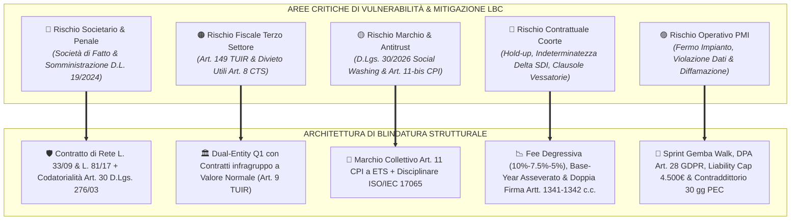
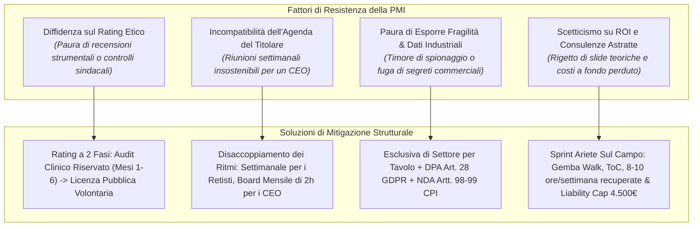
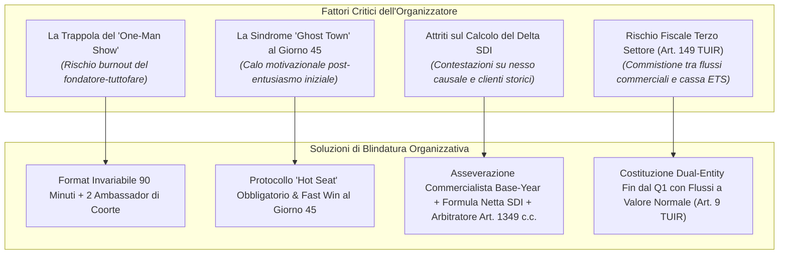
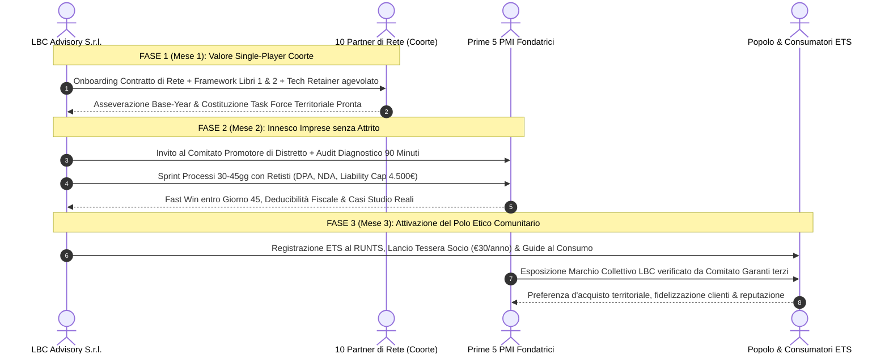
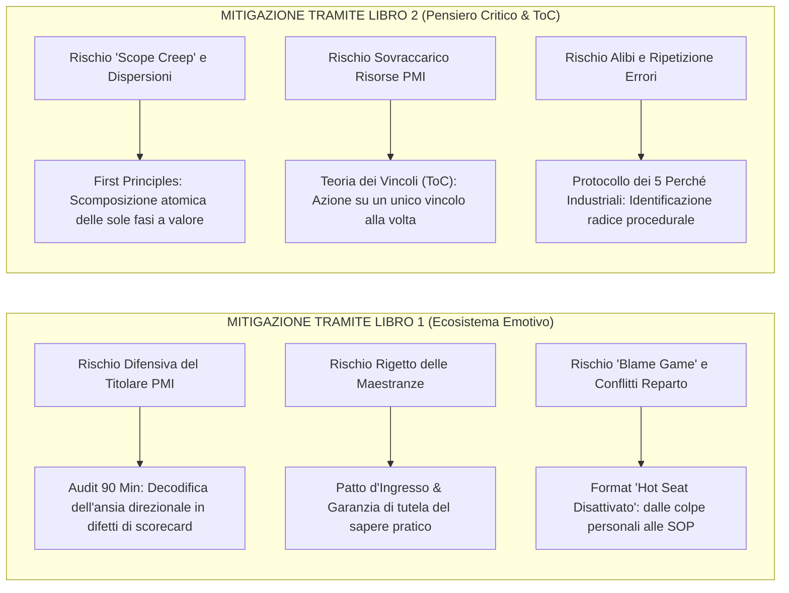

# ANALISI CRITICA, STRESS-TEST STRATEGICO & RISK MITIGATION — LBC
## Valutazione a 3 Lenti, Risoluzione dei 5 Failure Modes Storici, Conformità Normativa 2026 e Protocolli di Salvaguardia

> **Documenti Correlati dell'Ecosistema LBC:**  
> • [`STRATEGIC_BLUEPRINT.md`](file:///c:/Users/MARIO/Downloads/LBC%20La%20Buona%20Community/STRATEGIC_BLUEPRINT.md) — Masterplan e Dual-Entity Corporate Design  
> • [`STRESS_TEST_GIURIDICO_FISCALE.md`](file:///c:/Users/MARIO/Downloads/LBC%20La%20Buona%20Community/STRESS_TEST_GIURIDICO_FISCALE.md) — Audit Legale e Fiscale Approfondito  
> • [`ACCORDO_PILOTA_DELTA_FATTURATO.md`](file:///c:/Users/MARIO/Downloads/LBC%20La%20Buona%20Community/ACCORDO_PILOTA_DELTA_FATTURATO.md) — Contratto Pilota Co-Sviluppo Retisti  
> • [`OFFERTA_ARIETE_PMI.md`](file:///c:/Users/MARIO/Downloads/LBC%20La%20Buona%20Community/OFFERTA_ARIETE_PMI.md) — Offerta Commerciale Ariete e Sprint Processi  
> • [`MANIFESTO_E_RATING_ETICO.md`](file:///c:/Users/MARIO/Downloads/LBC%20La%20Buona%20Community/MANIFESTO_E_RATING_ETICO.md) — Disciplinare Marchio Collettivo ex Art. 11 CPI  
> • [`TARGET_SEGMENTATION_ANALYSIS.md`](file:///c:/Users/MARIO/Downloads/LBC%20La%20Buona%20Community/TARGET_SEGMENTATION_ANALYSIS.md) — Segmentazione PMI e Selezione Coorte  

---

### 1. Executive Summary & Architettura di Risk Mitigation

L'ecosistema economico e territoriale **"LBC — La Buona Community"** integra un polo commerciale for-profit (`LBC Advisory & Growth S.r.l.`), un polo associativo no-profit iscritto al RUNTS (`La Buona Community ETS - APS`), un'aggregazione professionale formalizzata in **Contratto di Rete d'Imprese (L. 33/2009 e L. 81/2017)** e una comunità di Grandi Imprese, PMI e cittadini consumatori.

Per prevenire i rischi di collasso che caratterizzano le aggregazioni relazionali e commerciali, LBC adotta una matrice di mitigazione del rischio fondata su:
1. **Separazione Istituzionale "Dual-Entity" fin dal Q1**: totale segregazione patrimoniale, fiscale e contrattuale tra la SRL operativa a fini di lucro e l'Associazione ETS-APS;
2. **Inquadramento di Rete con Codatorialità e Fondo Comune**: superamento radicale delle fattispecie di società di fatto (SDF) e dei rischi di somministrazione abusiva di personale ex D.L. 19/2024 conv. in L. 56/2024;
3. **Fee di Co-Sviluppo Degressiva Asseverata SDI**: 10% Anno 1 -> 7.5% Anno 2 -> 5% a regime, calcolata su formula matematica netta asseverata dal commercialista o revisore legale del partner o della PMI;
4. **DNA Metodologico dei 2 Libri Fondativi**: il Libro 1 (*"L'Ecosistema Emotivo dell'Impresa"*) e il Libro 2 (*"Il Pensiero Critico Applicato all'Azienda Reale"*) operano come sistema operativo didattico per l'onboarding dei retisti e protocollo di delivery per l'Audit dei 90 minuti e lo Sprint Ariete;
5. **Risoluzione Sistematica dei 5 Failure Modes Storici**: decostruzione analitica dei fallimenti di BNI, Vistage/TAB, EOS/Traction, reti informali e rischi di intermediazione abusiva;
6. **Conformità Normativa 2026**: recepimento del **D.Lgs. 20 febbraio 2026, n. 30** (attuativo della Direttiva UE 2024/825 contro il social-washing), dell'art. 11-bis CPI, delle tutele dello Statuto dei Lavoratori (artt. 4 e 8 L. 300/1970) tramite protocollo crittografico di $k$-anonymity ($k \ge 20$) e del GDPR (art. 28).

---

### 2. LENTE 1: La Prospettiva dell'Azienda Membro (PMI & Grandi Imprese)

#### 2.1 Analisi delle Frizioni Reali del Titolare:
* **La sindrome da "Tribunale del Lavoro" (Paura del Rating Pubblico)**: L'imprenditore di una PMI manifatturiera (5M€–30M€) è visceralmente protettivo verso la propria indipendenza di gestione. L'ipotesi che dipendenti o terzi possano esprimere giudizi pubblici sulla sua gestione genera l'angoscia di ritorsioni sindacali, vertenze o diffamazione online mascherata da etica sociale.
* **L'incompatibilità dell'agenda esecutiva**: Il titolare o direttore generale non può garantire la presenza a riunioni settimanali. Imporre una frequenza settimanale provocherebbe la delega a figure junior o l'abbandono entro il primo mese.
* **Vulnerabilità competitiva sul territorio**: Condividere inefficienze di reparto, colli di bottiglia o problemi di tesoreria in una stanza in cui siedono altri operatori del medesimo comprensorio attiva un blocco difensivo immediato per la tutela del proprio avviamento commerciale.
* **Diffidenza verso la consulenza tradizionale**: Il tessuto imprenditoriale di provincia ha sviluppato un rigetto verso la consulenza accademica delle multinazionali (Big 4), percepite come dispensatrici di presentazioni PowerPoint costose ma prive di impatto esecutivo sul margine operativo lordo.

#### 2.2 Presidi e Soluzioni Operative LBC:
1. **Rating a 2 Fasi (Periodo di Tutela Confidenziale)**:
   * *Fase 1 (Mesi 1–6)*: Il rating è **strettamente confidenziale** e non accessibile al pubblico. Opera come un *Audit Clinico Riservato* (autodiagnosi assistita e rilievi tecnici) per identificare e sanare le vulnerabilità di sicurezza, contrattuali o operative.
   * *Fase 2 (Dal Mese 7)*: La concessione della licenza d'uso del **Marchio Collettivo LBC ex art. 11 CPI** avviene solo su base volontaria, previa formale attestazione di conformità al Disciplinare Tecnico rilasciata dall'organismo di garanzia.
2. **Disaccoppiamento dei Ritmi Operativi**:
   * *Ritmo Settimanale (90 Minuti)*: Riservato esclusivamente ai 10 Partner di Rete e ai team tecnici operativi (focus su avanzamento commesse, standardizzazione dei processi e supporto multidisciplinare).
   * *Ritmo Mensile/Bimestrale ("Board Strategico dei Fondatori")*: Tavolo riservato di 2 ore serali dedicato esclusivamente ai titolari delle Grandi Imprese e PMI fondatrici, strutturato su scenari strategici, sinergie di distretto e cooperazione territoriale, escludendo carichi burocratici ordinari.
3. **Esclusiva di Distretto per Tavolo & Tutela del Know-How Industriale**:
   * All'interno del medesimo tavolo di confronto strategico non possono sedere imprese concorrenti dirette del medesimo comparto.
   * La cooperazione operativa è subordinata alla stipula di accordi di riservatezza a tutela dei segreti industriali ai sensi degli **artt. 98 e 99 CPI**, integrati da DPA (Data Processing Agreement) ex art. 28 GDPR.
4. **ROI Immediato e Misurabile tramite lo Sprint Ariete**:
   * L'offerta d'ingresso per la PMI non richiede impegni pluriennali al buio. Prevede l'**Audit dei 90 Minuti** e lo **Sprint Risolutivo di 30–45 giorni** (€ 2.500 – € 4.500 + IVA) interamente deducibile ex art. 109 TUIR.
   * L'intervento persegue un traguardo materiale immediato: **liberare 8–10 ore/settimana di sovraccarico del titolare** mediante l'applicazione combinata del Libro 1 (telemetria emotiva) e del Libro 2 (First Principles e Teoria dei Vincoli in officina e logistica), assistito da una clausola inderogabile di **Liability Cap pari al compenso incassato (art. 1229 c.c.)** e dall'onere preventivo di backup a carico della committente.

---

### 3. LENTE 2: La Prospettiva dell'Organizzatore e della Governance (Il "Dietro le Quinte")

#### 3.1 Analisi dei Colli di Bottiglia Operativi nei Primi 6 Mesi:
* **Il Burnout del Fondatore ("Effetto Giocoliere")**: Nei primi 180 giorni, l'organizzatore rischia di dover curare simultaneamente: docenza metodologica ai retisti, moderazione delle sessioni, prospezione commerciale alle PMI, coordinamento dei partner tecnici e adempimenti burocratici.
* **La Disillusione al Giorno 45 ("Ghost Town")**: Svanito l'entusiasmo delle prime tre settimane, se i professionisti non riscontrano opportunità concrete o non incassano fatture, l'attenzione cala e insorgono defezioni giustificate da presunte urgenze lavorative esterne.
* **Attriti sul Tracciamento della Success-Fee**: Parametrare il compenso variabile sull'incremento di fatturato senza criteri contabili certi rischia di innescare contenziosi sulla paternità delle commesse, sulla deducibilità dei costi e sul perimetro dei clienti pregressi.
* **Rischio Fiscale e Abuso del Diritto (Artt. 149 TUIR e 10-bis L. 212/2000)**: Posticipare l'Associazione no-profit a fasi successive o canalizzare corrispettivi commerciali in un conto promiscuo comporterebbe la decadenza immediata della qualifica di ente non commerciale, il recupero retroattivo di imposte dirette e indirette e sanzioni per violazione del divieto di distribuzione indiretta di utili ex art. 8 CTS.

#### 3.2 Soluzioni di Blindatura Gestionale e Fiscale:
1. **Format Invariabile a Cronometro (90 Minuti Rigidi)**:
   Ciascun incontro settimanale di coorte segue una scansione temporale inderogabile:
   * *Minuti 0–15*: Metriche e verifiche di avanzamento operativo (Scorecard).
   * *Minuti 15–45*: **"Hot Seat Risolutivo"**: un partner di rete presenta un blocco operativo o commerciale reale; il gruppo e LBC elaborano la soluzione procedurale tramite i framework dei Libri 1 e 2.
   * *Minuti 45–75*: **Rilascio Strumento / Formazione Esecutiva**: integrazione di automazioni low-code (Make/n8n), playbook commerciali o protocolli diagnostici.
   * *Minuti 75–90*: Definizione degli obiettivi operativi per la settimana successiva.
2. **Ambassador Operativi della Coorte**:
   Nomina immediata di **2 figure senior** tra i 10 professionisti con funzioni di co-facilitazione e monitoraggio dell'avanzamento, alleggerendo la pressione diretta sul fondatore.
3. **Infrastruttura Contabile Certificata sul Delta SDI**:
   * **Asseverazione Obbligatoria del Base-Year**: Condizione sospensiva di efficacia contrattuale ex art. 1353 c.c. Rilasciata dal commercialista o revisore legale del partner entro 15 giorni dalla firma sulla base dei dati SDI/LIPE ufficiali.
   * **Formula Matematica del Delta SDI Netto**:
     $$\Delta Fatturato_{Netto} = (Fatturato\ Imponibile\ Consuntivato) - (Fatturato\ Base\ Concordato) - (Detrazioni\ Tassative)$$
     Con esclusione di IVA, rivalsa cassa/INPS, rimborsi spese art. 15, note di credito, insoluti oltre 120 giorni e **Carve-out Clienti Storici (24 mesi)**.
   * **Degressività Pluriennale della Success-Fee**:
     - **Anno 1**: **10%** sul $\Delta Fatturato_{Netto}$;
     - **Anno 2**: **7.5%** sul $\Delta Fatturato_{Netto}$;
     - **Anno 3+ a Regime**: **5%** sul $\Delta Fatturato_{Netto}$;
     - **Cap Massimo Annuo**: tetto invalicabile a **€ 15.000,00 + IVA** per preservare la sostenibilità economica del partner.
   * **Presunzione di Causalità & Arbitratore Terzo**: Presunzione legata alla presenza ad almeno l'80% delle sessioni; facoltà di demandare controversie su commesse straordinarie a un commercialista terzo arbitratore ex art. 1349 c.c.
4. **Costituzione Dual-Entity Tempestiva in Q1**:
   Costituzione contestuale nel Q1 di `LBC Advisory & Growth S.r.l.` (P.IVA ordinaria, ATECO 70.22.09) e di `La Buona Community ETS - APS` (RUNTS). Separazione assoluta di conti correnti, organi decisionali e registri contabili. Contratti di licenza e supporto infragruppo regolati per iscritto a valore normale di mercato (art. 9 TUIR).

---

### 4. LENTE 3: La Dinamica di Network Effect (Superare l'Uovo e la Gallina)

#### 4.1 Il Dilemma Strutturale di Bootstrap:
* Le PMI non aprono le porte della fabbrica se non percepiscono una struttura solida e affidabile.
* I professionisti non mantengono l'impegno se non vedono l'accesso a commesse qualificate.
* I cittadini non si associano se non riscontrano un beneficio tangibile nei consumi e nella qualità del territorio.

#### 4.2 Il Principio Guida: "Valore Single-Player prima del Valore Multi-Player":
Ciascun partecipante deve ottenere un ritorno economico e professionale superiore ai costi sostenuti **anche qualora l'ecosistema contasse solo lui e la direzione di LBC**.

#### 4.3 I Meccanismi Esecutivi di Innesco:
1. **La Coorte dei 10 come "Rete d'Imprese Istituzionale"**:
   I 10 professionisti non si presentano sul territorio come singoli consulenti autonomi, ma come membri di un **Contratto di Rete d'Imprese formalizzato ex L. 33/2009 e L. 81/2017**, dotato di fondo comune patrimoniale segregato e disciplina della codatorialità. Questa aggregazione conferisce loro istantaneamente autorevolezza istituzionale e standing paritetico rispetto ai vertici delle PMI.
2. **Il "Comitato Promotore di Distretto" per le Prime 5 PMI**:
   Alle aziende storiche del comprensorio non si vende una prestazione commerciale generica. Si propone loro di assumere il ruolo di **Imprese Promotrici del Distretto Etico**:
   * Accesso all'Audit dei 90 Minuti quale disamina preliminare delle inefficienze occulte;
   * In cambio, l'azienda autorizza l'esecuzione di uno Sprint sui processi e rilascia un caso studio documentato a beneficio dell'economia locale.
3. **La Prima "Vittoria Visibile" (The Fast Win al Giorno 45)**:
   Entro il giorno 45, LBC coordina la rapida risoluzione di un collo di bottiglia operativo per una PMI pioniera (es. riduzione dei tempi di preventivazione tecnica da 12 giorni a 24 ore grazie a un connettore Make/n8n e al protocollo dei Primi Principi). Il risultato viene divulgato nel distretto come prova tangibile dell'ingegneria dei processi.
4. **La "Carta dei Consumi Etici" per i Cittadini (ETS-APS)**:
   L'Associazione no-profit valorizza i prodotti e i servizi delle imprese virtuose licenziatarie del Marchio Collettivo, offrendo ai soci cittadini guide informative, eventi culturali e convenzioni etiche di prossimità.

---

### 5. Risoluzione dei 5 Failure Modes Storici di Settore

L'infrastruttura contrattuale e organizzativa di LBC supera sistematicamente i cinque grandi fallimenti che storicamente colpiscono le reti d'impresa e i network professionali:

| Modello Storico di Aggregazione | Meccanismo Causale del Fallimento (Failure Pattern) | Conseguenze Tipiche / Churn Rate | Soluzione Architetturale e Giuridica di LBC |
| :--- | :--- | :--- | :--- |
| **1. BNI (Business Network Int.)** | **Referral forzati e transazionali**: obbligo di scambiare contatti settimanali; "referral fatigue"; scambio di contatti freddi o fittizi; time drain elevato (6–8 ore/settimana non retribuite); diluizione qualitativa verso il basso. | Churn rate del **70–72% nei primi 18 mesi**; allontanamento dei professionisti più qualificati. | **Zero obbligo di referral incrociati.** Coorte chiusa a 10 partner di rete con competenze complementari; Contratto di Rete con fondo comune patrimoniale; erogazione congiunta di commesse complesse per PMI; success-fee degressiva (10%-7.5%-5%) basata solo su incremento SDI netto asseverato. |
| **2. Vistage / The Alternative Board** | **Salotto intellettuale da CEO privo di delivery**: confronto tra pari senza esecuzione fisica; dipendenza esclusiva dalle doti del facilitatore (chair lottery); compiacenza "social & polite"; incapacità di toccare le macchine o la cassa. | Disillusione dei titolari pragmatici; effetto "outgrowing the room"; abbandono per assenza di impatto operativo misurabile. | **Sprint Ariete Sul Campo (30–45 giorni)**. Intervento fisico in officina e magazzino (Gemba Walk); applicazione del Libro 1 (telemetria emotiva per sbloccare i conflitti di reparto) e Libro 2 (First Principles e ToC per rimuovere l'unico collo di bottiglia fisico); risparmio misurabile di 8–10 ore/settimana per il titolare. |
| **3. EOS Worldwide / Traction** | **Consulenza standardizzata top-down senza skin-in-the-game**: implementazione di template rigidi a tariffa fissa anticipata; abbandono alle prime resistenze familiari; consulenti esterni privi di responsabilità economica diretta sui risultati. | Rigetto della PMI alle prime emergenze; cherry-picking dei tool comodi ed esclusione di quelli efficaci; interruzione dopo 6 mesi. | **Autentico Skin-in-the-Game**: quota d'ingresso simbolica (€ 500) e remunerazione di crescita ancorata al Delta Fatturato netto asseverato dal commercialista/revisore; adattamento chirurgico della Teoria dei Vincoli alla PMI manifatturiera padronale italiana. |
| **4. Reti d'Impresa Informali & Consorzi** | **Opportunismo burocratico ("Finanziamentite")**: reti costituite solo per partecipare a bandi pubblici; esauriti i fondi, la rete cessa di esistere; assenza di governance operativa, diffidenza atavica tra soci e rischio di contagio patrimoniale. | Reti "fantasma"; contenziosi per debiti contratti dai singoli soci; revoca dei contributi regionali ed estensione del fallimento. | **Rete-Contratto con Fondo Comune Segregato (L. 33/09 e L. 81/17)**: autonomia patrimoniale imperfetta (art. 2615 c.c.); organo comune commerciale gestore (`LBC Advisory & Growth S.r.l.`); codatorialità registrata (art. 30 D.Lgs. 276/03); trailing fee del 5% per 12 mesi anti-hold up e patto di non concorrenza valido ex art. 2596 c.c. con indennità monetaria mensile. |
| **5. Intermediazione Abusiva & Somministrazione Illecita** | **Intermediazione promiscua di manodopera**: fatturazione di compensi parametrici sul mero contatto o inserimento diretto di risorse esterne senza autorizzazione APL ministeriale. | Rilevanza penale ex D.L. 19/2024 conv. L. 56/2024 (nuovo art. 18 D.Lgs. 276/03: arresto fino a 1 mese o 60€/die/lavoratore); sanzioni Enasarco 17% + FIRR; nullità mediazione ex L. 39/89. | **Prestazioni Autonome di Advisory di Processo (Art. 2222 c.c.)**: contrattualizzazione B2B diretta con la PMI o tramite codatorialità/distacco di rete regolarmente iscritto al Registro Imprese; divieto assoluto di eterodirezione; DPA art. 28 GDPR e Liability Cap inderogabile a 4.500€ ex art. 1229 c.c. |

---

### 6. I 2 Libri Fondativi come Motore Sistemico di Risk Mitigation

I due manuali metodologici dell'ecosistema operano quali presidi di prevenzione contro i rischi di attrito relazionale, dispersione di risorse e contenzioso esecutivo:

#### 6.1 Libro 1: *"L'Ecosistema Emotivo dell'Impresa"*
* **Disinnesco del Blocco Psicologico del Titolare**: Il manuale fornisce ai retisti la chiave per interpretare l'ansia dell'imprenditore non come ostacolo caratteriale, ma come segnale oggettivo dell'assenza di indicatori visivi di controllo. La predisposizione entro 72 ore di una *Daily Pulse Dashboard* a 5 metriche ripristina la lucidità del titolare e consolida la fiducia nell'intervento.
* **Prevenzione del Sabotaggio di Reparto**: L'intervento di ingegneria dei processi non viene imposto dall'alto. Il protocollo prevede la condivisione preliminare con i capireparto della *Scheda di Handover con checklist bloccante*, conferendo all'officina l'autorità formale di respingere le commesse commerciali prive di specifiche tecniche complete.
* **Decontaminazione Emotiva delle Riunioni di Crisi**: L'adozione del format *Hot Seat Disattivato* neutralizza le recriminazioni soggettive durante i momenti di attrito operativo, riconducendo ogni contestazione alla revisione oggettiva delle procedure operative standard (SOP).

#### 6.2 Libro 2: *"Il Pensiero Critico Applicato all'Azienda Reale"*
* **Prevenzione dello "Scope Creep" (Allargamento Incontrollato del Progetto)**: I consulenti tradizionali tendono ad ampliare il raggio d'azione dell'intervento per vendere ulteriori giornate di lavoro. LBC applica la *Teoria dei Vincoli (ToC)*: si individua **uno e un solo collo di bottiglia fisico** che frena il throughput aziendale. Qualsiasi attività esterna all'ottimizzazione del vincolo è espressamente vietata.
* **First Principles Thinking contro la Residenza dell'Abitudine**: Disarticola il vincolo del *"Si è sempre fatto così"* smontando il ciclo di produzione nei suoi elementi fisici ed economici non negoziabili (costo del materiale, tempo macchina a contatto utensile, marginalità unitaria).
* **I "5 Perché Industriali" senza Alibi**: Impedisce che i guasti o i ritardi vengano liquidati con sanzioni individuali ai lavoratori, risalendo sistematicamente entro il quinto passaggio al difetto di manutenzione predittiva, alla carenza di specifiche o al fallimento del software gestionale.

---

### 7. Matrice Integrata dei Rischi Normativi 2026 & Misure di Conformità

La seguente matrice analizza analiticamente le vulnerabilità giuridiche, fiscali e regolamentari alla luce delle disposizioni normative applicabili nel **2026**:

| Area di Rischio Normativo | Riferimento Legislativo Vigente | Indice Rischio (1-10) | Conseguenza Sanzionatoria in Assenza di Presidio | Presidio Tecnico-Giuridico Adottato da LBC |
| :--- | :--- | :---: | :--- | :--- |
| **Social Washing & Marchio di Garanzia Nullo** | **D.Lgs. 20 febbraio 2026, n. 30** (attuativo Dir. UE 2024/825) & **Art. 11-bis D.Lgs. 30/2005 (CPI)** | **9.5** | Inserimento nella "black list" delle pratiche commerciali sleali e ingannevoli (artt. 20, 21, 23 c. 1 lett. f-bis Codice del Consumo); sanzioni AGCM da 5.000€ fino a **10.000.000€ (o fino al 4% del fatturato)**; nullità assoluta del marchio di certificazione rilasciato da soggetti che prestano servizi di consulenza nel medesimo comparto. | Rilascio esclusivo del **Marchio Collettivo ex Art. 11 CPI** intestato unicamente all'Associazione `La Buona Community ETS - APS`; adozione di un Disciplinare Tecnico oggettivo basato su parametri verificabili; totale astensione della SRL commerciale dal rilascio del Marchio; controlli di conformità affidati a organismi terzi indipendenti. |
| **Somministrazione Abusiva di Lavoro & Appalto Illecito** | **D.L. 19/2024 conv. in L. 56/2024** (nuovo art. 18 D.Lgs. 276/2003) & Art. 38 D.Lgs. 81/2015 | **9.2** | Rilevanza penale contravvenzionale: **arresto fino a 1 mese o ammenda di 60€ per ciascun lavoratore e giornata di somministrazione non autorizzata**; arresto fino a 3 mesi o ammenda di 100€/die in caso di somministrazione fraudolenta; costituzione coattiva del rapporto di lavoro subordinato in capo alla PMI committente. | Prestazioni qualificate unicamente come contratti d'opera professionale autonoma (art. 2222 c.c.) stipulati direttamente o in regime di **Contratto di Rete con codatorialità e distacco formalmente registrati (art. 30 c. 4-ter D.Lgs. 276/03 e Circ. INL n. 7/2018)**; totale autonomia organizzativa e assenza di eterodirezione. |
| **Società di Fatto Irregolare (SDF) & Contagio Patrimoniale** | Artt. 2247, 2297 c.c. & Art. 256 D.Lgs. 14/2019 (CCII, già art. 147 L.F.) | **9.0** | Responsabilità solidale e illimitata dei promotori per le obbligazioni e i debiti dei singoli professionisti della coorte; **estensione automatica della Liquidazione Giudiziale (fallimento)** al patrimonio personale dei fondatori e delle altre imprese consociate. | Inquadramento formale della coorte nel **Contratto di Rete d'Imprese ex L. 33/2009 e L. 81/2017** con Fondo Patrimoniale Comune Segregato (art. 2615 c.c.); segregazione soggettiva e assenza di conferimenti traslativi di capitale; divieto di rappresentanza generale. |
| **Decadenza Fiscale Terzo Settore & Abuso del Diritto** | Art. 149 TUIR; Artt. 8 e 85 D.Lgs. 117/2017 (CTS); Art. 10-bis L. 212/2000 | **8.8** | Perdita della qualifica di ente non commerciale per prevalenza commerciale o commistione patrimoniale; tassazione ordinaria retroattiva IRES e IRAP su tutte le entrate associative; sanzioni per distribuzione indiretta di utili; ripresa per elusione fiscale. | Costituzione formale e tempestiva fin dal Q1 di `La Buona Community ETS - APS` al RUNTS; divieto assoluto di distribuzione diretta o indiretta di utili; contrattualizzazione per iscritto di ogni rapporto infragruppo a **valore normale di mercato (art. 9 TUIR)** comprovato da perizia asseverata. |
| **Riqualificazione Agenzia Commerciale Enasarco** | Art. 1742 c.c.; L. 39/1989; Fondazione Enasarco | **8.5** | Recupero retroattivo dei contributi previdenziali Enasarco (aliquota fino al 17%), rivalsa FIRR, indennità di clientela ex art. 1751 c.c.; ovvero nullità del compenso per mediazione abusiva non iscritta al REA (L. 39/1989). | Causa contrattuale configurata rigorosamente quale prestazione di **advisory sui processi ed erogazione di know-how specialistico (art. 1322 e art. 2222 c.c.)**; eliminazione di compensi parametrici su mere segnalazioni di contratti; success-fee su servizi complessi di crescita legata a risultati globali netti. |
| **Inefficacia Clausole Onerose & Nullità Patti** | Artt. 1341 e 1342 c.c.; Art. 2596 c.c. (Limiti Concorrenza); Art. 1418 c.c. | **8.3** | Nullità assoluta e inopponibilità di penali risarcitorie, limitazioni di responsabilità, vincoli di lock-in e clausole arbitrali per carenza di specifica sottoscrizione per iscritto; nullità del patto di non concorrenza per corrispettivo meramente simbolico. | Inserimento obbligatorio del modulo di **"Approvazione Specifica delle Clausole Onerose ai sensi degli artt. 1341 e 1342 c.c."** con doppia firma digitale qualificata; patto di non concorrenza circoscritto a 12 mesi assistito da corrispettivo monetario certo (€ 100/mese) e non storno clientela. |
| **Privacy Industriale & Controllo Dipendenti** | Regolamento UE 2016/679 (GDPR); Artt. 4 e 8 L. 300/1970 (Statuto Lavoratori) | **8.2** | Sanzioni amministrative pecuniarie del Garante Privacy fino a **20.000.000€ (o fino al 4% del fatturato ex art. 83 GDPR)**; rilevanza penale per violazione dell'art. 8 L. 300/1970 per indagini non autorizzate sulle opinioni dei lavoratori; nullità prove raccolte. | Stipula sistematica di formale **DPA ex art. 28 GDPR** tra PMI e LBC; somministrazione questionari aggregati gestita da piattaforma terza accreditata con protocollo di **$k$-anonymity ($k \ge 20$)**; assoluto divieto di quesiti nominativi o individualizzanti. |
| **Responsabilità Civile da Audit & Fermo Impianti** | Artt. 1218, 1228, 1229 c.c.; Artt. 98 e 99 D.Lgs. 30/2005 (Segreti Industriali) | **8.0** | Richieste di risarcimento del danno emergente e del lucro cessante per blocco della produzione, corruzione archivi o interruzione d'esercizio occorsi durante lo Sprint dei 30–45 giorni. | Inserimento inderogabile nel contratto Sprint di una clausola di **Limitazione di Responsabilità (Liability Cap) pari al compenso incassato (max € 4.500)** ex art. 1229 c.c.; esclusione danni indiretti e fermo linea; formale onere preliminare di backup a carico della PMI. |
| **Concorrenza Sleale & Ritorsioni Diffamatorie** | Art. 595 c.p. (Diffamazione); Art. 2598 n. 2 c.c. (Denigrazione Commerciale); L. 287/1990 | **7.8** | Azioni risarcitorie per lesione dell'avviamento commerciale e denigrazione pubblica a seguito di revoche sommarie o declassamenti non motivati del rating etico. | Adozione di un rigoroso **Regolamento Istruttorio di Giustizia Privata**: obbligo di preavviso formale PEC di 30 giorni, accesso agli atti, audizione personale assistita, **obbligo di motivazione tecnica analitica** e clausola di arbitrato irrituale ex art. 808-ter c.p.c. |

---

### 8. Tabella di Controllo Operativo dei Rischi, Trigger Precoci & Protocolli di Risposta Automatica

LBC adotta un sistema di antenne precoci (*Early Warning Sensors*) con indicatori numerici oggettivi che attivano contromisure procedurali immediate:

| Indicatore di Rischio (Risk Trigger) | Soglia Critica di Allarme | Profilo di Rischio Sottostante | Procedura di Risposta Automatica & Azione Tempestiva | Responsabile Operativo |
| :--- | :--- | :--- | :--- | :--- |
| **Defezione Presenze Mastermind** | Presenza del retista < 80% nel mese solare | Disimpegno progressivo ("sindrome dell'agenda piena"); rischio abbandono della coorte e rifiuto success-fee. | Invio notifica formale di avviso decadenza tariffa agevolata Tech Retainer; convocazione colloquio 1-to-1 di allineamento entro 48 ore. | Coordinatore Mastermind / Ambassador Coorte |
| **Silenzio Prolungato alle Sessioni** | Partner che interviene per < 3 minuti per 2 incontri consecutivi | Frustrazione repressa, blocco emotivo o disallineamento strategico latente. | Applicazione immediata del format Hot Seat obbligatorio alla seduta successiva con esposizione del caso bloccante. | Facilitatore d'Aula / Ambassador Coorte |
| **Ritardo Asseverazione Base-Year** | Ritardo > 15 giorni dalla firma del contratto | Mancanza di trasparenza contabile o potenziale intenzione di occultare ricavi futuri. | Sospensione automatica dell'accesso alla task force multidisciplinare e ai contatti PMI sino al deposito dell'attestazione. | Responsabile Amministrativo SRL |
| **Stallo nella Negoziazione Sprint PMI** | Zero contratti di Sprint sottoscritti dopo 30 giorni dall'Audit | Diffidenza della committente o timore di interruzione dell'attività produttiva. | Revisione dell'approccio diagnostico: proposta di uno Sprint Light concentrato esclusivamente su 1 singolo vincolo ToC con garanzia di non interferenza operativa. | Venture Architect / Lead Consultant |
| **Discrepanza nel Rating del Clima** | Risultato medio questionario dipendenti < 3.2 / 5 | Tensione latente in officina; rischio vertenze sindacali o fallimento dell'intervento di processo. | Convocazione riservata del titolare per l'esame della telemetria emotiva (Libro 1); predisposizione immediata della Matrice Emotiva-Operativa di reparto. | Comitato Etico ETS / Senior Partner di Rete |
| **Reclamo Formale di Terzi su PMI Licenziataria** | Ricezione di segnalazione documentata per violazioni etiche o giuslavoristiche | Rischio di corresponsabilità per social washing e danno reputazionale al Marchio Collettivo LBC. | Attivazione immediata del procedimento istruttorio: notifica addebiti via PEC alla PMI con assegnazione del termine di 30 giorni per memorie difensive e audizione. | Comitato dei Garanti e Probiviri ETS |
| **Contestazione sul Conteggio del Delta SDI** | Disaccordo del partner sull'imputabilità causale di una specifica commessa | Rischio di lite e paralisi della success-fee variabile. | Convocazione del commercialista del partner e, in caso di disaccordo non composto entro 10 giorni, devoluzione della quantificazione all'arbitratore terzo ex art. 1349 c.c. | Organo Comune di Rete / Revisore Terzo |
| **Mancato Rispetto Tempi da Partner IT/CRM** | Connettore software Make/n8n non collaudato entro i 14 giorni stabiliti | Rischio ritardo dello Sprint PMI e perdita di credibilità della Rete. | Revoca immediata della commessa tecnica al fornitore inadempiente e riassegnazione al partner tecnologico di riserva del distretto. | Responsabile Tecnico Distrettuale |
