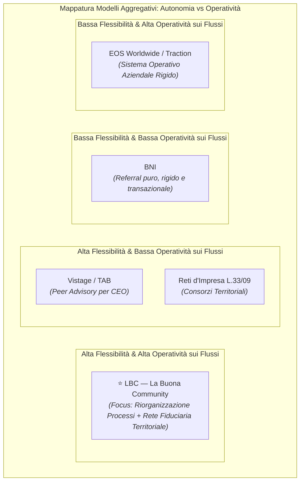
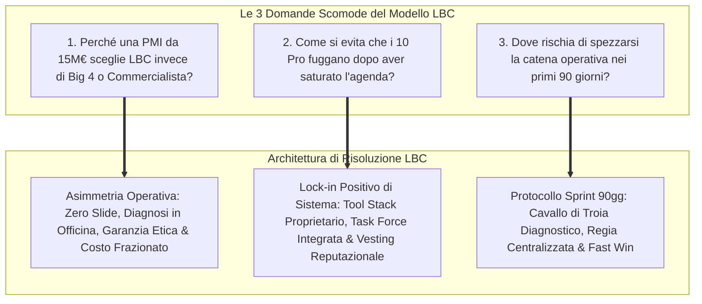
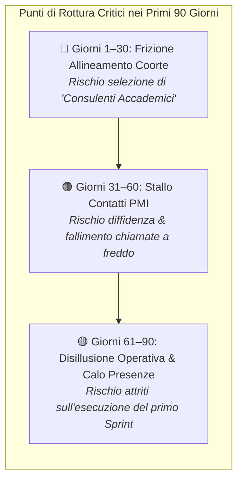
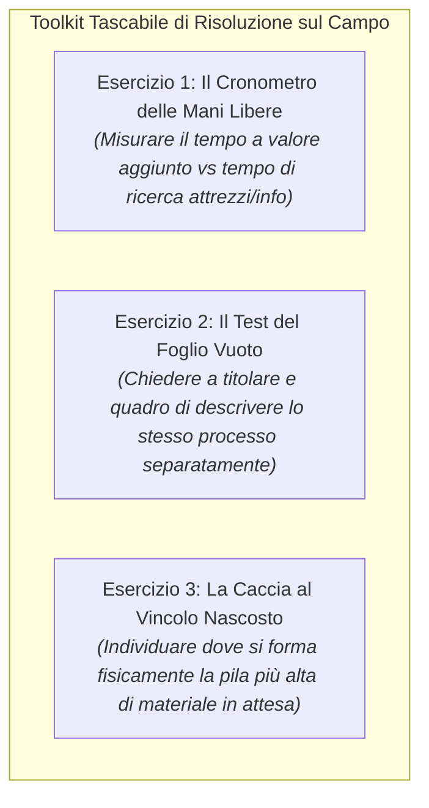
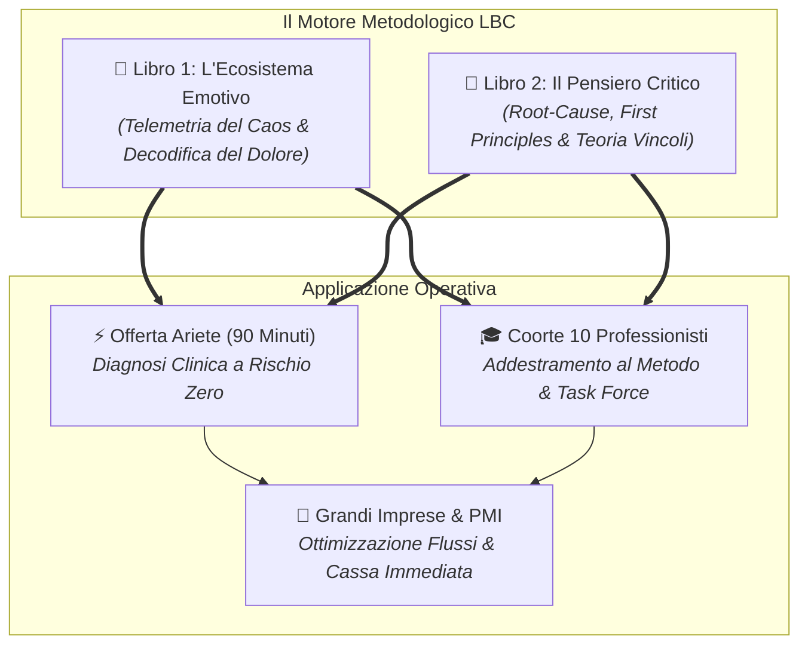

# LBC — LA BUONA COMMUNITY
# ANALISI CRITICA DELLO STATO DELL'ARTE, BENCHMARK COMPETITIVO & ARCHITETTURA DEI DUE MANUALI FONDATIVI

---

> **Documento Tecnico-Strategico di Validazione & Ingegnerizzazione dei Processi**  
> *Redatto a quadrupla lente: Venture Architecture, Psicologia Sistemica d'Impresa, Epistemologia Operativa e Market Intelligence.*

> **Documenti Correlati dell'Ecosistema LBC:**  
> • [`STRATEGIC_BLUEPRINT.md`](file:///c:/Users/MARIO/Downloads/LBC%20La%20Buona%20Community/STRATEGIC_BLUEPRINT.md) — Masterplan e Dual-Entity Corporate Design  
> • [`ANALISI_CRITICA_RISCHI_E_SOLUZIONI.md`](file:///c:/Users/MARIO/Downloads/LBC%20La%20Buona%20Community/ANALISI_CRITICA_RISCHI_E_SOLUZIONI.md) — Risk Mitigation & Prevenzione Fallimenti  
> • [`MACRO_ROADMAP_ECOSISTEMA_LBC.md`](file:///c:/Users/MARIO/Downloads/LBC%20La%20Buona%20Community/MACRO_ROADMAP_ECOSISTEMA_LBC.md) — Roadmap Operativa 12 Mesi  
> • [`OFFERTA_ARIETE_PMI.md`](file:///c:/Users/MARIO/Downloads/LBC%20La%20Buona%20Community/OFFERTA_ARIETE_PMI.md) — Offerta Commerciale Ariete e Sprint Processi  
> • [`ACCORDO_PILOTA_DELTA_FATTURATO.md`](file:///c:/Users/MARIO/Downloads/LBC%20La%20Buona%20Community/ACCORDO_PILOTA_DELTA_FATTURATO.md) — Contratto Pilota Co-Sviluppo Retisti  
> • [`MANIFESTO_E_RATING_ETICO.md`](file:///c:/Users/MARIO/Downloads/LBC%20La%20Buona%20Community/MANIFESTO_E_RATING_ETICO.md) — Disciplinare Marchio Collettivo ex Art. 11 CPI  
> • [`STRESS_TEST_GIURIDICO_FISCALE.md`](file:///c:/Users/MARIO/Downloads/LBC%20La%20Buona%20Community/STRESS_TEST_GIURIDICO_FISCALE.md) — Audit Legale e Fiscale Approfondito  

---

## SOMMARIO ESECUTIVO

Il presente documento costituisce la disamina critica senza filtri del modello operativo di **LBC (La Buona Community)**. L'analisi è strutturata in quattro macro-sezioni coordinate:
1. **Intelligence Competitiva & Studio dei Failure Modes**: disamina comparativa dei quattro grandi modelli storici di aggregazione d'impresa (BNI, Vistage/TAB, EOS Worldwide/Traction, Contratti di Rete italiani) e codifica dei 5 pattern ricorrenti di collasso/churn.
2. **Autopsia Preventiva del Progetto LBC**: risposta argomentata alle tre domande scomode su barriere all'entrata, sostenibilità della success-fee degressiva pluriennale (10% Anno 1 -> 7.5% Anno 2 -> 5% a regime, Cap 15k) e tenuta della macchina operativa nei primi 90 giorni.
3. **Architettura Completa del Libro Fondativo 1**: *"L'Ecosistema Emotivo dell'Impresa — Manuale di Procedura per Interpretare e Risolvere il Caos Organizzativo attraverso le Emozioni"* (la telemetria emotiva come strumento oggettivo di rilevazione dei colli di bottiglia e la Matrice Emotiva-Operativa).
4. **Architettura Completa del Libro Fondativo 2**: *"Il Pensiero Critico Applicato all'Azienda Reale — Guida Operativa al Problem Solving di Primo Livello per Imprenditori e Professionisti"* (First Principles in officina, Teoria dei Vincoli nel distretto, protocollo dei 5 Perché industriali, de-biasing e checklist sul campo).

---

# PARTE 1: INTELLIGENCE COMPETITIVA & STUDIO DEI FAILURE MODES

Per costruire una rete territoriale resiliente, è necessario condurre un'analisi forense dei modelli preesistenti per identificare i punti di rottura sistemici e montare le relative antenne d'allarme fin dal Giorno 1.



---

### 1.1 Disamina dei 4 Modelli Storici di Aggregazione

#### 1. BNI (Business Network International) — Il Modello a Referral Puro
* **Promessa di Valore**: Scambio sistematico di referenze commerciali tra professionisti e piccole imprese locali tramite incontri settimanali rigorosamente strutturati ("Givers Gain").
* **Punti di Forza**: Disciplina ferrea, presenza settimanale obbligatoria, misurazione metrica puntuale del volume d'affari scambiato (Grazie per il Business).
* **Perché si Rompe (Failure Data)**: Studi di settore e relazioni interne rilevano un tasso di abbandono (*churn rate*) vicino al **70–72% nei primi 18 mesi**.
  * *Referral Fatigue*: L'obbligo di passare contatti ogni settimana porta i membri a sfornare referenze forzate, fredde o di scarsa qualità pur di non subire penalità nel cruscotto.
  * *Time Drain insostenibile*: L'impegno reale richiesto (incontri mattutini, 1-to-1 obbligatori, eventi e reportistica) assorbe tra le 6 e le 8 ore settimanali non retribuite, percepito come un "secondo lavoro part-time".
  * *Diluizione qualitativa e selezione al ribasso*: Chi cresce e satura l'agenda abbandona; rimangono spesso venditori disperati di prodotti generici, scacciando i professionisti ad alto valore aggiunto.

#### 2. Vistage / The Alternative Board (TAB) — Il Modello a Peer-Advisory Board
* **Promessa di Valore**: Tavolo riservato di confronto tra titolari e CEO non in concorrenza diretta, guidato da un facilitatore esecutivo (Chair) per risolvere sfide strategiche di governance e leadership.
* **Punti di Forza**: Elevata riservatezza psicologica, isolamento del titolare attenuato, alto posizionamento di prezzo (10.000€–20.000€/anno per CEO).
* **Perché si Rompe (Failure Data)**:
  * *La "Lotteria del Facilitatore" (Chair Lottery)*: L'efficacia della stanza dipende al 95% dall'autorevolezza e dallo spessore del Chair locale. Se il facilitatore non ha vera esperienza di fabbrica o di cassa, il tavolo scade rapidamente.
  * *La Degenerazione "Social & Polite"*: I membri, col passare dei mesi, diventano amici e sviluppano un'inconscia ritrosia a darsi feedback brutali e taglienti. I problemi acuti vengono trattati in modo astratto per non ferire la sensibilità del pari.
  * *Effetto "Outgrowing the Room"*: Quando un membro scala la propria impresa a una classe dimensionale superiore rispetto alla media del tavolo, l'utilità marginale crolla e il membro abbandona.

#### 3. EOS Worldwide (Traction di Gino Wickman) — Il Sistema Operativo Aziendale
* **Promessa di Valore**: Framework standardizzato per PMI (Accountability Chart, Rocks trimestrali, Meeting Level 10, Scorecard numerica) per allineare leadership team e processi.
* **Punti di Forza**: Pragmatismo estremo, eliminazione delle ambiguità nei ruoli, focalizzazione maniacale sui problemi reali (Issues Solving Track: Identify, Discuss, Solve - IDS).
* **Perché si Rompe (Failure Data)**:
  * *Trattamento come "Progetto Temporaneo"*: Molte PMI affrontano EOS come una parentesi di 6 mesi; non appena subentrano le emergenze ordinarie, la disciplina del meeting settimanale decade e si ritorna al caos.
  * *Rigetto della "Guerra delle Sedie" (Right People in Right Seats)*: L'Accountability Chart richiede spesso di rimuovere figure storiche o familiari inadeguate. Se il titolare non ha il coraggio etico di procedere, l'intero sistema operativo implode per incoerenza.
  * *Cherry-Picking dei Tool*: Le aziende adottano gli strumenti facili (le riunioni) e scartano quelli scomodi (le metriche di scorecard e la trasparenza radicale).

#### 4. I Contratti di Rete Italiani (L. 33/2009) & Consorzi Tradizionali
* **Promessa di Valore**: Aggregazione formale di PMI per condividere investimenti di filiera, acquisti, fiere e codatorialità senza perdere l'indipendenza giuridica.
* **Punti di Forza**: Riconoscimento istituzionale, agevolazioni fiscali, tutela formale della rete.
* **Perché si Rompe (Failure Data)**:
  * *Opportunismo Burocratico (Finanziamentite)*: L'80% delle reti in Italia nasce esclusivamente per intercettare bandi regionali o fondi europei; esaurito il contributo a fondo perduto, la rete cessa ogni interazione reale.
  * *Diffidenza Atavica e Mancanza di Motore Commerciale Unificato*: L'imprenditore di distretto teme che il vicino rubi clienti, operai o segreti di produzione. In assenza di una regia terza che intermedi il business, la rete diventa un guscio vuoto.
  * *Rischi di Solidarietà e Trascina-Fallimenti*: In caso di insolvenza di un membro o contenziosi sul lavoro (distacco/codatorialità), la promiscuità non governata espone i partner a rischi legali e fiscali sproporzionati.

---

### 1.2 I 5 Pattern Ricorrenti di Collasso & Degrado delle Reti

Dall'incrocio dei 4 modelli emergono cinque dinamiche patologiche universali:

1. **Pattern 1: "The Race to the Bottom" (Diluizione Qualitativa)**:
   * *Meccanismo*: La tentazione di fare cassa porta la direzione ad abbassare i requisiti di ammissione.
   * *Effetto*: L'ingresso di figure deboli, disperate o improvvisate degrada la densità di valore della stanza; i membri di talento, accorgendosi che il livello si è abbassato, abbandonano silenziosamente, innescando una spirale discendente irreversibile.
2. **Pattern 2: "Cannibalismo & Free-Riding" (Opportunismo Asimmetrico)**:
   * *Meccanismo*: Alcuni membri prendono valore (contatti, clienti, automazioni) senza mai restituire nulla alla rete, oppure tentano di bypassare la community stipulando accordi diretti alle spalle dei partner.
   * *Effetto*: Rottura della fiducia sistemica e ritirata dei membri generosi verso il disimpegno.
3. **Pattern 3: "La Trappola del 'Qui da noi è diverso'" (Rigetto dell'Imprenditore di Provincia)**:
   * *Meccanismo*: Il titolare di PMI manifatturiera oppone una resistenza viscerale ai consulenti che usano gergo accademico o anglicismi ("framework", "agile", "deliverable"), considerandoli teorici privi di esperienza reale.
   * *Effetto*: Rifiuto categorico di farsi mettere in discussione e chiusura difensiva.
4. **Pattern 4: "Churn Post-Saturazione" (La Fuga del Professionista Saziato)**:
   * *Meccanismo*: Il professionista entra per fame di clienti. Una volta acquisiti 2 o 3 contratti stabili grazie alla rete, la sua agenda si riempie. A quel punto inizia a percepire la riunione settimanale e la fee di revenue share come un balzello ingiustificato.
   * *Effetto*: Abbandono della rete proprio nel momento in cui dovrebbe restituire valore al vivaio.
5. **Pattern 5: "Burocratizzazione da Salotto e Perdita del Grasso di Fabbrica"**:
   * *Meccanismo*: Le riunioni perdono il focus sui problemi acuti e si trasformano in tavoli filosofici sull'etica, la sostenibilità e i valori ideali.
   * *Effetto*: Gli imprenditori pragmatici, abituati a misurare il tempo in ore-macchina e cassa settimanale, fuggono considerando la community una perdita di tempo.

---

### 1.3 Le 6 Antenne d'Allarme Precoci (Early Warning Sensors) per LBC

LBC deve implementare una dashboard di monitoraggio permanente che faccia scattare protocolli di correzione automatica al verificarsi dei seguenti segnali:

| Antenna d'Allarme | Metrica Soglia Critica | Dinamica Sottostante | Azione Esecutiva Immediata |
| :--- | :--- | :--- | :--- |
| **1. Disimpegno Vocale (Silent Quitting)** | Membro che interviene per < 3 minuti nelle ultime 2 sessioni settimanali | Il membro sta accumulando frustrazione o ha deciso di disinvestire mentalmente. | Intervista 1-to-1 di 20 minuti entro 48 ore per dissotterrare il vero ostacolo emotivo o operativo. |
| **2. Calo del Tasso di Presenza (Attendance Dip)** | Presenza alla sessione settimanale < 80% nel mese | Subentro della "trappola dell'agenda piena" e inizio del ciclo di distacco. | Diffida bonaria con riesame della partecipazione alla Coorte dei 10. |
| **3. Rigetto della Misurazione Base-Year** | Ritardo > 15 giorni nella certificazione contabile del fatturato | Mancanza di trasparenza o intenzione larvata di occultare la crescita economica. | Sospensione immediata dall'accesso ai lead e alle commesse delle grandi aziende. |
| **4. Asimmetria nei Flussi dei Partner IT/Marketing** | Partner interno che riceve > 3 lead e non effettua la pre-fattibilità entro 48h | Mancanza di orientamento allo sprint; rischio di compromettere la reputazione di LBC verso la PMI. | Convocazione del partner e riassegnazione della commessa a un fornitore alternativo. |
| **5. Eccesso di "Conversazioni Educate"** | Tavolo di mastermind in cui per 3 settimane non emergono conflitti o problemi gravi | La stanza è diventata troppo confortevole e ipocrita; i problemi reali vengono nascosti. | Attivazione forzata del format "Hot Seat su Fallimento Recente": ogni membro deve esporre un errore costoso. |
| **6. Discrepanza Rating Clinico vs Dichiarato** | Voto dipendenti < 3.5 a fronte di un titolare convinto del "clima ideale" | Cecità direzionale grave; rischio esplosione vertenze o turnover durante l'intervento. | Convocazione del titolare per audit diagnostico secondo il Libro 1 (telemetria emotiva). |

---

# PARTE 2: AUTOPSIA PREVENTIVA & ANALISI CRITICA DEL PROGETTO LBC

Analisi spietata della documentazione attuale di LBC (`STRATEGIC_BLUEPRINT.md`, `OFFERTA_ARIETE_PMI.md`, `TARGET_SEGMENTATION_ANALYSIS.md`, `ACCORDO_PILOTA_DELTA_FATTURATO.md`, `MANIFESTO_E_RATING_ETICO.md`) per disinnescare i punti di fallimento strutturali.



---

### 2.1 Domanda Scomoda 1: Perché una PMI da 15M€ dovrebbe far entrare LBC e non il commercialista storico o una società di consulenza blasonata?

#### L'Analisi della Resistenza Reale del Titolare:
Il titolare di una PMI manifatturiera o logistica da 15M€ è assediato da:
* *Il Commercialista di Fiducia*: Gestisce i bilanci da 20 anni, pranza regolarmente con la proprietà, ma è un fiscalista retrospettivo. Non ha mai messo piede in reparto montaggio, non sa cosa sia una distinta base multilivello (BOM) e non ha idea di come dialoghino un PLC e un gestionale.
* *Le Grandi Società di Consulenza (Big 4 / Boutique di Milano)*: Vengono percepite con diffidenza viscerale: costano 1.500€–2.500€ al giorno, inviano neolaureati con completi eleganti che intervistano il personale producendo presentazioni PowerPoint dense di teoria, per poi andarsene lasciando l'azienda senza implementazione pratica.

#### La Risposta Asimmetrica e Irresistibile di LBC:
LBC disarticola entrambe le alternative posizionandosi in uno spazio operativo vuoto:

1. **Approccio "Zero Slide, Mani nel Grasso"**: LBC non presenta report teorici. L'Ariete di 90 minuti si svolge in officina, davanti alla lavagna di produzione e al terminale di magazzino. La diagnosi non misura "la strategia globale", ma individua l'ora precisa in cui ogni mattina si blocca il flusso tra ufficio tecnico e macchine CNC.
2. **Garanzia Etica a Rischio Zero**: Se al termine delle prime 2 sessioni operative l'imprenditore non ha toccato con mano un risparmio orario o l'eliminazione di un collo di bottiglia concreto, l'intervento si arresta senza saldo. Né il commercialista né le Big 4 offrono tale clausola.
3. **La Presenza di Competenze Multidisciplinari Esecutive a Kilometro Zero**: LBC si presenta non come singolo consulente, ma come **Task Force Territoriale Completa**: porta contemporaneamente l'ingegnere di processo (Lean), lo sviluppatore di automazioni e l'esperto di controllo di gestione, tutti residenti nello stesso distretto e pronti a rispondere fisicamente entro un'ora.

---

### 2.2 Domanda Scomoda 2: Come si impedisce che i 10 professionisti della coorte, una volta riempita l'agenda, fuggano per non corrispondere la success-fee degressiva (10% Anno 1 -> 7.5% Anno 2 -> 5% a regime, Cap 15k)?

#### L'Illusione del Vincolo Legale:
Nel mondo delle partite IVA e delle micro-consulenze, affidarsi esclusivamente a un contratto di revenue share sul fatturato è un suicidio tattico. Il professionista disonesto può facilmente:
* Fatturare attraverso società terze o familiari;
* Sostenere che i nuovi clienti derivino da contatti pregressi estranei alla rete;
* Ridurre formalmente il fatturato incassando dilazioni o compensazioni.

#### Le 4 Ancore di Fidelizzazione Strutturale (Lock-in Positivo):
Per rendere l'abbandono economicamente e professionalmente sconveniente, LBC applica quattro leve sistemiche:


1. **Dipendenza Sistemica dalla Task Force (Impossibilità dell'Uomo Solo al Comando)**:
   * Nessun professionista della coorte è in grado, da solo, di soddisfare le esigenze di una PMI da 15M€. Se un consulente Lean cerca di lavorare da solo, si scontrerà con la necessità di sviluppare automazioni software, grafiche per cataloghi commerciali o cruscotti finanziari complessi.
   * Lavorando con LBC, il professionista vende contratti complessi da 15.000€–30.000€ perché sa che dietro di lui ci sono le aziende partner interne a tariffe distrettuali scontate. Se esce, torna a essere un freelance isolato costretto a vendere giornate a tariffa oraria.
2. **Lo Stack Tecnologico e di Automazione Residente in LBC**:
   * I template operativi, i playbook diagnostici, i connettori software (Make/n8n) e i cruscotti di monitoraggio dei processi sono proprietà dell'infrastruttura LBC. L'uscita dalla rete comporta la revoca immediata delle licenze agevolate e dei flussi automatici configurati.
3. **La Formula della Degressività Pluriennale Programmata e Fedeltà di Rete**:
   * La fee non costituisce una provvigione di agenzia né una partecipazione societaria, bensì un compenso variabile di co-sviluppo strategico parametrato all'incremento netto reale asseverato:
     * *Struttura Pluriennale Degressiva*: **10% Anno 1** (con scaglioni di salvaguardia: 10% fino a € 30k, 7,5% da 30k a 70k, 5% oltre 70k), **7,5% Anno 2**, e **5% Anno 3 e a regime**, calcolata su delta fatturato imponibile netto certificato SDI, con tetto massimo invalicabile (Cap) di € 15.000,00 oltre IVA all'anno e carve-out di 24 mesi per i clienti storici.
     * *Rinnovi e Consolidamento di Rete (Anni successivi)*: per i professionisti che confermano la propria adesione al Contratto di Rete d'Imprese (L. 33/2009 e L. 81/2017), attribuzione della qualifica di **"Senior Mentor di Distretto"**, con priorità di docenza nelle sessioni formative, coordinamento operativo dei tavoli di mastermind e coinvolgimento diretto nei progetti complessi di ingegneria dei processi per le PMI.
4. **La Barriera Reputazionale Territoriale e il Costo Sociale del Tradimento**:
   * Nel distretto circoscritto, la reputazione è l'asset fondamentale. I 10 professionisti sono noti alle prime 5 PMI e al tessuto economico locale.
   * Chi tenta di sottrarsi agli impegni sottoscritti subisce la revoca del rating, l'espulsione dal Manifesto Etico e la segnalazione formale al Comitato dei Garanti. Nel giro di pochi chilometri, perdere la credibilità etica significa distruggere il proprio mercato locale.

---

### 2.3 Domanda Scomoda 3: Dove rischia di incepparsi la macchina operativa nei primi 90 giorni?

#### Mappatura Cronologica dei Punti di Rottura:



1. **Giorni 1–30: Il Rischio dell'Eterogeneità Tossica della Coorte**:
   * *Il Punto di Rottura*: Selezionare professionisti che sulla carta sembrano eccellenti ma che al primo incontro si rivelano accademici arroganti o freelance disperati che cercano solo qualcuno che gli trovi clienti domani mattina.
   * *Contromisura*: Applicazione inflessibile della **Griglia a 5 Criteri (Minimo 80/100)** e rifiuto di qualsiasi candidato che non abbia svolto almeno 3 anni di lavoro sul campo in aziende reali.
2. **Giorni 31–60: La Frizione di Innesco sulle PMI (L'Ansia del Primo Cavallo di Troia)**:
   * *Il Punto di Rottura*: L'imprenditore contattato diffida dell'Audit gratuito perché sospetta che sia una televendita mascherata; i professionisti della coorte hanno paura di fare chiamate dirette o non sanno come approcciare un titolare industriale.
   * *Contromisura*: L'organizzatore non manda i professionisti a fare prospezione a freddo. Si utilizza il **"Metodo della Visita di Cortesia Istituzionale"**: si contatta il titolare non per vendergli nulla, ma per invitarlo formalmente a far parte del *Comitato di Consultazione Territoriale LBC*, offrendo l'audit di 90 minuti come sessione conoscitiva a porte chiuse sui suoi colli di bottiglia operativi.
3. **Giorni 61–90: Il Rischio Dispersione sul Primo Progetto Pilota**:
   * *Il Punto di Rottura*: Vinto il primo contratto di Sprint Operativo (es. 3.500€ per riorganizzare l'ufficio acquisti di una PMI), i 2 professionisti assegnati rischiano di disperdersi su sintomi secondari e non chiudere l'intervento nei tempi, creando frustrazione nel cliente e imbarazzo in LBC.
   * *Contromisura (Protocollo "Fast Win 14 Giorni")*: Applicazione rigorosa del **Libro 1 e del Libro 2**. L'intervento non cerca di riorganizzare l'intera azienda, ma applica la *Teoria dei Vincoli*: individua l'unico collo di bottiglia fisico (es. bolle di magazzino cartacee non registrate), lo isola al **Giorno 5 (Bottleneck Confermato)** e rilascia al **Giorno 14 la prima SOP operativa monopagina e dashboard preliminare**, garantendo un ritorno immediato e tangibile alla committente prima del saldo dello Sprint.

---

# PARTE 3: ARCHITETTURA DEL LIBRO FONDATIVO 1

## *"L'Ecosistema Emotivo dell'Impresa"*
### *Manuale di Procedura per Interpretare e Risolvere il Caos Organizzativo attraverso le Emozioni*

---

### 3.1 Presupposti Epistemologici & Tesi Centrale

Nelle organizzazioni produttive (specialmente nelle PMI a matrice familiare o padronale), le manifestazioni emotive non sono eventi psicologici casuali, né debolezze caratteriali da correggere con prediche morali o sessioni di team building superficiale.

> **Tesi Fondativa**:  
> **L'emozione osservabile all'interno di un'azienda è la telemetria oggettiva, immediata e scientificamente precisa di un'interruzione nel flusso di valore, informazione o autorità.**  
> Laddove c'è rabbia, un processo a monte ha scaricato lavoro difettoso su un reparto a valle. Laddove c'è ansia, l'imprenditore è costretto a prendere decisioni critiche in assenza di dati affidabili. Laddove c'è apatia, un sistema di incentivi e procedure ha punito l'iniziativa autonoma.

Il manuale codifica l'approccio diagnostico di LBC: **non curare lo stato d'animo, ma seguire l'emozione come una traccia di fumo per localizzare l'incendio nel processo operativo**.

---

### 3.2 Indice Dettagliato dei Capitoli e Strumenti Associati

#### Capitolo 1: Dalla Psicologia da Salotto alla Telemetria di Processo
* *Concetto*: Superamento delle teorie astratte sul benessere aziendale. L'impresa come circuito idraulico in cui le persone sono snodi e le emozioni rappresentano picchi di pressione o vuoti d'aria.
* *Strumento Operativo*: **Il Manometro Organizzativo LBC** — Protocollo di misurazione dei gradienti di tensione nei reparti chiave.

#### Capitolo 2: L'Ansia del Titolare e la "Sindrome dell'Imbuto Direzionale"
* *Concetto*: Perché l'imprenditore non riesce a staccare il telefono nel fine settimana? L'ansia non deriva dall'eccesso di responsabilità, ma dal fatto che l'azienda è strutturata come un imbuto dove tutte le informazioni non standardizzate devono essere vagliate dal suo cervello.
* *Strumento Operativo*: **La Matrice di Delegabilità di Primo Livello** — Distinzione algoritmica tra decisioni reversibili (da delegare istantaneamente con procedura) e decisioni irreversibili (riservate alla proprietà).

#### Capitolo 3: La Rabbia dei Capi-Reparto e i Colli di Bottiglia a Monte
* *Concetto*: Il capofficina o il responsabile logistica che urla contro i propri sottoposti o contro l'ufficio acquisti non è una persona "collerica", ma un professionista che riceve specifiche incomplete, date di consegna irrealistiche o materiali non conformi e non ha leve procedurali per rifiutare l'ordine.
* *Strumento Operativo*: **Il Protocollo di Rifiuto Procedurale (Gatekeeper)** — Criteri oggettivi di accettazione commessa tra ufficio vendite e reparto produttivo.

#### Capitolo 4: Il Cinismo e l'Apatia dei Collaboratori: Diagnosi di Delega Fittizia
* *Concetto*: L'operaio o il programmatore che compie il minimo sindacale ("A me non pagano per pensare") non è nato disilluso: è stato educato all'inutilità dell'iniziativa da ripetute punizioni per errori commessi durante tentativi di autonomia non guidati da procedure scritte.
* *Strumento Operativo*: **La Lavagna delle Anomalie Protetta** — Sistema anonimo di segnalazione di difetti di processo con immunità garantita per l'operatore.

#### Capitolo 5: La Paura dell'Errore e l'Immobilismo da Iper-Controllo
* *Concetto*: Come la sovrapposizione di controlli manuali, doppie firme e approvazioni burocratiche paralizza l'azienda, trasformando un lead caldo da evadere in 2 ore in un preventivo consegnato dopo 14 giorni.
* *Strumento Operativo*: **Audit dei Tempi Morti da Autorizzazione** — Cronometraggio dei tempi di sosta di una commessa in attesa di firma direzionale.

#### Capitolo 6: L'Organizzazione Invisibile e la Rete Sociometrica Reale
* *Concetto*: Gli organigrammi appesi alle pareti sono menzogne formali. L'azienda reale è governata da nodi informali di influenza: il magazziniere anziano che conosce dove sono i pezzi, la contabile storica che decide i pagamenti prioritari, il commerciale che gestisce i clienti storici sul proprio cellulare personale.
* *Strumento Operativo*: **La Mappa Sociometrica del Potere di Blocco** — Identificazione delle persone-chiave non censite nell'organigramma formale.

#### Capitolo 7: Il Protocollo di Decontaminazione Emotiva nei Conflitti di Reparto
* *Concetto*: Tecnica chirurgica per neutralizzare le accuse personali durante le riunioni di crisi, traducendo ogni recriminazione ad personam in una modifica della procedura operativa standard.
* *Strumento Operativo*: **Format "Hot Seat Disattivato"** — Riunione strutturata di 45 minuti per analizzare un disservizio eliminando l'uso della prima persona ("Tu hai sbagliato") e sostituendola con l'analisi dello snodo di flusso ("Quale informazione mancava alla porta 3?").

---

### 3.3 La Matrice Emotiva-Operativa Completa (Tavola Sinottica)

Questa tabella costituisce il cuore dell'approccio diagnostico di LBC:

| Emozione Manifesta Rilevata | Attore Aziendale Coinvolto | Vero Errore Sistemico Sottostante (Root Cause) | Procedura di Sblocco Immediata LBC | Strumento Operativo Dedicato |
| :--- | :--- | :--- | :--- | :--- |
| **Ansia cronica / Insonnia** | Titolare / Direttore Generale | Mancanza di un cruscotto visivo sintetico (Scorecard); l'imprenditore decide su percezioni sensoriali e ha paura di dimenticare priorità invisibili. | Costruzione entro 72 ore di una dashboard di 5 indicatori non negoziabili (Cassa liquida, Ordini chiusi, Commesse in ritardo, Scarti, Ore fatturate). | **Daily Pulse Dashboard (Notifica mattutina ore 08:30 via Telegram/CRM)** |
| **Rabbia esplosiva / Urla** | Caporeparto / Responsabile Officina | Mancanza di filtro e standard d'ingresso all'avvio del ciclo produttivo; l'ufficio commerciale vende varianti personalizzate senza verificare i tempi macchina. | Istituzione della procedura "Fermo Ordine": il caporeparto ha l'autorità formale di respingere al commerciale i fogli commessa privi di specifiche tecniche validate. | **Scheda di Handover Commerciale-Produzione con checklist bloccante** |
| **Apatia / Distacco cinico ("Non è compito mio")** | Operatori di linea / Personale d'ufficio | Delega fittizia: è stato chiesto di raggiungere un obiettivo senza concedere il budget o l'autorità decisionale per realizzarlo; punizione sistematica degli errori di iniziativa. | Ridefinizione della "Sedia Operativa": assegnazione di un perimetro decisionale con budget autonomo di spesa fino a 300€ senza autorizzazione per sbloccare l'urgenza. | **Accountability Seat & Micro-Budget di Sblocco Emergenze** |
| **Paralisi decisionale / Rimando continuo** | Quadro intermedio / Responsabile Ufficio Acquisti | Ambiguità nelle priorità strategiche: l'azienda non ha chiarito se la priorità sia risparmiare sul costo del fornitore o garantire la consegna in 24 ore. | Pubblicazione della "Regola di Inversione di Trade-Off": esplicitazione scritta delle priorità aziendali (es. *"In questo trimestre la velocità di consegna prevale sul risparmio del 5% del costo"*). | **Policy Esplicita di Arbitraggio dei Trade-Off Aziendali** |
| **Senso di persecuzione / Stress da sovraccarico** | Responsabile Logistica / Magazziniere | Ricezione di ordini di spedizione fuori orario limite; richieste di consegne "urgenti" quotidiane che rendono impossibile la pianificazione dei carichi. | Fissazione dell'orario di cutoff rigido (es. ore 14:00): tutto ciò che entra dopo slitta al giorno lavorativo successivo senza deroghe concesse dalla direzione. | **Protocollo di Cut-Off Orario con Notifica Automatica al Cliente** |
| **Frustrazione da isolamento / Solitudine** | Professionista / Consulente della Coorte LBC | Mancanza di un gruppo di supporto tecnico nei momenti di blocco davanti al cliente industriale; sensazione di dover risolvere tutto da solo. | Attivazione della sessione settimanale di Mastermind a cronometro: 30 minuti dedicati al problema bloccante con supporto della Task Force LBC. | **Hot Seat di Rete a Soluzione Multi-Disciplinare** |
| **Diffidenza / Sospetto ostile verso i consulenti** | Dipendenti storici / Capi reparto anziani | Paura atavica che l'intervento di consulenza serva a giustificare tagli al personale, automazioni sostitutive o sanzioni disciplinari nascoste. | "Patto di Protezione delle Competenze": comunicazione trasparente della direzione in plenaria prima dell'avvio dell'audit (obiettivo: togliere compiti ripetitivi per valorizzare il sapere pratico). | **Patto Plenario d'Ingresso & Dichiarazione di Non-Riduzione dell'Organico** |
| **Vergogna / Reticenza a mostrare i dati contabili** | Titolare di PMI a gestione familiare | Confusione tra patrimonio personale e cassa aziendale; paura di essere giudicato per spese improprie o disordine amministrativo storico. | Accordo di Non Giudizio Deontologico: il consulente analizza solo i flussi di cassa operativi e la marginalità industriale, isolando i dati patrimoniali della proprietà. | **Protocollo di Segregazione Contabile Industriale** |

---

### 3.4 Protocollo di Utilizzo durante l'Audit di 90 Minuti (Offerta Ariete)

Il consulente della Coorte LBC che varca la soglia della PMI applica la telemetria emotiva secondo questa scansione cronologica:

```mermaid
sequenceDiagram
    autonumber
    actor Pro as Consulente Coorte LBC
    actor CEO as Titolare PMI
    actor Rep as Capi Reparto / Officina

    Note over Pro,CEO: Minuto 0-15: Rilevazione del Carico Emotivo Direzionale
    Pro->>CEO: "Qual è la singola cosa che la fa svegliare alle 4 del mattino o che la porta a litigare in azienda?"
    CEO-->>Pro: Emozione grezza (Ansia, Rabbia verso un reparto, Senso di solitudine)
    Pro->>Pro: Mappatura su Matrice Emotiva (Identificazione dell'errore di flusso presunto)

    Note over Pro,Rep: Minuto 15-45: Camminata di Fabbrica (Gemba Walk) & Ascolto Telemetrico
    Pro->>Rep: Osservazione del clima in reparto: volti, tono di voce, cartelli informali appesi
    Pro->>Rep: "Quando un pezzo arriva qui in ritardo o sbagliato, da dove arrivava e chi vi avvisa?"
    Rep-->>Pro: Identificazione del vero collo di bottiglia a monte (Disallineamento dati, Mancanza procedura)

    Note over Pro,CEO: Minuto 45-90: Restituzione Scientifica & Presentazione Sprint
    Pro->>CEO: Disegno su lavagna del flusso: "La sua rabbia non dipende dai dipendenti; dipende da questo snodo non presidiato."
    Pro->>CEO: Proposta dello Sprint Risolutivo 30-45gg con strumento software integrato LBC
```

---

# PARTE 4: ARCHITETTURA DEL LIBRO FONDATIVO 2

## *"Il Pensiero Critico Applicato all'Azienda Reale"*
### *Guida Operativa al Problem Solving di Primo Livello per Imprenditori e Professionisti*

---

### 4.1 Presupposti Epistemologici & Tesi Centrale

Nelle PMI territoriali, il 90% del tempo e del capitale speso per "innovare" o "risolvere problemi" viene dissipato nel curare sintomi superficiali, lasciando marcire la causa radice. Quando le cose non funzionano, le reazioni standard dell'imprenditore non addestrato al pensiero critico sono due:
1. **Dare la colpa alle persone**: *"I giovani non hanno voglia di lavorare", "I fornitori sono inaffidabili", "Il capofficina è distratto"*.
2. **Aggiungere complessità invece di togliere attrito**: comprare un software più costoso, assumere un'altra persona per controllare la prima, aggiungere una nuova riunione al calendario.

> **Tesi Fondativa**:  
> **Il vero Problem Solving industriale consiste nell'inversione metodica: togliere, semplificare e risalire ai primi principi fisici ed economici non negoziabili della commessa.**  
> Nessun problema operativo può essere risolto allo stesso livello di pensiero (e con lo stesso vocabolario) con cui è stato generato. Il professionista LBC è un maestro di chirurgia causale che distingue scientificamente i fatti dalle opinioni e i vincoli reali dai vincoli immaginari.

---

### 4.2 Indice Dettagliato dei Capitoli e Metodologie Operative

#### Capitolo 1: L'Epidemia dei Falsi Problemi nelle PMI
* *Contenuto*: Come distinguere tra un "Fatto Inevitabile" (es. il costo della materia prima raddoppiato sul mercato globale), un "Sintomo Derivato" (es. i clienti che chiamano infuriati per il ritardo) e il "Vero Problema Risolvibile" (es. la distinta base errata rilasciata dall'ufficio tecnico).
* *Strumento*: **Il Filtro di Scomposizione Trilivello (Fatto, Sintomo, Causa Radice)**.

#### Capitolo 2: First Principles Thinking in Officina (Ragionare dai Primi Principi)
* *Contenuto*: Distruggere il veleno intellettuale del *"Si è sempre fatto così"*. Smontare una commessa o un processo nei suoi elementi atomici: quali sono le leggi della fisica che governano questo pezzo? Quanti minuti effettivi di contatto utensile-materiale sono necessari? Qual è il costo marginale reale del singolo passaggio?
* *Strumento*: **La Scheda di Scomposizione Atomica del Processo**.

#### Capitolo 3: La Teoria dei Vincoli (ToC) di Goldratt nel Distretto Italiano
* *Contenuto*: Qualsiasi sistema produttivo o amministrativo ha **uno e un solo vincolo alla volta** che determina la velocità di throughput dell'intera azienda. Ottimizzare qualsiasi punto del processo che non sia il vincolo è un'illusione ottica che genera solo accumulo di scorte e spreco di cassa.
* *Strumento*: **I 5 Passi di Focalizzazione di Goldratt declinati per le PMI**:
  1. *Identificare il vincolo* (la macchina, la persona o il reparto che limita il fatturato).
  2. *Sfruttare al massimo il vincolo* (far sì che il vincolo non perda nemmeno 1 minuto di lavoro).
  3. *Subordinare ogni altra attività alla velocità del vincolo* (chi è a monte deve produrre solo al ritmo del vincolo).
  4. *Elevare il vincolo* (investire capitale solo per raddoppiare la capacità di quel singolo punto).
  5. *Se il vincolo si è spostato, ricominciare da capo senza cedere all'inerzia*.

#### Capitolo 4: Il Protocollo dei "5 Perché Industriali" senza Alibi
* *Contenuto*: Tecnica di scavo causale profondo. Come superare le prime 3 risposte (che sono sempre difensive o colpevolizzanti verso individui) per raggiungere il fallimento di procedura o di sistema entro il quinto perché.
* *Strumento*: **Il Diagramma ad Albero Causale dei 5 Perché Guidati**.

#### Capitolo 5: La Mappa delle Dipendenze e l'Identificazione del "Lavoro Fantasma"
* *Contenuto*: Mappare chi aspetta chi all'interno dell'azienda. Identificare il lavoro fantasma: attività ripetitive a valore zero (es. riscrivere dati da un foglio stampato al gestionale, telefonarsi per sapere se una pedana è pronta).
* *Strumento*: **Workflow Dependency Map & Tabella dei Rifiuti Informativi**.

#### Capitolo 6: De-Biasing Decisionale per l'Imprenditore e per il Consulente
* *Contenuto*: I 4 bias cognitivi letali che distruggono la marginalità delle PMI:
  * *Sunk Cost Fallacy (La trappola dei costi non recuperabili)*: continuare a investire in macchinari o commesse passive solo perché si è già speso molto.
  * *Confirmation Bias*: cercare solo i dati che confermano la bontà di una vecchia scelta imprenditoriale.
  * *Overconfidence del Titolare*: credere di poter chiudere una commessa complessa in metà tempo per orgoglio personale.
  * *Availability Heuristic*: prendere decisioni basandosi sull'ultimo errore eclatante avvenuto ieri, ignorando la statistica dei 12 mesi precedenti.
* *Strumento*: **La Scheda di De-Biasing Pre-Decisionale (Checklist di Sanità Logica)**.

#### Capitolo 7: L'Inversion Thinking (Pensare al Contrario)
* *Contenuto*: Regola di Carl Jacobi e Charlie Munger: *"Invert, always invert"*. Invece di chiedersi: *"Come possiamo raddoppiare il fatturato quest'anno?"*, chiedersi: *"Quali sono le 5 cose che, se le facessimo, garantirebbero al 100% il fallimento o la chiusura dell'azienda entro 6 mesi?"*. Eliminare sistematicamente tali condizioni.
* *Strumento*: **Il Protocollo Pre-Mortem della Commessa Critica**.

---

### 4.3 Eserciziario sul Campo & Toolkit Tascabile del Professionista LBC

Quando il professionista della Coorte entra in reparto durante il primo mese di affiancamento, deve eseguire questi 3 esercizi cardine:



#### Esercizio 1: Il Cronometro delle Mani Libere (Misurazione del Valore Reale)
* *Procedura*: Il consulente si affianca a un operatore qualificato per 60 minuti consecutivi con cronometro.
* *Rilevazione*:
  * Minuti in cui le mani dell'operatore producono/montano/programmano effettivamente = **Tempo a Valore (VA)**.
  * Minuti spesi a cercare un attrezzo, chiedere chiarimenti sul disegno, attendere il carrellista, aprire scatoloni = **Tempo a Spreco (NVA)**.
* *Output per il Titolare*: *"La sua risorsa da 30€/ora passa 22 minuti ogni ora a fare l'archivista o il fattorino. Risolvendo questo snodo con 500€ di carrello attrezzi standardizzato, guadagna 14 ore/mese per operaio senza fare straordinari."*

#### Esercizio 2: Il Test del Foglio Bianco sulla Procedura
* *Procedura*: Il consulente fa sedere in stanze separate il Titolare e il Responsabile Commerciale o Tecnico. Consegna a entrambi un foglio bianco con una sola domanda: *"Scrivi i 5 passaggi che avvengono da quando arriva la richiesta di un cliente a quando parte il preventivo, specificando chi decide il prezzo e chi valida i tempi"*.
* *Output*: Nel 95% dei casi, i due fogli presentano passaggi, responsabili e criteri completamente disallineati. Questo disallineamento visivo elimina ogni alibi e dimostra che il caos non è colpa del dipendente distratto, ma dell'assenza di un processo codificato.

#### Esercizio 3: La Caccia al Vincolo (WIP Pile Hunting)
* *Procedura*: Camminata lenta lungo l'officina e il magazzino per individuare **il punto esatto in cui si concentra la pila fisica o digitale più alta di lavoro in corso non completato (Work-in-Progress - WIP)**.
* *Output*: Quel punto è l'unico vero vincolo dell'azienda. Tutto il resto del tempo della consulenza LBC deve concentrarsi a proteggere ed efficientare quello snodo specifico, disinnescando qualsiasi spesa in altre aree.

---

### 4.4 Checklist di Audit "Zero-Bias" (10 Punti di Controllo)

Prima di formulare qualsiasi raccomandazione operativa o proposta di spesa alla PMI, il professionista LBC compila e firma la seguente checklist:

1. [ ] **Separazione Fatti / Opinioni**: Ho verificato personalmente i dati di commessa nei sistemi o sto ripetendo ciò che mi ha riferito verbalmente il titolare?
2. [ ] **Verifica dell'Invariante Fisico**: Esiste una legge fisica o normativa reale che impedisce di accorciare questo passaggio, o è solo una consuetudine aziendale?
3. [ ] **Identificazione dell'Unico Vincolo**: Questo problema riguarda il collo di bottiglia principale dell'azienda o sto ottimizzando un passaggio secondario che non aumenterà il fatturato complessivo?
4. [ ] **Test dei 5 Perché**: Ho scavato fino al difetto di sistema o mi sono fermato a un errore umano attribuibile a un singolo individuo?
5. [ ] **Incentivi Nascosti**: Quale vantaggio o disincentivo ha la persona coinvolta nel mantenere il processo inefficiente? (Es. straordinari retribuiti, sensazione di insostituibilità).
6. [ ] **Semplicità di Soluzione (Rasoio di Ockham)**: La soluzione proposta richiede nuovo software o può essere risolta eliminando un passaggio inutile con un foglio standardizzato o un'automazione no-code da 10€/mese?
7. [ ] **Misurabilità del ROI Temporale**: Quante ore nette a settimana verranno liberate con questo intervento? (Se < 5 ore, l'intervento non è prioritario).
8. [ ] **Valutazione Pre-Mortem**: Immaginando che questo intervento fallisca entro 60 giorni, quale sarà stata la causa più probabile? (E come la neutralizziamo oggi?).
9. [ ] **Coinvolgimento dell'Esecutore**: Ho chiesto all'operaio o all'impiegato che svolge l'operazione se la mia idea è realizzabile o l'ho calata dall'alto?
10. [ ] **Conformità al Manifesto Etico**: Questa ottimizzazione migliora la qualità del lavoro delle persone o si limita a stressare ulteriormente i tempi di lavorazione?

---

# PARTE 5: SINTESI DI INTEGRAZIONE NEL MODELLO OPERATIVO LBC

Le risultanze dei benchmark, l'autopsia preventiva e i due manuali fondativi ridefiniscono l'assetto strategico di LBC:



1. **Il Curriculum dei 10 Professionisti**: I due libri costituiscono il **testo di riferimento e il manuale operativo obbligatorio** per la Coorte dei 10. Nessun professionista viene inviato presso una PMI senza aver superato l'addestramento pratico sugli esercizi di telemetria emotiva e sulla checklist zero-bias.
2. **L'Arma Segreta dell'Offerta Ariete**: L'Audit dei 90 minuti non è più una consulenza improvvisata, ma l'applicazione scientifica del protocollo di telemetria: il titolare vede per la prima volta i propri dolori e le proprie ansie tradotti in colli di bottiglia visivi su lavagna, con ROI quantificato.
3. **La Barriera d'Ingresso Insuperabile per la Concorrenza**: Nessuna associazione di networking (BNI), nessun club datoriali (Confindustria), né agenzie di consulenza convenzionali possiedono un framework integrato che unisce psicologia sistemica di fabbrica, rigore epistemologico e un'infrastruttura tecnologica territoriale convenzionata.
