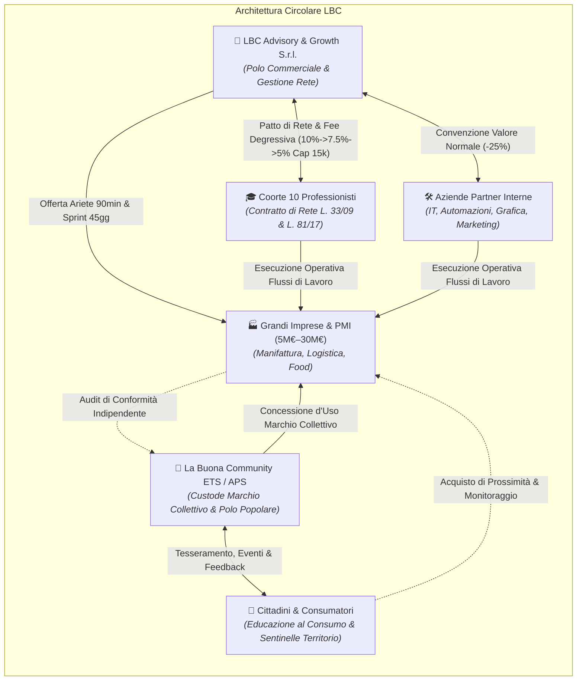
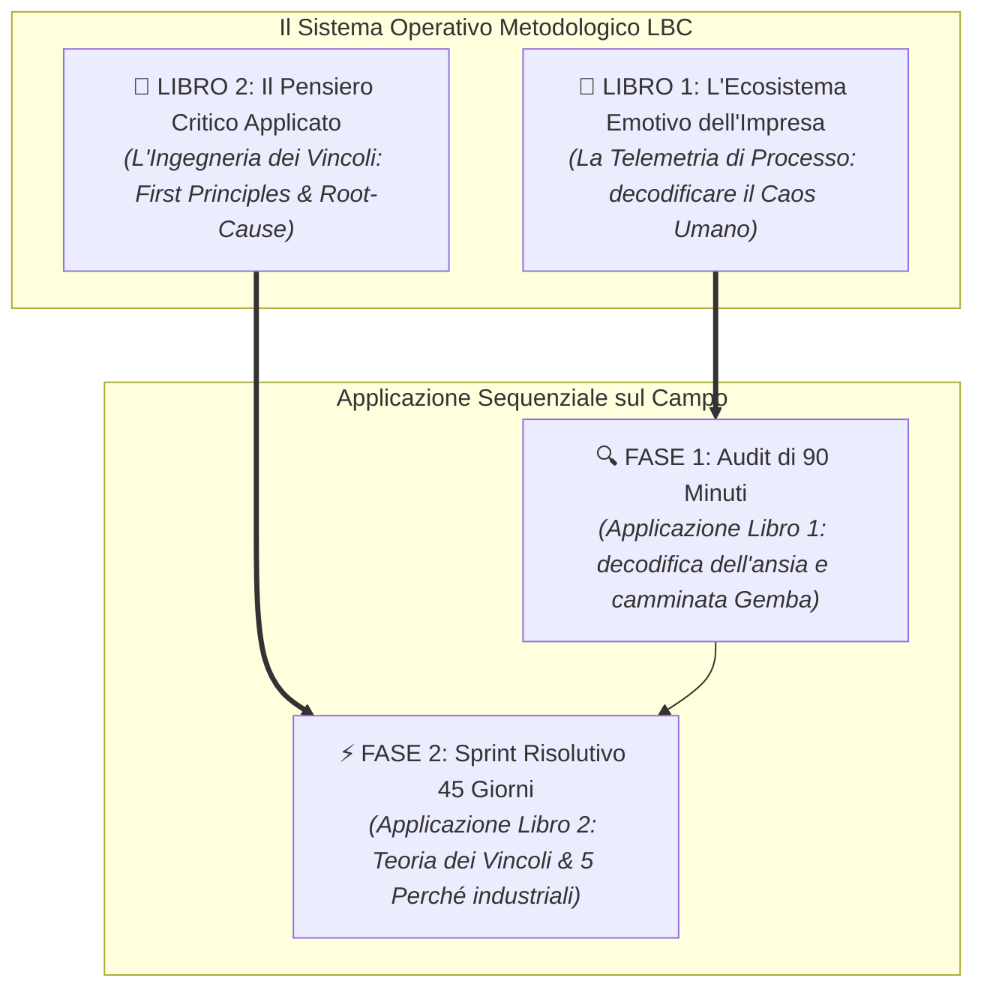
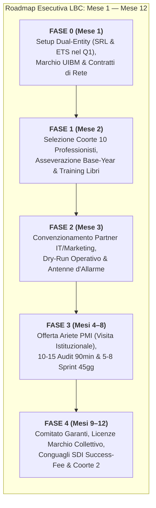
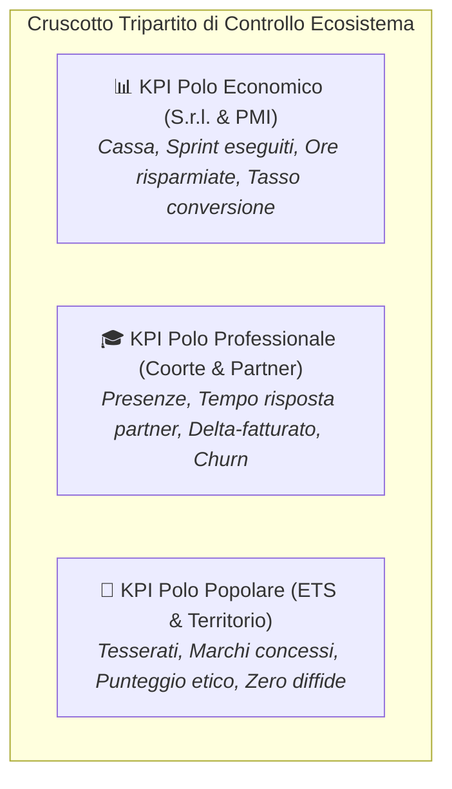

# LBC — LA BUONA COMMUNITY
# PIANIFICAZIONE STRATEGICA MACRO PER STEP DELL'ECOSISTEMA (MESE 1 — MESE 12)

---

> **Documento di Program Management, Architettura Dual-Entity & Metodologia Operativa Integrata**  
> *Versione Esecutiva Ufficiale — 25 Settembre 2026*  
> **Riferimenti di Base:** [`ANALISI_CRITICA_STATO_ARTE_E_MANUALI.md`](file:///c:/Users/MARIO/Downloads/LBC%20La%20Buona%20Community/ANALISI_CRITICA_STATO_ARTE_E_MANUALI.md), [`STRESS_TEST_GIURIDICO_FISCALE.md`](file:///c:/Users/MARIO/Downloads/LBC%20La%20Buona%20Community/STRESS_TEST_GIURIDICO_FISCALE.md), [`STRATEGIC_BLUEPRINT.md`](file:///c:/Users/MARIO/Downloads/LBC%20La%20Buona%20Community/STRATEGIC_BLUEPRINT.md), [`TARGET_SEGMENTATION_ANALYSIS.md`](file:///c:/Users/MARIO/Downloads/LBC%20La%20Buona%20Community/TARGET_SEGMENTATION_ANALYSIS.md), [`OFFERTA_ARIETE_PMI.md`](file:///c:/Users/MARIO/Downloads/LBC%20La%20Buona%20Community/OFFERTA_ARIETE_PMI.md).

---

## EXECUTIVE SUMMARY & INTENTO STRATEGICO

La presente **Pianificazione Strategica Macro** traduce la visione di **"LBC — La Buona Community"** in una macchina operativa scalabile, legalmente inattaccabile e metodologicamente rigorosa. L'architettura risolve alla radice le contraddizioni tipiche delle reti d'impresa e delle community professionali integrando tre pilastri sincronizzati:

1. **La Struttura Giuridico-Fiscale Dual-Entity**: netta separazione tra il veicolo a scopo di lucro (**LBC Advisory & Growth S.r.l.**) — che assume il rischio commerciale, contrattualizza la consulenza e gestisce la coorte — e l'ente non-profit (**La Buona Community ETS / APS**) — iscritto al RUNTS, custode indipendente del Marchio Collettivo e polo di educazione popolare, nel rigoroso rispetto del D.Lgs. 117/2017 e del D.Lgs. 30/2026 (anti-greenwashing).
2. **Il Sistema Operativo Metodologico dei 2 Libri Fondativi**: adozione della *Telemetria Emotiva di Processo* (Libro 1) per disinnescare le difese psicologiche del titolare ed eseguire l'Audit in 90 minuti, combinata con il *Pensiero Critico e la Teoria dei Vincoli* (Libro 2) per scaricare a terra gli Sprint dei 45 giorni con ROI misurabile a rischio zero.
3. **La Sequenza di Bootstrap in 5 Fasi (Mese 1 — Mese 12)**: superamento scientifico del dilemma dell'uovo e della gallina tramite la creazione del vivaio dei 10 professionisti, l'attivazione dei partner tecnici (CAC = 0), l'aggancio delle PMI industriali con l'Ariete a "Visita Istituzionale" e il rilascio finale del Marchio Collettivo verso i cittadini.

---

# SEZIONE 1: L'IDENTITÀ MACRO DELLA COMMUNITY E LE SUE 5 COMPONENTI

L'ecosistema LBC non è un'associazione generica né una società di consulenza tradizionale: è un **organismo integrato di distretto** in cui cinque attori interdipendenti scambiano valore secondo regole di allineamento simmetrico degli incentivi.

---

### 1.1 I Cittadini / Consumatori Consapevoli (Il Polo Popolare)
* **Inquadramento Giuridico**: Tesserati e soci dell'Associazione **La Buona Community ETS / APS** (Ente del Terzo Settore iscritto al RUNTS ai sensi del D.Lgs. 117/2017).
* **Modello di Contribuzione Popolare a Doppio Livello**:
  1. **Tesseramento Istituzionale di Base (30 € / anno)**:
     * *Natura*: Quota associativa annuale formale per l'acquisizione e il rinnovo dello status di socio dell'ETS.
     * *Inquadramento Fiscale*: Somma integralmente decommercializzata e priva di rilevanza IRES/IVA ai sensi dell'**art. 85 comma 1 D.Lgs. 117/2017 (CTS)** e dell'art. 148 TUIR.
     * *Finalità*: Iscrizione al libro soci, diritto di voto in assemblea, accesso alla mappa pubblica delle aziende certificate e supporto alle attività istituzionali dell'Associazione.
  2. **Abbonamento Continuativo alla Formazione & Mastermind Popolare (30 € / mese)**:
     * *Natura*: Corrispettivo specifico periodico riservato esclusivamente ai soci regolarmente iscritti, per la partecipazione continuativa al programma educativo di prossimità.
     * *Inquadramento Fiscale*: Decommercializzazione specifica per le APS ex **art. 85 comma 2 lett. a) D.Lgs. 117/2017**, in quanto attività di interesse generale (art. 5 comma 1 lett. d) CTS - educazione e formazione) resa direttamente a soci in conformità alle finalità statutarie.
     * *Contenuto di Alto Valore*: Incontri fisici periodici (settimanali/quindicinali) con esperti su spesa consapevole, salute alimentare, autoproduzione, risparmio energetico e finanza personale etica, oltre all'archivio video on-demand e guide applicative.
* **Sostenibilità Economica e Cassa Ricorrente (MRR dell'ETS)**:
  * Con 200 soci base: **€ 6.000 / anno** di cassa istituzionale pura.
  * Con una conversione del 50% sull'abbonamento formazione (100 soci attivi a 30 €/mese): **€ 3.000 / mese di MRR**, pari a **€ 36.000 / anno** di entrate ricorrenti prevedibili.
  * *Totale Raccolta*: **€ 42.000 / anno** che rendono l'ETS totalmente autosufficiente per affittare sedi fisiche prestigiose, coprire i rimborsi spese dei formatori e stampare guide senza dipendere da bandi pubblici o donazioni esterne.
* **Cosa Conferiscono all'Ecosistema**:
  * *Massa Critica e Legittimazione Sociale*: costituiscono il bacino territoriale di consumatori informati che orienta gli acquisti verso le aziende con Marchio Collettivo.
  * *Sentinelle del Territorio & Feedback di Base*: alimentano la raccolta di dati empirici sulla qualità reale e sulla trasparenza commerciale delle imprese della rete.
* **Cosa Ricevono in Cambio**:
  * *Formazione Specialistica Continua*: crescita personale e consapevolezza economica a fronte di un costo accessibile ma sostenibile (30 €/mese).
  * *Tutela Contro il Social-Washing*: certificazione rigorosa e indipendente delle aziende della provincia.
  * *Vantaggi Esclusivi di Distretto*: convenzioni e trattamenti di favore presso le attività del circuito LBC.

---

### 1.2 I 10 Professionisti della Coorte Pilota (Il Vivaio Operativo)
* **Inquadramento Giuridico**: Liberi professionisti e micro-consulenti federati mediante **Accordo Quadro di Co-Sviluppo Strategico B2B** collegato al **Contratto di Rete d'Impresa (L. 33/2009 e L. 81/2017)** con LBC Advisory & Growth S.r.l. Assoluta segregazione patrimoniale e soggettiva (totale esclusione di vincoli societari di fatto, agenzia o subordinazione).
* **Cosa Conferiscono all'Ecosistema**:
  * *Competenza Tecnica Specialistica*: ore di lavoro sul campo, diagnosi operativa, mappatura dei processi e implementazione delle soluzioni presso le PMI.
  * *Presenza e Disciplina*: partecipazione obbligatoria ad almeno l'85% degli incontri settimanali di lavoro in presenza (90 minuti a cadenza fissa).
  * *Success-Fee Degressiva su Delta Netto SDI*: riconoscimento a LBC Advisory & Growth S.r.l. di un compenso professionale variabile di co-sviluppo parametrato all'incremento netto di fatturato asseverato dal commercialista (Base-Year), con aliquota degressiva su base pluriennale:
    - **Anno 1 (10%)**: articolata per scaglioni di salvaguardia ($10\%$ fino a € 30.000, $7,5\%$ da 30k a 70k, $5\%$ oltre 70k);
    - **Anno 2 (7,5%)**: aliquota degressiva del $7,5\%$;
    - **Anno 3+ (5%)**: aliquota stabilizzata a regime al $5\%$;
    applicata sul volume d'affari incrementale imponibile certificato SDI al netto dell'anno base (*Base-Year*), con Cap massimo annuo di € 15.000,00 oltre IVA ed esclusioni dei clienti storici (24 mesi), escludendo tassativamente qualsiasi provvigione d'agenzia o mediazione.
* **Cosa Ricevono in Cambio**:
  * *Sblocco dell'Acquisizione Clienti*: superamento della solitudine professionale e della dipendenza dal passaparola casuale; accesso diretto alle commesse delle PMI del distretto.
  * *Addestramento d'Élite sui 2 Libri Fondativi*: padronanza della Telemetria Emotiva e del Problem Solving di First Principles.
  * *Task Force di Supporto a Costo di Distretto*: possibilità di vendere progetti complessi sapendo di avere alle spalle le aziende partner di IT, grafica e marketing a tariffe agevolate.
  * *Sostegno Morale & Gruppo di Pari*: mastermind settimanale strutturato con metodo Hot Seat per risolvere i colli di bottiglia dei singoli mandati.

---

### 1.3 Le Aziende Partner Interne (IT, Automazioni, Grafica, Marketing)
* **Inquadramento Giuridico**: Società strutturate (agenzie tra i 5 e i 25 dipendenti) convenzionate con **LBC Advisory & Growth S.r.l.** mediante contratti quadro di fornitura di servizi continuativi a valore normale (art. 9 TUIR) e accordi di licenza d'uso.
* **Il Modello ad Abbonamento Mensile ai Servizi ("Tech & Growth Retainer LBC")**:
  * *Superamento della Prestazione Singola a Spot*: Invece di proporre fatture una tantum onerose e isolate (es. € 3.000 per un'automazione o € 2.500 per un restyling grafico), i servizi tecnici vengono erogati tramite un **canone in abbonamento mensile continuativo** a tariffa distrettuale agevolata (es. € 150 – € 250 / mese per i professionisti della coorte; pacchetti modulari da € 350 – € 650 / mese per le PMI).
  * *Cosa Comprende l'Abbonamento*: Mantenimento e monitoraggio dei connettori software (Make, n8n), manutenzione del CRM, hosting sicuro, quota mensile di ore dedicate per grafica, marketing e lead generation, e assistenza tecnica prioritaria entro 24 ore.
* **La "Carta di Permanenza" (La Leva Strategica di Retention e Lock-in Positivo)**:
  * L'accesso al canone di abbonamento agevolato costituisce il principale **strumento strutturale di fidelizzazione** per rimanere attivi all'interno della community.
  * **I Vincoli Inderogabili di Presenza e Disciplina Comunitaria**:
    1. *Presenza Minima alle Sessioni*: Il diritto a mantenere la tariffa agevolata è subordinato alla partecipazione continuativa ad **almeno l'85% degli incontri settimanali di lavoro in presenza** e ai tavoli di mastermind.
    2. *Rispetto del Manifesto Etico e Contribuzione di Rete*: Il membro deve mantenere un rating etico impeccabile, condividere casi studio e rispettare i colleghi della coorte.
    3. *Clausola di Decadenza e Ripristino Tariffe di Mercato*: In caso di recesso dalla community, espulsione per inadempienza etica o assenze ingiustificate reiterate (> 15%), **il membro decade ipso iure dall'agevolazione di distretto**:
       - L'abbonamento passa immediatamente alla tariffa commerciale piena di mercato (**maggiorazione dal +150% al +200%** a carico del cliente receduto);
       - Qualora i connettori o i template risiedano su infrastrutture proprietarie LBC, la licenza d'uso viene revocata e i flussi disattivati entro 30 giorni.
* **Cosa Conferiscono all'Ecosistema**:
  * *Infrastruttura Software Operativa*: fornitura di soluzioni pronte, connettori gestionali e materiali di vendita che consentono ai professionisti di chiudere commesse complesse.
  * *Supporto Tecnico e Pre-Vendita Rapida*: rilascio di pre-fattibilità tecniche entro 48 ore lavorative per supportare i professionisti nella fase di proposta commerciale verso la PMI.
* **Cosa Ricevono in Cambio**:
  * *Entrate Ricorrenti Prevedibili (MRR Garantito)*: consolidamento di una base clienti solida e fidelizzata con pagamenti mensili puntuali.
  * *Costo di Acquisizione Clienti Pari a Zero (CAC = 0)*: i 10 professionisti della coorte agiscono come antenne commerciali diffuse sul territorio, veicolando costantemente nuovi abbonamenti e commesse verso i partner.
  * *Accesso a Grandi Progetti Industriali*: partecipazione da protagonisti a interventi sistemici presso PMI da 10M€–30M€ al fianco della regia LBC.

---

### 1.4 Le PMI e Grandi Imprese del Territorio (I Committenti dei Flussi)
* **Inquadramento Giuridico**: Imprese industriali e dei servizi (fatturato tra 5M€ e 30M€, 25–120 dipendenti) che stipulano con **LBC Advisory & Growth S.r.l.** contratti di fornitura di servizi di consulenza specialistica e formazione manageriale (art. 2222 c.c.) con manleva, backup preventivo e liability cap inderogabile.
* **Cosa Conferiscono all'Ecosistema**:
  * *Accesso ai Processi di Fabbrica*: disponibilità a condurre l'Audit dei 90 minuti e ad aprire i reparti operativi per l'eliminazione dei colli di bottiglia.
  * *Remunerazione a Riconoscimento del Valore*: pagamento del compenso forfettario per lo "Sprint Risolutivo 45gg" (€ 2.500–€ 4.500 + IVA) con garanzia di interruzione senza saldo se non viene rilevato ROI chiaro nelle prime 2 sessioni.
  * *Opportunità di Lavoro per la Rete*: affidamento di progetti esecutivi di efficientamento e digitalizzazione ai professionisti e ai partner tecnici.
* **Cosa Ricevono in Cambio**:
  * *Sblocco Immediato dei Flussi e Ore Recuperate*: eliminazione degli attriti tra preventivo, ufficio tecnico e officina; recupero di 10–15 ore/settimana di produttività direzionale.
  * *Accesso Diretto a Competenze Specialistiche di Distretto*: supporto operativo qualificato di professionisti autonomi della rete senza i costi proibitivi e gli schemi rigidi delle multinazionali di consulenza.
  * *Riconoscimento di Idoneità Etica Distrettuale*: diritto a sottoporsi all'istruttoria indipendente dell'ETS per ottenere la licenza d'uso del Marchio Collettivo LBC ex art. 11 CPI, spendibile verso il mercato e i consumatori in piena conformità al D.Lgs. 30/2026.

---

### 1.5 La Struttura Dual-Entity di Coordinamento
Per preservare la purezza dell'impatto etico e garantire al contempo la massima operatività commerciale, la governance si fonda su due soggetti distinti e non sovrapponibili:

```mermaid
flowchart LR
    subgraph Braccio_Commerciale ["LBC Advisory & Growth S.r.l."]
        direction TB
        S1["Finalità: Lucrativa For-Profit (ATECO 70.22.09)"]
        S2["Contratti di Consulenza e Formazione con le PMI"]
        S3["Gestione Economica della Coorte (Success-Fee a Scaglioni SDI)"]
        S4["Fornitura Servizi Software & Automazioni"]
        S5["Assume il Rischio d'Impresa & Risarcitorio (Liability Cap)"]
    end

    subgraph Braccio_Terzo_Settore ["La Buona Community ETS / APS"]
        direction TB
        E1["Finalità: Civica, Solidaristica & Utilità Sociale"]
        E2["Iscrizione RUNTS (D.Lgs. 117/2017)"]
        E3["Titolare Esclusiva del Marchio Collettivo (Art. 11 CPI)"]
        E4["Comitato Terzo Indipendente di Valutazione"]
        E5["Educazione Popolare & Tesseramento Cittadini"]
    end

    Braccio_Commerciale -.->|"Convenzione d'Uso Marchio a Condizioni di Mercato (Art. 9 TUIR)"| Braccio_Terzo_Settore
    Braccio_Terzo_Settore -.->|"Nessuna Commistione di Cassa né Prestazioni di Consulenza"| Braccio_Commerciale
```

| Parametro Differenziale | LBC Advisory & Growth S.r.l. | La Buona Community ETS / APS |
| :--- | :--- | :--- |
| **Natura Giuridica** | Società a responsabilità limitata ordinaria for-profit (Codice ATECO 70.22.09). | Associazione di Promozione Sociale (APS) iscritta al RUNTS (D.Lgs. 117/2017). |
| **Ruolo Primario** | Erogatore dei servizi di advisory, formazione B2B, ingegneria dei processi e contratti PMI. | Ente custode del Manifesto, educazione al consumo e titolare del Marchio Collettivo. |
| **Flussi Finanziari** | Fatture per Sprint PMI (€ 2.500–€ 4.500), success-fee sui professionisti, canoni software. | Quote associative tesserati (€ 20–€ 30), donazioni, contributi per progetti sociali. |
| **Regime Fiscale** | Ordinario IRES (24%), IRAP (3.9%), contabilità ordinaria d'impresa e IVA ordinaria. | Decommercializzazione istituzionale (art. 85 CTS) con divieto assoluto di utili (art. 8 CTS). |
| **Rapporto con il Marchio** | Semplice licenziatario d'uso commerciale per i propri servizi advisory e formativi. | Titolare esclusivo e registrato del Marchio Collettivo ex art. 11 CPI. |
| **Potere Decisionale Etico** | Nessuno. Non può concedere, sospendere o revocare il Marchio Collettivo. | Riservato in via esclusiva al Comitato dei Garanti e Probiviri terzo e indipendente. |

---

# SEZIONE 2: I 2 LIBRI COME "SISTEMA OPERATIVO METODOLOGICO"

I due libri non sono manuali accademici né letteratura promozionale: costituiscono il **motore software intellettuale** che uniforma il comportamento della Coorte dei 10 e rende l'intervento di LBC inconfondibile rispetto a qualsiasi altra consulenza sul mercato.

---

### 2.1 Libro 1: "L'Ecosistema Emotivo dell'Impresa" (La Telemetria di Processo)

* **Tesi Scientifica di Base**: Nelle PMI a matrice padronale o familiare, le manifestazioni emotive non sono debolezze caratteriali o problemi psicologici da trattare con la motivazione: sono **la spia sul cruscotto che indica un guasto di flusso o di procedura**.
* **Come Viene Applicato nell'Audit di 90 Minuti**:
  1. *Minuto 0–15 (Decodifica dell'Ansia del Titolare)*: Il consulente non chiede numeri di bilancio generici, ma usa la domanda-grilletto: *"Qual è la situazione operativa che la costringe a tenere il telefono acceso a tavola o a intervenire di persona per evitare un disastro?"*. L'emozione espressa (ansia da controllo, rabbia verso un collaboratore, solitudine) viene immediatamente mappata sulla *Matrice Emotiva-Operativa* per individuare l'assenza del cruscotto visivo o della procedura di delega.
  2. *Minuto 15–45 (La Camminata Telemetrica in Officina - Gemba Walk)*: Il consulente cammina tra le linee produttive osservando i micro-comportamenti: la rabbia del capoturno indica che dall'ufficio commerciale arrivano ordini privi di fattibilità tecnica; il cinismo degli operai segnala che l'azienda punisce l'iniziativa e premia l'immobilismo; la paralisi dell'ufficio acquisti rivela l'ambiguità tra qualità del materiale e risparmio di costo.
  3. *Minuto 45–90 (La Restituzione Scientifica)*: Il consulente mette il titolare davanti alla lavagna e traduce le sue lamentele umane in nodi di processo: *"Lei non ha un problema di persone svogliate: ha un problema alla porta 2 dove la bolla d'ordine non contiene le specifiche di collaudo. Risolvendo questo snodo procedurale con una scheda di handover bloccante, la sua rabbia scompare e recupera 8 ore a settimana."*

---

### 2.2 Libro 2: "Il Pensiero Critico Applicato all'Azienda Reale" (L'Ingegneria dei Vincoli)

* **Tesi Scientifica di Base**: Nelle PMI il 90% degli sforzi viene dissipato nel curare sintomi superficiali lasciando marcire la causa radice, imprigionati nel bias del *"Si è sempre fatto così"*. Il vero problem solving non consiste nell'aggiungere complessità o software costosi, ma nel togliere attrito e risalire ai primi principi fisici ed economici.
* **Come Viene Applicato nello Sprint dei 45 Giorni**:
  1. *First Principles Thinking (Smontare il Processo agli Atomi)*: Quando un responsabile afferma che *"ci vogliono per forza 10 giorni per evadere questo ordine"*, il team LBC applica l'Esercizio 1 (*Il Cronometro delle Mani Libere*). Si scompone l'ordine nei suoi elementi fisici non negoziabili: quanti minuti la macchina tocca effettivamente il metallo? (Es. 45 minuti). I restanti 9 giorni e 23 ore sono tempo di attesa, passaggio fogli e sosta su bancale. La battaglia si combatte solo sui tempi di sosta.
  2. *La Teoria dei Vincoli (ToC di Goldratt sul Distretto)*: L'azienda ha un solo collo di bottiglia alla volta (WIP Pile). Se la piegatrice CNC è il vincolo, ottimizzare il taglio laser a monte serve solo ad accumulare scorte e bloccare capitale circolante. Lo Sprint concentra il 100% dell'attenzione sul vincolo: nessun minuto perso alla piegatrice, carichi bilanciati ed eliminazione di ogni fermo non programmato.
  3. *Il Protocollo dei 5 Perché Industriali*: Quando un pezzo esce difettoso o una consegna ritarda, il consulente vieta la caccia al colpevole e guida la riunione secondo l'albero causale dei 5 Perché fino a dissotterrare il fallimento di procedura (es. assenza di calibrazione programmata, acquisto di utensili non conformi, istruzioni verbali mai scritte).
  4. *La Checklist Zero-Bias (10 Punti)*: Nessun professionista LBC può presentare una soluzione alla PMI senza aver verificato i 10 punti di controllo (esclusione di bias di conferma, misurabilità del ROI temporale > 5h/settimana, assunzione del punto di vista dell'operatore ed eliminazione di complessità software superflua).

---

# SEZIONE 3: LA ROADMAP ESECUTIVA IN 5 FASI (MESE 1 — MESE 12)

La roadmap scandisce cronologicamente l'avvio, la messa in sicurezza e la scalabilità dell'ecosistema attraverso cinque fasi sequenziali inderogabili.

---

### FASE 0: Setup Strutturale, Strumentale & Redazione Libri (Mese 1)

* **Obiettivo Primario**: Costituzione formale dei veicoli giuridici nel Q1, blindatura dei rischi e completamento dei materiali metodologici proprietari prima di qualsiasi interazione sul mercato.
* **Attività Operative**:
  1. *Costituzione notarile di LBC Advisory & Growth S.r.l.*: redazione dell'atto costitutivo e statuto (ATECO 70.22.09, P.IVA ordinaria, capitale sociale versato).
  2. *Costituzione di La Buona Community ETS / APS e Deposito Marchio nel Q1*: registrazione statuto conforme al D.Lgs. 117/2017 (CTS), adozione del divieto assoluto di distribuzione utili (art. 8 CTS), avvio della pratica di iscrizione al RUNTS e deposito presso l'UIBM del Marchio Collettivo ex art. 11 CPI con Disciplinare conforme al D.Lgs. 30/2026, prevenendo contestazioni di elusione e promiscuità fiscale ex art. 149 TUIR.
  3. *Formalizzazione del Contratto di Rete & Accordo Quadro B2B*: predisposizione del testo definitivo dell'Accordo di Co-Sviluppo Strategico conforme alle L. 33/2009 e L. 81/2017, con totale esclusione di vincoli societari di fatto o presunzioni di subordinazione.
  4. *Redazione e Pubblicazione dei Playbook Operativi dei 2 Libri Fondativi*: completamento dei testi integrali di *"L'Ecosistema Emotivo"* e *"Il Pensiero Critico"* per il curriculum formativo della Coorte.
  5. *Predisposizione del Kit di Blindatura Contrattuale*: DPA ex art. 28 GDPR con protocollo di k-anonymity ($k \ge 20$), NDA di distretto, clausola di liability cap e onere preventivo di backup per i clienti industriali.
* **Deliverable di Fase**:
  * Visura camerale LBC Advisory & Growth S.r.l., registrazione Statuto ETS e ricevuta deposito Marchio Collettivo UIBM.
  * Testo contrattuale standard con doppia firma formale per clausole onerose (artt. 1341–1342 c.c.).
  * Playbook dei 2 Libri Fondativi stampati e pronti in formato PDF protetto.
* **Metrica di Passaggio (Gate 0)**: 100% conformità legale validata e disponibilità dei playbook prima di avviare la campagna di reclutamento.

---

### FASE 1: Reclutamento, Selezione & Certificazione della Coorte Pilota (Mese 2)

* **Obiettivo Primario**: Selezionare, allineare e certificare i 10 professionisti complementari destinati a costituire la prima task force distrettuale di LBC.
* **Attività Operative**:
  1. *Lancio della Call Selettiva Territoriale*: pubblicazione della selezione per 10 posizioni ad architettura complementare (3 Operations, 2 Vendite B2B, 2 Finance, 2 Digital/Low-code, 1 HR).
  2. *Screening con Questionario a 7 Domande*: somministrazione del filtro con verifica vincolante dell'idoneità contabile all'asseverazione del Base-Year, accettazione della success-fee degressiva (10% Anno 1 -> 7.5% Anno 2 -> 5% a regime, con scaglioni di salvaguardia e Cap a € 15.000), presenza settimanale e adesione al Manifesto Etico.
  3. *Colloqui Clinici di Selezione & Griglia a 100 Punti*: ammissione vincolata al raggiungimento di almeno 80/100 punti (zero ammissioni per deroga).
  4. *Certificazione Documentale del Fatturato Base-Year*: asseverazione del volume d'affari degli ultimi 12 mesi solari rilasciata dal commercialista del candidato su dati SDI netti come condizione sospensiva di efficacia ex art. 1353 c.c.
  5. *Accademia Intensiva Residenziale sui 2 Libri (3 Giorni)*: addestramento pratico dei 10 professionisti con simulazioni di telemetria emotiva, scomposizione First Principles e checklist zero-bias.
  6. *Sottoscrizione del Patto Contrattuale & Attivazione Abbonamento Servizi*: firma dell'Accordo di Co-Sviluppo B2B con versamento della quota di iscrizione/onboarding (€ 500 + IVA) e sottoscrizione dell'opzione per il canone in abbonamento agevolato ai servizi tecnici dei partner, con clausola di decadenza in caso di assenze > 15%.
* **Deliverable di Fase**:
  * Registro dei 10 Professionisti Accreditati con asseverazione Base-Year agli atti.
  * Contratti sottoscritti con doppia firma ex artt. 1341–1342 c.c. e vincolo di permanenza.
  * Attestato interno di superamento dell'Accademia Metodologica LBC.
* **Metrica di Passaggio (Gate 1)**: Coorte dei 10 completa, asseverata e certificata sui 2 libri entro il giorno 60.

---

### FASE 2: Convenzionamento Partner IT/Marketing & Simulazioni sul Campo (Mese 3)

* **Obiettivo Primario**: Federare le prime 3–4 aziende partner tecnologiche e creative con modello in abbonamento mensile, rodare la task force su 2 casi pilota e attivare le antenne d'allarme precoci.
* **Attività Operative**:
  1. *Stipula Contratti "Tech & Growth Retainer LBC" in Abbonamento*: convenzionamento con Software House, Agenzia Automazioni Low-Code, Studio Grafico e Agenzia Marketing B2B, strutturando pacchetti in abbonamento continuativo (€ 150–€ 250/mese per i professionisti) vincolati alla presenza comunitaria attiva.
  2. *Integrazione dello Stack Software Proprietario*: rilascio ai 10 professionisti delle licenze convenzionate, dei connettori software attivi (Make, n8n, CRM) e dei modelli grafici.
  3. *Dry-Run Operativo su 2 Casi Aziendali Simulati (Stress-Test del Metodo)*:
     * *Caso 1 (Manifattura)*: simulazione completa dell'Audit di 90 minuti su un'officina meccanica amica del territorio con identificazione del vincolo e restituzione su lavagna.
     * *Caso 2 (Servizi/Logistica)*: simulazione di gestione commessa con handover tra professionista commerciale, ingegnere di processo e partner IT.
  4. *Attivazione delle 6 Antenne d'Allarme Precoci*: configurazione del cruscotto di monitoraggio delle presenze (trigger allarme < 80%), dei tempi di risposta dei partner (< 48h) e dei livelli di engagement nei meeting.
  5. *Istituzione della "Cena Mensile dei Fondatori"*: avvio del format riservato serale dedicato al confronto tra pari per consolidare la coesione del gruppo.
* **Deliverable di Fase**:
  * 4 Accordi di Convenzione in Abbonamento sottoscritti con le aziende partner interne.
  * Report documentato dei 2 audit pilota simulati con validazione del tempo ciclo.
  * Cruscotto operativo di monitoraggio delle 6 antenne d'allarme configurato.
* **Metrica di Passaggio (Gate 2)**: Flussi di lavoro tra professionisti e partner tecnici collaudati con tempo di risposta < 48h e canoni di abbonamento attivi.

---

### FASE 3: Apertura Territoriale e Attivazione Offerta Ariete sulle PMI (Mesi 4 — 8)

* **Obiettivo Primario**: Penetrare il distretto industriale pilota, erogare i primi 10–15 audit diagnostici in azienda e chiudere 5–8 Sprint Risolutivi, generando cassa e primi casi studio reali.
* **Attività Operative**:
  1. *Campagna Territoriale "Visita Istituzionale di Cortesia"*: approccio telefonico e personale di 30 PMI target (manifattura, logistica, food da 5M€ a 30M€) condotto dalla direzione LBC, invitando il titolare a una sessione conoscitiva a porte chiuse senza alcuna vendita a freddo.
  2. *Esecuzione di 10–15 Audit Diagnostici in Presenza (90 Minuti)*: conduzione degli incontri in azienda applicando la Telemetria Emotiva (Libro 1) e la Camminata di Fabbrica (Gemba Walk).
  3. *Contrattualizzazione di 5–8 Sprint Risolutivi (30–45 Giorni)*: chiusura dei contratti di riorganizzazione operativa (€ 2.500–€ 4.500 + IVA) con clausola di liability cap e garanzia etica a rischio zero.
  4. *Deployment delle Task Force sul Campo*: esecuzione degli sprint affiancando i professionisti della coorte alle PMI e integrando i moduli tecnici in abbonamento delle aziende partner interne (automazioni e cruscotti).
  5. *Rendicontazione dei Primi Risultati e Incasso Cassa*: incasso delle fatture di consulenza, documentazione delle ore recuperate (>10h/settimana per titolare) e primo monitoraggio del delta-fatturato generato per i professionisti.
  6. *Realizzazione del Primo Video-Caso Studio di Distretto*: produzione di un contenuto documentale di alto impatto che testimonia la risoluzione di un collo di bottiglia reale in un'azienda storica della provincia.
* **Deliverable di Fase**:
  * 12 Verbali di Audit Diagnostico dei 90 minuti compilati e archiviati.
  * 6 Contratti di Sprint Risolutivo firmati ed eseguiti con successo.
  * € 15.000 — € 25.000 di fatturato di consulenza incassato da LBC Advisory & Growth S.r.l.
  * Primo video-caso studio pubblicato sui canali professionali territoriali.
* **Metrica di Passaggio (Gate 3)**: Almeno 5 PMI con problemi di flusso risolti, 100% di garanzie etiche superate senza recessi e prime quote di revenue share fatturate ai professionisti.

---

### FASE 4: Lancio del Polo Popolare ETS & Rilascio Primi Marchi Collettivi (Mesi 9 — 12)

* **Obiettivo Primario**: Attivare il polo sociale non-profit, avviare il tesseramento e l'abbonamento formazione dei cittadini, convocare il Comitato dei Garanti per il rilascio dei primi Marchi Collettivi e chiudere il bilancio dell'Anno 1.
* **Attività Operative**:
  1. *Attivazione Pubblica dell'Associazione La Buona Community ETS / APS*: lancio della campagna con **Tesseramento Istituzionale a 30 € / anno** (quota associativa) e **Abbonamento Continuativo alla Formazione a 30 € / mese** (incontri pratici riservati ai soci sul consumo consapevole, benessere e finanza etica ex art. 85 comma 2 CTS).
  2. *Convocazione del Comitato Tecnico-Etico Indipendente*: insediamento dell'organo di garanzia dell'ETS, composto da figure terze (docenti universitari, esperti ambientali, rappresentanti dei lavoratori ed esponenti del terzo settore).
  3. *Istruttoria di Conformità sulle Prime PMI Efficientate*: audit etico documentato secondo il Disciplinare Tecnico conforme a standard ISO/IEC 17065 (clima aziendale con protocollo $k \ge 20$, sicurezza, filiera corta e regolarità contrattuale).
  4. *Concessione del Marchio Collettivo LBC*: rilascio formale delle prime licenze d'uso del Marchio Collettivo con codice QR dinamico, registrato a norma dell'art. 11 CPI e conforme al D.Lgs. 30/2026 contro il social-washing.
  5. *Evento Plenario Territoriale del Distretto*: conferenza pubblica congiunta (PMI virtuose, professionisti della coorte, partner tecnologici e cittadini tesserati/abbonati) con consegna pubblica dei Marchi Collettivi e forte risonanza mediatica locale.
  6. *Consuntivo Economico dell'Anno 1 & Conguaglio Success-Fee*: verifica contabile SDI del delta-fatturato dei 10 professionisti, incasso dei conguagli entro il Cap di € 15.000 oltre IVA e consolidamento della Coorte 1 con attribuzione della qualifica di Senior Mentor di Distretto.
  7. *Apertura Candidature per la Coorte Pilota 2*: selezione dei successivi professionisti del distretto, guidati dai membri della prima coorte promossi al ruolo di "Senior Mentor di Distretto".
* **Deliverable di Fase**:
  * Almeno 200 cittadini tesserati all'Associazione ETS (€ 6.000 cassa base) e almeno 100 soci abbonati alla formazione (€ 3.000/mese MRR).
  * Primi 3–5 Marchi Collettivi concessi e registrati nel registro pubblico LBC.
  * Bilancio d'esercizio dell'Anno 1 chiuso in utile operativo per LBC Advisory & Growth S.r.l.
  * Regolamento e bando di selezione per la Coorte 2 pubblicato.
* **Metrica di Passaggio (Gate 4)**: Autosufficienza finanziaria consolidata, Marchio Collettivo inattaccabile da contestazioni AGCM e consolidamento della Coorte 1 con pianificazione Coorte 2.

---

# SEZIONE 4: MATRICE DI CONTROLLO & DASHBOARD DI MONITORAGGIO

Per garantire il perfetto equilibrio operativo tra polo economico (S.r.l.), polo professionale (Coorte & Partner) e polo popolare (ETS & Cittadini), la direzione di LBC monitora mensilmente la seguente tabella sinottica di KPI critici:

| Area dell'Ecosistema | Indicatore Chiave di Performance (KPI) | Target Anno 1 | Soglia d'Allarme (Trigger di Rischio) | Azione Correttiva Immediata |
| :--- | :--- | :---: | :---: | :--- |
| **Polo Economico (S.r.l. & PMI)** | **Tasso di Conversione Audit 90min $\rightarrow$ Sprint 45gg** | $\ge 40\%$ | $< 25\%$ | Rivedere lo script di contatto iniziale e verificare che l'Audit applichi rigorosamente la Telemetria Emotiva (Libro 1). |
| **Polo Economico (S.r.l. & PMI)** | **Ore Medie Settimanali Risparmiate dal Titolare** | $\ge 10$ ore/sett | $< 5$ ore/sett | Ricalibrare l'intervento sul vincolo principale (Libro 2 - ToC) ed eliminare le micro-ottimizzazioni secondarie. |
| **Polo Economico (S.r.l. & PMI)** | **Tasso di Attivazione Garanzia Etica (Recessi senza saldo)** | $< 5\%$ | $> 15\%$ | Sospendere il consulente incaricato e riesaminare la qualifica delle aziende target nel processo di selezione. |
| **Polo Professionale (Coorte)** | **Tasso di Presenza alle Sessioni Settimanali** | $\ge 85\%$ | $< 80\%$ | Convocazione del professionista, diffida bonaria e applicazione della clausola di decadenza dal retainer agevolato dei partner. |
| **Polo Professionale (Coorte)** | **Incremento Medio di Fatturato Pro-Capite (Delta Base-Year)** | $\ge +25\%$ | $< +10\%$ | Affiancare al professionista il Commerciale B2B della coorte e un'agenzia marketing interna per rivedere l'offerta. |
| **Polo Professionale (Coorte)** | **Tasso di Abbandono / Churn dei Professionisti** | $< 10\%$ | $> 20\%$ | Attivare l'antenna "Disimpegno Vocale" e verificare se la fee continuativa è percepita come equa rispetto ai lead passati. |
| **Polo Partner Tecnici** | **Adozione 'Tech & Growth Retainer' da parte della Coorte** | $\ge 80\%$ | $< 50\%$ | Rivedere i pacchetti modulari con i partner tecnici per assicurare che il canone mensile risponda alle esigenze pratiche dei professionisti. |
| **Polo Partner Tecnici** | **Tempo Medio di Rilascio Pre-Fattibilità Tecnica** | $< 48$ ore | $> 72$ ore | Convocazione d'urgenza dell'agenzia partner e riassegnazione prioritaria delle commesse a fornitori di riserva. |
| **Polo Popolare (ETS & Cittadini)** | **Soci con Tesseramento Istituzionale di Base (30 € / anno)** | $\ge 200$ soci | $< 50$ (al Mese 10) | Potenziare la presenza social locale ed organizzare 2 eventi aperti in collaborazione con commercianti virtuosi di quartiere. |
| **Polo Popolare (ETS & Cittadini)** | **Soci con Abbonamento Formazione & Mastermind (30 € / mese)** | $\ge 100$ abbonati (€ 3k MRR) | $< 30$ abbonati | Ricalibrare i contenuti dei corsi su temi di immediato risparmio economico (es. spesa intelligente, bollette ed energia domestica). |
| **Polo Popolare (ETS & Marchio)** | **Punteggio Medio di Conformità Etica delle PMI (Auditate)** | $\ge 4.2 / 5.0$ | $< 3.8 / 5.0$ | Prescrizione del Piano di Cura a 60 giorni prima di consentire la presentazione della domanda di Marchio Collettivo. |
| **Conformità Giuridica Globale** | **Numero di Contestazioni per Social-Washing o Violazioni AGCM** | **0 Assoluto** | $\ge 1$ segnalazione | Sospensione cautelare immediata dell'esposizione del marchio per l'azienda coinvolta e riesame del disciplinare. |

---

### CONCLUSIONE OPERATIVA

L'ecosistema **LBC — La Buona Community** si presenta ora come un'architettura completa, dove ogni decisione di business è ancorata a:
1. **Uno scudo giuridico-fiscale infallibile** (Dual-Entity, Rete d'Impresa, Marchio Collettivo a norma D.Lgs. 30/2026).
2. **Un protocollo operativo scientifico** (Telemetria Emotiva del Libro 1 e First Principles del Libro 2).
3. **Una sequenza di passi pragmatici** che garantisce cassa immediata per la S.r.l., crescita per i professionisti e trasparenza per i consumatori del territorio.

Il programma è formalmente pronto per l'avvio della **Fase 0 (Mese 1)**.
