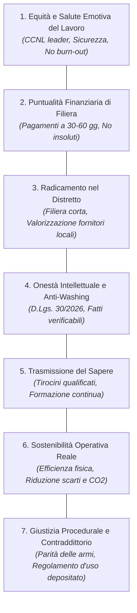
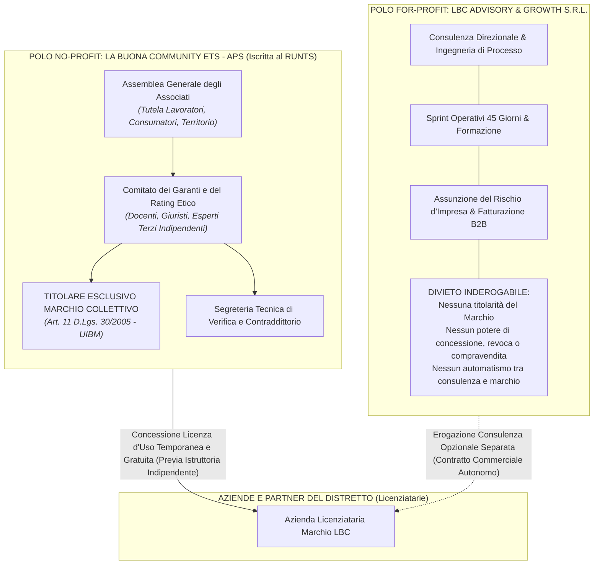
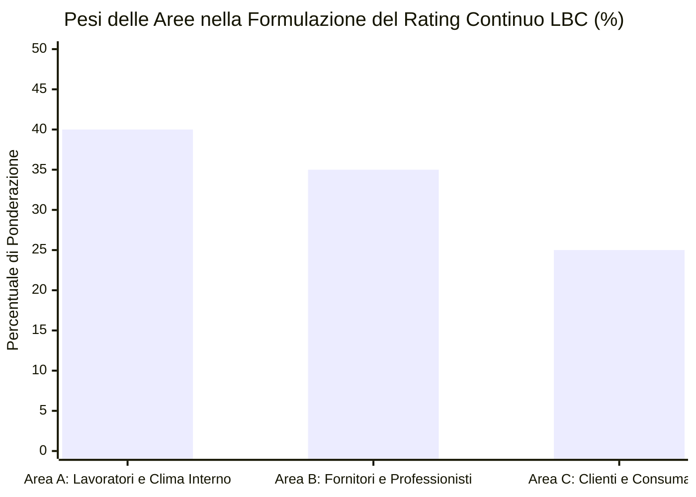
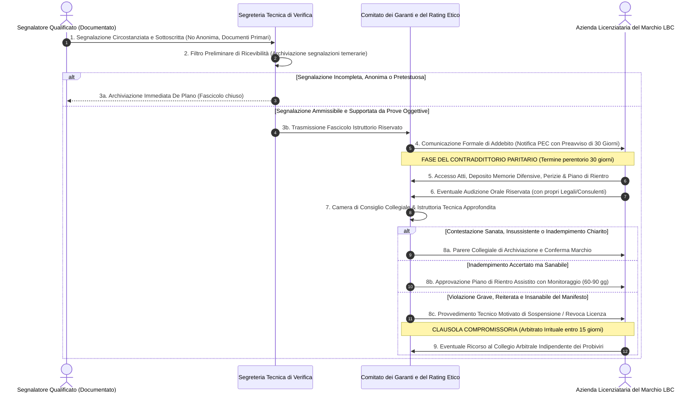
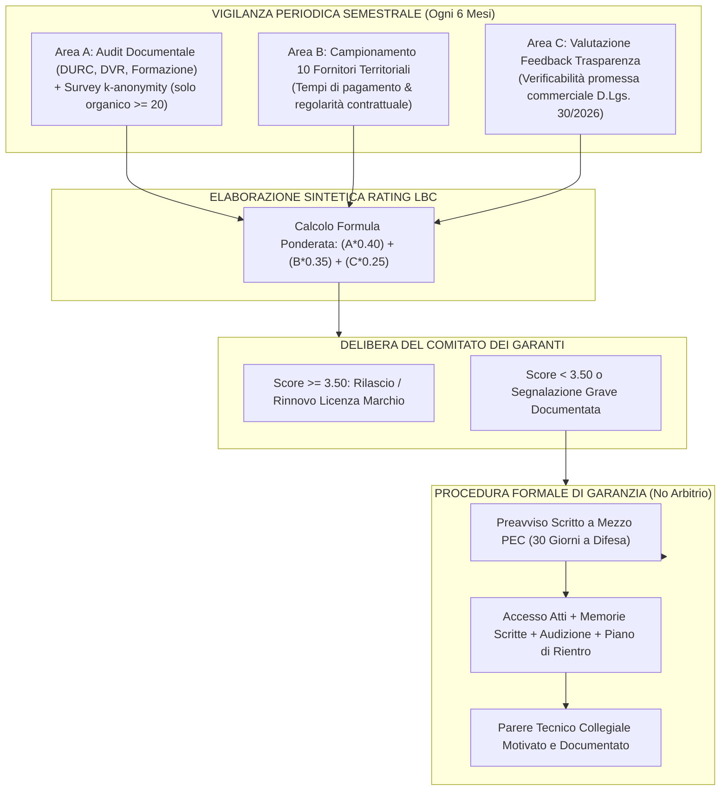

# LBC — LA BUONA COMMUNITY
## Manifesto Etico, Disciplinare del Marchio Collettivo e Griglia di Rating Continuo di Distretto
### Disciplinare di Governance e Procedura Istruttoria di Garanzia
#### Redatto in conformità al D.Lgs. 30/2026 (Attuazione Direttiva UE 2024/825), agli Artt. 11 e 11-bis del Codice della Proprietà Industriale (D.Lgs. 30/2005), al D.Lgs. 117/2017 (Codice del Terzo Settore), agli Artt. 4 e 8 della Legge 300/1970 (Statuto dei Lavoratori) e al Regolamento (UE) 2016/679 (GDPR)

> **Documenti Correlati dell'Ecosistema LBC:**  
> • [`STRATEGIC_BLUEPRINT.md`](file:///c:/Users/MARIO/Downloads/LBC%20La%20Buona%20Community/STRATEGIC_BLUEPRINT.md) — Masterplan e Dual-Entity Corporate Design  
> • [`ANALISI_CRITICA_RISCHI_E_SOLUZIONI.md`](file:///c:/Users/MARIO/Downloads/LBC%20La%20Buona%20Community/ANALISI_CRITICA_RISCHI_E_SOLUZIONI.md) — Risk Mitigation & Prevenzione Fallimenti  
> • [`OFFERTA_ARIETE_PMI.md`](file:///c:/Users/MARIO/Downloads/LBC%20La%20Buona%20Community/OFFERTA_ARIETE_PMI.md) — Offerta Commerciale Ariete e Sprint Processi  
> • [`ACCORDO_PILOTA_DELTA_FATTURATO.md`](file:///c:/Users/MARIO/Downloads/LBC%20La%20Buona%20Community/ACCORDO_PILOTA_DELTA_FATTURATO.md) — Contratto Pilota Co-Sviluppo Retisti  
> • [`TARGET_SEGMENTATION_ANALYSIS.md`](file:///c:/Users/MARIO/Downloads/LBC%20La%20Buona%20Community/TARGET_SEGMENTATION_ANALYSIS.md) — Segmentazione PMI e Selezione Coorte  
> • [`STRESS_TEST_GIURIDICO_FISCALE.md`](file:///c:/Users/MARIO/Downloads/LBC%20La%20Buona%20Community/STRESS_TEST_GIURIDICO_FISCALE.md) — Parere di Inquadramento Giuridico-Fiscale  

---

### PREAMBOLO: VISIONE, METODOLOGIA SCIENTIFICA E FONDAMENTI DOTTRINALI

L'ecosistema di **LBC — La Buona Community** nasce per colmare una frattura strutturale del sistema economico territoriale: la degenerazione della "responsabilità sociale d'impresa" e della sostenibilità in pura retorica promozionale, *social-washing* e certificazioni di facciata prive di riscontro oggettivo.

A differenza dei modelli tradizionali basati su autodichiarazioni compiacenti o indagini d'opinione arbitrarie, LBC fonda i propri standard di valutazione e condotta su una rigorosa integrazione teorico-metodologica derivata direttamente dai due testi fondativi dell'ecosistema:

1. **"L'Ecosistema Emotivo dell'Impresa — Manuale di Procedura per Interpretare e Risolvere il Caos Organizzativo attraverso le Emozioni"**:
   LBC rigetta la visione della moralità aziendale come astratta esortazione etica. L'ecologia delle relazioni umane e la salute emotiva dell'organizzazione sono assunte come **telemetria oggettiva e scientifica dello stato di funzionamento dei processi interni**. L'ansia del personale, la conflittualità tra reparti, l'apatia o il sovraccarico tossico non sono accidenti caratteriali, bensì indicatori precisi di disallineamenti procedurali, deficit di chiarezza contrattuale, deleghe fittizie o violazioni della dignità del lavoro. Rispettare il lavoratore significa progettare flussi operativi sostenibili, orari certi e ambienti psicologicamente decontaminati da arbitri gerarchici.
2. **"Il Pensiero Critico Applicato all'Azienda Reale — Guida Operativa al Problem Solving di Primo Livello per Imprenditori e Professionisti"**:
   LBC applica il metodo galileiano e i principi del pensiero critico di primo livello (First Principles Thinking, Teoria dei Vincoli e Protocollo dei 5 Perché industriali) all'etica d'impresa. L'onestà intellettuale, la trasparenza radicale dei numeri e l'aderenza documentale ai fatti sostituiscono ogni narrazione autoreferenziale. Un'azienda non è "buona" per dichiarazione d'intenti o slogan pubblicitari, ma perché i dati contabili, i registri di sicurezza, i tempi medi di pagamento ai fornitori e le evidenze empiriche ne certificano la correttezza sostanziale.

Il presente documento costituisce l'atto fondamentale che disciplina i valori comuni, l'architettura istituzionale di segregazione societaria, le metriche di misurazione e il regolamento vincolante di tutela in contraddittorio del **Marchio Collettivo LBC**.

---

### 1. IL MANIFESTO ETICO LBC (I 7 PILASTRI INDEROGABILI)

Ogni impresa, consorzio o professionista che richiede l'adesione alla Community e la concessione in uso del Marchio Collettivo LBC si impegna formalmente e contrattualmente al rispetto sostanziale dei seguenti 7 Pilastri Fondamentali:

#### Pilastro 1 — Equità Contrattuale, Dignità e Salute Emotiva del Lavoro
Garantire condizioni di lavoro lecite, sicure ed eque, applicando esclusivamente i Contratti Collettivi Nazionali di Lavoro (CCNL) stipulati dalle organizzazioni datoriali e sindacali comparativamente più rappresentative sul piano nazionale, scongiurando l'applicazione di contratti pirata o inquadramenti elusivi. Promuovere la salute emotiva dell'ambiente lavorativo attraverso la razionalizzazione dei carichi di lavoro, la prevenzione del burn-out, il contrasto a ogni forma di molestia o mobbing e il rigoroso rispetto dei riposi e della conciliazione vita-lavoro.

#### Pilastro 2 — Puntualità e Trasparenza nei Flussi Finanziari di Filiera
Riconoscere nella liquidità del fornitore un bene comune del distretto economico. Rispettare tassativamente i termini di pagamento contrattualizzati (standard distrettuale: 30–60 giorni data fattura), astenendosi da ritardi unilaterali ingiustificati, contestazioni strumentali a saldo lavori o imposizioni di sconti non concordati a prestazione eseguita.

#### Pilastro 3 — Radicamento Territoriale e Valorizzazione della Filiera Corta
Privilegiare, a parità di requisiti qualitativi e tecnici, l'approvvigionamento di beni, semilavorati e servizi professionali presso imprese ed artigiani operanti nel territorio di riferimento. Reinvestire quote di valore economico nel distretto per fortificare il tessuto produttivo ed occupazionale locale.

#### Pilastro 4 — Onestà Intellettuale, Trasparenza Informativa e Contrasto al Social/Green Washing (D.Lgs. 30/2026)
Conformare qualsiasi comunicazione esterna ai principi di oggettività, verificabilità e non ingannevolezza sanciti dal **D.Lgs. 30/2026** (di attuazione della Direttiva UE 2024/825 contro le pratiche commerciali sleali). È vietato diffondere asserzioni ambientali generiche (*"green"*, *"amico dell'ambiente"*, *"a impatto zero"*) o sociali (*"azienda etica"*, *"amica del territorio"*) prive di parametri scientifici terzi o impegni verificabili per iscritto. L'onestà metodologica e l'aderenza ai fatti oggettivi devono precedere qualsiasi messaggio commerciale.

#### Pilastro 5 — Trasmissione del Sapere Tecnico e Formazione Continua
Considerare il *know-how* industriale e artigianale come patrimonio dinamico da trasmettere alle nuove generazioni. Garantire tirocini curriculari ed extracurriculari effettivamente formativi ed equamente retribuiti, attivando percorsi continui di riqualificazione delle competenze dei collaboratori interni.

#### Pilastro 6 — Sostenibilità Operativa e Minimizzazione degli Impatti Ambientali
Adottare misure concrete di efficienza energetica, riduzione degli scarti produttivi, riciclo virtuoso delle materie prime e contenimento delle emissioni, misurate su basi fisiche oggettive e costantemente aggiornate nei bilanci o documenti di gestione operativa.

#### Pilastro 7 — Adesione al Disciplinare del Marchio e Giustizia Procedurale Paritaria
Riconoscere l'autorità tecnica del Disciplinare del Marchio Collettivo LBC e degli organi di vigilanza dell'Associazione, collaborando attivamente all'aggiornamento semestrale del Rating e accettando la giurisdizione del regolamento in contraddittorio a tutela della parità di trattamento e del miglioramento continuo.

---

### 2. ARCHITETTURA ISTITUZIONALE DUAL-ENTITY E SEGREGAZIONE DEI RUOLI

A presidio assoluto dell'indipendenza di giudizio, della legalità societaria e della prevenzione di conflitti di interesse (in ossequio all'**Art. 11-bis comma 2 del Codice della Proprietà Industriale** e alla disciplina antitrust), l'ecosistema LBC si struttura su una rigida e inderogabile separazione tra il veicolo associativo no-profit e il veicolo societario for-profit.

#### 2.1 La Buona Community ETS — APS (Ente del Terzo Settore)
1. **Inquadramento Giuridico**: Associazione di Promozione Sociale costituita ai sensi del D.Lgs. 117/2017 (Codice del Terzo Settore), iscritta nel Registro Unico Nazionale del Terzo Settore (RUNTS). Ente privo di scopi di lucro, caratterizzato dal divieto assoluto e permanente di distribuzione diretta o indiretta di utili, avanzi di gestione o riserve (art. 8 CTS).
2. **Funzione Istituzionale Esclusiva**: L'Associazione è l'**unica ed esclusiva intestataria del Marchio Collettivo denominativo e figurativo "LBC — La Buona Community"**, depositato e registrato presso l'UIBM ai sensi dell'**art. 11 del D.Lgs. 30/2005 (Codice della Proprietà Industriale)**.
3. **Tutela del Mercato e dei Consumatori**: L'ETS opera quale organismo garante a tutela degli interessi diffusi dei cittadini, dei consumatori e del lavoro dignitoso nel distretto economico. Gestisce il Registro dei Licenziatari, nomina il Comitato dei Garanti e del Rating Etico e sovrintende all'applicazione del Disciplinare Tecnico.

#### 2.2 LBC Advisory & Growth S.r.l. (Società Commerciale Autonoma)
1. **Inquadramento Giuridico**: Società di capitali a responsabilità limitata a scopo di lucro, soggetta al regime tributario e civilistico ordinario d'impresa.
2. **Perimetro di Attività**: Eroga servizi commerciali di advisory, ingegneria dell'efficienza organizzativa, automazione di processo e affiancamento direzionale per PMI e professionisti, operando secondo standard contrattuali a valore normale di mercato (art. 9 TUIR).
3. **Divieti Inderogabili di Segregazione e Assenza di Poteri sul Marchio**:
   * Per espresso vincolo statutario e regolamentare, **LBC Advisory & Growth S.r.l. NON è titolare del Marchio Collettivo, NON ha facoltà di concederlo, NON ha alcun potere di revoca e NON può commercializzare né vendere il Bollino Etico o il Rating LBC sotto alcuna forma negoziale**;
   * È fatto assoluto divieto di inserire la concessione del Marchio o la garanzia di un rating positivo all'interno dei contratti di consulenza commerciale stipulati dalla S.r.l. L'accesso al Marchio è rimesso unicamente all'istruttoria tecnica indipendente dell'Associazione ETS;
   * Nessun socio, amministratore o dipendente della S.r.l. può fare parte del Comitato dei Garanti e del Rating Etico dell'Associazione no-profit.

---

### 3. METRICHE DEL RATING CONTINUO E PROTOCOLLO DI TUTELA GIUSLAVORISTICA

Il Rating Etico LBC è una **valutazione tecnica periodica aggregata di idoneità etico-distrettuale** (espresso in centesimi da **1.00 a 5.00**), calcolato su base semestrale attraverso l'integrazione di tre macro-aree ponderate.

#### Area A: Lavoratori e Collaboratori Interni (Peso: 40%)
##### Blindatura Privacy (GDPR) e Statuto dei Lavoratori (L. 300/1970)
La rilevazione del clima aziendale e delle condizioni di lavoro avviene nel rispetto rigoroso e non derogabile della normativa giuslavoristica e della disciplina in materia di protezione dei dati personali:

1. **Rispetto dell'Art. 4 L. 300/1970 (Divieto di Controllo a Distanza)**:
   È vietato l'utilizzo di qualsivoglia applicativo software, script di telemetria individuale, monitoraggio di log temporali di postazione o telecontrollo a distanza per la profilazione dell'attività dei dipendenti. I questionari sul benessere non indagano le performance dei singoli lavoratori ma unicamente la percezione aggregata del clima organizzativo e della sicurezza.
2. **Rispetto dell'Art. 8 L. 300/1970 (Divieto di Indagini sulle Opinioni)**:
   Le rilevazioni escludono tassativamente domande vertenti su opinioni politiche, religiose, sindacali, orientamenti personali, appartenenze associative o fatti non rilevanti ai fini della valutazione dell'idoneità professionale e della sicurezza aziendale.
3. **Data Processing Agreement (DPA) ex Art. 28 GDPR**:
   Ogni indagine è preceduta dalla stipula di un formale DPA tra l'azienda aderente (Titolare del Trattamento) e la piattaforma informatica terza certificata ISO 27001 (Responsabile del Trattamento). L'Associazione ETS riceve esclusivamente dati completamente anonimizzati e aggregati, configurandosi come Titolare Autonomo del solo indicatore sintetico finale.
4. **Protocollo Matematico di $k$-Anonymity ($k \ge 20$)**:
   La somministrazione di indagini dirette al personale è **ammessa esclusivamente all'interno di unità produttive, cluster o reparti aziendali aventi un organico di almeno 20 (venti) dipendenti**. La piattaforma terza aggrega le risposte applicando un algoritmo di indistinguibilità matematica con soglia minima $k = 20$. In virtù di tale vincolo, è tecnicamente, crittograficamente e matematicamente preclusa la correlazione tra una risposta e l'identità del singolo compilatore, prevenendo alla radice ritorsioni o pressioni datoriali.
5. **Procedura Documentale per Micro-Imprese (< 20 dipendenti)**:
   Nelle aziende con organico inferiore alla soglia dimensionale di 20 dipendenti, la somministrazione di survey interne è vietata per l'impossibilità di garantire il requisito matematico di $k$-anonymity. L'Area A viene pertanto accertata unicamente mediante **verifica documentale, contabile e peritale oggettiva**, consistente in:
   * Acquisizione del Documento Unico di Regolarità Contributiva (DURC) in corso di validità;
   * Esame dei verbali di consegna dei DPI e del Documento di Valutazione dei Rischi (DVR);
   * Attestazioni di avvenuta formazione obbligatoria su salute e sicurezza (D.Lgs. 81/2008);
   * Certificazione dell'assenza di vertenze giuslavoristiche pendenti per condotte antisindacali (art. 28 L. 300/70) o inadempimenti retributivi conclamati nell'ultimo biennio.

*Indicatori di Dettaglio Area A:*
* **A1. Salute, Sicurezza e Conformità Ambientale** (1–5): Manutenzione e certificazione impianti, fornitura e idoneità DPI, rispetto turnazioni a norma di legge.
* **A2. Regolarità Retributiva e Contrattuale** (1–5): Rispetto dei minimi tabellari del CCNL comparativamente più rappresentativo, puntualità nel pagamento di retribuzioni e contributi, corretta contabilizzazione degli straordinari.
* **A3. Salute Emotiva dell'Organizzazione ed Ecologia Relazionale** (1–5): Monitoraggio dei carichi di lavoro (applicazione del modello del Libro 1 LBC), prevenzione del sovraccarico cronico e dell'ansia da disorganizzazione, chiarezza dei ruoli operativi, assenza di prassi umilianti o tossiche.
* **A4. Trasmissione del Sapere e Formazione Professionale** (1–5): Ore di formazione effettive erogate al personale, qualità dell'inserimento dei tirocinanti, percorsi di accrescimento delle competenze specialistiche.

---

#### Area B: Professionisti e Fornitori di Distretto (Peso: 35%)
La rilevazione misura l'impatto economico e l'affidabilità commerciale dell'impresa lungo la filiera locale:

*Indicatori di Dettaglio Area B:*
* **B1. Puntualità nei Pagamenti Commerciali** (1–5): Scrupoloso rispetto delle scadenze concordate (standard 30-60 gg). Assenza di morosità superiori a 30 giorni non concordate per iscritto.
* **B2. Trasparenza Contrattuale ed Equità dei Capitolati** (1–5): Definizione scritta preventiva dei contratti d'appalto, commessa o fornitura. Assenza di clausole vessatorie o pretese di attività extracontrattuali prive di remunerazione.
* **B3. Correttezza Etico-Relazionale di Filiera** (1–5): Rispetto dell'autonomia e del valore tecnico-professionale dei fornitori; divieto di pratiche strozzanti o abuso di dipendenza economica (L. 192/1998).
* **B4. Spirito di Rete Territoriale** (1–5): Predisposizione all'acquisto di beni e servizi a km zero o di distretto, cooperazione industriale e partecipazione ad accordi di filiera virtuosa.

---

#### Area C: Clienti e Consumatori di Distretto (Peso: 25%)
La rilevazione misura la veridicità della promessa commerciale e la soddisfazione del mercato diffuso:

*Indicatori di Dettaglio Area C:*
* **C1. Conformità della Prestazione alla Promessa (Anti-Washing D.Lgs. 30/2026)** (1–5): Rigorosa corrispondenza tecnica e qualitativa tra quanto dichiarato nella comunicazione pubblicitaria o contrattuale e il bene o servizio effettivamente fornito. Assenza totale di asserzioni ingannevoli o claim generici non asseverati.
* **C2. Trasparenza Economica e Gestione Reclami** (1–5): Politiche di prezzo cristalline, assenza di costi occulti o postume voci aggiuntive non preventivate; tempestività ed efficienza nella risoluzione delle contestazioni della clientela.
* **C3. Utilità Territoriale ed Impatto Sociale Percepito** (1–5): Riconoscimento del valore tangibile apportato dall'impresa alla comunità territoriale e al benessere collettivo locale.

---

### 4. ALGORITMO DI SINTESI E FASCE DI RATING

Il punteggio finale sintetico è determinato tramite media aritmetica ponderata:

$$Rating_{\text{LBC}} = (Media_A \times 0.40) + (Media_B \times 0.35) + (Media_C \times 0.25)$$

| Fascia di Punteggio Validato | Qualifica Attribuita | Regime di Licenza d'Uso del Marchio | Azione dell'Organo di Garanzia |
| :---: | :--- | :--- | :--- |
| **4.50 — 5.00** | **Eccellenza Etica di Distretto LBC** | Licenza Piena con Menzione Speciale | Riconoscimento pubblico nel portale dell'Associazione, rilascio sigillo con menzione d'onore. |
| **4.00 — 4.49** | **Aderente Virtuoso LBC** | Licenza Piena Standard | Concessione/Conferma ordinaria del Marchio Collettivo. |
| **3.50 — 3.99** | **Soglia di Idoneità con Monitoraggio** | Licenza Condizionata | Notifica tecnica riservata con raccomandazioni di allineamento organizzativo. |
| **Sotto 3.50** | **Non Conformità ai Parametri** | Sospensione / Revoca Subordinata a Istruttoria | **Attivazione inderogabile della Procedura Formale di Garanzia e Contraddittorio (30 gg a difesa).** |

---

### 5. PROCEDURA FORMALE DI GARANZIA E CONTRADDITTORIO (DUE PROCESS)
#### Superamento Radicale dell'Arbitrio e Presidio contro Lite Temeraria, Diffamazione e Denigrazione Commerciale

A salvaguardia del principio costituzionale del giusto procedimento (artt. 24 e 41 Cost.), a tutela della reputazione aziendale contro atti di concorrenza sleale per denigrazione (art. 2598 n. 2 c.c.) e contro la diffamazione (art. 595 c.p.), **è fatto espresso e assoluto divieto di adottare provvedimenti punitivi, sanzionatori o di declassamento basati su "giudizi insindacabili", delibere sovrane prive di motivazione o meri automatismi algoritmici**.

Qualsiasi declassamento sotto la soglia di 3.50/5.00, nonché qualsiasi contestazione promossa da terzi qualificati o emersa in sede di audit periodico, deve essere gestita nel rigoroso rispetto della seguente procedura paritaria vincolante.

#### Articolo 1 — Rigetto Incondizionato delle Denunce Anonime e Standard di Prova Primaria
1. Nessun procedimento istruttorio o di riesame del rating può essere aperto sulla base di recensioni web anonime, segnalazioni prive di identificazione certa o delazioni non verificabili.
2. La segnalazione deve essere depositata per iscritto a mezzo PEC o tramite portale protetto dell'Associazione, con identificazione verificata del segnalante e allegazione di **prove documentali primarie** (es. fatture scadute e non contestate da oltre 60 giorni, atti giudiziari o ispettivi, corrispondenza formale tra le parti).

#### Articolo 2 — Comunicazione Formale di Addebito e Obbligo di Preavviso Scritto di 30 Giorni
1. Ove la media del rating cali sotto quota 3.50 o emergano violazioni gravi documentate del Manifesto, la Segreteria Tecnica trasmette all'impresa a mezzo PEC la **"Comunicazione Formale di Addebito e Avvio di Verifica Etica"**.
2. A pena di nullità radicale della procedura, l'atto deve indicare:
   * La descrizione puntuale e circostanziata dei fatti addebitati;
   * Le specifiche clausole del Disciplinare o del Manifesto che si assumono violate;
   * L'indicazione delle fonti documentali assunte a supporto;
   * L'assegnazione di un **termine perentorio di preavviso non inferiore a 30 (trenta) giorni solari** entro cui l'azienda può esercitare integralmente il proprio diritto di difesa.

#### Articolo 3 — Diritto di Difesa, Accesso agli Atti e Contraddittorio Paritario
Entro il termine di 30 giorni dalla ricezione della comunicazione, l'azienda aderente ha diritto di:
1. Accedere al fascicolo integrale depositato presso la Segreteria Tecnica ed estrarre copia degli atti e delle evidenze oggettive (con mero oscuramento dei dati identificativi personali dei lavoratori dipendenti ove previsto a tutela da ritorsioni ai sensi del D.Lgs. 24/2023);
2. Depositare memorie difensive scritte, chiarimenti analitici, perizie tecniche di parte e documentazione probatoria contraria (es. quietanze contabili, liberatorie fornitori, verbali sindacali);
3. Formulare formale richiesta di audizione collegiale riservata innanzi al Comitato dei Garanti, con facoltà di farsi assistere o rappresentare dai propri legali o consulenti tecnici di fiducia;
4. Presentare una proposta circostanziata di **Piano di Rientro Assistito** per sanare entro un termine congruo le criticità riscontrate.

#### Articolo 4 — Obbligo di Parere Tecnico Collegiale Motivato e Documentato
1. Al termine dell'istruttoria e decorso il termine per il contraddittorio, il Comitato dei Garanti si riunisce in camera di consiglio.
2. È fatto espresso obbligo al Comitato di redigere un **Parere Tecnico Collegiale Motivato e Documentato**, approvato a maggioranza qualificata dei suoi componenti, contenente:
   * L'analitica ricostruzione dei fatti storici accertati;
   * La motivata confutazione o accoglimento delle argomentazioni e dei documenti prodotti dall'azienda;
   * L'indicazione dei parametri tecnici ed etici applicati in ossequio al Disciplinare depositato.
3. I pareri privi di analitica motivazione o recanti formule stereotipate sono nulli di diritto e non possono costituire presupposto per alcuna modifica del rating o della licenza.

#### Articolo 5 — Principio di Gradualità Sanzionatoria e Piano di Rientro Assistito
In osservanza del canone di proporzionalità, il Comitato può deliberare unicamente le seguenti misure graduate:
1. **Archiviazione per insussistenza del fatto**: in caso di esito favorevole del contraddittorio o chiarimento documentale;
2. **Richiamo Formale Riservato di Allineamento**: per anomalie lievi o meri ritardi formali tempestivamente regolarizzati;
3. **Approvazione del Piano di Rientro Assistito (60–90 giorni)**: concordato tra azienda e Comitato dei Garanti per sanare criticità operative (es. piano di rientro debiti verso fornitori locali, aggiornamento DVR, riorganizzazione orari). Durante tale periodo, la licenza del Marchio resta valida con qualifica di "Fase di Monitoraggio Assistito";
4. **Sospensione Cautelare Temporanea del Marchio (massimo 6 mesi)**: applicata unicamente in presenza di gravi inadempimenti in corso di accertamento o mancato rispetto del Piano di Rientro, con mantenimento del segreto d'ufficio e divieto assoluto di divulgazione pubblica;
5. **Revoca Definitiva della Licenza d'Uso del Marchio**: misura residuale ed estrema, deliberabile esclusivamente a fronte di gravissime, conclamate e dolose violazioni del Manifesto (es. condanne penali definitive per caporalato, inquinamento doloso, frode commerciale) o diniego esplicito di sanatoria a seguito del Piano di Rientro.

#### Articolo 6 — Riservatezza Assoluta, Segreto d'Ufficio e Tutela Reputazionale
1. Tutti gli atti del procedimento di contraddittorio, le memorie, i verbali delle audizioni e le deliberazioni interne sono coperti da **segreto d'ufficio assoluto**.
2. È fatto divieto inderogabile a qualunque membro dell'Associazione, del Comitato o della Segreteria di diffondere all'esterno notizie sull'avvio di procedimenti di verifica, memorie difensive o sospensioni provvisorie. La violazione del segreto d'ufficio comporta la decadenza immediata dell'autore dall'incarico e l'obbligo di risarcimento del danno all'avviamento commerciale dell'azienda (art. 2043 c.c.).

#### Articolo 7 — Clausola Compromissoria ed Arbitrato Irrituale dei Probiviri (Art. 808-ter c.p.c.)
1. Avverso la delibera definitiva di sospensione o revoca del Marchio Collettivo adottata dal Comitato dei Garanti, l'azienda ha diritto di proporre ricorso entro 15 (quindici) giorni solari innanzi a un **Collegio Arbitrale Irrituale** composto da tre membri terzi: uno nominato dall'azienda, uno dall'Associazione ETS e il Presidente nominato d'intesa dal Presidente dell'Ordine degli Avvocati territorialmente competente.
2. Il Collegio Arbitrale decide secondo equità e con pieno rispetto del principio del contraddittorio, emettendo un lodo contrattuale inoppugnabile che definisce la lite in via transattiva ai sensi dell'art. 808-ter c.p.c., precludendo liti temerarie e garantendo giustizia celere e competente.

---

### 6. DISCIPLINARE D'USO DEL MARCHIO COLLETTIVO LBC (ART. 11 CPI & CONFORMITÀ D.LGS. 30/2026)

#### 6.1 Natura Giuridica del Marchio Collettivo Registrato
1. Il segno distintivo "LBC — La Buona Community" (denominativo e figurativo) è un **Marchio Collettivo Privato registrato presso l'Ufficio Italiano Brevetti e Marchi (UIBM) ai sensi dell'Art. 11 del D.Lgs. 10 febbraio 2005, n. 30 (Codice della Proprietà Industriale)**.
2. La titolarità del Marchio è attribuita per legge e per statuto in modo esclusivo e intrasferibile a **La Buona Community ETS — APS**.
3. Il presente documento costituisce il **Regolamento d'Uso del Marchio Collettivo** prescritto dall'art. 11 comma 2 CPI, depositato unitamente alla domanda di registrazione e reso pubblicamente consultabile da qualsiasi cittadino, consumatore o operatore di mercato sul portale ufficiale dell'Associazione.

#### 6.2 Conformità al D.Lgs. 30/2026 contro il Social e Green Washing
1. In ottemperanza alle prescrizioni inderogabili del **D.Lgs. 30/2026 (di recepimento della Direttiva UE 2024/825 Empowering Consumers for the Green Transition)**, il Marchio Collettivo LBC costituisce uno **schema di certificazione volontario basato su un sistema di verifica terzo, trasparente, oggettivo e non discriminatorio**.
2. **Esclusione Assoluta di Dichiarazioni Ingannevoli**: È fatto espresso divieto all'Associazione, alla società commerciale di advisory e a tutte le imprese licenziatarie di presentare il Marchio Collettivo LBC come una "certificazione legale pubblica obbligatoria" o una "certificazione di conformità statale". Il Marchio attesta unicamente l'adesione volontaria e verificata ai principi del Manifesto Etico e al Regolamento d'Uso di Distretto.
3. Il portale istituzionale rende accessibili i criteri di calcolo del rating, la composizione indipendente del Comitato dei Garanti e il testo integrale del Disciplinare, garantendo assoluta trasparenza informativa a tutela delle decisioni di acquisto dei consumatori.

#### 6.3 Regime della Licenza d'Uso per le Aziende Aderenti
1. La concessione del diritto di uso del Marchio Collettivo LBC costituisce una **licenza d'uso contrattuale a titolo non esclusivo, temporaneo e condizionato alla permanenza dei requisiti di conformità**.
2. Il diritto d'uso è strettamente legato al mantenimento del rating semestrale pari o superiore a 3.50/5.00 e al puntuale rispetto del presente Disciplinare.
3. La licenza è strettamente personale e non cedibile a terzi, né per via negoziale né per cessione o affitto di ramo d'azienda senza preventivo assenso scritto dell'Associazione ETS.

#### 6.4 Modalità di Esposizione e Vincoli d'Uso
Le imprese licenziatarie in regola con la concessione hanno diritto di apporre il segno distintivo esclusivamente nei seguenti canali:
* **Supporti Fisici**: vetrofanie nei locali aperti al pubblico, roll-up istituzionali, carta intestata aziendale, packaging di prodotti realizzati nel rispetto delle filiere etiche conformi al Disciplinare;
* **Supporti Digitali**: footer del portale web istituzionale, presentazioni societarie, canali social ufficiali, con inserimento obbligatorio del link ipertestuale alla scheda trasparenza dell'Associazione ETS.

#### 6.5 Codice QR di Trasparenza Informativa e Protezione Reputazionale
1. Ogni supporto recante il Marchio Collettivo LBC deve contenere un **Codice QR dinamico di Trasparenza**, generato e gestito dalla piattaforma dell'Associazione.
2. La scansione del QR Code rinvia in modo univoco alla scheda telematica ufficiale dell'impresa sul portale dell'ETS, recante unicamente:
   * La denominazione e i dati anagrafici dell'azienda aderente;
   * La data di rilascio e la scadenza semestrale della licenza d'uso in corso;
   * Lo stato corrente (*"Marchio Attivo"*, *"In Fase di Aggiornamento Semestrale"*, *"In Monitoraggio Assistito"*);
   * Il punteggio sintetico numerico di rating validato (scala 1–5).
3. **Divieto di Contenuti Denigratori**: Al fine di scongiurare atti denigratori e tutelare l'avviamento commerciale (art. 2598 c.c.), la scheda pubblica del QR Code **non contiene recensioni individuali di singoli utenti, elenchi di contenziosi, giudizi soggettivi o riferimenti a procedimenti istruttori in corso**. In caso di revoca definitiva del marchio, la scheda informativa viene semplicemente disattivata dal portale istituzionale, rimuovendo ogni associazione al Marchio senza la pubblicazione di menzioni lesive o note di demerito.

---

### 7. SCHEMA DI SINTESI DEI CONTROLLI E CLAUSOLE DI SALVAGUARDIA

#### Clausola di Revisione Periodica e Salvaguardia Normativa
Il presente Disciplinare è soggetto a revisione periodica biennale da parte dell'Assemblea di **La Buona Community ETS — APS**, sentiti il Comitato dei Garanti e le rappresentanze delle imprese licenziatarie, al fine di garantire il costante adeguamento all'evoluzione tecnologica, giuslavoristica e comunitaria in materia di tutela dei consumatori e proprietà industriale. Ogni modifica al Disciplinare viene tempestivamente depositata presso l'UIBM quale aggiornamento del Regolamento d'Uso del Marchio Collettivo ex art. 11 CPI.
