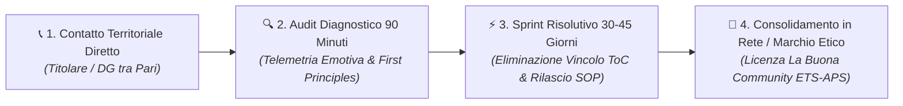
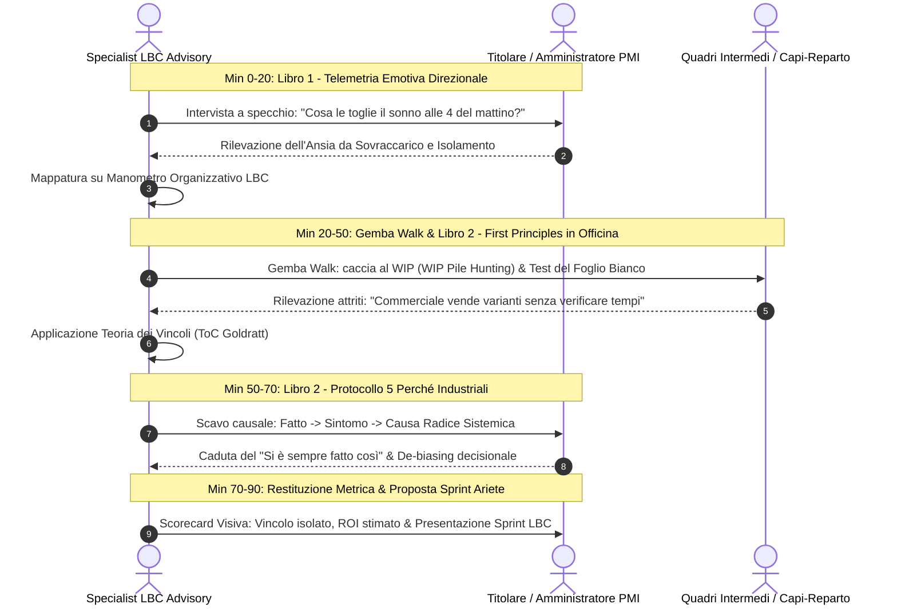
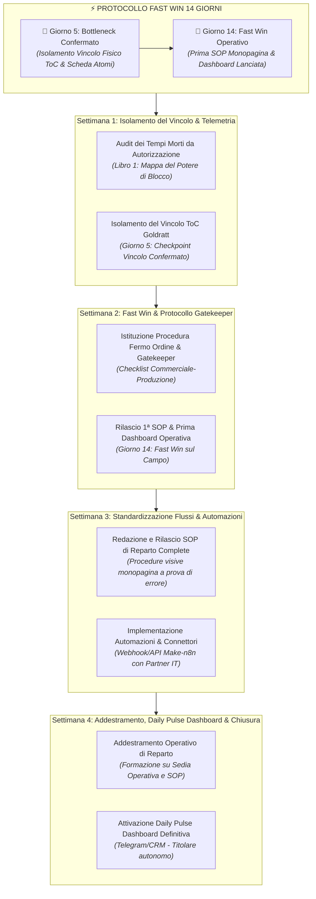

# OFFERTA "ARIETE" PER LE PMI LOCALI
## Format di Ingresso, Audit Diagnostico sui Problemi Acuti, Script Territoriale & Condizioni Contrattuali Blindate
### Soggetto Contrattuale Proponente: LBC Advisory & Growth S.r.l.

> **Documenti Correlati dell'Ecosistema LBC:**  
> • [`ACCORDO_PILOTA_DELTA_FATTURATO.md`](file:///c:/Users/MARIO/Downloads/LBC%20La%20Buona%20Community/ACCORDO_PILOTA_DELTA_FATTURATO.md) — Contratto Pilota Co-Sviluppo Retisti  
> • [`TARGET_SEGMENTATION_ANALYSIS.md`](file:///c:/Users/MARIO/Downloads/LBC%20La%20Buona%20Community/TARGET_SEGMENTATION_ANALYSIS.md) — Segmentazione PMI e Selezione Coorte  
> • [`MANIFESTO_E_RATING_ETICO.md`](file:///c:/Users/MARIO/Downloads/LBC%20La%20Buona%20Community/MANIFESTO_E_RATING_ETICO.md) — Disciplinare Marchio Collettivo ex Art. 11 CPI  
> • [`STRATEGIC_BLUEPRINT.md`](file:///c:/Users/MARIO/Downloads/LBC%20La%20Buona%20Community/STRATEGIC_BLUEPRINT.md) — Masterplan e Dual-Entity Corporate Design  
> • [`ANALISI_CRITICA_RISCHI_E_SOLUZIONI.md`](file:///c:/Users/MARIO/Downloads/LBC%20La%20Buona%20Community/ANALISI_CRITICA_RISCHI_E_SOLUZIONI.md) — Risk Mitigation & Prevenzione Fermi Macchina  
> • [`STRESS_TEST_GIURIDICO_FISCALE.md`](file:///c:/Users/MARIO/Downloads/LBC%20La%20Buona%20Community/STRESS_TEST_GIURIDICO_FISCALE.md) — Base Giuridica di Protezione Aziendale  

---

---

### 1. Il Concetto dell'Offerta "Ariete"

L'imprenditore di una PMI consolidata (fatturato € 5M — € 30M, 25 — 120 dipendenti) non acquista "networking generico", "etica astratta" o "tavoli associativi da salotto": è già sovraccarico, diffidente, tartassato da emergenze operative e corteggiato da venditori di ogni tipo.

L'**Ariete LBC** è un modulo di advisory strategico-operativa ad alto impatto concepito per **intervenire chirurgicamente su un problema acuto e circoscritto**, presentandosi non come consulenti teorici né come agenzia generalista, ma come partner operativi radicati nel distretto che erogano:
* **Consulenza specialistica di ingegneria dei processi e riorganizzazione dei flussi di lavoro**;
* **Formazione manageriale e di reparto alle figure chiave e quadri intermedi aziendali**;
* **Trasferimento metodologico e rilascio di Procedure Operative Standard (SOP)** supportate da tecnologie di automazione no-code/low-code e connettori software avanzati.

#### Qualificazione Giuridica Rigorosa ed Esclusione di Intermediazione di Lavoro
> [!IMPORTANT]
> **ESCLUSIONE TASSATIVA DI SOMMINISTRAZIONE O STAFF AUGMENTATION (ART. 18 D.LGS. 276/2003 & D.L. 19/2024)**  
> Il servizio erogato da **LBC Advisory & Growth S.r.l.** è un contratto di prestazione d'opera intellettuale e consulenza direzionale di processo (art. 2222 e segg. c.c.). Resta categoricamente esclusa qualsiasi forma di somministrazione di manodopera, intermediazione, distacco eterodiretto, staff augmentation o fornitura di personale operativo. LBC non esercita alcun potere gerarchico, direttivo o disciplinare sui dipendenti della PMI committente, i quali rimangono sotto l'esclusiva direzione e vigilanza degli organi aziendali interni.

---

### 2. Le 5 Aree di "Problemi Acuti" Tipici delle PMI di Distretto

Durante il primo contatto territoriale, la diagnosi operativa si concentra su uno dei 5 colli di bottiglia critici che prosciugano marginalità e generano attrito quotidiano:

1. **La "Trappola del Titolare-Collo di Bottiglia" (Sindrome dell'Imbuto Direzionale)**:
   * *Sintomo Clinico*: Tutte le decisioni operative devono passare dalla scrivania dell'imprenditore; se si assenta due giorni, l'azienda rallenta visibilmente; incapacità di delegare e tempo per la strategia azzerato.
2. **Dispersione di Competenze & Assenza di Standard Operativi (SOP)**:
   * *Sintomo Clinico*: Mancanza di procedure scritte e documentate; dipendenza dalla memoria individuale di 2 o 3 persone storiche; disorientamento operativo dei nuovi assunti, rilavorazioni ed elevato turnover.
3. **Attrito nei Processi & Disallineamento Interfunzionale (Ufficio Tecnico vs Vendite vs Produzione)**:
   * *Sintomo Clinico*: Informazioni frammentate su fogli Excel paralleli o chat WhatsApp non sincronizzate; disegni tecnici non aggiornati che arrivano alle macchine; ritardi di consegna e scaricabarile tra uffici e officina.
4. **Resistenza all'Automazione & "Lavoro Fantasma"**:
   * *Sintomo Clinico*: Personale qualificato che impiega ore a trascrivere manualmente dati da bolle cartacee a gestionali ERP o a compilare moduli duplicati; mancata adozione di workflow digitali automatici.
5. **Cecità sulla Marginalità Reale di Commessa**:
   * *Sintomo Clinico*: L'azienda chiude l'anno in utile globale ma non ha visibilità analitica sui costi orari effettivi per singola commessa, vendendo in perdita lotti speciali a causa di straordinari ed errori non preventivati.

---

### 3. Struttura dell'Audit Diagnostico in Presenza (90 Minuti)
#### Ingegnerizzato sui 2 Libri Fondativi di LBC

L'audit non è una presentazione commerciale né un seminario accademico, ma una vera e propria **seduta di chirurgia organizzativa condotta direttamente presso la sede operativa dell'azienda committente**. Il protocollo è rigidamente scandito dai due testi metodologici proprietari:

#### Minuto 0 – 20: Mappatura del Dolore e Telemetria Emotiva Direzionale (*Libro 1: "L'Ecosistema Emotivo dell'Impresa"*)
* **Presupposto Metodologico**: Le emozioni manifestate in azienda non sono debolezze caratteriali o problemi psicologici, ma la **telemetria oggettiva e millimetrica di un'interruzione nel flusso di lavoro, informazione o autorità**.
* **Interrogatorio Diagnostico**: *"Qual è l'attività operativa o la commessa che Le genera maggiore ansia, frustrazione o rabbia ogni singola settimana?"*
* **Applicazione del Manometro Organizzativo**:
  * *Ansia del Titolare*: Sintomo dell'imbuto decisionale e dell'assenza di una scorecard giornaliera con dati certi.
  * *Rabbia dei Capi-Reparto*: Sintomo di specifiche tecniche incomplete e assenza di un filtro formale d'ingresso (Gatekeeper) per gli ordini venduti dal commerciale.
  * *Apatia degli Operatori*: Diagnosi di delega fittizia e punizione sistematica degli errori di iniziativa.

#### Minuto 20 – 50: Gemba Walk nei Reparti & Scomposizione a Primi Principi (*Libro 2: "Il Pensiero Critico Applicato all'Azienda Reale"*)
* **Caccia al Vincolo Fisico (WIP Pile Hunting — Teoria dei Vincoli di Goldratt)**: Camminata osservativa lungo il reparto produttivo, il magazzino e gli uffici per individuare dove si forma fisicamente la pila più alta di materiale fermo o pratiche inevase. Quello è l'**unico collo di bottiglia reale** dell'azienda: qualsiasi ottimizzazione al di fuori del vincolo è solo uno spreco di capitale.
* **Il Test del Foglio Bianco**: Il consulente separa per 5 minuti il Titolare e il Responsabile di Reparto, chiedendo a entrambi di annotare su un foglio bianco i 5 passaggi che compie una commessa dalla richiesta preventivo alla messa in produzione. Il disallineamento oggettivo che ne emerge distrugge all'istante l'illusione del controllo e dimostra l'assenza di standard condivisi.
* **Cronometro delle Mani Libere**: Rilevazione del tempo a valore aggiunto reale (VA) rispetto al tempo speso a cercare informazioni, chiarire ordini o movimentare materiali inutilmente (NVA).

#### Minuto 50 – 70: Protocollo dei "5 Perché Industriali" & Abbattimento del "Si è sempre fatto così"
* **Scomposizione a Primi Principi (First Principles Thinking)**: Decostruzione della commessa nei suoi vincoli fisici ed economici non negoziabili (leggi della fisica, tempo ciclo macchina, costo atomico del materiale), isolando le convenzioni storiche stratificate.
* **I 5 Perché Guidati**: Superamento delle prime 3 risposte (che scaricano colpe su fornitori o dipendenti distratti) per identificare il fallimento di procedura o di sistema entro il quinto livello (es. mancanza di una checklist d'accettazione vincolante all'apertura dell'ordine).
* **De-Biasing Decisionale**: Disinnesco dei bias cognitivi dell'imprenditore (*Sunk Cost Fallacy*, *Overconfidence*, *Confirmation Bias*).

#### Minuto 70 – 90: Restituzione Clinica, Quantificazione del ROI e Presentazione dello Sprint Ariete
* **Disegno del Flusso su Lavagna**: Restituzione visiva immediata: *"La sua tensione e i ritardi di produzione non dipendono dai collaboratori, ma da questo snodo non governato tra ufficio tecnico e macchine"*.
* **Proposta Operativa Formale**: Presentazione della lettera d'incarico per lo **Sprint Risolutivo di 30–45 Giorni** fatturato da **LBC Advisory & Growth S.r.l.**, con perimetro di intervento circoscritto e clausole di protezione operativa reciproca.

---

### 4. Il Percorso Operativo: Lo "Sprint Risolutivo" (30–45 Giorni) e il Protocollo "Fast Win 14 Giorni"

Lo Sprint Ariete non è un'analisi teorica che produce un voluminoso e inutile documento in PDF: è un **intervento di ingegneria operativa sul campo**, scandito dal rigoroso **Protocollo "Fast Win 14 Giorni"**:

> [!TIP]
> **IL PROTOCOLLO "FAST WIN 14 GIORNI" — ROI VISIBILE E AZZERAMENTO RISCHIO**  
> Per dissipare ogni diffidenza della proprietà e soddisfare a pieno la garanzia del "Patto di Lealtà", lo Sprint è ingegnerizzato su due checkpoint non negoziabili nelle prime due settimane:  
> • **Giorno 5 (Bottleneck Confermato)**: Individuazione analitica e asseverazione dell'unico vincolo reale di throughput (WIP Pile e manometro organizzativo). Nessuna dispersione su sintomi secondari.  
> • **Giorno 14 (Prima SOP & Dashboard Lanciata)**: Scrittura, affissione e collaudo sul campo della **prima Procedura Operativa Standard (SOP) monopagina** e attivazione della versione preliminare della **Daily Dashboard di controllo**, producendo un recupero immediato di tempo e certezza operativa entro sole due settimane dall'ingresso in azienda.

#### Dettaglio delle Fasi di Intervento:
* **Settimana 1 — Isolamento del Vincolo & Checkpoint Giorno 5 (Bottleneck Confermato)**:
  * Applicazione del *Manometro Organizzativo* e della *Mappa Sociometrica del Potere di Blocco* per individuare i nodi informali non censiti che rallentano l'operatività;
  * Analisi cronometrica dei tempi di fermo e quantificazione delle perdite economiche da lavoro fantasma;
  * Firma congiunta del *Verbale di Presa in Carico Sistemi IT e Asseverazione Preventiva di Backup* a cura esclusiva della Committente;
  * **Traguardo Giorno 5**: Consegna al Titolare del verbale sintetico di isolamento dell'unico vero vincolo ToC che limita il fatturato o satura le ore.
* **Settimana 2 — Riprogettazione del Flusso & Checkpoint Giorno 14 (Fast Win Sul Campo)**:
  * Introduzione del protocollo *Gatekeeper Commerciale-Produzione*: divieto categorico per il commerciale di immettere in lavorazione ordini privi dei parametri tecnici minimi;
  * Fissazione dell'orario di *Cut-off Giornaliero* per le commesse e le spedizioni, bloccando l'innesco di urgenze arbitrarie;
  * Riunione di decontaminazione emotiva (*Format Hot Seat Disattivato*) con i quadri di reparto per tradurre recriminazioni personali in modifiche di procedura;
  * **Traguardo Giorno 14**: Rilascio della **prima SOP visuale monopagina** applicata al vincolo e lancio del cruscotto preliminare. L'imprenditore tocca con mano i primi risultati concreti prima di decidere sul rinnovo di fiducia.
* **Settimana 3 — Standardizzazione Procedure (SOP) & Integrazione Automazioni**:
  * Scrittura e affissione nei reparti delle **Procedure Operative Standard (SOP)** monopagina, visuali e codificate;
  * In collaborazione con le Aziende Partner di distretto convenzionate con LBC (Software House, Automatori low-code), configurazione di webhook e connettori automatici per eliminare il doppio inserimento manuale tra ordini, fogli Excel e gestionale;
  * Collaudo operativo in ambiente protetto (*User Acceptance Testing - UAT*).
* **Settimana 4 — Addestramento, Cruscotto di Controllo (Scorecard) & Chiusura**:
  * Formazione manageriale e operativa sul campo ai quadri e addetti coinvolti sull'adozione della nuova procedura;
  * Rilascio al Titolare della **Daily Pulse Dashboard** definitiva (5 indicatori chiave non negoziabili inviati ogni mattina via Telegram/ERP: cassa liquida, ordini validati, commesse a rischio ritardo, ore lavorate a valore, scarti);
  * Consegna della Relazione Tecnica Finale di Collaudo e proposta di estensione al percorso di qualificazione per il **Marchio Collettivo Etico LBC** promosso da **La Buona Community ETS - APS**.

---

### 5. Proposta Economica, Termini di Pagamento & Garanzia

* **Soggetto Giuridico Fatturante**: **LBC Advisory & Growth S.r.l.**
* **Compenso Professionale a Forfait per lo Sprint**: **€ 2.500,00 — € 4.500,00 + IVA di legge** (in base alla complessità del reparto e al numero di addetti coinvolti).
* **Deducibilità Fiscale**: Compenso interamente deducibile dal reddito d'impresa ai sensi dell'art. 109 del D.P.R. 917/1986 (TUIR) con IVA ordinaria al 22% integralmente detraibile ai sensi dell'art. 19 del D.P.R. 633/1972.
* **Termini di Pagamento**:
  * 50% all'accettazione dell'offerta mediante bonifico bancario a vista fattura;
  * 50% al termine delle 4 settimane, previa consegna della relazione tecnica finale e delle SOP collaudate.
* **Garanzia di Soddisfazione "Patto di Lealtà"**: Qualora al termine delle prime 2 sessioni di affiancamento la Committente ritenga, a propria motivata valutazione discrezionale, di non riscontrare un evidente valore operativo e metodologico, potrà recedere dall'incarico con semplice comunicazione PEC, saldando unicamente il primo acconto del 50% a saldo di ogni prestazione svolta, senza ulteriori pretese da parte di LBC.

---

### 6. Script Operativo di Contatto Diretto Territoriale
#### Per l'Enterprise Sales & Operations Specialist LBC

> **Interlocutore Target**: Titolare, Amministratore Delegato o Direttore Generale di PMI locale.  
> **Canale**: Visita di persona in azienda, telefono diretto o contatto fiduciario di distretto.  
> **Posizionamento**: Consulenza strategico-operativa d'élite tra pari, rigore ingegneristico, totale assenza di fuffa commerciale.

**Specialist LBC**: *"Buongiorno [Nome Imprenditore], sono [Tuo Nome] di LBC Advisory & Growth qui a [Distretto/Città]. La contatto direttamente senza intermediari perché stiamo affiancando alcune storiche aziende manifatturiere e logistiche del nostro comprensorio per risolvere un problema che tocca quasi tutti i titolari della nostra zona: il sovraccarico operativo della proprietà e i continui rallentamenti nei flussi tra ufficio vendite, ufficio tecnico e reparto produttivo.*

*Non siamo venditori di software né formatori teorici che fanno conferenze generiche. Lavoriamo direttamente sul campo con ingegneri di processo ed esperti del territorio per eliminare colli di bottiglia e dispersioni di marginalità.*

*Abbiamo riservato per questo mese 3 sessioni di Audit Diagnostico Operativo di 90 minuti direttamente in officina e negli uffici, basate sui protocolli dei nostri due manuali industriali: mappiamo il flusso reale, identifichiamo con la Teoria dei Vincoli l'unico vero blocco che frena il reparto e verifichiamo dove si annida il lavoro a vuoto.*

*Al termine dei 90 minuti Le lasciamo una mappa visiva esatta della situazione, senza alcun vincolo di prosecuzione. Posso passare da Lei martedì mattina alle 09:00 o preferisce giovedì alle 14:30?"*

---

### 7. Indicatori di Conversione Target (Pipeline 60 Giorni)

| Metrica Operativa Commerciale | Obiettivo Minimo | Risultato di Business Atteso |
| :--- | :---: | :--- |
| **Aziende Qualificate Contattate nel Distretto** | 30 PMI Target | Costruzione di relazioni stabili con titolari (€ 5M-30M) |
| **Audit Diagnostici 90 Minuti Eseguiti in Presenza** | 10 Sessioni | Tasso di conversione dal contatto pari al 33% |
| **Sprint Risolutivi 30-45gg Contrattualizzati** | **3 — 5 Commesse** | **€ 9.000 — € 18.000 di fatturato advisory immediato** |
| **Moduli Tecnici Specialistici Attivati con i Partner di Rete** | 3 — 4 Progetti | Sinergie con software house e automatori convenzionati LBC |
| **Aziende Avviate alla Certificazione Marchio Etico LBC** | 2 — 3 Imprese | Pipeline per La Buona Community ETS-APS |

---

### 8. CONDIZIONI GENERALI DI CONTRATTO B2B (CONDIZIONI BLINDATE DI PROTEZIONE OPERATIVA)
*(Clausole contrattuali vincolanti che disciplinano l'Audit Diagnostico e lo Sprint Risolutivo)*

Le presenti condizioni formano parte integrante, sostanziale ed inderogabile di ogni lettera d'incarico professionale stipulata tra **LBC Advisory & Growth S.r.l.** (di seguito *"LBC"*) e la **PMI Committente** (di seguito *"Committente"*).

***

#### CLAUSOLA A — QUALIFICAZIONE DEL RAPPORTO ED ESCLUSIONE TASSATIVA DI INTERMEDIAZIONE / SOMMINISTRAZIONE DI LAVORO (ART. 18 D.LGS. 276/2003 E D.L. 19/2024)
1. **Natura della Prestazione:** Il contratto ha ad oggetto esclusivamente prestazioni di consulenza direzionale, ingegneria dei processi aziendali, trasferimento di know-how metodologico e formazione manageriale d'aula e di reparto, inquadrate quali contratti d'opera intellettuale e servizi B2B ai sensi degli artt. 2222 e segg. c.c. e dell'art. 1655 c.c.
2. **Esclusione di Somministrazione e Subordinazione:** È categoricamente esclusa qualsiasi ipotesi di somministrazione di lavoro, distacco di personale privo dei requisiti di legge, appalto non genuino di manodopera o staff augmentation ai sensi del D.Lgs. 276/2003 e del D.L. 19/2024.
3. **Autonomia Organizzativa e Direttiva:** I consulenti, ingegneri ed esperti designati da LBC svolgono la propria opera in piena autonomia tecnica e professionale, rispondendo esclusivamente delle direttive metodologiche impartite da LBC. Il personale dipendente o collaboratore della Committente rimane in ogni momento sotto l'esclusivo potere direttivo, organizzativo, gerarchico e disciplinare del datore di lavoro Committente.

***

#### CLAUSOLA B — ACCORDO DI RISERVATEZZA E TUTELA DEI SEGRETI INDUSTRIALI (ARTT. 98 E 99 D.LGS. 30/2005 - CODICE PROPRIETÀ INDUSTRIALE)
1. **Oggetto della Tutela:** Ciascuna Parte si impegna a considerare strettamente riservata ogni informazione tecnica, finanziaria, contabile, commerciale, elenchi clienti, costi orari di manodopera, marginalità di commessa, disegni tecnici, schemi di produzione e segreti commerciali ai sensi degli artt. 98 e 99 del D.Lgs. 30/2005 (Codice della Proprietà Industriale) appresi in occasione dell'Audit Diagnostico e dello Sprint Risolutivo.
2. **Obblighi di Segretezza:** LBC si obbliga a impiegare tali informazioni unicamente per l'esecuzione del mandato, applicando standard di sicurezza adeguati ai sensi dell'art. 1176, comma 2, c.c., e vincolando i propri professionisti autonomi ed esperti tecnici a medesimi obblighi formali di riservatezza.
3. **Durata del Vincolo:** Gli obblighi di segretezza rimarranno pienamente vincolanti per un periodo di **3 (tre) anni** dalla data di conclusione formale dello Sprint Risolutivo.

***

#### CLAUSOLA C — DATA PROCESSING AGREEMENT (DPA EX ART. 28 REG. UE 2016/679 - GDPR) & TUTELA STATUTO LAVORATORI
1. **Designazione a Responsabile del Trattamento:** Qualora lo svolgimento delle attività comporti l'accesso accidentale o strumentale a dati personali residenti sui sistemi della Committente, la Committente assume la qualifica di **Titolare del Trattamento** (Data Controller) e designa LBC quale **Responsabile del Trattamento** (Data Processor) ai sensi dell'art. 28 GDPR.
2. **Amministratori di Sistema:** I tecnici LBC o delle aziende partner che operino con credenziali di amministrazione su ERP, database o server aziendali operano nel pieno rispetto del **Provvedimento del Garante per la Protezione dei Dati Personali del 27 novembre 2008**, con conservazione sicura e inalterabile dei log di accesso per almeno 6 (sei) mesi. Al termine dell'intervento, ogni accesso privilegiato verrà revocato a cura della Committente e ogni dato temporaneo di collaudo verrà distrutto con rilascio di attestazione.
3. **Divieto Assoluto di Controllo a Distanza (Art. 4 Legge 300/1970):**  
   È fatto espresso divieto a LBC di progettare o configurare flussi informatici, automatismi o cruscotti che consentano o siano finalizzati al monitoraggio o controllo a distanza dell'attività lavorativa o della produttività individuale dei lavoratori dipendenti della Committente, garantendo la più rigorosa conformità ai dettami dell'**art. 4 della Legge 300/1970 (Statuto dei Lavoratori)**.

***

#### CLAUSOLA D — CONDIZIONE SOSPENSIVA ED ONERE INDEROGABILE DI BACKUP PREVENTIVO A CARICO ESCLUSIVO DELLA COMMITTENTE
1. **Onere Tassativo di Backup:** Prima che LBC o i professionisti incaricati effettuino qualsiasi attività di mappatura tecnica, configurazione API, inserimento webhook o interfacciamento con gestionali, database o server, **la Committente ha l'onere perentorio, esclusivo e inderogabile di eseguire, a propria totale cura, spesa e sotto la propria esclusiva responsabilità, un backup integrale, completo e regolarmente collaudato (test di disaster recovery) di tutti i sistemi informatici, file, software, database e registri contabili**.
2. **Condizione Sospensiva di Efficacia (Art. 1353 c.c.):** La sottoscrizione congiunta del *"Verbale di Presa in Carico Sistemi IT e Asseverazione Preventiva di Backup"* costituisce **condizione sospensiva essenziale di efficacia** per l'avvio delle attività operative di configurazione e interfacciamento.
3. **Esonero Totale di Responsabilità:** LBC, i suoi dipendenti e i partner tecnici sono totalmente esonerati da qualsiasi responsabilità civile, contrattuale o extracontrattuale per perdite di dati, corruzione di archivi, disallineamento di database o cancellazioni accidentali derivanti da mancata, incompleta, erronea o negligente esecuzione del backup preventivo da parte della Committente.

***

#### CLAUSOLA E — LIMITAZIONE DI RESPONSABILITÀ, ESONERO PER FERMO MACCHINA E MASSIMALE RISARCITORIO (ART. 1229 C.C.)
1. **Esonero Totale per Danni Indiretti, Fermo Linea e Disservizi Preesistenti:**  
   Salvo i casi inderogabili di dolo o colpa grave accertati con sentenza definitiva passata in giudicato, LBC, i suoi consulenti e i partner tecnici non risponderanno in nessun caso verso la Committente o verso terzi per:
   * **Fermi macchina, blocchi di linea produttiva, interruzioni di processo produttivo o logistico**;
   * **Mancata produzione, ritardi nelle consegne a clienti finali, penali contrattuali azionate da terzi contro la Committente**;
   * **Perdite di fatturato, mancati utili o margini, perdite di clientela o di avviamento commerciale**;
   * **Disservizi operativi, anomalie gestionali o difetti di sistema già preesistenti all'avvio dell'intervento di LBC**;
   * **Ritardi o inadempimenti imputabili alla mancata o tardiva fornitura di dati, credenziali, specifiche o materiali da parte della Committente o di fornitori terzi della stessa**.
2. **Massimale Risarcitorio Aggregato (Liability Cap):**  
   Ai sensi e per gli effetti dell'art. 1229 c.c., le Parti concordano che l'eventuale responsabilità risarcitoria complessiva e aggregata di LBC per qualsiasi titolo, pregiudizio materiale, inadempimento o contestazione derivante o connessa all'esecuzione dell'Audit Diagnostico e dello Sprint Risolutivo **sarà tassativamente circoscritta e limitata all'importo effettivamente corrisposto e incassato da LBC a titolo di corrispettivo per lo Sprint contestato, e in ogni caso con un tetto massimo insuperabile pari a € 4.500,00 (quattromilacinquecento/00)**.
3. **Equilibrio Sinallagmatico Essenziale:** La Committente riconosce e dà atto che la presente limitazione di responsabilità costituisce presupposto causale ed economico fondamentale e non negoziabile per la determinazione della tariffa forfettaria agevolata pattuita per lo Sprint.

***

### APPROVAZIONE SPECIFICA DELLE CLAUSOLE ONEROSE E VESSATORIE (ARTT. 1341 E 1342 C.C.)

Ai sensi e per gli effetti degli articoli 1341 e 1342 del Codice Civile, la Committente dichiara di aver letto con attenzione, esaminato punto per punto, compreso e di approvare specificamente e per iscritto le seguenti pattuizioni contrattuali:
* **Clausola A** (Qualificazione dell'incarico quale pura advisory di ingegneria di processo ed esclusione di somministrazione di manodopera o subordinazione);
* **Clausola D, commi 1, 2 e 3** (Onere perentorio e preventivo di backup integrale a carico esclusivo della Committente quale condizione sospensiva di efficacia ed esonero totale di LBC per perdita, corruzione o dispersione dati);
* **Clausola E, comma 1** (Esonero totale di responsabilità di LBC per fermo macchina, mancata produzione, interruzioni operative, ritardi di fornitura, danni indiretti, perdite di fatturato e penali commerciali di terzi);
* **Clausola E, comma 2** (Liability Cap aggregato inderogabile limitato al corrispettivo incassato con tetto massimo assoluto di € 4.500,00).

Data: ____________________  

**La Committente (Firma Digitale del Legale Rappresentante)**:  
____________________________________________________________

---

### ALLEGATO: VERBALE DI PRESA IN CARICO SISTEMI IT E ATTESTAZIONE PREVENTIVA DI BACKUP
*(Da sottoscriversi congiuntamente presso la sede operativa aziendale prima di iniziare qualsiasi intervento tecnico o configurazione)*

> **VERBALE TECNICO DI PRESA IN CARICO E ATTESTAZIONE DI AVVENUTO BACKUP PREVENTIVO**
> 
> **TRA LE PARTI:**  
> 1. **LBC Advisory & Growth S.r.l.**, rappresentata dal consulente tecnico incaricato Sig./Dott. ________________________________;  
> 2. La Committente **[Ragione Sociale PMI]**, rappresentata dal Legale Rappresentante o Responsabile IT Sig./Dott. ________________________________;  
> 
> **SI DÀ ATTO E SI ASSEVERA QUANTO SEGUE:**
> 1. In data odierna hanno avvio le attività operative relative allo **Sprint Risolutivo LBC** avente ad oggetto l'analisi e l'ottimizzazione dei processi operativi, la redazione di SOP e l'integrazione di flussi e automazioni aziendali.
> 2. In ottemperanza alla Clausola D delle Condizioni Generali di Contratto B2B, la Committente **DICHIARA, ASSEVERA E ATTESTA SOTTO LA PROPRIA RESPONSABILITÀ**:
>    * Di aver eseguito con esito positivo in data odierna un **backup integrale, completo e verificato** di tutti i database aziendali, file gestionali ERP, server fisici o cloud, registri contabili e configurazioni di rete interessati dalle attività;
>    * Di aver collaudato le procedure di ripristino di emergenza (*disaster recovery*), accertando la perfetta leggibilità e integrità delle copie di salvataggio;
>    * Di conservare in luogo sicuro e sotto la propria esclusiva custodia e responsabilità le copie di backup realizzate;
> 3. La Committente autorizza i tecnici LBC all'accesso ai sistemi aziendali unicamente nei limiti del mandato ricevuto, confermando che la presente attestazione costituisce liberatoria ed esonero formale di responsabilità di LBC per qualsiasi anomalia, danneggiamento o perdita dati non imputabile a dolo del fornitore.
> 
> Luogo e Data: ________________________________  
> 
> **Per la Committente (Firma del Legale Rappresentante / IT Manager)**:  
> ____________________________________________________  
> 
> **Per LBC Advisory & Growth S.r.l. (Firma del Consulente Incaricato)**:  
> ____________________________________________________  
