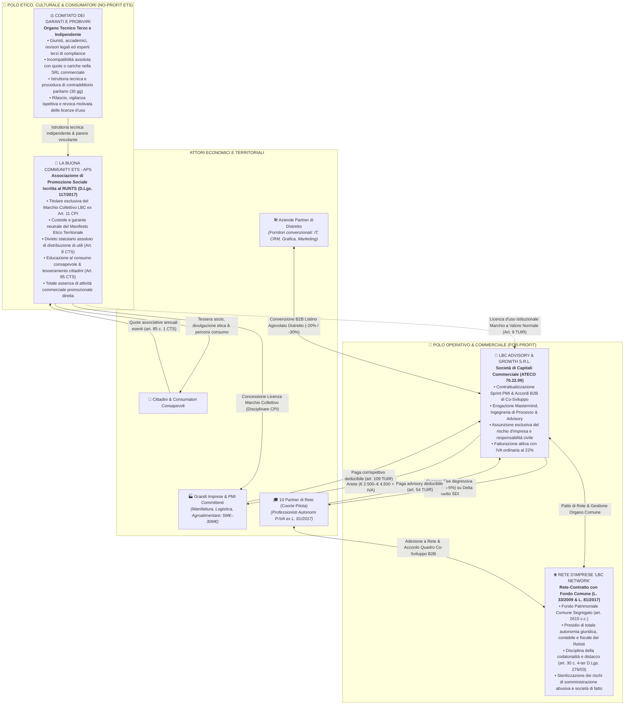

<div align="center">

# LBC — LA BUONA COMMUNITY
### Ecosistema Economico, Professionale e Territoriale Integrato
**Architettura Istituzionale Dual-Entity | Rete d'Imprese (L. 33/2009 & L. 81/2017) | Metodologia dei Due Libri Fondativi**

[-0A66C2?style=for-the-badge&logo=git&logoColor=white)](./REVISIONE_INTEGRATA_ECOSISTEMA_LBC.md)
[](./STRATEGIC_BLUEPRINT.md)
[](./STRESS_TEST_GIURIDICO_FISCALE.md)
[](./ACCORDO_PILOTA_DELTA_FATTURATO.md)
[-10B981?style=for-the-badge&logo=leaf&logoColor=white)](./MANIFESTO_E_RATING_ETICO.md)

</div>

---

> [!IMPORTANT]
> **Stato dell'Ecosistema:** Documentazione operativa, societaria e metodologica integralmente revisionata e blindata per conformità civilistica, fiscale, giuslavoristica e antitrust italiana (Anno di Validazione: 2026).  
> Tutti i contratti, le metriche di processo, le procedure di garanzia e i playbook operativi sono pronti per il dispiegamento sul mercato B2B distrettuale.

---

## 🧭 Vision & Modello Circolare di Distretto

**LBC (La Buona Community)** è un ecosistema territoriale integrato che supera la frammentazione tipica delle PMI e del lavoro autonomo italiano, connettendo in forma circolare e sinergica quattro pilastri cardine:

```
                  ┌────────────────────────────────────────────────────────┐
                  │          👥 CITTADINI & CONSUMATORI CONSAPEVOLI        │
                  │   (Scelta etica di prossimità, tesseramento ETS-APS)   │
                  └───────────────────────────┬────────────────────────────┘
                                              │  Premiano con la spesa
                                              ▼  le aziende etiche
                  ┌────────────────────────────────────────────────────────┐
                  │       🏭 GRANDI IMPRESE & PMI DEL DISTRETTO (5-30M€)    │
                  │  (Committenti Sprint Processi & Licenziatarie Marchio) │
                  └──────┬──────────────────────────────────────────▲──────┘
                         │                                          │
    Riorganizzazione dei │                                          │ Erogazione Sprint &
    flussi e commesse    ▼                                          │ Risoluzione colli
                  ┌───────────────────────────┐    Convenzioni      │ di bottiglia
                  │  🎓 10 PARTNER DI RETE    │◄─────────────────►┌┴──────────────────────────┐
                  │  (Coorte Autonomi P.IVA   │   agevolate B2B   │ 🛠️ AZIENDE PARTNER DISTRETTO│
                  │   in Contratto di Rete)   │   (-20% / -30%)   │ (IT, Make/n8n, CRM, Mktg) │
                  └───────────────────────────┘                   └───────────────────────────┘
```

1. **👥 Cittadini e Consumatori Consapevoli**: educati al consumo critico, etico e di prossimità attraverso i percorsi dell'Associazione ETS-APS. Premiano sul mercato i prodotti e i servizi delle imprese virtuose che tutelano la dignità del lavoro, la sicurezza e la sostenibilità di filiera.
2. **🎓 Coorte dei 10 Professionisti di Rete**: professionisti autonomi selezionati e imprese individuali (P.IVA ex L. 81/2017) strutturati in un formale **Contratto di Rete d'Imprese** (L. 33/2009) con Fondo Patrimoniale Comune segregato. Operano come una task force multidisciplinare integrata (Lean, CFO, Automazioni, Giuslavoristica, Sviluppo B2B).
3. **🛠️ Aziende Partner di Distretto**: realtà consolidate locali (IT/software, automazioni low-code Make/n8n, CRM, agenzie di marketing e grafica B2B) che erogano supporto tecnico specialistico ai retisti a tariffe convenzionate di distretto (*Tech & Growth Retainer* con sconti del 20%–30%).
4. **🏭 Grandi Imprese e PMI Consolidate (5M€ – 30M€)**: realtà industriali (manifattura meccanica su commessa, logistica e food processing) affiancate nell'ingegneria dei processi e nella risoluzione di colli di bottiglia operativi mediante l'Audit di 90 minuti e gli Sprint di processo a 45 giorni, valorizzate dal rilascio del prestigioso **Marchio Collettivo Etico di Distretto**.

---

## 🏛️ Architettura Societaria "Dual-Entity" Istituzionale

Per garantire la **totale impermeabilità fiscale, patrimoniale e giuslavoristica**, l'architettura istituzionale di LBC adotta fin dal primo trimestre di vita (Q1) il modello del **Dual-Entity Corporate Design**, imperniato su due persone giuridiche distinte e rigorosamente segregate:



### Regole Auree di Segregazione Societaria & Fiscale
* **Costituzione Contestuale in Q1**: Costituzione sincrona sia della SRL commerciale che dell'ETS-APS per escludere rischi di abuso del diritto ed elusione tributaria (art. 10-bis L. 212/2000).
* **Separazione dei Flussi Finanziari**: Conti correnti, codici fiscali, registri contabili e scritture IVA radicalmente separati. Nessuna cassa promiscua.
* **Transazioni Infragruppo a Valore Normale (Art. 9 TUIR)**: Contratti scritti con perizia asseverata per qualsiasi cessione di servizi logistici o licenze d'uso del marchio tra ETS e SRL.
* **Incompatibilità di Governance**: Divieto di maggioranza coincidente negli organi direttivi e divieto perentorio di distribuzione diretta o indiretta di utili (Art. 8 D.Lgs. 117/2017).

---

## 📚 Indice della Knowledge Base (Mappatura dei File)

Tutti i documenti operativi, legali, metodologici e commerciali dell'ecosistema sono interamente navigabili nella tabella sottostante:

| Documento | Tipologia & Ambito | Focus Operativo & Contenuto Chiave |
| :--- | :--- | :--- |
| 📄 [`STRATEGIC_BLUEPRINT.md`](./STRATEGIC_BLUEPRINT.md) | **Masterplan Strategico & Governance** | Visione globale, architettura Dual-Entity Q1, inquadramento Contratto di Rete (L. 33/2009 e L. 81/2017), segregazione patrimoniale e modello economico circolare. |
| 🎯 [`TARGET_SEGMENTATION_ANALYSIS.md`](./TARGET_SEGMENTATION_ANALYSIS.md) | **Market Intelligence & Coorte** | Analisi dei 3 cluster industriali target PMI (5M€–30M€), profilazione dettagliata dei 10 ruoli della coorte e griglia oggettiva di selezione (min. 80/100). |
| ⚡ [`OFFERTA_ARIETE_PMI.md`](./OFFERTA_ARIETE_PMI.md) | **Format Commerciale & Delivery** | Struttura dell'Audit dei 90 minuti (Gemba Walk), protocollo dello Sprint 45 giorni (€ 2.500–€ 4.500 + IVA), contrattualistica agile e garanzia etica. |
| 📝 [`ACCORDO_PILOTA_DELTA_FATTURATO.md`](./ACCORDO_PILOTA_DELTA_FATTURATO.md) | **Contratto Legale B2B Co-Sviluppo** | Accordo quadro retisti, success-fee degressiva pluriennale (10% -> 7.5% -> 5%, Cap 15k€), asseverazione Base-Year SDI, codatorialità e tutela IP. |
| 🏆 [`MANIFESTO_E_RATING_ETICO.md`](./MANIFESTO_E_RATING_ETICO.md) | **Disciplinare Marchio Collettivo** | Regolamento d'uso ex Art. 11 CPI intestato all'ETS, sistema di rating a 5 pilastri (Lavoro, Filiera, Sicurezza, Ambiente, Trasparenza) e Comitato Garanti. |
| ⚖️ [`STRESS_TEST_GIURIDICO_FISCALE.md`](./STRESS_TEST_GIURIDICO_FISCALE.md) | **Audit Legale, Lavoro & Fiscale** | Presidi di blindatura normativa: sterilizzazione somministrazione abusiva (D.L. 19/2024), esclusione società di fatto (art. 256 CCII) e conformità TUIR/CTS. |
| 🧠 [`ANALISI_CRITICA_STATO_ARTE_E_MANUALI.md`](./ANALISI_CRITICA_STATO_ARTE_E_MANUALI.md) | **Benchmark & Metodologia 2 Libri** | Intelligence competitiva sui fallimenti di rete (BNI, Vistage, EOS), antenne d'allarme precoce e architettura completa dei Due Libri Fondativi. |
| 🛡️ [`ANALISI_CRITICA_RISCHI_E_SOLUZIONI.md`](./ANALISI_CRITICA_RISCHI_E_SOLUZIONI.md) | **Risk Management & Continuità** | Prevenzione scientifica dei rischi di cassa, churn di coorte, attriti PMI, dispute contrattuali e protocolli esecutivi di risoluzione. |
| 🗺️ [`MACRO_ROADMAP_ECOSISTEMA_LBC.md`](./MACRO_ROADMAP_ECOSISTEMA_LBC.md) | **Roadmap Operativa a 12 Mesi** | Cronoprogramma esecutivo Q1-Q4 con diagramma di Gantt, milestone trimestrali, budget previsionale e KPI di trazione e consolidamento. |
| 🔄 [`REVISIONE_INTEGRATA_ECOSISTEMA_LBC.md`](./REVISIONE_INTEGRATA_ECOSISTEMA_LBC.md) | **Master Harmonization Report** | Relazione di orchestrazione globale: convalida delle 5 Regole Auree di sistema e verifica incrociata della coerenza tra tutti i 9 moduli. |

---

## 📖 Il Motore Metodologico: I Due Libri Fondativi

L'efficacia degli interventi diagnostici e trasformativi di LBC all'interno delle PMI industriali poggia sull'applicazione rigorosa dei principi codificati nei **Due Libri Fondativi**:

```
 ┌────────────────────────────────────────────────────────┐
 │        MOTORE METODOLOGICO DELL'ECOSISTEMA LBC         │
 └───────────────────────────┬────────────────────────────┘
                             │
            ┌────────────────┴────────────────┐
            ▼                                 ▼
┌───────────────────────────┐     ┌───────────────────────────┐
│     LIBRO FONDATIVO 1     │     │     LIBRO FONDATIVO 2     │
│   L'Ecosistema Emotivo    │     │   Il Pensiero Critico     │
│       dell'Impresa        │     │  Applicato all'Azienda    │
│  ───────────────────────  │     │  ───────────────────────  │
│    TELEMETRIA EMOTIVA     │     │     FIRST PRINCIPLES      │
│  "L'emozione come traccia │     │  "Semplificare, togliere, │
│  oggettiva del guasto nel │     │  risalire ai principi     │
│  flusso dei processi"     │     │  fondamentali e alla ToC" │
└───────────────────────────┘     └───────────────────────────┘
```

### 📘 Libro 1: *"L'Ecosistema Emotivo dell'Impresa"*
*Sottotitolo:* **Manuale di Procedura per Interpretare e Risolvere il Caos Organizzativo attraverso le Emozioni**

* **Tesi Epistemologica Fondativa**: All'interno di una fabbrica o di una struttura aziendale, le manifestazioni emotive non sono debolezze caratteriali o problemi psicologici da gestire con il team building. **L'emozione è la telemetria oggettiva, immediata e precisa di un'interruzione nel flusso di lavoro, informazione o autorità.**
* **Principio Diagnostico**: Laddove c'è rabbia, un processo a monte ha scaricato semilavorati o dati difettosi a valle; laddove c'è ansia, l'imprenditore decide alla cieca senza scorecard; laddove c'è apatia, il personale è stato punito per tentativi autonomi di risolvere problemi non proceduralizzati.
* **La Matrice Emotiva-Operativa**:
  * *Ansia del Titolare* → Assenza di cruscotto sintetico → Creazione entro 72h della **Daily Pulse Dashboard** (5 KPI critici).
  * *Rabbia del Caporeparto* → Mancanza di filtro commesse dal commerciale → Istituzione della **Scheda di Handover Bloccante**.
  * *Apatia dell'Operatore* → Delega fittizia e punizione dell'iniziativa → Assegnazione di **Accountability Seat e Micro-Budget di Sblocco** (fino a 300€).
  * *Paralisi Decisionale* → Ambiguità nei trade-off strategici → Adozione della **Policy Esplicita di Inversione di Trade-Off**.
* **Utilizzo sul Campo**: Guida il Gemba Walk nei primi 45 minuti dell'Offerta Ariete, trasformando le lamentele informali in una mappatura millimetrica dei colli di bottiglia.

### 📙 Libro 2: *"Il Pensiero Critico Applicato all'Azienda Reale"*
*Sottotitolo:* **Guida Operativa al Problem Solving di Primo Livello per Imprenditori e Professionisti**

* **Tesi Epistemologica Fondativa**: Il 90% degli investimenti in "innovazione" fallisce perché le PMI curano sintomi superficiali aggiungendo complessità (software costosi, assunzione di supervisori per controllare altri supervisori, riunioni infinite). Il vero problem solving consiste nel **togliere, semplificare e ricondurre ogni problema ai primi principi fisici ed economici non negoziabili**.
* **Framework e Metodologie Chiave**:
  * **First Principles Thinking in Officina**: Smontare ogni commessa o flusso nei suoi elementi atomici (tempo di contatto utensile-pezzo, passaggi informativi essenziali, costo marginale reale).
  * **Teoria dei Vincoli (ToC) di Goldratt**: In un'azienda esiste **un solo vincolo alla volta** che determina la velocità di throughput e di cassa. Qualsiasi ottimizzazione al di fuori del vincolo è un miraggio che genera scorte inutili e brucia liquidità.
  * **Protocollo dei 5 Perché Industriali**: Indagine causale profonda che bypassa le prime risposte accusatorie individuali fino a disvelare il fallimento della procedura sottostante.
  * **De-Biasing Pre-Decisionale**: Neutralizzazione attiva dei 4 bias cognitivi industriali (*Sunk Cost Fallacy*, *Confirmation Bias*, *Overconfidence del Titolare*, *Availability Heuristic*).
  * **Inversion Thinking (Pensare al Contrario)**: Identificare e disinnescare sistematicamente le condizioni operative che porterebbero con certezza al dissesto della commessa.

---

## 🔒 Proprietà Intellettuale, Segretezza & Riservatezza

Tutti i contenuti, i modelli procedurali, i contratti quadro, i software low-code, i disciplinari e le architetture documentali presenti in questo repository costituiscono **know-how riservato e patrimonio intellettuale protetto**.

* **Tutela del Know-How e dei Segreti Aziendali**: Tutelati ai sensi e per gli effetti degli **articoli 98 e 99 del D.Lgs. 10 febbraio 2005, n. 30 (Codice della Proprietà Industriale - CPI)** e successive modifiche.
* **Marchio Collettivo LBC**: Marchio denominativo e figurativo registrato presso l'Ufficio Italiano Brevetti e Marchi (UIBM) ad esclusiva titolarità di *La Buona Community ETS - APS* ai sensi dell'Art. 11 CPI. Ogni utilizzo non espressamente autorizzato con licenza deliberata dal Comitato dei Garanti costituisce violazione perseguibile a norma di legge.
* **Riservatezza dei Partner**: I membri della Coorte e le aziende partner sottoscrivono accordi formali di riservatezza (NDA) con clausole penali espresse a tutela dei playbook diagnostici e dei dati industriali e finanziari delle PMI committenti.

---

<div align="center">

**LBC — La Buona Community © 2026**  
*Tutti i diritti riservati. Polo For-Profit gestito da LBC Advisory & Growth S.r.l. — Polo No-Profit custodito da La Buona Community ETS - APS.*

</div>
