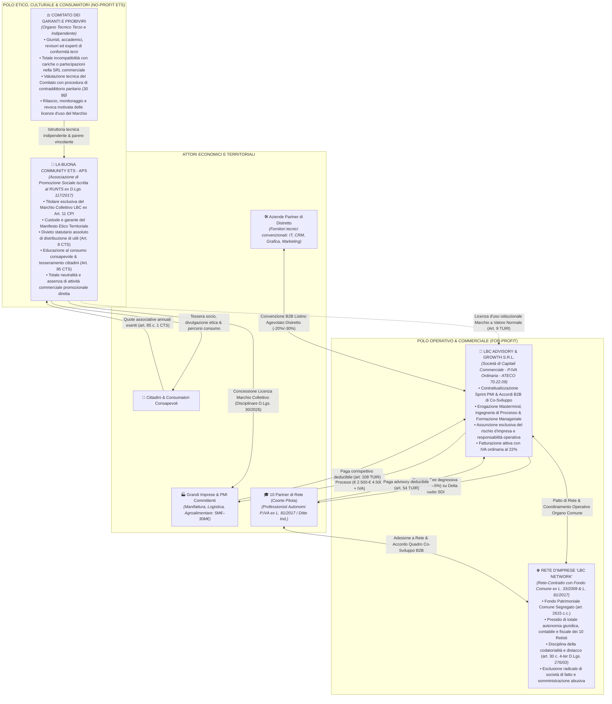
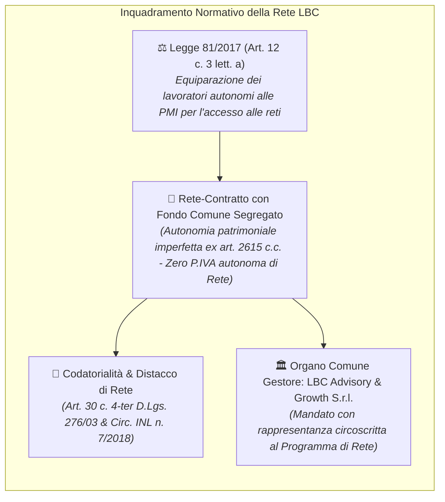
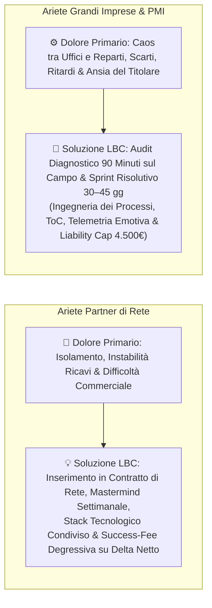
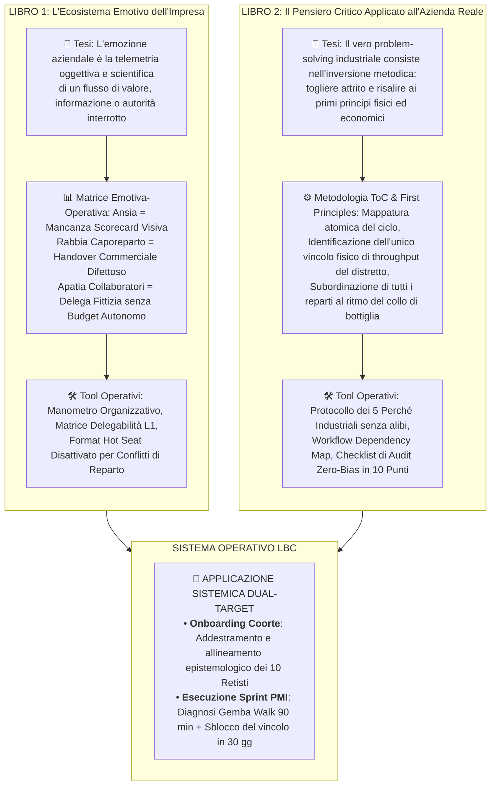
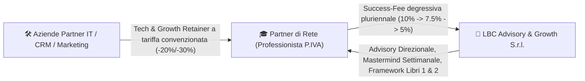
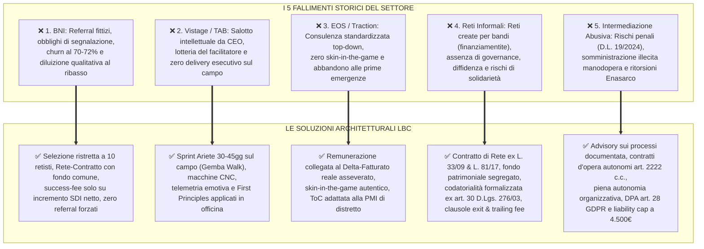
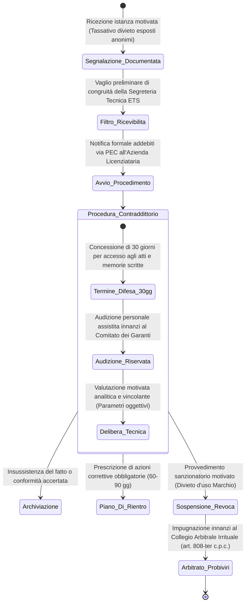
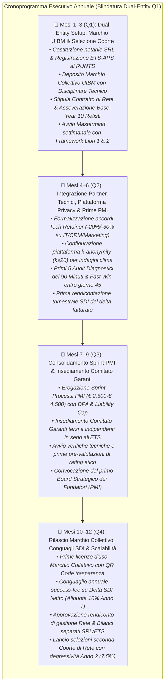

# LBC — LA BUONA COMMUNITY
## Masterplan Strategico & Modello Operativo d'Impresa (Revisione Blindata 3.0 — Conformità Normativa 2026)
### Architettura Dual-Entity Istituzionale, Contratto di Rete (L. 33/2009 e L. 81/2017) & Motore Metodologico dei 2 Libri Fondativi

> **Documenti Correlati dell'Ecosistema LBC:**  
> • [`ANALISI_CRITICA_RISCHI_E_SOLUZIONI.md`](file:///c:/Users/MARIO/Downloads/LBC%20La%20Buona%20Community/ANALISI_CRITICA_RISCHI_E_SOLUZIONI.md) — Risk Mitigation & Prevenzione Fallimenti  
> • [`ACCORDO_PILOTA_DELTA_FATTURATO.md`](file:///c:/Users/MARIO/Downloads/LBC%20La%20Buona%20Community/ACCORDO_PILOTA_DELTA_FATTURATO.md) — Contratto Pilota Co-Sviluppo Retisti  
> • [`OFFERTA_ARIETE_PMI.md`](file:///c:/Users/MARIO/Downloads/LBC%20La%20Buona%20Community/OFFERTA_ARIETE_PMI.md) — Offerta Commerciale Ariete e Sprint Processi  
> • [`TARGET_SEGMENTATION_ANALYSIS.md`](file:///c:/Users/MARIO/Downloads/LBC%20La%20Buona%20Community/TARGET_SEGMENTATION_ANALYSIS.md) — Segmentazione PMI e Selezione Coorte  
> • [`MANIFESTO_E_RATING_ETICO.md`](file:///c:/Users/MARIO/Downloads/LBC%20La%20Buona%20Community/MANIFESTO_E_RATING_ETICO.md) — Disciplinare Marchio Collettivo ex Art. 11 CPI  
> • [`MACRO_ROADMAP_ECOSISTEMA_LBC.md`](file:///c:/Users/MARIO/Downloads/LBC%20La%20Buona%20Community/MACRO_ROADMAP_ECOSISTEMA_LBC.md) — Roadmap Operativa 12 Mesi  
> • [`ANALISI_CRITICA_STATO_ARTE_E_MANUALI.md`](file:///c:/Users/MARIO/Downloads/LBC%20La%20Buona%20Community/ANALISI_CRITICA_STATO_ARTE_E_MANUALI.md) — Epistemologia e Architettura 2 Libri Fondativi  
> • [`STRESS_TEST_GIURIDICO_FISCALE.md`](file:///c:/Users/MARIO/Downloads/LBC%20La%20Buona%20Community/STRESS_TEST_GIURIDICO_FISCALE.md) — Audit Legale e Fiscale Approfondito  

---

### 1. Vision & Architettura Societaria "Dual-Entity" Istituzionale

**LBC (La Buona Community)** è un ecosistema economico, professionale e territoriale integrato che connette in forma circolare e sinergica tre pilastri cardine:
1. **I Cittadini e Consumatori Consapevoli**: educati al consumo critico, etico e di prossimità, orientati a premiare le imprese che tutelano la dignità del lavoro, la sicurezza e la trasparenza di filiera;
2. **I Professionisti Autonomi e Imprese Individuali (Partner di Rete)**: organizzati in un formale **Contratto di Rete d'Imprese** per superare la frammentazione commerciale, qualificare l'offerta verso l'alto ed erogare interventi complessi grazie alle sinergie strutturate con le aziende partner interne (IT, automazioni low-code/Make/n8n, CRM, grafica, marketing B2B);
3. **Le Grandi Imprese e PMI Consolidate del Distretto (5M€ – 30M€)**: affiancate nell'**ingegneria dei processi e riorganizzazione dei flussi operativi** mediante audit diagnostici, automazioni e advisory direzionale specialistico, valorizzate dal rilascio del Marchio Collettivo Etico di Distretto.

Per garantire la totale impermeabilità fiscale, patrimoniale e giuslavoristica, l'infrastruttura istituzionale di LBC adotta fin dal **Q1 (Mese 1)** il modello del **Dual-Entity Corporate Design**, imperniato su due persone giuridiche distinte e rigorosamente segregate:

#### Regole Auree di Segregazione Societaria, Fiscale e Contrattuale:
1. **Costituzione Contestuale in Q1**: Sia la società commerciale `LBC Advisory & Growth S.r.l.` sia l'ente del terzo settore `La Buona Community ETS - APS` vengono costituiti e registrati nel primo trimestre di operatività. Viene categoricamente respinta l'idea di posticipare l'ente no-profit a trimestri successivi, azzerando sul nascere il rischio di decadenza fiscale (art. 149 TUIR), abuso del diritto ed elusione tributaria (art. 10-bis L. 212/2000).
2. **Assoluta Separazione dei Flussi e Divieto di Promiscuità**: I conti correnti bancari, le scritture contabili, i registri IVA e i codici identificativi sono rigidamente distinti. L'ETS opera con proprio Codice Fiscale per il perseguimento delle finalità civiche, solidaristiche e di utilità sociale; la SRL opera con autonoma Partita IVA commerciale ordinaria e assume per intero il rischio operativo e risarcitorio delle commesse B2B.
3. **Regolazione dei Rapporti Infragruppo a Valore Normale (Art. 9 TUIR)**: Qualsiasi interazione negoziale tra SRL ed ETS (es. licenza d'uso del marchio per finalità divulgative, supporto logistico o condivisione spazi) è regolata mediante contratti formali scritti con data certa, a corrispettivi allineati al valore normale di mercato comprovato da perizia terza, escludendo qualsiasi fatturazione simulata, sovrafatturazione o transito promiscuo di cassa.
4. **Divieto di Organi Amministrativi Coincidenti e Distribuzione di Utili (Art. 8 CTS)**: L'Amministratore Unico o i membri del CdA della SRL non possono detenere la maggioranza del Consiglio Direttivo dell'ETS. È sancito statutariamente il divieto assoluto di distribuzione diretta o indiretta di utili, avanzi di gestione o riserve a fondatori, associati o amministratori.

---

### 2. Inquadramento della Coorte nel Contratto di Rete (L. 33/2009 e L. 81/2017)

La Coorte dei 10 Professionisti non costituisce un'aggregazione informale né un sodalizio promiscuo, bensì un formale **Contratto di Rete d'Imprese** (Rete-Contratto con Fondo Comune ex art. 3 commi 4-ter ss. D.L. 5/2009 conv. in L. 33/2009):

#### Esclusione Radicale delle Patologie Giuridiche:
* **Esclusione di Società di Fatto (SDF)**: L'adesione alla rete non conferisce diritti di voto assembleare nella SRL, non comporta conferimenti traslativi di capitale né commistione patrimoniale. Ciascun partner di rete risponde esclusivamente in proprio per i debiti professionali e fiscali, neutralizzando il rischio di estensione della liquidazione giudiziale ex art. 256 CCII.
* **Esclusione di Associazione in Partecipazione (Art. 2549 c.c.)**: Non vi è apporto di capitale a fronte di partecipazione agli utili complessivi dell'impresa associante, bensì stipula di accordi bilaterali corrispettivi di sviluppo strategico e consulenza complessa.
* **Esclusione di Somministrazione Abusiva e Appalto Non Genuino (D.L. 19/2024)**: I professionisti non sono "forniti" o "inseriti" come manodopera eterodiretta presso le PMI clienti. Operano in qualità di titolari autonomi d'opera intellettuale (art. 2222 c.c.) ovvero quali retisti operanti nell'ambito del programma comune di rete regolarmente iscritto al Registro delle Imprese, beneficiando del regime legale di codatorialità e distacco di rete (art. 30 c. 4-ter D.Lgs. 276/03 e Circolare INL n. 7/2018), preservando totale autonomia organizzativa, tecnica e gestionale.
* **Esclusione di Mandato d'Agenzia (Art. 1742 c.c.) e Mediazione Abusiva (L. 39/1989)**: Il rapporto tra LBC e il partner di rete non ha ad oggetto la promozione stabile di contratti per conto terzi né la mediazione neutrale. Ha per oggetto l'**advisory sui processi ed erogazione di know-how specialistico**, formazione intensiva, messa a disposizione di playbook, infrastrutture digitali e mastermind direzionale.

---

### 3. Target e Perimetro Territoriale Distrettuale

L'ecosistema circoscrive l'operatività a un **distretto produttivo o comprensorio provinciale pilota**, ove la prossimità fisica garantisce un presidio fiduciario inattaccabile, velocità di intervento fisico e controllo reputazionale capillare:

| Attore dell'Ecosistema | Identikit e Criteri di Selezione Operativa | Ruolo Sistemico nell'Ecosistema |
| :--- | :--- | :--- |
| **Grandi Imprese & PMI Target** | Aziende industriali consolidate con fatturato compreso tra **5M€ e 30M€** (25–120 dipendenti), comparti manifattura meccanica su commessa, logistica di distretto e food processing agroalimentare. Presentano colli di bottiglia acuti nei flussi operativi e conflitti tra ufficio tecnico, vendite e produzione. | Committenti diretti degli Sprint Risolutivi di ingegneria dei processi; candidate all'Audit dei 90 minuti e all'adozione volontaria del Marchio Collettivo Etico. |
| **I 10 Partner di Rete della Coorte** | Professionisti autonomi e imprese individuali (P.IVA ex L. 81/2017) con competenze verticali complementari (Lean Manufacturing, Controllo di Gestione/CFO frazionato, Automazioni low-code/CRM, Sviluppo Commerciale B2B, Giuslavoristica & HR). | Componenti della task force territoriale; fruitori dell'advisory e del mastermind LBC; esecutori sul campo degli interventi di co-sviluppo e sprint di processo. |
| **Aziende Partner di Distretto** | 3–4 aziende consolidate locali fornitrici di infrastrutture IT, connettori software (Make, n8n, API gestionali), grafica industriale e marketing B2B. | Partner tecnici convenzionati; erogano il *"Tech & Growth Retainer"* a tariffe di distretto dedicate (-20%/-30%) a supporto operativo dei retisti. |
| **Cittadini e Consumatori Consapevoli** | Comunità territoriale di consumatori, lavoratori e famiglie sensibili al consumo etico, al rispetto della sicurezza sul lavoro e alla tutela delle produzioni locali. | Tesserati dell'Associazione ETS-APS; fruitori di percorsi formativi sul consumo critico; garanti popolari del rating etico territoriale. |

> Per il piano completo dei cluster industriali, la profilazione analitica dei 10 posti della coorte e la griglia selettiva:  
> 👉 **[`TARGET_SEGMENTATION_ANALYSIS.md`](file:///c:/Users/MARIO/Downloads/LBC%20La%20Buona%20Community/TARGET_SEGMENTATION_ANALYSIS.md)**

---

### 4. L'Ariete d'Ingresso ("Piede nella Porta") Differenziato

L'approccio commerciale e relazionale di LBC non si basa su promesse generiche o presentazioni teoriche, ma aggredisce il problema primario e urgente di ciascun interlocutore:

#### 4.1 Per i Partner di Rete (I 10 Professionisti della Coorte):
* **Il Dolore Reale**: Solitudine operativa, dipendenza da passaparola casuale, incapacità di gestire commesse multidisciplinari complesse da 15.000€–40.000€ e continuo spreco di tempo in attività non retribuite.
* **L'Intervento Risolutivo LBC**: Inserimento nel Contratto di Rete d'Imprese; accesso immediato alla task force multidisciplinare di distretto e al supporto delle aziende partner tecnologiche; trasferimento dei format commerciali e metodologici dei **2 Libri Fondativi**; remunerazione legata unicamente a success-fee degressiva sul reale incremento del fatturato netto asseverato.

#### 4.2 Per le Grandi Imprese e PMI (5M€ – 30M€):
* **Il Dolore Reale**: Titolare sovraccarico che fa da "pompiere", ordini che si bloccano tra ufficio tecnico e officina, consegne ritardate, marginalità industriale che si disperde in lavorazioni non standard.
* **L'Intervento Risolutivo LBC**:
  1. **Audit dei 90 Minuti (Gemba Walk & First Principles)**: Condotto direttamente sul campo (officina, magazzino, postazioni di lavoro), senza slide teoriche, per localizzare il punto esatto di strozzatura del flusso operativo.
  2. **Sprint Risolutivo (30–45 Giorni)**: Contratto di ingegneria dei processi e formazione manageriale d'aula e di reparto fatturato da `LBC Advisory & Growth S.r.l.` (€ 2.500 – € 4.500 + IVA) interamente deducibile ex art. 109 TUIR.
  3. **Blindatura Contrattuale Preventiva**:
     * Formale **Data Processing Agreement (DPA)** redatto ai sensi dell'art. 28 GDPR tra PMI (Titolare) e LBC (Responsabile del Trattamento);
     * Accordo di Riservatezza e tutela del Segreto Industriale redatto ai sensi degli artt. 98 e 99 CPI;
     * Clausola inderogabile di **Limitazione di Responsabilità (Liability Cap)** parametrata all'importo del corrispettivo incassato ex art. 1229 c.c., con espressa esclusione di danni indiretti o fermo impianto;
     * **Condizione Sospensiva di Backup Preventivo**: formale onere preliminare a carico esclusivo della PMI di esecuzione e verifica del backup integrale di database gestionali ed ERP prima dell'accesso dei tecnici.

> Per il protocollo diagnostico completo e le condizioni generali contrattuali dello Sprint:  
> 👉 **[`OFFERTA_ARIETE_PMI.md`](file:///c:/Users/MARIO/Downloads/LBC%20La%20Buona%20Community/OFFERTA_ARIETE_PMI.md)**

---

### 5. I Due Libri Fondativi: DNA Metodologico & Sistema Operativo Didattico

L'eccellenza esecutiva della Coorte e la replicabilità scientifica degli interventi nelle PMI poggiano integralmente sui **2 Libri Fondativi proprietari dell'ecosistema LBC**, i quali fungono da:
1. **Sistema Operativo Didattico**: per l'onboarding, l'addestramento intensivo e la certificazione standardizzata dei 10 partner di rete;
2. **Framework di Delivery Sul Campo**: per l'erogazione omogenea dell'Audit dei 90 minuti, dello Sprint Ariete e degli accordi pluriennali di co-sviluppo nelle PMI.

#### 5.1 Libro 1: *"L'Ecosistema Emotivo dell'Impresa — Manuale di Procedura per Interpretare e Risolvere il Caos Organizzativo attraverso le Emozioni"*
* **Principio Epistemologico**: Nelle aziende reali, le manifestazioni emotive (urla in officina, riunioni di blame-game, insonnia del titolare) non sono deviazioni psicologiche individuali da trattare con prediche morali o team-building astratti. Sono **telemetria oggettiva e istantanea di un difetto procedurale a monte**.
* **Utilizzo nell'Audit dei 90 Minuti**: Nei primi 15–30 minuti di colloquio con il titolare, il consulente LBC intercetta l'emozione dominante (*"Cosa la sveglia alle 4 del mattino?"*) e, tramite la Matrice Emotiva-Operativa, disinnesca le difese dell'imprenditore dimostrando che la sua frustrazione non è causata dall'incapacità dei dipendenti, ma da uno snodo procedurale cieco.
* **Format "Hot Seat Disattivato"**: Procedura standard di riunione di 45 minuti per analizzare i disservizi interni traducendo ogni recriminazione soggettiva (*"Tu hai sbagliato"*) in una revisione oggettiva della Scheda di Handover di Reparto (*"Quale informazione mancava alla stazione 2?"*).

#### 5.2 Libro 2: *"Il Pensiero Critico Applicato all'Azienda Reale — Guida Operativa al Problem Solving di Primo Livello per Imprenditori e Professionisti"*
* **Principio Epistemologico**: Nelle PMI italiane, il 90% degli sforzi di "innovazione" fallisce perché tenta di curare sintomi superficiali aumentando la complessità (acquistando nuovi software costosi o inserendo ulteriori moduli burocratici) invece di rimuovere l'attrito sistemico.
* **First Principles & Teoria dei Vincoli (ToC)**: Applicazione della Teoria dei Vincoli di Goldratt tarata sulle dinamiche di fabbrica e di magazzino. In qualsiasi momento esiste **uno e un solo vincolo** che limita il fatturato o la produzione. Ogni investimento o intervento che non agisca direttamente sull'unico vincolo attivo produce solo accumulo di scorte, spreco di liquidità e ulteriore congestione.
* **Il Protocollo dei "5 Perché Industriali" senza Alibi**: Tecnica guidata per superare le risposte difensive e colpevolizzanti, risalendo sistematicamente entro il quinto passaggio al punto esatto di rottura delle Procedure Operative Standard (SOP).

> Per l'indice analitico dei capitoli, i manuali completi e le tavole sinottiche:  
> 👉 **[`ANALISI_CRITICA_STATO_ARTE_E_MANUALI.md`](file:///c:/Users/MARIO/Downloads/LBC%20La%20Buona%20Community/ANALISI_CRITICA_STATO_ARTE_E_MANUALI.md)**

---

### 6. Modello Economico: Success-Fee Degressiva su Servizi Complessi di Crescita & Tech Retainer

Il modello economico bilaterale stipulato tra `LBC Advisory & Growth S.r.l.` e ciascun partner di rete esclude radicalmente qualificazioni di agenzia commerciale (art. 1742 c.c.) o procacciamento d'affari. Si qualifica quale **Accordo Quadro di Co-Sviluppo Strategico B2B per la Prestazione di Servizi Complessi** (art. 1322 e art. 2222 c.c. / L. 81/2017):

#### 6.1 Schema di Remunerazione e Degressività Pluriennale:
1. **Onboarding Fee Iniziale Una Tantum**: **€ 500,00 + IVA** a parziale copertura dei costi vivi di configurazione tecnica, profilazione preliminare e integrazione nei canali di rete.
2. **Formula Matematica della Success-Fee su Delta Netto SDI**:
   La success-fee matura unicamente sull'effettivo incremento del volume d'affari imponibile ($\Delta Fatturato_{Netto}$) conseguito dal partner rispetto al Base-Year storico:
   $$\Delta Fatturato_{Netto} = (Fatturato\ Imponibile\ Consuntivato) - (Fatturato\ Base\ Concordato) - (Detrazioni\ Tassative)$$
   *Detrazioni Tassative inderogabili*: IVA, rivalsa cassa/INPS, rimborsi spese documentati art. 15 D.P.R. 633/72, note di credito trasmesse allo SDI, insoluti documentati oltre 120 gg e **Carve-out Clienti Storici** (preesistenti da 24 mesi formalizzati nell'Allegato Clienti).
3. **Aliquota di Co-Sviluppo Rigorosamente Degressiva per Anno di Fedeltà**:
   * **Anno 1 di Coorte**: **10%** sul $\Delta Fatturato_{Netto}$ asseverato;
   * **Anno 2 di Rinnovo**: **7.5%** sul $\Delta Fatturato_{Netto}$ asseverato;
   * **Anno 3+ a Regime**: **5%** sul $\Delta Fatturato_{Netto}$ asseverato.
4. **Cap Massimo di Salvaguardia**: Tetto annuo invalicabile pari a **€ 15.000,00 + IVA** per preservare l'equilibrio contrattuale ed evitare ogni contestazione di sproporzione economica.
5. **Asseverazione Obbligatoria del Base-Year (Condizione Sospensiva ex Art. 1353 c.c.)**:
   Il volume d'affari storico deve essere certificato e asseverato entro 15 giorni dalla firma dal Commercialista, Esperto Contabile o Revisore del partner sulla base delle fatture elettroniche attive trasmesse allo SDI e delle comunicazioni LIPE. In difetto, il contratto è privo di efficacia.
6. **Presunzione di Causalità**: L'incremento si presume derivato dal concorso metodologico di LBC in presenza di **almeno l'80% di partecipazione** ai mastermind settimanali e adozione dei playbook. In caso di controversia su specifiche commesse straordinarie, è facoltà delle parti demandare la qualificazione a un commercialista arbitratore terzo indipendente ex art. 1349 c.c.

#### 6.2 I Servizi dei Partner in Abbonamento ("Tech & Growth Retainer LBC") come Leva di Retention:
* I partner tecnici convenzionati (IT, automazioni low-code Make/n8n, CRM, marketing) erogano i propri servizi professionali tramite un **canone in abbonamento mensile continuativo a tariffa di distretto agevolata** (es. € 150 – € 250 / mese a membro).
* **Vincolo Contrattuale di Presenza Continuativa**: Il mantenimento della tariffa convenzionata è contrattualmente subordinato alla presenza ad **almeno l'85% degli incontri settimanali di lavoro in presenza**. In caso di diserzione reiterata o recesso ingiustificato, il professionista decade immediatamente dal listino di distretto, con passaggio automatico alla tariffa commerciale piena di mercato (+150%/+200%) e disattivazione dei connettori software proprietari entro 30 giorni.

#### 6.3 Struttura Contributiva del Polo Popolare ETS:
* **Tesseramento Annuale Istituzionale**: **€ 30,00 / anno** (quota associativa istituzionale per il sostegno al Manifesto Etico, decommercializzata ex art. 85 comma 1 CTS);
* **Abbonamento Continuativo alla Formazione Popolare**: **€ 30,00 / mese** (corrispettivo per percorsi formativi sul consumo critico e gestione del bilancio domestico, decommercializzato ex art. 85 comma 2 CTS).

---

### 7. Risoluzione Strutturale dei 5 Failure Modes Storici

L'architettura di LBC è stata specificamente ingegnerizzata per superare i fallimenti sistemici che storicamente distruggono le reti e i modelli di aggregazione professionale:

1. **Superamento del Modello BNI (Referral Transazionali Fittizi)**:
   * *Il Fallimento Storico*: BNI obbliga i membri a scambiarsi contatti ogni settimana. Ciò genera "referral fatigue", spinge a scambiare contatti freddi di nessun valore e determina un churn rate drammatico (70–72% nei primi 18 mesi), allontanando i professionisti ad alto valore aggiunto.
   * *La Risoluzione LBC*: Nessun obbligo di referral incrociati. LBC è un Contratto di Rete strutturato dove i 10 professionisti uniscono competenze complementari per co-erogare progetti complessi ad alta marginalità verso Grandi Imprese e PMI. La success-fee è parametrata unicamente su risultati certi di fatturato netto asseverato.
2. **Superamento del Modello Vistage / TAB (Salotto Intellettuale Senza Delivery)**:
   * *Il Fallimento Storico*: Vistage riunisce titolari per discutere di leadership in stanze riservate. Tuttavia, l'efficacia dipende esclusivamente dal facilitatore (chair lottery), i membri diventano compiacenti e non vi è alcuna capacità di intervenire fisicamente sui problemi di fabbrica o di cassa.
   * *La Risoluzione LBC*: LBC affianca al confronto tra pari l'intervento fisico con lo **Sprint Ariete di ingegneria dei processi**. I professionisti scendono in officina, applicano la telemetria emotiva (Libro 1) per disinnescare i conflitti e la Teoria dei Vincoli (Libro 2) per sturare il collo di bottiglia fisico in 30 giorni.
3. **Superamento del Modello EOS Worldwide / Traction (Template Rigidi Senza Skin-in-the-Game)**:
   * *Il Fallimento Storico*: I consulenti certificati implementano manuali standardizzati a fronte di fatture certe e abbandonano l'azienda alle prime difficoltà esecutive o resistenze familiari.
   * *La Risoluzione LBC*: Skin-in-the-game integrale. La quota fissa d'ingresso è modesta, mentre la remunerazione rilevante per LBC e per i partner matura solo sull'incremento netto reale generato. I framework dei Libri 1 e 2 sono disegnati specificamente per la realtà padronale e distrettuale italiana.
4. **Superamento delle Reti d'Impresa Informali (Finanziamentite e Abbandono)**:
   * *Il Fallimento Storico*: Le reti tradizionali nascono spesso per intercettare contributi pubblici a fondo perduto. Esaurito il bando, la mancanza di governance, di fondo comune e di motore commerciale le fa collassare.
   * *La Risoluzione LBC*: Rete-Contratto formalizzata ex L. 33/2009 e L. 81/2017 con fondo comune segregato (art. 2615 c.c.), organo comune professionale (`LBC Advisory & Growth S.r.l.`), codatorialità registrata, trailing-fee di salvaguardia post-recesso (5% per 12 mesi) e patto di non concorrenza valido ex art. 2596 c.c. con indennità monetaria mensile.
5. **Superamento dei Rischi di Intermediazione Abusiva e Somministrazione Illecita**:
   * *Il Fallimento Storico*: L'attività di intermediazione di commesse o l'inserimento promiscuo di consulenti senza APL espone al rischio penale ex D.L. 19/2024 conv. L. 56/2024 (arresto fino a 1 mese o ammenda 60€/die/lavoratore per somministrazione abusiva) e a contenziosi Enasarco.
   * *La Risoluzione LBC*: Configurazione inequivocabile dei contratti quali prestazioni d'opera autonoma (art. 2222 c.c.) e advisory specialistica sui processi; adozione facoltativa del distacco e codatorialità di rete ex art. 30 c. 4-ter D.Lgs. 276/03; divieto assoluto di eterodirezione; adozione formale di DPA ex art. 28 GDPR e liability cap inderogabile.

---

### 8. Governance Etica, Garanzia Istruttoria & Conformità Normativa 2026

A garanzia della piena legalità antitrust (L. 287/1990), a tutela contro la concorrenza sleale per denigrazione (art. 2598 n. 2 c.c.) e la diffamazione (art. 595 c.p.), e in stretta ottemperanza al **D.Lgs. 20 febbraio 2026, n. 30 (Direttiva UE 2024/825 contro il social-washing)** e all'**art. 11-bis CPI**, la governance etica dell'ecosistema è rigorosamente separata e strutturata:

#### Requisiti Istituzionali di Conformità 2026:
* **Titolarità Esclusiva del Marchio Collettivo ex Art. 11 CPI**: Il Marchio Collettivo "LBC" è depositato presso l'UIBM e intestato unicamente all'Associazione `La Buona Community ETS - APS`. È sancita la totale incompatibilità con marchi di certificazione gestiti da soggetti economici operanti nel mercato di riferimento (art. 11-bis CPI). La SRL di advisory commerciale è mera licenziataria d'uso priva di poteri deliberativi sul rilascio del bollino.
* **Comitato dei Garanti e Probiviri Terzo e Indipendente**: Organo tecnico collegiale composto da magistrati a riposo, giuristi d'impresa, docenti universitari e rappresentanti dei consumatori, incompatibili per statuto con qualsiasi carica, quota o interesse economico nella SRL commerciale.
* **Garanzia Istruttoria del Contraddittorio Paritario (Due Process)**: Nessuna misura sanzionatoria, sospensione o revoca del Marchio Collettivo può essere disposta senza formale contestazione degli addebiti a mezzo PEC, concessione di **30 giorni di tempo per depositare memorie difensive**, diritto di accesso completo al fascicolo istruttorio e facoltà di audizione personale assistita da propri difensori.
* **Obbligo di Motivazione Tecnica Analitica**: Le deliberazioni del Comitato devono contenere la disamina puntuale dei rilievi tecnici ed economici a pena di nullità radicale. È categoricamente bandito qualsiasi giudizio sommario, arbitrario o non documentato.
* **Tutela della Privacy dei Lavoratori (Statuto dei Lavoratori & k-anonymity)**: Le indagini sul clima aziendale e sulla puntualità retributiva sono effettuate mediante somministrazione di questionari digitali aggregati gestiti da piattaforma terza certificata, con rigoroso protocollo crittografico di **k-anonymity ($k \ge 20$)**, garantendo l'assoluta impossibilità di risalire all'identità dei singoli dipendenti, in totale ossequio agli artt. 4 e 8 della Legge 300/1970 e all'art. 28 GDPR.

---

### 9. Roadmap Operativa dell'Anno 1 (Costituzione Dual-Entity Fin dal Q1)

La tabella di marcia esecutiva dell'ecosistema per l'Anno 1 prevede l'immediata attivazione della struttura dual-entity fin dal Mese 1:

#### Sintesi dei Traguardi Esecutivi:
* **Q1 (Mesi 1–3)**: Fondazione istituzionale inattaccabile. Nascita contestuale di `LBC Advisory & Growth S.r.l.` e `La Buona Community ETS - APS`. Deposito UIBM del Marchio Collettivo. Formalizzazione del Contratto di Rete dei 10 Professionisti con fondo comune patrimoniale. Raccolta delle perizie asseverate dei rispettivi commercialisti sul Base-Year.
* **Q2 (Mesi 4–6)**: Operatività di distretto. Attivazione dei partner tecnici con connettori software Make/n8n. Conduzione delle prime visite conoscitive presso le 5 PMI del territorio e chiusura della prima commessa rapida (Fast Win al giorno 45).
* **Q3 (Mesi 7–9)**: Scalabilità degli interventi. Conduzione degli Sprint Risolutivi di 30–45 giorni per sbloccare i vincoli di produzione e logistica con piena conformità contrattuale (DPA, NDA, Liability Cap a 4.500€). Piena operatività del Comitato dei Garanti indipendente.
* **Q4 (Mesi 10–12)**: Consolidamento e conguaglio. Concessione delle prime licenze d'uso del Marchio Collettivo Etico. Conguaglio annuale della success-fee del 10% sul $\Delta Fatturato_{Netto}$ asseverato dei retisti con applicazione del tetto di € 15.000. Programmazione dell'Anno 2 con applicazione dell'aliquota degressiva del 7.5%.
