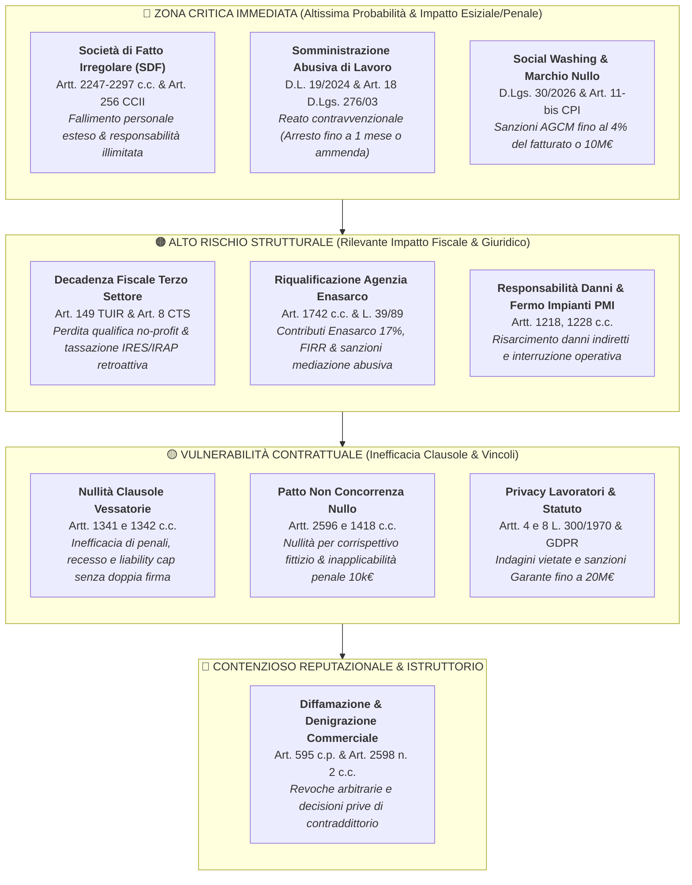
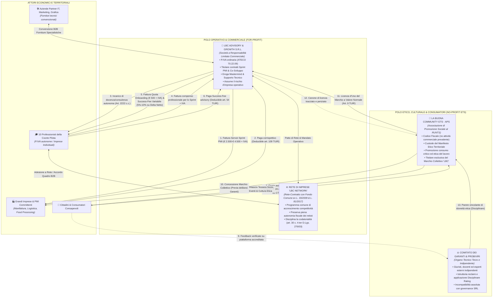
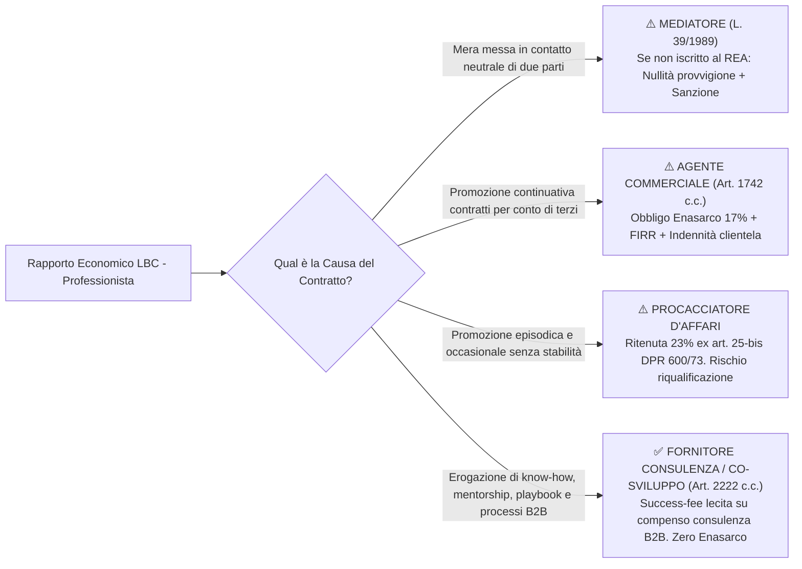
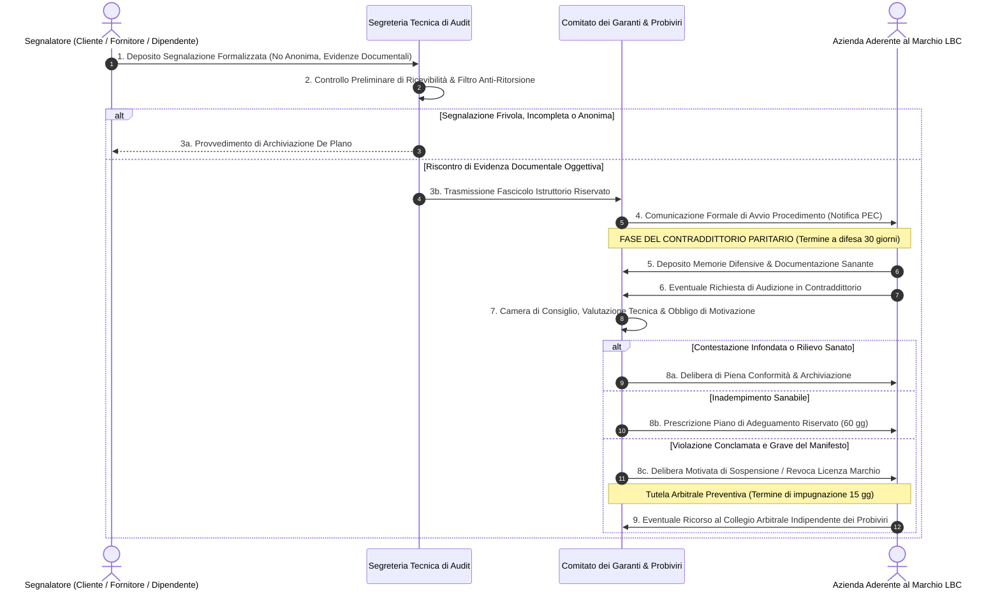
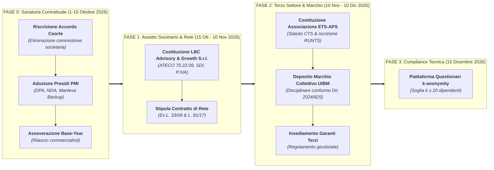

# AUDIT LEGALE & STRESS-TEST GIURIDICO-FISCALE
## Analisi di Vulnerabilità Normativa, Rischio Contrattuale e Architettura di Blindatura per "LBC — La Buona Community"
**Autore:** Senior Legal Counsel & Fiscalista d'Impresa (Expertise: Contrattualistica B2B, Contratti di Rete L. 33/2009, Diritto del Terzo Settore D.Lgs. 117/2017, Giuslavoristica D.Lgs. 276/2003, Compliance AGCM & Data Protection GDPR)  
**Data:** 25 Settembre 2026  
**Documento di Riferimento:** Audit Integrato sui Materiali Fondativi dell'Ecosistema LBC  
**Destinatari:** Organo Direttivo & Promotori Fondatori di "LBC — La Buona Community"  
**Classificazione:** STRETTAMENTE CONFIDENZIALE — PRIVILEGED LEGAL WORK PRODUCT  

> **Documenti Attuativi dell'Ecosistema LBC:**  
> • [`ACCORDO_PILOTA_DELTA_FATTURATO.md`](file:///c:/Users/MARIO/Downloads/LBC%20La%20Buona%20Community/ACCORDO_PILOTA_DELTA_FATTURATO.md) — Contratto Pilota Blindato Co-Sviluppo Retisti  
> • [`OFFERTA_ARIETE_PMI.md`](file:///c:/Users/MARIO/Downloads/LBC%20La%20Buona%20Community/OFFERTA_ARIETE_PMI.md) — Offerta Commerciale Ariete e Sprint Processi  
> • [`MANIFESTO_E_RATING_ETICO.md`](file:///c:/Users/MARIO/Downloads/LBC%20La%20Buona%20Community/MANIFESTO_E_RATING_ETICO.md) — Disciplinare Marchio Collettivo ex Art. 11 CPI  
> • [`STRATEGIC_BLUEPRINT.md`](file:///c:/Users/MARIO/Downloads/LBC%20La%20Buona%20Community/STRATEGIC_BLUEPRINT.md) — Masterplan e Dual-Entity Corporate Design  
> • [`ANALISI_CRITICA_RISCHI_E_SOLUZIONI.md`](file:///c:/Users/MARIO/Downloads/LBC%20La%20Buona%20Community/ANALISI_CRITICA_RISCHI_E_SOLUZIONI.md) — Risk Mitigation & Prevenzione Fallimenti  
> • [`TARGET_SEGMENTATION_ANALYSIS.md`](file:///c:/Users/MARIO/Downloads/LBC%20La%20Buona%20Community/TARGET_SEGMENTATION_ANALYSIS.md) — Segmentazione PMI e Selezione Coorte  
> • [`MACRO_ROADMAP_ECOSISTEMA_LBC.md`](file:///c:/Users/MARIO/Downloads/LBC%20La%20Buona%20Community/MACRO_ROADMAP_ECOSISTEMA_LBC.md) — Roadmap Operativa 12 Mesi  
> • [`ANALISI_CRITICA_STATO_ARTE_E_MANUALI.md`](file:///c:/Users/MARIO/Downloads/LBC%20La%20Buona%20Community/ANALISI_CRITICA_STATO_ARTE_E_MANUALI.md) — Epistemologia e Architettura 2 Libri Fondativi  

---

## 1. Executive Summary & Valutazione Complessiva di Rischio Legale

### 1.1 Rating Sintetico di Vulnerabilità

| Area Giuridica Oggetto di Stress-Test | Indice di Rischio (1–10) | Severità Operativa | Profilo Sanzionatorio & Conseguenze Giudiziarie |
| :--- | :---: | :---: | :--- |
| **1. Profilo Societario & Qualificazione Partecipazione** | **9.5 / 10** | *Esiziale* | Riqualificazione in "Società di Fatto Irregolare" (artt. 2247 e 2297 c.c.); estensione personale della liquidazione giudiziale (art. 256 CCII); responsabilità solidale e illimitata dei promotori per i debiti dei singoli professionisti. |
| **2. Diritto del Lavoro & Somministrazione Manodopera** | **9.2 / 10** | *Esiziale / Penale* | Rilevanza penale contravvenzionale ex D.L. 19/2024 conv. in L. 56/2024 (nuovo art. 18 D.Lgs. 276/2003): arresto fino a 1 mese o ammenda di 60€/die/lavoratore per somministrazione non autorizzata e appalto non genuino; costituzione coattiva del rapporto subordinato ex art. 38 D.Lgs. 81/2015. |
| **3. Rating Etico, Marchi & Tutela del Consumatore** | **9.0 / 10** | *Critico* | Violazione frontale del **D.Lgs. 20 febbraio 2026, n. 30** (attuativo della Direttiva UE 2024/825 Empowering Consumers) con piena efficacia esecutiva dal **27 settembre 2026**; nullità assoluta del marchio di garanzia per violazione dell'art. 11-bis D.Lgs. 30/2005 (CPI); sanzioni AGCM per pratiche commerciali ingannevoli (social washing) fino al 4% del fatturato annuo o 10.000.000€. |
| **4. Dual-Entity Corporate Design & Fiscalità ETS** | **8.8 / 10** | *Critico* | Disconoscimento del regime agevolativo Terzo Settore e decadenza della qualifica di ente non commerciale ex art. 149 TUIR per commistione o prevalenza commerciale; ripresa a tassazione IRES/IRAP ordinaria retroattiva; contestazione per distribuzione indiretta di utili (art. 8 D.Lgs. 117/2017) e abuso del diritto (art. 10-bis L. 212/2000). |
| **5. Riqualificazione Rapporti Coorte (Agenzia/Mediazione)** | **8.5 / 10** | *Alto* | Riqualificazione delle success-fee su commesse segnalate o procacciate in provvigioni di agenzia commerciale: recupero contributivo INPS ed Enasarco (aliquota fino al 17%), accantonamento FIRR, indennità di risoluzione rapporto ex art. 1751 c.c.; ovvero decadenza dal diritto al compenso per mediazione abusiva non iscritta al REA (L. 39/1989). |
| **6. Tutela Vessatoria & Patti Post-Contrattuali** | **8.3 / 10** | *Alto* | Nullità insanabile delle penali, dei patti di stabilità, delle limitazioni di responsabilità e delle clausole compromissorie per difetto di specifica approvazione per iscritto (artt. 1341 e 1342 c.c.); nullità del patto di non concorrenza per corrispettivo meramente simbolico o apparente (artt. 2596 e 1418 c.c.). |
| **7. Privacy Industriale, DPA & Statuto dei Lavoratori** | **8.2 / 10** | *Alto* | Sanzioni amministrative pecuniarie del Garante Privacy (fino a 20.000.000€ o 4% del fatturato ex art. 83 GDPR) per trattamento dati dipendenti/clienti PMI privo di DPA ex art. 28; violazione penale degli artt. 4 e 8 della Legge 300/1970 (Statuto dei Lavoratori) per indagini sulle opinioni e controllo a distanza tramite indagini sul clima aziendale. |
| **8. Responsabilità Civile Operativa & Danni PMI** | **8.0 / 10** | *Alto* | Responsabilità contrattuale ed extracontrattuale illimitata (artt. 1218 e 2043 c.c.) per blocchi produttivi, perdite di commesse e corruzione di database gestionali occorsi durante lo Sprint dei 45 giorni in assenza di perentorio onere preventivo di backup e liability cap inderogabile ex art. 1229 c.c. |
| **VALUTAZIONE PONDERATA GLOBALE** | **8.7 / 10** | **STATO DI ALLARME ROSSO** | **L'infrastruttura contrattuale e organizzativa originaria espone i fondatori a responsabilità patrimoniale illimitata e a sanzioni penali e tributarie immediate.** |

---

### 1.2 Sintesi Diagnostica del Senior Counsel

L'ecosistema **"LBC — La Buona Community"**, così come delineato nella bozza contrattuale (`ACCORDO_PILOTA_DELTA_FATTURATO.md`), nel disciplinare del rating (`MANIFESTO_E_RATING_ETICO.md`), nell'offerta PMI (`OFFERTA_ARIETE_PMI.md`) e nei relativi documenti di pianificazione strategica (`STRATEGIC_BLUEPRINT.md`, `ANALISI_CRITICA_RISCHI_E_SOLUZIONI.md`, `TARGET_SEGMENTATION_ANALYSIS.md`), esprime un'intuizione di straordinario valore economico e relazionale sul piano del marketing territoriale. Tuttavia, sotto il profilo gius-commerciale, contrattuale, tributario e regolamentare, **poggia su presupposti di elevatissima pericolosità giuridica**.

Le cinque "trappole ad alto potenziale distruttivo" riscontrate nei documenti originari sono:

1. **Il rischio di riqualificazione in Società di Fatto Irregolare (SDF):**  
   L'incauta espressione adoperata all'art. 1 delle Premesse dell'originario `ACCORDO_PILOTA` (*"agendo a supporto strategico della loro crescita senza sottrarre quote societarie"*, ma con commistione organizzativa e compartecipazione incrementale) costituiva una confessione stragiudiziale di esistenza di una **Società di Fatto Irregolare (SDF)**. In base alla costante giurisprudenza della Corte di Cassazione (Cass. Civ. n. 1095/2016; Cass. Civ. n. 27541/2019), il concorso nell'attività economica, la compartecipazione ai risultati incrementali e la commistione organizzativa integrano gli estremi dell'*affectio societatis*. In caso di insolvenza o dissesto finanziario di uno solo dei 10 professionisti pilota, i creditori o il Curatore Fallimentare potranno chiedere l'estensione della Liquidazione Giudiziale (art. 256 Codice della Crisi d'Impresa e dell'Insolvenza - CCII) all'entità LBC e ai patrimoni personali dei suoi fondatori.
2. **Il rischio penale per somministrazione abusiva di manodopera (D.L. 19/2024):**  
   Proporre alle PMI l'erogazione di *"competenze operative pre-selezionate"* e l'*"interventi di supporto operativo esterno sui progetti di ottimizzazione"* a fronte di un corrispettivo forfettario (€ 2.500–€ 4.500), senza che LBC sia un'Agenzia per il Lavoro (APL) iscritta all'Albo ANPAL ex art. 4 D.Lgs. 276/2003 e senza la schermatura di un Contratto di Rete con codatorialità formalizzata, fa scattare la configurabilità del reato contravvenzionale di **somministrazione abusiva di manodopera** e **appalto non genuino**. A seguito della riforma introdotta dall'art. 29 del **D.L. 2 marzo 2024, n. 19 conv. in L. 29 aprile 2024, n. 56**, il legislatore ha reintrodotto la sanzione dell'**arresto fino a un mese o l'ammenda di 60 euro al giorno per ciascun lavoratore**, elevata fino all'arresto a 3 mesi o 100 euro/die in caso di somministrazione fraudolenta (art. 18 commi 1, 5-bis e 5-ter D.Lgs. 276/2003; Nota INL n. 1133/2024).
3. **L'illiceità del "Bollino Etico Privato" alla luce del D.Lgs. 30/2026 e dell'Art. 11-bis CPI:**  
   Il rilascio di un marchio o bollino etico fondato su deliberazioni *"discrezionali e prive di motivazione analitica"* di un comitato interno e su un questionario dipendenti non validato vìola direttamente il **D.Lgs. 20 febbraio 2026, n. 30** (pubblicato in G.U. n. 56 del 9 marzo 2026 ed entrato in piena operatività il **27 settembre 2026**), che recepisce la **Direttiva (UE) 2024/825** (*Empowering Consumers for the Green Transition*). Il D.Lgs. 30/2026 inserisce nella c.d. "black list" delle pratiche commerciali sleali e ingannevoli (artt. 20, 21, 23 comma 1 lett. f-bis Codice del Consumo) l'esibizione di marchi o etichette di sostenibilità sociale o etica non basati su un sistema di certificazione terzo e indipendente o non istituiti da autorità pubbliche. Inoltre, ai sensi dell'**art. 11-bis del Codice della Proprietà Industriale (D.Lgs. 30/2005)**, è sancita la nullità radicale del marchio di certificazione qualora il soggetto che lo rilascia svolga attività economica nel settore certificato (nel caso specifico, la fornitura di servizi di consulenza e digitalizzazione alle medesime imprese valutate).
4. **La commistione patrimoniale e la decadenza fiscale dell'Associazione (Art. 149 TUIR & Art. 8 CTS):**  
   L'idea di avviare prima le attività di cassa con le PMI e rimandare l'Associazione al Mese 3 o 4, incassando quote o provvigioni promiscue, espone i promotori all'accertamento per **abuso del diritto ed elusione fiscale (art. 10-bis L. 212/2000)**. Qualora l'Associazione ETS/APS incassi corrispettivi legati alle prestazioni commerciali di advisory o redistribuisca valore economico alla SRL operativa dei fondatori, l'Agenzia delle Entrate dichiarerà la perdita immediata della qualifica di ente non commerciale ex art. 149 TUIR con recupero a tassazione ordinaria IRES/IRAP/IVA retroattiva di tutte le entrate e l'applicazione di pesanti sanzioni per violazione del divieto di distribuzione indiretta di utili ex art. 8 del Codice del Terzo Settore (D.Lgs. 117/2017).
5. **La fragilità contrattuale: hold-up, patti di non concorrenza e mancata doppia firma (Artt. 1341-1342 c.c.):**  
   L'`ACCORDO_PILOTA` non contiene una formula contabile certa per il delta fatturato, rendendo la prestazione indeterminabile ex art. 1346 c.c. Non vi è presidio contro l'abbandono opportunistico del professionista (hold-up al mese 6-11 dopo aver ricevuto formazione e lead). Il patto di non concorrenza ipotizzato è giuridicamente nullo perché privo di corrispettivo monetario reale e congruo (art. 2596 c.c.). Infine, l'assenza della **doppia sottoscrizione formale delle clausole vessatorie ai sensi degli artt. 1341 e 1342 c.c.** rende legalmente inefficaci nei confronti del professionista o della PMI qualsiasi limitazione di responsabilità, penale risarcitoria, vincolo di non concorrenza e clausola compromissoria.

**Finalità del presente Report:** Il presente documento non si limita a censurare le criticità, ma fornisce l'architettura tecnica completa, le delibere societarie, le matrici fiscali, i testi contrattuali integralmente riscritti e il regolamento del comitato etico per rendere LBC blindata, legalmente inattaccabile e pronta per il lancio sul mercato.

---

## 2. Matrice dei Rischi Giuridici Dettagliata

La presente matrice analizza analiticamente le 12 vulnerabilità strutturali identificate nei documenti dell'ecosistema LBC secondo i requisiti tassativi di audit.

| Area di Rischio | Norma di Riferimento | Impatto (1-5) | Probabilità (1-5) | Gravità | Vulnerabilità Identificata | Soluzione Giuridica |
| :--- | :--- | :---: | :---: | :---: | :--- | :--- |
| **Diritto Societario & Crisi d'Impresa** | Artt. 2247, 2297 c.c.; Art. 256 D.Lgs. 14/2019 (CCII, già art. 147 L.F.) | 5 | 4 | **20 (Critico)** | L'impostazione originaria configurava un'assidua commistione e compartecipazione ai risultati incrementali dei professionisti (`ACCORDO_PILOTA` Premessa 1 e `STRATEGIC_BLUEPRINT` sez. 5). <strong>Rischio/Sanzioni:</strong> Riqualificazione come Società di Fatto Irregolare: responsabilità solidale e illimitata dei promotori per i debiti personali/professionali dei Partner di coorte; estensione automatica della Liquidazione Giudiziale (fallimento) all'intero ecosistema e ai fondatori. | Espunzione radicale di qualsiasi commistione societaria. Riqualificazione come "Accordo Quadro di Co-Sviluppo Strategico B2B" ad adempimento reciproco ovvero formalizzazione mediante "Contratto di Rete d'Imprese" ex L. 33/2009 con segregazione soggettiva e patrimoniale assoluta. |
| **Diritto del Lavoro & Sanzioni Penali** | Artt. 18 (commi 1, 5-bis, 5-ter) e 29 D.Lgs. 276/2003; D.L. 19/2024 conv. in L. 56/2024; Art. 38 D.Lgs. 81/2015 | 5 | 4 | **20 (Critico)** | LBC proponeva alle PMI l'erogazione di *"competenze operative pre-selezionate"* e l'inserimento guidato di professionisti nei progetti operativi delle PMI (`OFFERTA_ARIETE` e `TARGET_SEGMENTATION`) senza autorizzazione ministeriale APL. <strong>Rischio/Sanzioni:</strong> Riqualificazione come Somministrazione Abusiva di Lavoro e Appalto Non Genuino: reato contravvenzionale punito con l'arresto fino a 1 mese o ammenda di 60€/giorno per ciascun lavoratore; fino a 3 mesi di arresto e 100€/die per somministrazione fraudolenta; costituzione coattiva del rapporto di lavoro subordinato in capo alla PMI. | Inquadramento delle prestazioni come contratti d'opera professionale autonoma (art. 2222 c.c.) stipulati direttamente tra il professionista e la PMI, ovvero stipula di un Contratto di Rete con codatorialità espressamente pattuita e registrata ai sensi dell'art. 30 comma 4-ter D.Lgs. 276/2003 e Circolare INL 7/2018. |
| **Antitrust & Tutela del Consumatore** | Artt. 20, 21, 23 c. 1 lett. f-bis D.Lgs. 206/2005 (Codice del Consumo mod. da D.Lgs. 30/2026 - Dir. UE 2024/825) | 5 | 4 | **20 (Critico)** | Concessione ed esposizione pubblica del "Bollino Etico LBC" fondato su deliberazioni discrezionali interne e questionari non validati (`MANIFESTO_E_RATING` sez. 5). <strong>Rischio/Sanzioni:</strong> Pratica commerciale ingannevole (social-washing): violazione della black list del Codice del Consumo applicabile dal 27/09/2026; sanzioni amministrative AGCM da 5.000€ a 10.000.000€ (fino al 4% del fatturato annuo); divieto di prosecuzione dell'uso commerciale del marchio. | Rinuncia immediata a claim di certificazione di conformità terza non accreditata; inquadramento esclusivo come Marchio Collettivo privato ex art. 11 CPI intestato all'Associazione ETS no-profit, regolato da Disciplinare Tecnico conforme a standard ISO/IEC 17065 con verifiche affidate a organismi terzi indipendenti. |
| **Proprietà Industriale & Marchi** | Art. 11-bis D.Lgs. 30/2005 (Codice Proprietà Industriale) | 4 | 5 | **20 (Critico)** | Il Bollino Etico viene definito marchio di garanzia/certificazione (`MANIFESTO_E_RATING` sez. 5.1), ma l'ente o la società emittente eroga parallelamente consulenza operativa B2B alle aziende certificate. <strong>Rischio/Sanzioni:</strong> Nullità assoluta e insanabile della registrazione del marchio di certificazione per violazione del divieto inderogabile ex art. 11-bis comma 2 CPI (incompatibilità assoluta tra fornitura di servizi certificati e titolarità del marchio di certificazione). | Separazione strutturale Dual-Entity: titolarità del marchio assegnata inderogabilmente all'Associazione ETS no-profit (che non svolge alcuna attività di consulenza commerciale); la SRL operativa agisce quale mera licenziataria d'uso commerciale per i propri servizi advisory, priva di poteri di rilascio del bollino. |
| **Diritto Tributario & Terzo Settore** | Art. 149 D.P.R. 917/1986 (TUIR); Artt. 8, 79, 85 D.Lgs. 117/2017 (Codice del Terzo Settore); Art. 10-bis L. 212/2000 | 5 | 3 | **15 (Alto)** | Utilizzo dell'Associazione come schermo o cassa di raccolta fondi ancillare per la SRL commerciale; posticipo dell'ETS al Mese 3-4 dopo l'incasso dei primi 12k€ (`ANALISI_CRITICA` Lente 2). <strong>Rischio/Sanzioni:</strong> Perdita della qualifica di ente non commerciale ex art. 149 TUIR per prevalenza delle entrate commerciali o commistione patrimoniale; tassazione retroattiva ordinaria IRES e IRAP; riqualificazione per distribuzione indiretta di utili (art. 8 CTS) ed elusione fiscale. | Costituzione formale e tempestiva dell'ETS (APS iscritta al RUNTS); adozione del divieto statutario assoluto di distribuzione diretta o indiretta di utili; contrattualizzazione dei rapporti infragruppo a condizioni di mercato con documentazione del valore normale ex art. 9 TUIR. |
| **Giuslavoristica & Inquadramento Commerciale** | Art. 1742 c.c. (Contratto di Agenzia); L. 39/1989 (Mediazione); Art. 25-bis D.P.R. 600/1973; Fondazione Enasarco | 4 | 4 | **16 (Alto)** | Previsione all'art. 4 `ACCORDO_PILOTA` di un compenso del 5%-10% sulle *"commesse generate direttamente o segnalate attraverso la rete LBC"*. <strong>Rischio/Sanzioni:</strong> Riqualificazione del rapporto in contratto di agenzia commerciale continuativa con obbligo di versamento retroattivo dei contributi previdenziali Enasarco (17%), FIRR e indennità di clientela ex art. 1751 c.c.; ovvero nullità per mediazione abusiva senza iscrizione al REA (L. 39/1989). | Ridefinizione della causa del contratto come prestazione di servizi complessi di sviluppo aziendale, mentorship e marketing B2B (art. 2222 c.c. e art. 1322 c.c.); eliminazione di ogni riferimento ad agenzia o procacciamento d'affari diretto; compenso configurato come success-fee su consulenza strategica. |
| **Diritto Contrattuale & Clausole Vessatorie** | Artt. 1341 e 1342 c.c. (Condizioni Generali di Contratto e Moduli) | 4 | 5 | **20 (Critico)** | Le bozze contrattuali (`ACCORDO_PILOTA` e offerta Sprint PMI) contengono penali, limitazioni di responsabilità, decadenze e vincoli di recesso prive di specifica approvazione per iscritto. <strong>Rischio/Sanzioni:</strong> Nullità assoluta e inopponibilità di tutte le clausole protettive (penale per occultamento, manleva fermo macchina, patto di non concorrenza, clausola arbitrale) in caso di predisposizione unilaterale su modulo standard LBC. | Inserimento obbligatorio e formale in calce a ciascun contratto della sezione "Approvazione Specifica delle Clausole Onerose e Vessatorie ai sensi degli artt. 1341 e 1342 c.c.", con doppia firma autografa o digitale qualificata su ciascun articolo tassativamente richiamato. |
| **Patti di Non Concorrenza & Vincoli Post-Recesso** | Art. 2596 c.c. (Limiti Contrattuali della Concorrenza); Art. 1418 c.c. (Nullità del Contratto) | 4 | 4 | **16 (Alto)** | Previsione di un patto di non concorrenza post-contrattuale di 12 mesi a fronte di un *"corrispettivo forfettario pari a uno sconto del 20% sui corsi interni"* (`ACCORDO_PILOTA` art. 5.3). <strong>Rischio/Sanzioni:</strong> Nullità radicale del patto di non concorrenza per violazione dell'art. 2596 c.c. e dei principi generali sull'onerosità dei vincoli restrittivi (corrispettivo meramente simbolico o apparente); inapplicabilità della penale risarcitoria di 10.000€. | Riformulazione del patto come clausola di non concorrenza con corrispettivo monetario certo, congruo e periodico (indennità mensile post-recesso determinata), affiancata da un patto di non storno di clientela e collaboratori con penale forfettaria ex art. 1382 c.c. |
| **Determinabilità dell'Oggetto Contrattuale** | Art. 1346 c.c. (Requisiti dell'Oggetto); Art. 1355 c.c. (Condizione Meramente Potestativa) | 4 | 4 | **16 (Alto)** | La success-fee è parametrata genericamente all'incremento di fatturato senza chiarire se al lordo o netto imposte, senza definire il perimetro dei costi o isolare i clienti preesistenti. <strong>Rischio/Sanzioni:</strong> Nullità della clausola di revenue-share per indeterminatezza o indeterminabilità dell'oggetto contrattuale ex art. 1346 c.c.; impossibilità di agire in via monitoria (decreto ingiuntivo) per carenza di prova scritta liquida ed esigibile. | Adozione di una formula matematica rigorosa e inequivocabile con perimetro SDI netto (imponibile al netto di IVA, note di credito, insoluti e clienti storici asseverati); introduzione dell'asseverazione del Base-Year rilasciata dal commercialista del Partner. |
| **Privacy & Statuto dei Lavoratori** | Reg. UE 2016/679 (GDPR); Artt. 4 e 8 L. 300/1970; D.Lgs. 196/2003 mod. D.Lgs. 101/2018 | 4 | 4 | **16 (Alto)** | I questionari di rating rivolti ai dipendenti delle PMI (Area A: 40%) indagano sul clima aziendale e sui pagamenti in contesti di 20-50 dipendenti senza DPA né garanzie di re-identificazione (`MANIFESTO_E_RATING` sez. 3). <strong>Rischio/Sanzioni:</strong> Sanzioni del Garante Privacy fino a 20.000.000€ o 4% del fatturato; violazione penale dell'art. 8 e 4 L. 300/1970 (indagini vietate sulle opinioni dei lavoratori e controllo a distanza); inutilizzabilità probatoria delle risultanze istruttorie. | Adozione di un formale DPA ex art. 28 GDPR tra PMI (Titolare) e LBC (Responsabile); somministrazione questionari affidata a piattaforma terza certificata con protocollo di k-anonymity (minimo $k \ge 20$ risposte aggregate); divieto di quesiti individuali o discriminatori. |
| **Concorrenza Sleale & Diffamazione** | Art. 595 c.p. (Diffamazione aggravata); Art. 2598 n. 2 c.c. (Denigrazione Commerciale); L. 287/1990 | 4 | 3 | **12 (Medio)** | La revoca pubblica del bollino o il declassamento del punteggio avvengono su *"giudizio discrezionale del Comitato"* senza previo contraddittorio formale (`MANIFESTO_E_RATING` sez. 4). <strong>Rischio/Sanzioni:</strong> Azioni risarcitorie milionarie per lesione dell'onore e dell'avviamento commerciale; querele per diffamazione a mezzo internet; procedimenti per boicottaggio economico e concorrenza sleale per denigrazione ex art. 2598 n. 2 c.c. | Adozione di un Regolamento Istruttorio Giustiziale Rigido: comunicazione formale di addebito, termine perentorio a difesa di 30 giorni (contraddittorio paritario), obbligo di motivazione tecnica analitica e clausola arbitrale di garanzia innanzi a collegio di probiviri terzi. |
| **Responsabilità Civile da Audit & Sprint PMI** | Artt. 1218, 1228, 1229 c.c.; Artt. 98 e 99 D.Lgs. 30/2005 (Segreti Industriali) | 4 | 4 | **16 (Alto)** | I tecnici e consulenti LBC intervengono su ERP, connettori gestionali e flussi produttivi delle PMI (`OFFERTA_ARIETE`) senza esonero per fermo impianto o perdita dati. <strong>Rischio/Sanzioni:</strong> Richieste di risarcimento del danno emergente e lucro cessante per blocco della catena produttiva, interruzione d'esercizio o fuga di segreti commerciali, con responsabilità solidale ex art. 1228 c.c. dei promotori. | Inserimento obbligatorio nel contratto Sprint di una clausola di limitazione di responsabilità (liability cap pari al compenso incassato ex art. 1229 c.c.), esclusione totale per danni indiretti e fermo linea, e formale condizione sospensiva con onere inderogabile di backup preventivo a carico della PMI. |

---

## 3. Architettura Societaria & Fiscale Blindata

Per scongiurare il pericolo di commistione patrimoniale, la riqualificazione societaria in "Società di Fatto", la decadenza dal regime no-profit (art. 149 TUIR) e l'accertamento di abuso del diritto (art. 10-bis L. 212/2000), l'ecosistema LBC deve adottare il modello strutturato del **Dual-Entity Corporate Design**, imperniato su due persone giuridiche distinte e coordinate tramite accordi negoziali a valore normale.

### 3.1 Diagramma Mermaid dell'Architettura Societaria e Flussi

---

### 3.2 La Segregazione dei Ruoli: SRL Commerciale vs ETS RUNTS

Per prevenire l'applicazione dell'art. 149 TUIR (perdita della qualifica di ente non commerciale), dell'art. 8 CTS (divieto di distribuzione indiretta di utili) e dell'art. 10-bis L. 212/2000 (abuso del diritto), è stabilita la netta **separazione funzionale, patrimoniale e statutaria tra i due veicoli**:

#### 1. LBC Advisory & Growth S.r.l. (Polo For-Profit)
* **Forma Giuridica:** Società a Responsabilità Limitata Commerciale ordinaria (D.Lgs. 6/2003).
* **Oggetto Sociale Tipico:** Consulenza di direzione aziendale e strategica (Codice ATECO 70.22.09); organizzazione e gestione dei processi industriali e commerciali; marketing B2B e lead generation; sviluppo e integrazione di automazioni digitali e software gestionali; supporto alla digitalizzazione delle PMI.
* **Funzione nell'Ecosistema:** È il braccio operativo a scopo di lucro. Stipula i contratti con le PMI, emette e riceve fatture elettroniche con IVA al 22%, assume il rischio d'impresa contrattuale dei progetti di riorganizzazione operativa, incassa i corrispettivi degli Sprint e le quote di revenue-share (success fee) dai professionisti della coorte.
* **Trattamento Fiscale:** Assoggettamento ordinario ad IRES (24%) e IRAP (3,9%). Detraibilità integrale dell'IVA assolta sugli acquisti (art. 19 D.P.R. 633/1972). Deducibilità fiscale dei corrispettivi versati dalle PMI clienti per l'Audit e lo Sprint quali costi inerenti d'esercizio ai sensi dell'art. 109 TUIR.

#### 2. La Buona Community ETS — APS (Polo No-Profit)
* **Forma Giuridica:** Associazione di Promozione Sociale (APS) costituita con atto pubblico/scrittura privata registrata e iscritta nel Registro Unico Nazionale del Terzo Settore (RUNTS) ex D.Lgs. 117/2017.
* **Attività di Interesse Generale (Art. 5 CTS):** Lettera *d)* educazione, istruzione e formazione professionale; lettera *i)* organizzazione e gestione di attività culturali, artistiche o ricreative di interesse sociale; lettera *w)* promozione e tutela dei diritti umani, civili e dei consumatori.
* **Funzione nell'Ecosistema:** Rappresenta la comunità dei cittadini e dei consumatori. Custodisce il Manifesto Etico, promuove il consumo di prossimità e il rispetto del lavoro dignitoso, organizza assemblee popolari ed eventi divulgativi, ed è **l'unica titolare formale del Marchio Collettivo "LBC"** depositato presso l'UIBM.
* **Trattamento Fiscale:** Regime di decommercializzazione ex art. 85 D.Lgs. 117/2017 per le quote associative e i contributi versati dai soci cittadini. Non emette fatture per consulenza commerciale, non riceve percentuali di fatturato dalle PMI, né svolge attività d'agenzia o mediazione d'affari.

#### 3. Regole d'Oro di Blindatura Fiscale (Circolare Agenzia Entrate n. 18/E/2018 & Risoluzione n. 38/E/2021)
1. **Divieto di Organi Amministrativi Coincidenti:** L'Amministratore Unico o i consiglieri di amministrazione della SRL non possono costituire la maggioranza del Consiglio Direttivo dell'Associazione ETS. L'ETS deve includere membri rappresentativi della società civile e dei consumatori indipendenti, scongiurando contestazioni di interposizione fittizia ex art. 37 comma 3 D.P.R. 600/1973.
2. **Tracciabilità dei Flussi a Valore Normale (Art. 9 TUIR):** I contratti di servizio tra SRL ed ETS (es. canone di licenza del marchio, condivisione spazi o supporto di segreteria) devono essere formalizzati per iscritto con data certa e regolati a corrispettivi allineati al valore normale di mercato comprovato da perizia asseverata, escludendo qualsiasi transito opaco di liquidità.
3. **Divieto Assoluto di Distribuzione Indiretta di Utili (Art. 8 CTS):** È vietata la corresponsione ad amministratori, fondatori o collaboratori di compensi o rimborsi superiori a quelli previsti dai CCNL di settore o sproporzionati rispetto alla redditività dell'ente.

---

### 3.3 Il Contratto di Rete (Legge 33/2009): Rete-Contratto vs Rete-Soggetto

Per inquadrare la Coorte dei 10 Professionisti pilota escludendo la "Società di Fatto" e la somministrazione abusiva, lo strumento giuridico di elezione è il **Contratto di Rete d'Imprese** disciplinato dall'art. 3, commi 4-ter ss. del D.L. 10 febbraio 2009, n. 5 (conv. in Legge 9 aprile 2009, n. 33 e ss.mm.ii.).

#### La Legittimazione dei Professionisti Autonomi: Legge 81/2017
Un'obiezione frequente è che i professionisti persone fisiche o partite IVA non siano "imprese". Questa criticità è stata espressamente superata dall'**art. 12, comma 3, lettera a) della Legge 22 maggio 2017, n. 81 (Jobs Act del Lavoro Autonomo)**, il quale stabilisce inderogabilmente che:
> *"I lavoratori autonomi sono equiparati alle piccole e medie imprese ai fini dell'accesso ai contratti di rete di cui all'articolo 3, commi 4-ter e seguenti, del decreto-legge 10 febbraio 2009, n. 5, convertito, con modificazioni, dalla legge 9 aprile 2009, n. 33."*

Pertanto, i 10 professionisti autonomi possono legittimamente essere parti stipulanti del Contratto di Rete d'Imprese insieme alla SRL commerciale.

#### Analisi Comparativa: Rete-Contratto vs Rete-Soggetto

| Parametro Giuridico / Fiscale | Opzione A: Rete-Contratto (Rete Pura) | Opzione B: Rete-Soggetto | Valutazione per LBC |
| :--- | :--- | :--- | :--- |
| **Natura Giuridica** | Contratto plurilaterale con comunione di scopo non traslativo. Priva di autonoma personalità o soggettività giuridica. | Nuovo soggetto di diritto autonomo, istituito mediante iscrizione nella Sezione Ordinaria del Registro Imprese (art. 3 c. 4-quater L. 33/09). | **Opzione A consigliata per la Coorte dei 10.** Massima flessibilità, zero rigidità societarie. |
| **Fondo Patrimoniale Comune** | Facoltativo o segregato. Ha autonomia patrimoniale imperfetta (art. 2615 c.c.): risponde solo delle obbligazioni contratte dall'Organo Comune in esecuzione del programma. | Obbligatorio e vincolato. Dotato di autonomia patrimoniale perfetta; i singoli retisti non rispondono dei debiti della rete se non per i conferimenti. | L'Opzione A con fondo comune leggero (€ 1.000–€ 2.000) è sufficiente a schermare i retisti senza vincoli di capitale. |
| **Soggettività Fiscale (IRES/IRAP)** | **Trasparenza Fiscale Totale.** La rete non è soggetto passivo IRES o IRAP (Circolare Agenzia Entrate n. 20/E/2013). Ciascun retista fattura e dichiara la propria quota di reddito. | **Autonomo soggetto passivo IRES e IRAP.** Ha una propria Partita IVA, presenta la dichiarazione dei redditi modello SC e versa le imposte in proprio. | L'Opzione A azzera il "doppio carico" fiscale e contabile, lasciando i ricavi direttamente in capo alla SRL e ai professionisti. |
| **Partita IVA e Fatturazione** | Non ha P.IVA autonoma; se è presente fondo comune, richiede solo il Codice Fiscale (Risoluzione Agenzia Entrate n. 70/E/2013). La fatturazione alle PMI avviene tramite la SRL mandataria o direttamente dai retisti. | Ha propria Partita IVA ordinaria. Fattura direttamente ai clienti terzi e riceve fatture passive per le spese della rete. | L'Opzione A consente a LBC S.r.l. di fungere da capofila/mandataria con rappresentanza limitata senza creare un ente d'imposta intermedio. |
| **Obblighi di Bilancio** | Nessun deposito di bilancio al Registro Imprese. È sufficiente un rendiconto annuale di gestione della spesa comune approvato dai retisti. | Obbligo di redazione e deposito del bilancio d'esercizio annuale presso il Registro Imprese ai sensi dell'art. 2615-bis c.c. (costi di deposito e commercialista). | L'Opzione A fa risparmiare adempimenti burocratici e costi fissi (circa 2.500€/anno di gestione societaria). |
| **Codatorialità e Distacco (Giuslavoristica)** | **Pienamente Ammissibile.** Ai sensi dell'art. 30 comma 4-ter D.Lgs. 276/2003 e della Circolare INL n. 7/2018, la codatorialità e il distacco tra le imprese della rete sono automatici e legittimi. | Pienamente Ammissibile. Disciplinata secondo le medesime regole previste per la rete-contratto. | **Pareggio perfetto.** Entrambe le opzioni neutralizzano il rischio di somministrazione abusiva ed appalto illecito. |
| **Costi Notarili e Iscrizione** | Iscrizione telematica a margine della posizione di ciascun retista presso il Registro Imprese (atto pubblico o scrittura autenticata). | Costituzione per atto pubblico notarile con iscrizione autonoma nella sezione ordinaria del Registro Imprese. | L'Opzione A comporta oneri di costituzione e registrazione significativamente inferiori. |

**Conclusione Operativa:** Per la fase pilota (1° anno con i 10 professionisti), la scelta strategica e fiscale ottimale è la **Rete-Contratto con Fondo Patrimoniale Comune e Organo Comune privo di soggettività giuridica (Opzione A)**, conferendo il ruolo di Organo Comune gestore a **LBC Advisory & Growth S.r.l.**

---

### 3.4 Inquadramento della Coorte: Procacciatore d'Affari vs Agente Enasarco vs Mediatore vs Fornitore di Consulenza B2B

Uno degli errori più gravi rinvenuti nell'art. 4 dell'originario `ACCORDO_PILOTA` era la previsione di una percentuale riconosciuta sulle *"commesse procacciate o segnalate attraverso la rete LBC"*. In sede ispettiva (INPS, Guardia di Finanza, Fondazione Enasarco), qualsiasi formulazione riconducibile a provvigioni su affari innesca l'immediata riqualificazione del rapporto.

La seguente tabella stabilisce i confini giuridici per scongiurare sanzioni tributarie e contributive:

| Figura Giuridica | Definizione Civilistica | Tratto Distintivo Essenziale | Rischio di Riqualificazione per LBC | Presidio Contrattuale Blindato |
| :--- | :--- | :--- | :--- | :--- |
| **Agente di Commercio** | Art. 1742 c.c.: Una parte assume stabilmente l'incarico di promuovere la conclusione di contratti in una zona determinata per conto dell'altra, verso retribuzione. | **Stabilità, continuità e vincolo di promozione attiva** a favore del preponente. | **Altissimo.** Recupero retroattivo contributi Enasarco (fino al 17% sulle provvigioni), accantonamento FIRR e indennità di fine rapporto ex art. 1751 c.c. | Eliminare ogni obbligo di promozione delle commesse di terzi. Escludere zone geografiche di esclusiva. Precisare che LBC non conferisce alcun incarico di vendita stabile. |
| **Procacciatore d'Affari** | Fattispecie atipica (art. 1322 c.c.): Collaborazione priva di stabilità e continuità, in cui il procacciatore segnala occasionalmente opportunità di affari. | **Episodicità, assenza di stabilità e assenza di obbligo di promozione.** | **Medio/Alto.** Se l'attività diventa continuativa, la giurisprudenza (Cass. Civ. 8940/2020) la riqualifica automaticamente in agenzia Enasarco; ritenuta 23% ex art. 25-bis DPR 600/73. | Vietare compensi parametrici sul mero contatto tra terzi. Qualificare la remunerazione come compenso forfettario o variabile per servizi complessi. |
| **Mediatore Professionale** | Art. 1754 c.c. e Legge 39/1989: Chi mette in relazione due o più parti per la conclusione di un affare, senza essere legato ad alcuna di esse da rapporti di collaborazione o dipendenza. | **Equidistanza, neutralità e terzietà assoluta** rispetto a entrambe le parti. | **Critico.** Mancata iscrizione al Registro Imprese/REA comporta la perdita totale del diritto alla provvigione e sanzioni pecuniarie per esercizio abusivo. | Non configurare mai LBC come "mediatore neutrale tra domanda e offerta". LBC interviene quale parte consulenziale integrata con advisory specialistico. |
| **Fornitore Autonomo di Servizi di Co-Sviluppo B2B (Modello LBC Corretto)** | Contratto d'opera intellettuale o fornitura servizi complessi (art. 2222 c.c. e art. 1655 c.c. / Contratto di Rete). | **Causa complessa:** erogazione di formazione, mentorship, playbook commerciali, sessioni di mastermind e supporto tecnologico. | **Nessuno.** Il compenso variabile (success-fee) è una modalità concordata di quantificazione del valore della consulenza resa ex art. 2225 c.c. | **Clausola blindata:** la success fee matura sull'incremento di fatturato del Partner per effetto dell'allineamento strategico e del know-how acquisito da LBC, non come provvigione sull'affare. |

---

## 4. Clausole Contrattuali Correttive Pronte all'Uso

### 4.1 Riscrizione e Integrazione dell'`ACCORDO_PILOTA_DELTA_FATTURATO.md`

I seguenti articoli sostituiscono integralmente le corrispondenti sezioni dell'accordo originario, estirpando ogni espressione tossica e introducendo i presidi civilistici, fiscali e probatori richiesti.

***

#### ARTICOLO 1 — NATURA B2B DEL RAPPORTO, AUTONOMIA E TOTALE ESCLUSIONE DI VINCOLI SOCIETARI
1.1. **Qualificazione delle Parti e Natura del Contratto:** Il presente accordo costituisce un contratto atipico di cooperazione strategica, advisory direzionale e prestazione di servizi complessi di co-sviluppo tra imprese e professionisti autonomi indipendenti (B2B), concluso ai sensi dell'art. 1322 e dell'art. 2222 del Codice Civile.  
1.2. **Espressa Esclusione di Società di Fatto, Associazione o Agenzia:** Le Parti dichiarano, attestano e riconoscono espressamente che il presente accordo **non costituisce, né potrà in alcun caso o sede essere interpretato quale atto costitutivo di una società di fatto, società apparente, consorzio con attività esterna, associazione in partecipazione ex art. 2549 c.c., mandato d'agenzia commerciale ex art. 1742 c.c. o mediazione ex art. 1754 c.c.** Ciascuna Parte conserva la propria totale indipendenza giuridica, gestionale, patrimoniale e fiscale, assumendo in via esclusiva il proprio rischio d'impresa. Nessuna Parte ha il potere di rappresentare, obbligare o vincolare l'altra nei confronti di terzi o di assumere obbligazioni in nome e per conto dell'altra.  
1.3. **Assenza di Vincolo di Subordinazione ed Eterodirezione:** Resta tassativamente esclusa qualsiasi forma di subordinazione gerarchica, orario di lavoro vincolato, soggezione al potere direttivo o disciplinare di LBC nei confronti del Partner. Gli incontri operativi e di mastermind costituiscono mera modalità concordata di esecuzione dei servizi di advisory strategico.

***

#### ARTICOLO 2 — DETERMINAZIONE, ASSEVERAZIONE DEL BASE-YEAR E REGIMI SPECIALI
2.1. **Fatturato Base-Year:** Ai fini della determinazione della quota variabile di compenso di cui al successivo Articolo 3, le Parti individuano quale volume d'affari storico di riferimento ("Base-Year") l'ammontare complessivo imponibile pari a:
$$\mathbf{Fatturato\ Base\ Concordato:\ €\ [\_.\_.\_.\_,\_0]\ (euro\ [\_.\_.\_.\_.\_.\_.\_.\_])}$$
conseguito dal Partner nei 12 (dodici) mesi solari antecedenti la data di efficacia del presente contratto.  
2.2. **Asseverazione Obbligatoria del Commercialista:** Il valore del Base-Year deve essere certificato e asseverato, entro e non oltre 15 (quindici) giorni solari dalla sottoscrizione del presente atto, a mezzo di formale dichiarazione scritta rilasciata dal Dottore Commercialista, Esperto Contabile o Revisore Legale incaricato dal Partner (secondo il modello di cui all'Allegato A del presente contratto). L'asseverazione si fonda sulle risultanze delle fatture elettroniche attive trasmesse tramite il Sistema di Interscambio (SDI) e delle liquidazioni periodiche IVA (LIPE) depositate. L'acquisizione dell'asseverazione costituisce **condizione sospensiva di efficacia** del presente accordo.  
2.3. **Disciplina per Professionisti in Regime Forfettario o Nuove Attività:**
* Per i Partner che adottano il **Regime Forfettario** (art. 1, commi 54–89, Legge 190/2014), l'asseverazione del commercialista si baserà sull'ammontare dei ricavi/compensi indicati nel rigo LM22 del Modello Redditi Persone Fisiche dell'anno antecedente e sull'estratto delle fatture elettroniche SDI emesse con dicitura di esenzione IVA.
* Per i Partner che abbiano avviato la propria Partita IVA da **meno di 12 (dodici) mesi**, il Base-Year verrà determinato convenzionalmente pro-rata temporis annualizzando la media mensile dei compensi fatturati nei mesi di effettiva attività, con un valore convenzionale floor concordato non inferiore a **€ 15.000,00 (quindicimila/00)**.

***

#### ARTICOLO 3 — CORRISPETTIVO, FORMULA DEL REVENUE-SHARE A SCAGLIONI E PERIMETRO CONTABILE
3.1. **Corrispettivo Fisso di Avviamento (Onboarding Fee):** Quale corrispettivo per la configurazione tecnica dei canali di lavoro, l'analisi preliminare di posizionamento e l'accesso agli strumenti condivisi, il Partner corrisponde a LBC Advisory & Growth S.r.l. una quota una tantum non ripetibile pari a **€ 500,00 (cinquecento/00) oltre IVA ordinaria**, da saldarsi a mezzo bonifico bancario all'atto della sottoscrizione.  
3.2. **Success-Fee Variabile su Valore Incrementale (Revenue-Share):** A remunerazione delle attività continuative di mentorship, revisione dell'offerta, affiancamento commerciale e mastermind strategico erogate da LBC, il Partner riconoscerà e verserà a LBC un compenso variabile parametrato all'incremento netto del proprio volume d'affari conseguito nei 12 mesi di vigenza del rapporto, calcolato secondo la seguente formula:

$$Compenso_{LBC} = \sum_{i=1}^{3} \left( \mathbf{P_i} \times \Delta Fatturato_{Netto, i} \right)$$

con applicazione delle seguenti aliquote degressive per scaglioni:
* **Aliquota $\mathbf{P_1} = 10\%$** per la quota di $\Delta Fatturato_{Netto}$ compresa tra € 0,01 e € 30.000,00;
* **Aliquota $\mathbf{P_2} = 7\%$** per la quota di $\Delta Fatturato_{Netto}$ compresa tra € 30.000,01 e € 70.000,00;
* **Aliquota $\mathbf{P_3} = 5\%$** per la quota di $\Delta Fatturato_{Netto}$ eccedente € 70.000,00.

3.3. **Definizione Rigorosa del Perimetro Contabile Netto:**  
Il $\Delta Fatturato_{Netto}$ è determinato applicando la seguente equazione contabile:
$$\Delta Fatturato_{Netto} = (Fatturato\ Imponibile\ Consuntivato) - (Fatturato\ Base\ Concordato) - (Detrazioni\ Tassative)$$

Sono espressamente e inderogabilmente **escluse dal computo del fatturato** le seguenti voci (Detrazioni Tassative):
1. L'IVA e ogni altra imposta, tassa o contributo previdenziale integrativo (es. rivalsa 4% INPS o cassa professionale obbligatoria);
2. I rimborsi delle spese documentate anticipate in nome e per conto del cliente ai sensi dell'art. 15 D.P.R. 633/1972;
3. Resi, abbuoni, sconti finanziari e note di credito trasmesse allo SDI;
4. Crediti insoluti e non riscossi risultanti da fatture insolute da oltre 120 giorni e oggetto di formale diffida ad adempiere (qualora tali crediti vengano incassati in esercizi successivi, la quota LBC diverrà esigibile contestualmente all'effettivo incasso);
5. **Carve-out Clienti Storici:** I compensi derivanti da clienti con cui il Partner abbia intrattenuto documentati rapporti commerciali e contrattuali nei 24 (ventiquattro) mesi antecedenti la sottoscrizione del presente accordo, debitamente elencati nella *"Dichiarazione dei Clienti Preesistenti"* allegata sub B, salvo che tali prestazioni costituiscano linee di servizio radicalmente innovative sviluppate in seno al mastermind LBC.

3.4. **Nesso Eziologico e Presunzione Contrattuale di Causalità:**  
Le Parti concordano che l'incremento di volume d'affari del Partner si presume generato con il concorso determinante delle metodologie e dell'assistenza LBC al verificarsi congiunto delle seguenti condizioni oggettive:
1. Effettiva partecipazione del Partner ad almeno l'**80% delle sessioni settimanali di mastermind operativo** regolarmente convocate nel corso dell'anno contrattuale;
2. Concreta adozione dei format commerciali, delle automazioni di processo o dei servizi tecnici specialistici delle aziende partner interne convenzionate con LBC.  
È fatta salva la facoltà del Partner di dimostrare documentalmente che specifici ricavi incrementali siano dipesi in via esclusiva da fattori causali straordinari totalmente indipendenti e disconnessi dall'ecosistema LBC (es. eredità d'azienda, subentri in appalti pubblici preesistenti o partnership societarie terze). In caso di contrasto non sanabile tra le Parti sul nesso di causalità di una commessa, la determinazione è deferita a un arbitratore terzo indipendente (Dottore Commercialista) nominato di comune accordo o, in difetto, dal Presidente dell'ODCEC territorialmente competente ai sensi dell'art. 1349 c.c.

***

#### ARTICOLO 4 — RENDICONTAZIONE PERIODICA, AUDIT SDI E PENALE PER OCCULTAMENTO
4.1. **Rendicontazione Trimestrale:** Entro il giorno 20 (venti) del mese successivo alla chiusura di ciascun trimestre solare, il Partner è tenuto a trasmettere a LBC un estratto contabile analitico delle fatture elettroniche attive emesse nel periodo (con evidenza di data, imponibile, cliente e codice univoco SDI), a riprova dell'andamento dei compensi.  
4.2. **Diritto di Ispezione e Audit Indipendente:** LBC ha la facoltà, con preavviso scritto di almeno 5 (cinque) giorni lavorativi a mezzo PEC, di disporre una verifica contabile nominando un Dottore Commercialista o Revisore Legale indipendente. Il Partner garantisce al revisore designato l'accesso ai registri IVA vendite e alle sezioni pertinenti del proprio cassetto fiscale telematico dell'Agenzia delle Entrate.  
4.3. **Ripartizione Spese di Audit e Penale Risarcitoria (Art. 1382 c.c.):**
* Qualora l'audit confermi la fedeltà della rendicontazione o evidenzi uno scostamento non dichiarato inferiore al **3% (tre per cento)** del fatturato consuntivato, le spese del revisore graveranno integralmente su LBC.
* Qualora l'audit accerti un occultamento o un'omessa dichiarazione di corrispettivi superiore al **3% (tre per cento)**, il Partner decade dal beneficio della graduazione delle quote e dovrà provvedere entro 10 (dieci) giorni:
  1. Al versamento immediato dell'intero compenso variabile omesso, maggiorato degli interessi moratori commerciali ex D.Lgs. 231/2002;
  2. Al rimborso integrale delle spese dell'audit indipendente sostenute da LBC;
  3. Al pagamento a favore di LBC di una **penale risarcitoria forfettaria ex art. 1382 c.c. pari al 100% dell'importo occultato**, impregiudicato il diritto di LBC al risarcimento dell'ulteriore danno e la facoltà di risolvere il contratto con effetto immediato ai sensi dell'art. 1456 c.c. (clausola risolutiva espressa).

***

#### ARTICOLO 5 — DURATA, LOCK-IN, RECESSO, CLAUSOLA ANTI HOLD-UP (TRAILING-FEE) E PATTO DI NON CONCORRENZA
5.1. **Durata e Patto di Stabilità Minima (Lock-in):** Il presente accordo ha durata di **12 (dodici) mesi solari** decorrenti dalla data di avveramento della condizione sospensiva di cui all'art. 2.2. A fronte dei costi anticipati di accoglienza, formazione e messa a disposizione del network sostenuti da LBC, le Parti convengono un vincolo di stabilità minima (lock-in) inderogabile di **6 (sei) mesi**, durante il quale il recesso ad nutum è precluso ad entrambe le Parti.  
5.2. **Recesso Ordinario del Partner e Meccanismo di Trailing Fee (Clawback):**
* Decorso il 6° mese, il Partner ha facoltà di recedere in via ordinaria comunicando la propria volontà a mezzo PEC con preavviso di almeno 30 (trenta) giorni.
* **Tutela anti hold-up (Trailing Fee):** Qualora il Partner eserciti il recesso prima della scadenza naturale dei 12 mesi o non rinnovi l'accordo pur avendo acquisito clientela tramite LBC, sarà obbligato a corrispondere a LBC:
  1. La quota variabile di success fee maturata e conguagliata sul $\Delta Fatturato_{Netto}$ conseguito sino alla data di efficacia del recesso;
  2. A titolo di indennizzo per l'avviamento commerciale e il know-how trasferito, una **Trailing Fee pari al 5% (cinque per cento)** sull'imponibile di tutte le commesse o incarichi professionali fatturati dal Partner nei **12 (dodici) mesi successivi al recesso** verso clienti conosciuti, acquisiti o presentati tramite l'ecosistema LBC durante la vigenza contrattuale.  
  Tale clausola ha natura causale di remunerazione differita delle prestazioni pregresse e non costituisce sanzione penale.

5.3. **Patto di Non Concorrenza Territoriale & Non Storno (Art. 2596 c.c.):**
* **Oggetto e Limiti:** Il Partner si obbliga, per l'intera durata del contratto e per i **12 (dodici) mesi successivi** alla cessazione a qualsiasi titolo del rapporto, a:
  1. Non costituire, promuovere, gestire, finanziare o collaborare con associazioni, network, community o piattaforme B2B aventi identico modello metodologico basato su mastermind e compartecipazione a delta fatturato, entro un raggio di **50 chilometri** dal perimetro provinciale pilota;
  2. Non stornare, direttamente o indirettamente, clienti, aziende committenti o altri membri della Coorte conosciuti in costanza di accordo.
* **Congruità del Corrispettivo di Non Concorrenza:** Quale corrispettivo congruo e specifico per il vincolo restrittivo di cui al presente articolo, LBC corrisponderà al Partner una specifica indennità monetaria pari a **€ 1.200,00 (milleduecento/00) oltre IVA**, da erogarsi in quote mensili posticipate di € 100,00 per ciascuno dei 12 mesi di vigenza del vincolo post-contrattuale, importo che le Parti concordemente ritengono equo e proporzionato alle limitazioni assunte ai sensi dell'art. 2596 c.c.
* **Penale per Inadempimento:** La violazione accertata del patto di non concorrenza o del divieto di storno comporterà a carico del Partner inadempiente l'obbligo di versare a LBC una **penale risarcitoria ex art. 1382 c.c. pari a € 10.000,00 (diecimila/00)** per ogni violazione, impregiudicato il diritto al risarcimento dell'eventuale maggior danno e all'inibitoria cautelare ex art. 700 c.p.c.

***

#### ARTICOLO 6 — LIMITAZIONE DI RESPONSABILITÀ (ART. 1229 C.C.)
6.1. **Obbligazione di Mezzi e Non di Risultato:** LBC garantisce la scrupolosa diligenza professionale (art. 1176 c.c.) nell'erogazione delle sessioni di mastermind, nella fornitura dei modelli e nell'allineamento strategico. Tuttavia, le Parti si danno reciprocamente atto che l'incremento di fatturato e il successo commerciale del Partner dipendono da variabili economiche esterne, dalla reputazione individuale e dall'impegno del professionista, non assumendo LBC alcuna garanzia di risultato minimo vincolante.  
6.2. **Liability Cap:** Salvo dolo o colpa grave ai sensi dell'art. 1229 c.c., la responsabilità contrattuale complessiva ed aggregata di LBC per qualsiasi pretesa, inadempimento o disservizio derivante dall'esecuzione del presente contratto è espressamente limitata a un massimale assoluto pari all'importo della quota fissa di ingresso effettivamente incassata da LBC ai sensi dell'art. 3.1 (€ 500,00). È esclusa qualsiasi responsabilità per danni indiretti, perdite di chance commerciali o lucro cessante.

***

#### ARTICOLO 7 — LEGGE APPLICABILE, FORO COMPETENTE E CONCILIAZIONE PREVENTIVA
7.1. **Legge Applicabile:** Il presente accordo è regolato esclusivamente dalla legge italiana.  
7.2. **Tentativo Obbligatorio di Conciliazione:** Per qualsiasi controversia nascente dall'interpretazione, esecuzione o risoluzione del presente accordo, le Parti esperiranno obbligatoriamente un tentativo preventivo di conciliazione presso l'Organismo di Mediazione della Camera di Commercio territorialmente competente.  
7.3. **Foro Esclusivo:** In caso di esito negativo della conciliazione, ogni controversia sarà devoluta in via esclusiva alla competenza giurisdizionale del Foro di [Città Sede LBC].

***

#### APPROVAZIONE SPECIFICA DELLE CLAUSOLE ONEROSE E VESSATORIE (ARTT. 1341 E 1342 C.C.)
Ai sensi e per gli effetti degli artt. 1341 e 1342 del Codice Civile, il Partner dichiara di aver letto attentamente, valutato e di approvare specificamente con apposizione di autonoma sottoscrizione ciascuna delle seguenti clausole:
* **Art. 2.2** (Condizione sospensiva di efficacia ed onere di asseverazione commercialista);
* **Art. 4.3** (Diritto di ispezione contabile, addebito spese e penale risarcitoria forfettaria del 100% per occultamento);
* **Art. 5.1** (Patto di stabilità minima e lock-in con rinuncia al recesso immotivato per 6 mesi);
* **Art. 5.2** (Trailing fee e compensazione differita post-recesso per 12 mesi);
* **Art. 5.3** (Patto di non concorrenza territoriale post-contrattuale per 12 mesi, divieto di storno e penale da € 10.000,00);
* **Art. 6.2** (Limitazione di responsabilità generale di LBC, liability cap al corrispettivo fisso ed esclusione danni indiretti);
* **Art. 7.3** (Deroga alla competenza dell'autorità giudiziaria e foro territoriale esclusivo).

**Per espressa approvazione:**  
Data: _______________  
**Il Partner di Coorte (Firma Digitale Qualificata)**: __________________________________

---

### 4.2 Clausole di Protezione per l'Offerta Ariete PMI (`OFFERTA_ARIETE_PMI.md` / Contratto Sprint)

Le seguenti clausole sono inderogabili e devono essere obbligatoriamente allegate al contratto di affidamento incarico B2B per l'Audit dei 90 minuti e lo Sprint Risolutivo delle PMI.

***

#### CLAUSOLA A — RISERVATEZZA RIGOROSA E SEGRETI INDUSTRIALI (ARTT. 98 E 99 D.LGS. 30/2005 - CPI)
1. **Definizione di Informazioni Riservate e Segreti Commerciali:** Le Parti riconoscono che nel corso dell'esecuzione dell'Audit Diagnostico e delle sessioni dello Sprint Operativo avranno accesso a dati operativi, listini prezzi, costi industriali, margini di commessa, flussi organizzativi, codici sorgente, archivi clienti e documentazione interna della Committente che integrano la qualifica di **Segreti Commerciali** ai sensi e per gli effetti degli artt. 98 e 99 del D.Lgs. 30/2005 (Codice della Proprietà Industriale).
2. **Obblighi di Segretezza e Non Divulgazione:** LBC e i professionisti formalmente designati si obbligano a:
   * Custodire le Informazioni Riservate con il massimo grado di diligenza professionale (art. 1176 c.c.);
   * Non divulgare, diffondere, cedere o rendere accessibili a terzi le predette informazioni senza preventivo consenso scritto del legale rappresentante della Committente;
   * Utilizzare i dati aziendali acquisiti esclusivamente per i fini strettamente necessari all'ottimizzazione dei workflow concordati nello Sprint, con divieto categorico di sfruttamento a fini concorrenziali propri o di terzi.
3. **Durata ed Efficacia:** Il presente vincolo di riservatezza rimarrà pienamente valido ed efficace per un periodo di **3 (tre) anni solari** successivi alla conclusione dello Sprint Risolutivo o all'interruzione delle sessioni per qualsiasi causa.

***

#### CLAUSOLA B — ACCORDO SUL TRATTAMENTO DEI DATI (DPA EX ART. 28 REG. UE 2016/679 - GDPR)
1. **Ruoli Privacy e Base Giuridica:** La PMI Committente opera in qualità di **Titolare del Trattamento** (Data Controller). **LBC Advisory & Growth S.r.l.**, unitamente ai consulenti e tecnici formalmente designati per iscritto, agisce in qualità di **Responsabile del Trattamento** (Data Processor) ai sensi e per gli effetti dell'art. 28 del Regolamento (UE) 2016/679 (GDPR).
2. **Perimetro del Trattamento e Istruzioni Vincolanti:** Il Responsabile del Trattamento tratta i dati personali (ivi inclusi dati anagrafici, contabili e identificativi di dipendenti, clienti e fornitori) esclusivamente su istruzione documentata della Committente e nei limiti strettamente imposti dall'esecuzione dello Sprint di riorganizzazione dei flussi di lavoro.
3. **Misure Tecniche e Prescrizioni Speciali per Amministratori di Sistema:**
   * I tecnici LBC che accedono a banche dati, ERP o server della Committente con privilegi di amministrazione sono formalmente designati quali **Amministratori di Sistema** in conformità alle prescrizioni del **Provvedimento del Garante Privacy del 27 novembre 2008**, con conservazione dei log di accesso per almeno 6 (sei) mesi;
   * È fatto divieto assoluto di duplicare, estrarre, copiare su supporti rimovibili personali o archiviare in cloud non conformi a GDPR banche dati aziendali della Committente;
   * Al termine del collaudo dei flussi (UAT), tutti i file temporanei, le credenziali provvisorie e i dump di test dovranno essere cancellati in modo sicuro e irreversibile, rilasciando apposita attestazione scritta.
4. **Tutela della Privacy dei Dipendenti e Divieto di Controllo a Distanza (Art. 4 Legge 300/1970):**  
   È fatto espresso e categorico divieto a LBC di configurare script, connettori o cruscotti di automazione (Make, Zapier, n8n, ecc.) che realizzino o consentano, anche in via indiretta o potenziale, il controllo a distanza dell'attività lavorativa, della produttività o della posizione dei dipendenti della Committente, in conformità al divieto inderogabile sancito dall'**art. 4 della Legge 20 maggio 1970, n. 300 (Statuto dei Lavoratori)**.

***

#### CLAUSOLA C — LIMITAZIONE DI RESPONSABILITÀ, ONERE PREVENTIVO DI BACKUP E MANLEVA FERMO LINEA (ART. 1229 C.C.)
1. **Condizione Sospensiva ed Onere Preventivo Inderogabile di Backup a Carico della Committente:**
   * Prima di consentire ai consulenti LBC l'accesso fisico o da remoto ai propri elaboratori elettronici, gestionali ERP, server, archivi contabili o connettori API, **la Committente ha l'onere perentorio e inderogabile di eseguire, a propria cura, spese e sotto la propria esclusiva responsabilità tecnica, un backup integrale, completo e verificato di tutti i sistemi informativi, banche dati, registri e configurazioni aziendali**.
   * L'avvenuta esecuzione e verifica del backup preventivo costituisce **condizione sospensiva di efficacia** per l'avvio delle attività tecniche. LBC è esonerata da qualsiasi responsabilità per perdita, corruzione, alterazione o dispersione di dati aziendali imputabile a mancata, inidonea o parziale esecuzione del backup preventivo da parte della Committente.
2. **Esclusione di Responsabilità per Danni Indiretti, Perdita di Produzione e Fermi Macchina:**
   * Salvo dolo o colpa grave accertati con sentenza passata in giudicato, LBC, i suoi dipendenti e i professionisti partner **non saranno in nessun caso responsabili nei confronti della Committente o di terzi per danni indiretti, fermi di linea produttiva, ritardi nelle consegne a clienti finali, mancati ricavi, perdite di commesse, perdite di avviamento commerciale o penalità contrattuali** scaturenti dall'intervento di riconfigurazione dei flussi, dall'aggiornamento dei database o da disservizi temporanei di piattaforme software di terze parti.
3. **Massimale Risarcitorio Aggregato (Liability Cap ex Art. 1229 c.c.):**
   * L'eventuale responsabilità risarcitoria complessiva di LBC per qualsivoglia inadempimento, difformità o pregiudizio materiale cagionato nell'esecuzione dell'Audit e dello Sprint è tassativamente limitata a un importo massimo non superiore al **100% del corrispettivo effettivamente incassato da LBC per il modulo di servizio contestato**, con un tetto massimo inderogabile pari a **€ 4.500,00 (quattromilacinquecento/00)**.
   * La presente clausola definisce l'allocazione concordata ed equa del rischio contrattuale, costituendo presupposto causale essenziale per la quantificazione economica dell'Offerta Ariete.

***

#### APPROVAZIONE SPECIFICA PER LE PMI (ARTT. 1341 E 1342 C.C.)
La Committente dichiara di approvare specificamente per iscritto, ai sensi degli artt. 1341 e 1342 c.c., le seguenti clausole:
* **Clausola C, comma 1** (Onere preventivo di backup come condizione sospensiva ed esonero di responsabilità per perdita dati);
* **Clausola C, comma 2** (Esclusione di responsabilità per fermo impianto, danni indiretti e mancato guadagno);
* **Clausola C, comma 3** (Massimale risarcitorio aggregato - Liability cap pari al compenso incassato con tetto a € 4.500,00).

**Per espressa approvazione:**  
Data: _______________  
**Il Legale Rappresentante della Committente (Firma Digitale)**: __________________________________

---

## 5. Regolamento di Governance del Comitato dei Garanti e Probiviri (Superamento delle Delibere Arbitrarie)

Per sanare i profili di illiceità antitrust (divieto di intese restrittive e boicottaggio economico ex L. 287/1990), concorrenza sleale per denigrazione commerciale (art. 2598 n. 2 c.c.), diffamazione a mezzo internet (art. 595 c.p.) e violazione della Direttiva (UE) 2024/825 (D.Lgs. 30/2026), l'organo etico deve abbandonare la nozione tossica di *"deliberazioni arbitrarie prive di motivazione"* e strutturarsi come **Organo Tecnico Terzo di Giustizia Privata e Garanzia Istruttoria**.

### 5.1 Diagramma Procedurale Giustiziale (Due Process & Contraddittorio)

---

### 5.2 Disciplinare Tecnico e Regolamento Istruttorio del Marchio Collettivo "LBC"

Il presente disciplinare è adottato dall'Associazione **La Buona Community ETS — APS** ed allegato al deposito del Marchio Collettivo presso l'UIBM ai sensi dell'art. 11 del D.Lgs. 30/2005.

***

#### ARTICOLO 1 — PRINCIPIO DI TERZIETÀ, INDIPENDENZA E REQUISITI DEI GARANTI (ART. 11-BIS CPI)
1.1. **Composizione dell'Organo di Garanzia:** Il Comitato dei Garanti e del Rating Etico è composto da un numero dispari di membri (3 o 5), eletti dall'Assemblea Generale dell'Associazione ETS tra personalità di indiscutibile indipendenza morale e competenza tecnico-giuridica (es. docenti universitari di materie giuridiche o economiche, magistrati a riposo, avvocati cassazionisti, rappresentanti designati dalle associazioni di tutela dei consumatori riconosciute dal CNCU).  
1.2. **Divieto Assoluto di Conflitto di Interessi e Incompatibilità:**  
I componenti del Comitato dei Garanti **non possono, a pena di decadenza immediata:**
1. Essere soci, amministratori, dipendenti o consulenti continuativi di **LBC Advisory & Growth S.r.l.**;
2. Esercitare attività professionali o d'impresa in concorrenza diretta con le aziende associate;
3. Avere rapporti di parentela, affinità o coniugio fino al quarto grado con amministratori delle aziende sotto procedimento istruttorio.  
1.3. **Obbligo di Astensione:** Il Garante che si trovi in una situazione di potenziale conflitto d'interessi ha l'obbligo di astenersi tempestivamente dalla trattazione del fascicolo, venendo sostituito dal membro supplente.

***

#### ARTICOLO 2 — STANDARD PROBATORIO, RIGETTO DELLE DENUNCE ANONIME E TUTELA DEI LAVORATORI
2.1. **Inammissibilità delle Segnalazioni Anonime o Infondate:** Nessun procedimento disciplinare o istruttorio di declassamento può essere avviato sulla scorta di recensioni web anonime, denunce prive di sottoscrizione o voci confidenziali non riscontrabili. Ogni segnalazione deve pervenire tramite portale protetto, corredata da documento di identità del segnalante e da prove documentali primarie (es. diffide di pagamento inevase oltre 90 giorni, verbali ispettivi, fatture scadute e non contestate).  
2.2. **Tutela della Privacy dei Dipendenti (Protocollo k-anonymity):**
* I questionari rivolti a dipendenti e collaboratori delle aziende aderenti (Area A del Rating, peso 40%) possono essere somministrati esclusivamente all'interno di aziende che dispongano di un organico di almeno **20 (venti) unità lavorative**;
* I questionari sono gestiti tramite sistemi crittografici che garantiscono l'aggregazione statistica con soglia di indistinguibilità $k \ge 20$ (protocollo di k-anonymity), precludendo in radice la possibilità per il datore di lavoro o per la commissione di risalire all'identità del compilatore;
* I quesiti devono vertere rigorosamente su parametri organizzativi oggettivi (sicurezza sul lavoro, disponibilità DPI, regolarità dei pagamenti), con divieto categorico di indagare su opinioni politiche, religiose o sindacali ai sensi dell'**art. 8 della Legge 300/1970**.

***

#### ARTICOLO 3 — PROCEDIMENTO IN CONTRADDITTORIO E DIRITTO DI DIFESA (DUE PROCESS)
3.1. **Comunicazione Formale di Addebito:** Qualora la media del rating cali al di sotto del valore di soglia (3.50/5.00) o pervenga una segnalazione qualificata superante il vaglio preliminare, la Segreteria Tecnica notifica all'azienda interessata a mezzo PEC la "Comunicazione di Avvio del Procedimento di Verifica Etica", con descrizione analitica dei fatti contestati e dei parametri del Disciplinare assunti come violati.  
3.2. **Termine a Difesa e Diritto di Accesso agli Atti:**  
Dalla data di ricezione della notifica, l'azienda ha diritto a:
1. Accedere al fascicolo istruttorio completo e ottenere copia dei documenti posti a fondamento del rilievo (con oscuramento dei dati identificativi del segnalante ove sussistano comprovati rischi di ritorsione);
2. Depositare memorie difensive scritte, perizie tecniche di parte e chiarimenti documentali entro il termine perentorio di **30 (trenta) giorni solari**;
3. Richiedere di essere audita personalmente, con l'assistenza di propri difensori o consulenti tecnici, innanzi al Comitato dei Garanti in seduta riservata.

***

#### ARTICOLO 4 — CRITERIO DI GRADUALITÀ SANZIONATORIA E OBBLIGO DI MOTIVAZIONE ANALITICA
4.1. **Gradualità dei Provvedimenti:** È espressamente esclusa qualsiasi deliberazione automatica o sommaria di esclusione o revoca del Marchio. Il Comitato dei Garanti può irrogare esclusivamente le seguenti misure graduate in base alla proporzionalità:
1. *Archiviazione per insussistenza del fatto o rilievo infondato*;
2. *Richiamo formale confidenziale di allineamento*;
3. *Ammissione a Piano di Rientro Assistito (60–90 giorni):* l'azienda concorda impegni documentati di risanamento (es. piano di rientro per pagamenti a fornitori del territorio);
4. *Sospensione cautelare temporanea del diritto di esporre il Marchio (fino a 6 mesi)*, con mantenimento del segreto d'ufficio verso l'esterno;
5. *Revoca definitiva della licenza del Marchio ed esclusione dalla Community*, riservata a violazioni gravissime e reiterate o al mancato adempimento del Piano di Rientro.
4.2. **Obbligo di Motivazione Analitica:** Qualsiasi provvedimento sanzionatorio o di sospensione deve contenere, a pena di nullità radicale, l'esposizione puntuale delle ragioni di fatto accertate, dei criteri oggettivi applicati e della disamina delle memorie difensive prodotte dall'azienda.

***

#### ARTICOLO 5 — DIVIETO DI DIFFUSIONE DENIGRATORIA E PROTEZIONE CONTRO DIFFAMAZIONE (ART. 595 C.P. E ART. 2598 C.C.)
5.1. **Riservatezza Assoluta dell'Istruttoria:** Tutte le fasi del procedimento istruttorio e i contenuti del Piano di Rientro sono coperti da **segreto d'ufficio assoluto**. È vietato alla Segreteria, ai Garanti e agli associati divulgare pubblicamente l'esistenza del procedimento, scongiurando qualsiasi esposizione ad azioni per diffamazione aggravata (art. 595 c.p.) o denigrazione commerciale (art. 2598 n. 2 c.c.).  
5.2. **Regolamentazione del Portale Web e del QR Code:**  
La scheda informativa accessibile tramite la scansione del QR Code del Bollino Etico deve limitarsi a certificare lo stato di conformità dell'azienda (*"Marchio Attivo"*, *"In Fase di Rinnovo"*, *"Rating Validato"* con punteggio numerico complessivo). In nessun caso il portale riporterà recensioni denigratorie di singoli consumatori, elenchi di debiti o giudizi lesivi della reputazione dell'impresa. In caso di revoca del marchio, la scheda pubblica verrà rimossa dal portale senza commenti denigratori.

***

#### ARTICOLO 6 — CLAUSOLA COMPROMISSORIA ED ARBITRATO IRRITUALE DEI PROBIVIRI
6.1. **Clausola Compromissoria:** Qualsiasi controversia promossa dall'azienda avverso le deliberazioni del Comitato dei Garanti relative al punteggio di rating, alla sospensione o alla revoca del Marchio è devoluta alla cognizione esclusiva di un **Collegio Arbitrale Irrituale** composto da 3 (tre) probiviri indipendenti, nominati dal Presidente dell'Ordine degli Avvocati territorialmente competente.  
6.2. **Natura del Lodo:** Gli arbitri giudicheranno secondo equità e con rispetto del contraddittorio, pronunciando un lodo contrattuale inoppugnabile che definisce transattivamente la vertenza ex art. 808-ter c.p.c., con espressa rinuncia delle parti ad azioni risarcitorie temerarie in sede giudiziaria ordinaria.

---

## 6. Checklist Operativa di Adeguamento Giuridico-Fiscale

Il seguente cronoprogramma vincolante elenca le azioni inderogabili che il management di LBC deve eseguire prima di apporre qualsiasi firma sugli accordi di coorte o proporre lo Sprint alle PMI.

### 6.1 Tabella degli Interventi Prioritari

| Priorità | Ambito Operativo | Azione Concreta da Compiere | Deliverable Formale Richiesto | Scadenza Tassativa |
| :-: | :--- | :--- | :--- | :--- |
| **P0 (Immediata)** | **Contrattualistica Coorte** | Sostituire integralmente la bozza originaria di `ACCORDO_PILOTA_DELTA_FATTURATO.md` con il testo blindato (Sezione 4.1 del presente report), epurando ogni profilo di comunione d'impresa o riqualificazione societaria ed inserendo la formula degressiva (10%-7%-5%), le detrazioni SDI, il clawback e la doppia firma ex artt. 1341-1342 c.c. | Accordo Quadro di Co-Sviluppo Strategico 2.0 firmato digitalmente con marca temporale. | **Prima della sottoscrizione con i 10 professionisti pilota** |
| **P0 (Immediata)** | **Contrattualistica PMI** | Integrare nelle lettere di incarico dell'`OFFERTA_ARIETE_PMI.md` le clausole di Riservatezza/Segreti Industriali, Nomina a Responsabile Privacy (DPA ex art. 28 GDPR) e Limitazione di Responsabilità con onere preventivo di backup (Sezione 4.2). | Lettera di Incarico Sprint PMI con Allegato Tecnico Privacy e Manleva Backup firmata. | **Prima dell'ingresso fisico nella prima PMI target** |
| **P1 (Urgente)** | **Certificazione Base-Year** | Raccogliere per ciascuno dei 10 candidati della Coorte l'attestazione asseverata del fatturato storico rilasciata dal rispettivo commercialista (secondo il Modello A allegato). | Fascicolo delle asseverazioni Base-Year allegato sub Allegato A dell'Accordo Quadro. | **Entro 15 giorni dalla firma dell'accordo coorte** |
| **P1 (Urgente)** | **Polo Commerciale For-Profit** | Procedere alla costituzione notarile di **LBC Advisory & Growth S.r.l.**, con codice ATECO 70.22.09 (Consulenza aziendale), capitale sociale versato e attribuzione della P.IVA ordinaria. | Atto costitutivo, statuto sociale, attribuzione P.IVA e iscrizione Registro Imprese. | **Entro il Mese 1 della Roadmap Operativa** |
| **P1 (Urgente)** | **Contratto di Rete Coorte** | Stipulare il **Contratto di Rete d'Imprese (Rete-Contratto con Fondo Comune)** ex L. 33/2009 tra la SRL e i 10 professionisti autonomi ex art. 12 L. 81/2017, codificando la codatorialità ex art. 30 comma 4-ter D.Lgs. 276/2003. | Contratto di Rete registrato presso il Registro Imprese con attribuzione di Codice Fiscale. | **Entro il Mese 2 della Roadmap Operativa** |
| **P2 (Medio Termine)** | **Polo No-Profit ETS** | Costituire per atto registrato l'Associazione **La Buona Community ETS — APS**, con statuto rigidamente conforme al D.Lgs. 117/2017, assenza di distribuzione indiretta di utili e richiesta di iscrizione al RUNTS. | Atto Costitutivo, Statuto conforme CTS, iscrizione RUNTS e attribuzione Codice Fiscale ETS. | **Entro il Mese 2–3 (Q1) della Roadmap Operativa** |
| **P2 (Medio Termine)** | **Tutela Marchio & Proprietà Industriale** | Depositare presso l'UIBM il marchio denominativo e figurativo "LBC — La Buona Community" quale **Marchio Collettivo (Art. 11 CPI)** intestato esclusivamente all'Associazione ETS no-profit. | Domanda di deposito UIBM con allegato Disciplinare Tecnico conforme a Direttiva 2024/825. | **Entro il Mese 2–3 (Q1) della Roadmap Operativa** |
| **P2 (Medio Termine)** | **Governance Comitato Garanti** | Formalizzare la delibera di nomina dei componenti terzi indipendenti del Comitato dei Garanti, adottando il Disciplinare Giustiziale (Sezione 5.2) per blindare il rating etico contro ricorsi AGCM. | Delibera Assemblea ETS e verbali di accettazione incarico dei Garanti indipendenti. | **Prima dell'avvio delle rilevazioni dei rating** |
| **P3 (A Regime)** | **Privacy Dipendenti & k-anonymity** | Stipulare accordo di fornitura software conforme a ISO 27001 per la somministrazione crittografica anonima dei questionari ai dipendenti delle PMI con soglia minima $k \ge 20$. | Contratto di fornitura piattaforma e attestazione di conformità privacy rilasciata dal DPO. | **Prima della somministrazione del primo questionario dipendenti** |

---

### 6.2 Modelli Operativi di Supporto (Tool Pronti all'Uso)

#### MODELLO A: SCHEDA DI ASSEVERAZIONE DEL BASE-YEAR
*(Da compilarsi su carta intestata del Dottore Commercialista / Revisore Legale del Partner)*

> **Spett.le LBC Advisory & Growth S.r.l.**  
> Via _______________________, n. ___  
> PEC: __________________________________  
> 
> **Oggetto: Attestazione Asseverata del Volume d'Affari di Riferimento ("Base-Year") ai sensi dell'Articolo 2 dell'Accordo di Co-Sviluppo Strategico LBC.**
> 
> Il sottoscritto Dott./Rag. ________________________________________, iscritto all'Ordine dei Dottori Commercialisti e degli Esperti Contabili di __________________ al n. ________, con studio in ____________________, Via ____________________________, C.F. ________________________, in qualità di professionista incaricato della tenuta della contabilità del Partner [Nome Cognome / Ragione Sociale], P.IVA: ________________________,  
> 
> **ASSEVERA E CERTIFICA SOTTO LA PROPRIA RESPONSABILITÀ PROFESSIONALE CHE:**
> 1. Il volume d'affari imponibile conseguito dal predetto Partner nel periodo di 12 (dodici) mesi solari intercorrente tra il __/__/____ e il __/__/____, desunto dalle fatture elettroniche attive trasmesse allo SDI dell'Agenzia delle Entrate e dalle relative liquidazioni periodiche IVA (LIPE) regolarmente inviate, ammonta complessivamente ad:  
>    **€ _________________________,00 (euro ________________________________________/00)** al netto di IVA;
> 2. Dal predetto ammontare sono stati debitamente scomputati i rimborsi spese anticipate in nome e per conto del cliente ex art. 15 D.P.R. 633/1972, nonché resi, note di credito e sconti contrattualizzati;
> 3. *(Per i contribuenti in Regime Forfettario)*: L'ammontare dei compensi percepiti ai sensi dell'art. 1, commi 54-89, Legge 190/2014 ammonta per il medesimo periodo ad € ___________________,00;
> 4. Si rilascia la presente attestazione ad ogni effetto di legge per consentire l'efficacia del contratto di partnership concluso con la Vostra società.
> 
> Luogo e Data: ________________________  
> **Firma e Timbro Professionale del Commercialista**: __________________________________

***

#### MODELLO B: VERBALE DI PRESA IN CARICO E ATTESTAZIONE PREVENTIVA DI BACKUP
*(Da sottoscriversi contestualmente all'accesso presso la sede della PMI prima dell'inizio delle attività tecniche)*

> **VERBALE DI PRESA IN CARICO SISTEMI IT E DICHIARAZIONE DI AVVENUTO BACKUP PREVENTIVO**
> 
> **TRA:**  
> 1. **LBC Advisory & Growth S.r.l.**, rappresentata dal consulente tecnico incaricato Sig./Dott. __________________________;  
> 2. La Committente **[Ragione Sociale PMI]**, rappresentata dal Legale Rappresentante o Responsabile IT Sig. __________________________;  
> 
> **SI DA ATTO E CONVIENE QUANTO SEGUE:**
> 1. In data odierna ha inizio la sessione operativa relativa allo **Sprint Risolutivo LBC** avente ad oggetto l'analisi e la riconfigurazione dei flussi operativi e dei sistemi software aziendali;
> 2. Ai sensi e per gli effetti della Clausola C, comma 1 del Contratto di Incarico Professionale, la Committente **DICHIARA E ATTESTA**:
>    * Di aver eseguito in data odierna un **backup completo, integrale e regolarmente collaudato** di tutti i database aziendali, file di configurazione, registri ERP e dati operativi suscettibili di essere interessati dalle attività di ottimizzazione;
>    * Di aver verificato il corretto funzionamento delle procedure di ripristino (disaster recovery) del predetto backup;
>    * Di assumere in proprio la custodia e la responsabilità di tali copie di salvataggio;
> 3. I tecnici di LBC Advisory & Growth S.r.l. prendono in carico l'accesso ai sistemi aziendali esclusivamente nei limiti delle istruzioni ricevute, intendendosi la presente attestazione quale esonero formale di responsabilità per qualsiasi perdita o corruzione dati non imputabile a dolo del fornitore.
> 
> Luogo e Data: ________________________  
> **Per la Committente (Firma del Legale Rappresentante/IT Manager)**: ______________________________  
> **Per LBC Advisory & Growth S.r.l. (Firma del Tecnico Incaricato)**: ______________________________

---

## 7. Conclusioni del Senior Legal Counsel

Il percorso tracciato nel presente stress-test giuridico-fiscale converte un modello embrionale ad altissimo rischio patrimoniale e penale in una **piattaforma di aggregazione economica territoriale inattaccabile, scalabile e pienamente conforme alla normativa vigente e alle recenti riforme del 2024–2026**.

L'adozione scrupolosa del modello **Dual-Entity (SRL for-profit + ETS no-profit)**, l'inquadramento della Coorte nel **Contratto di Rete d'Imprese ex L. 33/2009 e L. 81/2017**, la corretta declinazione della **success fee come compenso variabile di advisory B2B (escludendo i vincoli di agenzia Enasarco)**, l'adozione delle **clausole contrattuali con specifica approvazione delle vessatorie ex artt. 1341-1342 c.c.** e l'adeguamento tempestivo al **D.Lgs. 30/2026 sul Marchio Collettivo** consentono ai promotori di LBC di:
1. **Azzerare la responsabilità patrimoniale personale** ed eliminare alla radice il rischio di estensione della liquidazione giudiziale (art. 256 CCII);
2. **Neutralizzare integralmente i rischi di rilevanza penale** in materia di somministrazione illecita di lavoro introdotti dal D.L. 19/2024;
3. **Garantire la piena deducibilità fiscale dei costi** per le PMI committenti (art. 109 TUIR) e la regolarità delle quote associative dell'ETS (art. 85 CTS e art. 149 TUIR);
4. **Proteggere il rating territoriale e il Marchio LBC** da denunce penali per diffamazione (art. 595 c.p.), azioni civili per concorrenza sleale (art. 2598 c.c.) e sanzioni milionarie dell'AGCM per social-washing.

Si raccomanda di recepire senza indugio il testo delle clausole e i deliverable della Sezione 6 prima dell'avvio della campagna di onboarding dei 10 professionisti pilota.
