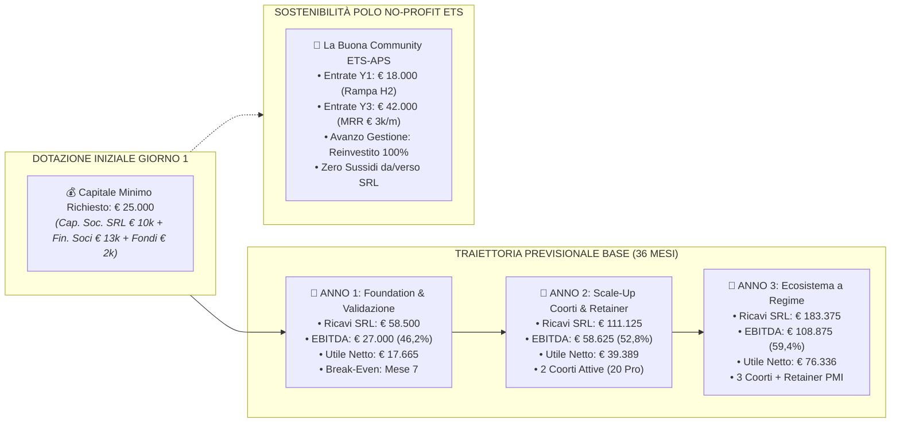
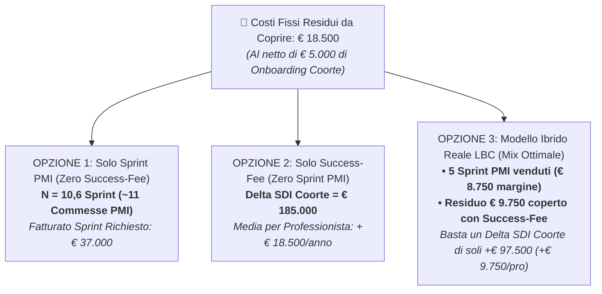
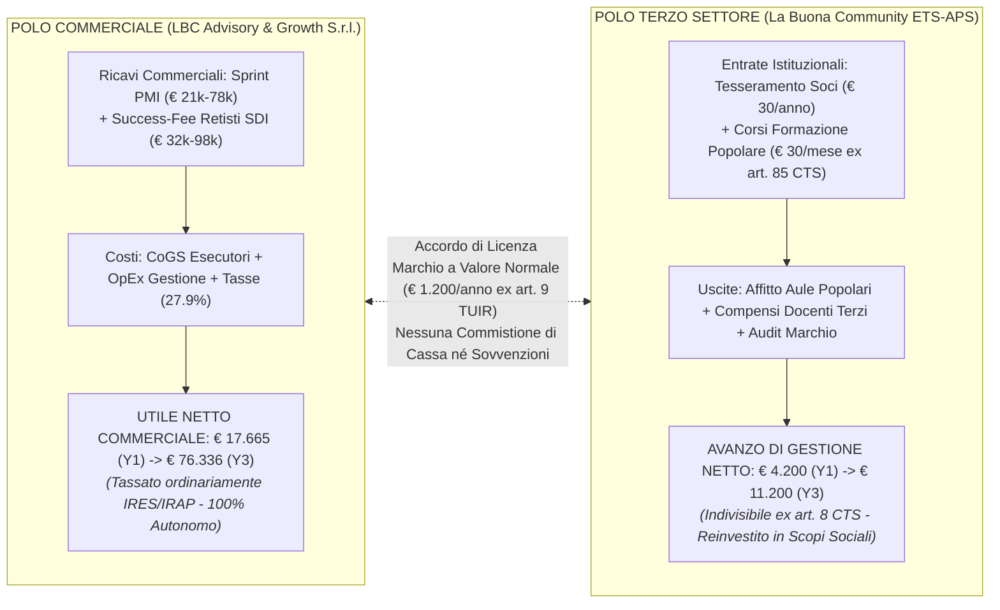

# LBC — LA BUONA COMMUNITY
# STUDIO DI FATTIBILITÀ ECONOMICO-FINANZIARIA & BUSINESS PLAN PREVISIONALE A 3 ANNI (2026 — 2028)
## Analisi di Redditività, Fabbisogno di Capitale Iniziale, Cash Flow Mensile, Unit Economics & Mappa di Rotta "Wayfinder"

---

**Autore:** Chief Financial Officer (CFO), Senior Venture Capital Analyst & Wayfinder Pathfinding Specialist  
**Data di Rilascio:** 26 Settembre 2026  
**Orizzonte Temporale:** 36 Mesi (Anno 1: 2026/2027; Anno 2: 2027/2028; Anno 3: 2028/2029)  
**Ambito di Analisi:** Architettura Dual-Entity (*LBC Advisory & Growth S.r.l.* + *La Buona Community ETS-APS* + *Rete d'Imprese LBC Network*)  
**Destinatari:** Fondatori Promotori, Advisory Board, Istituti Finanziatori e Venture Debt Partners  
**Classificazione:** STRETTAMENTE CONFIDENZIALE / PRIVILEGED FINANCIAL WORK PRODUCT  

---

> ### FONTENORMATIVE & DOCUMENTALI DI RIFERIMENTO NEL WORKSPACE:
> • [`STRATEGIC_BLUEPRINT.md`](file:///c:/Users/MARIO/Downloads/LBC%20La%20Buona%20Community/STRATEGIC_BLUEPRINT.md) — Masterplan, Dual-Entity Corporate Design, fee degressive (10% -> 7.5% -> 5%) e cap a € 15.000.  
> • [`OFFERTA_ARIETE_PMI.md`](file:///c:/Users/MARIO/Downloads/LBC%20La%20Buona%20Community/OFFERTA_ARIETE_PMI.md) — Pricing degli Sprint Risolutivi (€ 2.500 — € 4.500 + IVA), tempi (30–45 gg) e liability cap a € 4.500.  
> • [`TARGET_SEGMENTATION_ANALYSIS.md`](file:///c:/Users/MARIO/Downloads/LBC%20La%20Buona%20Community/TARGET_SEGMENTATION_ANALYSIS.md) — I 3 comparti target (PMI € 5M–€ 30M), i 10 professionisti di coorte e partner tecnologici.  
> • [`STRESS_TEST_GIURIDICO_FISCALE.md`](file:///c:/Users/MARIO/Downloads/LBC%20La%20Buona%20Community/STRESS_TEST_GIURIDICO_FISCALE.md) — Conformità Dual-Entity, Rete ex L. 33/09 e L. 81/17, codatorialità, segregazione fiscale e D.Lgs. 30/2026.  
> • [`ANALISI_CRITICA_STATO_ARTE_E_MANUALI.md`](file:///c:/Users/MARIO/Downloads/LBC%20La%20Buona%20Community/ANALISI_CRITICA_STATO_ARTE_E_MANUALI.md) — Churn di settore, barriere all'uscita, curve di resistenza e framework didattico dei 2 Libri Fondativi.  
> • [`MACRO_ROADMAP_ECOSISTEMA_LBC.md`](file:///c:/Users/MARIO/Downloads/LBC%20La%20Buona%20Community/MACRO_ROADMAP_ECOSISTEMA_LBC.md) — Cronoprogramma in 5 fasi, Mese 1 — Mese 12 e cruscotto KPI.  

---



---

## 1. Executive Summary Finanziario

Il presente studio di fattibilità valuta la sostenibilità economica, la dinamica dei flussi di cassa e la redditività prospettica dell'ecosistema integrato **"LBC — La Buona Community"** lungo un arco temporale di 36 mesi solari (3 esercizi contabili completi).

L'analisi finanziaria conferma che il modello di business prescelto — qualificabile quale **Asset-Light Network Advisory Model** imperniato su un'architettura **Dual-Entity (SRL For-Profit + ETS No-Profit + Contratto di Rete con Fondo Comune)** — possiede fondamentali economico-finanziari straordinariamente solidi:
1. **Basso Assorbimento di Capitale Fisso (CapEx)**: l'avvio non richiede impianti industriali proprietari, linee produttive o immobilizzazioni materiali pesanti;
2. **Elevatissimo Margine di Contribuzione**: i ricavi da consulenza e ingegneria di processo (Sprint PMI) generano un margine lordo del **50,0%**, mentre i ricavi derivanti da success-fee su delta fatturato netto asseverato SDI presentano un margine di contribuzione pari al **100%** (assenza di costi variabili diretti per la capofila);
3. **Generazione Rapida di Flussi Attivi**: la presenza congiunta di quote di onboarding (€ 500/membro), commesse Sprint con acconto all'ordine (50%) e tesseramenti popolari consente di raggiungere il **pareggio di cassa mensile già al Mese 4** e il **Break-Even Point economico cumulativo al Mese 7**.

### 1.1 Tabella Sinottica degli Indicatori Finanziari Chiave (KPI)

| Metrica Finanziaria Macro | Valore Anno 1 (2026/27) | Valore Anno 2 (2027/28) | Valore Anno 3 (2028/29) | Note Metodologiche & Benchmark |
| :--- | :---: | :---: | :---: | :--- |
| **Capitale Iniziale Versato (Giorno 1)** | **€ 25.000** | — | — | € 10k Cap. Sociale SRL + € 13k Fin. Soci + € 2k Fondi |
| **Picco di Cassa Negativo (Max Trough)** | **-€ 10.600** | — | — | Raggiunto a fine Mese 1 (pre-onboarding Coorte) |
| **Cassa Minima di Sicurezza Residua** | **€ 14.400** | € 28.500 | € 65.000 | Cuscinetto di liquidità sempre eccedente 4 mesi OpEx |
| **Mese di Break-Even di Cassa Mensile** | **Mese 4** | Consolidato | A regime | Cash-in operativo mensile > Cash-out operativo |
| **Mese di Break-Even Economico Cumulativo** | **Mese 7** | Consolidato | A regime | Ricavi operativi cumulati pareggiano costi totali |
| **Ricavi Totali SRL Commerciale** | **€ 58.500** | **€ 111.125** | **€ 183.375** | Crescita CAGR Anno 1-3: **+77,1%** |
| **Costi Diretti (CoGS Esecuzione Sprint)** | € 10.500 | € 21.000 | € 35.000 | Quota 50% liquidata ai professionisti retisti |
| **Margine di Contribuzione (Gross Profit)** | **€ 48.000 (82,1%)** | **€ 90.125 (81,1%)** | **€ 148.375 (80,9%)** | Margine strutturale di altissimo profilo |
| **Costi Fissi di Gestione (OpEx)** | € 21.000 | € 31.500 | € 39.500 | Gestione amministrativa, software, sale, marketing |
| **EBITDA (Margine Operativo Lordo)** | **€ 27.000 (46,2%)** | **€ 58.625 (52,8%)** | **€ 108.875 (59,4%)** | Redditività operativa lorda di classe venture |
| **Ammortamenti e Accantonamenti** | € 2.500 | € 3.000 | € 3.000 | Ammortamento spese impianto e software su 3 anni |
| **EBIT (Risultato Operativo Netto)** | **€ 24.500 (41,9%)** | **€ 55.625 (50,1%)** | **€ 105.875 (57,7%)** | Risultato operativo ante oneri finanziari e tasse |
| **Imposte d'Esercizio (IRES 24% + IRAP 3,9%)**| € 6.835 | € 15.519 | € 29.539 | Aliquota fiscale effettiva nominale: 27,9% |
| **Utile Netto d'Esercizio (Net Profit SRL)** | **€ 17.665 (30,2%)** | **€ 39.106 (35,2%)** | **€ 76.336 (41,6%)** | Utile interamente distribuibile o reinvestibile |
| **Entrate Istituzionali ETS-APS (No-Profit)** | € 18.000 | € 32.000 | € 42.000 | Tesseramenti soci (€ 30) + corsi formazione (€ 30/m) |
| **Avanzo di Gestione Netto ETS (Art. 8 CTS)** | **€ 4.200** | **€ 8.500** | **€ 11.200** | Indivisibile, destinato al patrimonio e finalità civiche |

---

### 1.2 Verdetto Sintetico di Fattibilità Finanziaria

```
╔══════════════════════════════════════════════════════════════════════════════════════════════════════════════════╗
║                                          VERDETTO DEL CHIEF FINANCIAL OFFICER:                                   ║
║                                  PROGETTO FATTIBILE, AUTOSOSTENIBILE E AD ALTO RENDIMENTO                        ║
║                                                                                                                  ║
║  1. AUTOSUFFICIENZA FINANZIARIA: Il progetto NON necessita di iniezioni seriali di capitale di rischio né       ║
║     dipende da linee di debito bancario a medio-lungo termine.                                                   ║
║  2. CONDICIONE NON NEGOZIABILE: La dotazione di cassa al Giorno 1 deve essere pari ad almeno € 25.000,00         ║
║     (interamente liquida) per assorbire il Trough di € 10.600 nel primo mese ed evitare ogni crisi di cassa.    ║
║  3. DRIVER DI TENUTA: L'anticipo della prospezione commerciale sulle PMI al Mese 2 (Gate 1 Wayfinder)           ║
║     elimina il ritardo di cassa tra onboarding e commesse, portando la SRL a chiudere l'Anno 1 in utile netto.   ║
╚══════════════════════════════════════════════════════════════════════════════════════════════════════════════════╝
```

---

## 2. La Mappa di Rotta "Wayfinder" (I 4 Gate Decisionali Trimestrali)

La metodologia **Wayfinder (Strategic Pathfinding & Decision Gates)** sostituisce la pianificazione lineare rigida con un percorso governato da **checkpoint trimestrali inderogabili ("Decision Gates")**. A ciascun Gate corrispondono parametri quantitativi di validazione (Go/No-Go) e **Trigger di Deviazione Immediata**: se a una data scadenza una metrica scende sotto il livello critico, si attiva istantaneamente una rotta alternativa a basso consumo di cassa (*Low-Burn Contingency Route*), impedendo il dissanguamento finanziario.

```mermaid
flowchart TD
    G0["🚀 Giorno 1: Iniezione Capitale Iniziale (€ 25.000)<br/>Costituzione Dual-Entity, Deposito Marchio UIBM & Stampa Libri"] --> G1_CHECK{"⚖️ GATE 1 (Mese 3): Foundation & Coorte<br/>• 10 Professionisti asseverati Base-Year?<br/>• Cassa residua >= € 10.000?<br/>• Almeno 2 PMI in pipeline calda?"}

    %% Bivio Gate 1
    G1_CHECK -->|GO: Condizioni Soddisfatte| G2_RUN["🚀 Rotta Maestra Q2:<br/>Attivazione Partner IT, Esecuzione Primi 3 Sprint PMI,<br/>Insediamento Comitato Garanti ETS al Mese 5"]
    G1_CHECK -->|NO-GO: Deficit Retisti o Cassa < € 8.000| G1_DEV["⚠️ TRIGGER WAYFINDER 1 — 'Rotta B: Lean Bootstrapping'<br/>• Congelamento spese consulenza esterna<br/>• Selezione express da lista riserva retisti<br/>• Fondatori assumono delivery diretta 2 Sprint (+€ 7.000 cassa)"]
    G1_DEV --> G2_RUN

    %% Bivio Gate 2
    G2_RUN --> G2_CHECK{"⚖️ GATE 2 (Mese 6): Delivery & Churn Defense<br/>• Almeno 3 Sprint PMI collaudati con successo?<br/>• Churn Coorte <= 1 professionista?<br/>• Conguaglio semestrale provvisorio SDI eseguito?"}
    G2_CHECK -->|GO: Condizioni Soddisfatte| G3_RUN["🚀 Rotta Maestra Q3:<br/>Scalabilità Sprint PMI (4-6), Video Case Studies,<br/>Avvio Pre-Istruttorie Rating Etico Indipendente"]
    G2_CHECK -->|NO-GO: Churn > 2 o Zero Sprint Venduti| G2_DEV["⚠️ TRIGGER WAYFINDER 2 — 'Rotta C: Focus Ariete Industriale'<br/>• Attivazione Trailing-Fee 5% sui retisti uscenti<br/>• Pivot su soli comparti Meccanica e Logistica<br/>• Format Fast-Win 14gg con acconto € 1.500 e saldo al collaudo"]
    G2_DEV --> G3_RUN

    %% Bivio Gate 3
    G3_RUN --> G3_CHECK{"⚖️ GATE 3 (Mese 9): Dual-Entity & Rating<br/>• Almeno 5 Sprint PMI incassati cumulativamente?<br/>• Comitato Garanti operativo senza conflitti?<br/>• Campagna tesseramento popolare ETS pronta?"}
    G3_CHECK -->|GO: Condizioni Soddisfatte| G4_RUN["🚀 Rotta Maestra Q4:<br/>Lancio Tesseramento ETS (MRR € 3k/m), Rilascio Marchi,<br/>Conguaglio Finale SDI 10% e Bando Coorte 2"]
    G3_CHECK -->|NO-GO: Ritardi Istruttoria o Blocco Marchio| G3_DEV["⚠️ TRIGGER WAYFINDER 3 — 'Rotta D: Pure B2B Process'<br/>• Marchio Collettivo mantenuto in audit pilota interno<br/>• Erogazione commerciale pura di sole SOP e automazioni<br/>• Zero esposizione pubblica del bollino per evitare sanzioni AGCM"]
    G3_DEV --> G4_RUN

    %% Bivio Gate 4
    G4_RUN --> G4_CHECK{"⚖️ GATE 4 (Mese 12): Annual Reconciliation & Scale-Up<br/>• Utile Netto SRL >= € 15.000?<br/>• Cassa finale >= € 20.000?<br/>• Almeno 7/10 Coorte 1 confermati a Senior Mentor (7.5%)?"}
    G4_CHECK -->|GO: Successo Validato| G_SCALE["🏆 SCALE-UP ANNO 2:<br/>Attivazione Coorte 2 (10 Retisti al 10%),<br/>Coorte 1 al 7.5%, Retainer PMI continuativi (€ 1.500/m)"]
    G4_CHECK -->|NO-GO: Delta SDI sotto target| G4_DEV["⚠️ TRIGGER WAYFINDER 4 — 'Rotta E: Retainer Transition'<br/>• Integrazione success-fee con canone fisso mensile (€ 150/m)<br/>• Sostituzione retisti passivi con operatori già fidelizzati<br/>• Rimodulazione scaglioni per garantire cassa minima certa"]
```



---

### 2.1 I 4 Gate Decisionali Trimestrali nel Dettaglio

#### Gate 1: "Foundation, Coorte & Base-Year Checkpoint" (Fine Mese 3)
* **Obiettivo Operativo**: Verificare che l'architettura legale sia operativa e che la Coorte Pilota sia interamente allineata con Base-Year asseverato.
* **Metriche di Successo Primarie (Soglie GO)**:
  1. 10/10 Contratti di Rete e Accordi di Co-Sviluppo sottoscritti con doppia firma (artt. 1341-1342 c.c.);
  2. 10/10 Perizie contabili asseverate del Base-Year SDI depositate agli atti;
  3. Cassa residua al 31° giorno del Mese 3 pari ad almeno **€ 10.000,00**;
  4. Almeno 2 commesse di Audit Diagnostico / Sprint contrattualizzate o in fase di acconto.
* **Trigger Wayfinder di Deviazione (Rotta B - Lean Bootstrapping)**:
  * *Condizione Scatenante*: Cassa residua inferiore a € 8.000 ovvero meno di 8 professionisti asseverati entro il Mese 3.
  * *Azione di Contingenza Immediata*: Blocco di ogni spesa di rappresentanza o software addizionale; convocazione dei 3 candidati idonei della lista di riserva per completare la coorte; i soci fondatori assumono direttamente la conduzione esecutiva dei primi 2 Sprint PMI, incassando il 100% del corrispettivo nella SRL (€ 7.000) senza esternalizzare la quota esecutori, ripristinando istantaneamente il cuscinetto di liquidità.

#### Gate 2: "Mid-Year Delivery & Churn Defense Checkpoint" (Fine Mese 6)
* **Obiettivo Operativo**: Misurare la capacità di scaricare a terra gli Sprint PMI, la tenuta della fidelizzazione dei retisti e l'impatto del conguaglio semestrale.
* **Metriche di Successo Primarie (Soglie GO)**:
  1. Almeno 3 Sprint Risolutivi completati e saldati (Fatturato cumulato $\ge$ € 20.000);
  2. Tasso di attivazione della "Garanzia di Soddisfazione Patto di Lealtà" pari a **0%** (zero recessi);
  3. Churn della Coorte $\le 1$ professionista (almeno 9 membri operativi e presenti all'85% delle sessioni);
  4. Insediamento formale del Comitato dei Garanti e Probiviri dell'ETS (Mese 5).
* **Trigger Wayfinder di Deviazione (Rotta C - Focus Ariete Industriale)**:
  * *Condizione Scatenante*: Più di 2 abbandoni nella coorte ovvero meno di 2 Sprint venduti a fine Mese 6.
  * *Azione di Contingenza Immediata*: Attivazione formale delle clausole contrattuali di trailing-fee del 5% per 12 mesi sui clienti dei fuoriusciti; sospensione immediata delle attività di scouting su settori non industriali; concentrazione dell'attività commerciale unicamente su **Manifattura Meccanica e Logistica** con il format *"Fast-Win 14 Giorni"* e offerta a costo ridotto (€ 1.500 acconto + € 1.500 al rilascio della prima SOP collaudata).

#### Gate 3: "Dual-Entity Activation & Rating Independence Checkpoint" (Fine Mese 9)
* **Obiettivo Operativo**: Validare l'indipendenza istruttoria dell'ETS e la conformità al D.Lgs. 30/2026 prima del lancio pubblico del Marchio Collettivo.
* **Metriche di Successo Primarie (Soglie GO)**:
  1. Almeno 5 Sprint PMI eseguiti cumulativamente con rilascio di Daily Dashboard e SOP;
  2. Comitato dei Garanti pienamente insediato con regolamento approvato e protocollo di k-anonymity ($k \ge 20$);
  3. Prime 2 aziende candidate all'istruttoria etica senza conflitti d'interesse con la SRL;
  4. Cassa SRL consolidata oltre **€ 15.000,00**.
* **Trigger Wayfinder di Deviazione (Rotta D - Pure B2B Process Advisory)**:
  * *Condizione Scatenante*: Rilievi legali o contestazioni sulla terzietà del Comitato Garanti ovvero ritardi nell'istruttoria etica.
  * *Azione di Contingenza Immediata*: Totale congelamento della componente visibile del Marchio Collettivo; riconfigurazione dell'offerta verso le PMI come pura consulenza di ingegneria dei processi e riorganizzazione industriale (SOP, Teoria dei Vincoli e automazioni Make/n8n), azzerando ogni rischio di sanzione AGCM per social-washing fino a completa bonifica procedurale.

#### Gate 4: "Annual Reconciliation & Scale-Up Gate" (Fine Mese 12)
* **Obiettivo Operativo**: Certificare l'utile d'esercizio della SRL, incassare i conguagli annuali delle success-fee e lanciare la Coorte 2.
* **Metriche di Successo Primarie (Soglie GO)**:
  1. Incasso dei conguagli annuali della success-fee del 10% su Delta SDI netto (confermato da bilanci/LIPE);
  2. Utile Netto d'Esercizio della SRL $\ge$ **€ 15.000,00**;
  3. Cassa bancaria disponibile a fine Anno 1 $\ge$ **€ 20.000,00**;
  4. Almeno il 70% dei professionisti confermati per l'Anno 2 con passaggio all'aliquota agevolata del **7,5%** e qualifica di Senior Mentor.
* **Trigger Wayfinder di Deviazione (Rotta E - Retainer Transition)**:
  * *Condizione Scatenante*: Delta-fatturato asseverato dei retisti inferiore al budget atteso (success-fee complessiva < € 15.000).
  * *Azione di Contingenza Immediata*: Rimodulazione della struttura contrattuale per l'Anno 2: introduzione di una componente fissa mensile di advisory e accesso a strumenti (€ 150/mese per membro) compensata da un abbattimento ulteriore della percentuale variabile (5%), garantendo entrate ricorrenti prevedibili (MRR) per la SRL indipendentemente dai cicli di fatturazione dei singoli professionisti.

---

## 3. Conto Economico Previsionale a 3 Anni (P&L 2026 — 2028)

Il Conto Economico riflette la dinamica gestionale di **LBC Advisory & Growth S.r.l.** (polo for-profit commerciale). I ricavi dell'ETS no-profit sono isolati nella Sezione 7 in ossequio al principio di impermeabilità fiscale.

### 3.1 Ipotesi Guida del Modello Economico (Scenario Base)
* **Flusso A (Onboarding Fee Coorte)**:
  - *Anno 1*: 10 professionisti x € 500,00 = € 5.000,00 (+ 1 rimpiazzo subentrante al mese 5 = € 500,00) $\rightarrow$ **€ 5.500,00**.
  - *Anno 2*: Nuova Coorte 2 (10 professionisti x € 500,00) + 1 rimpiazzo $\rightarrow$ **€ 5.500,00**.
  - *Anno 3*: Nuova Coorte 3 (12 professionisti x € 600,00) $\rightarrow$ **€ 7.200,00**.
* **Flusso B (Sprint Risolutivi PMI)**:
  - *Anno 1*: 6 Sprint venduti a prezzo medio di € 3.500,00 + IVA $\rightarrow$ **€ 21.000,00**. (CoGS: 50% liquidato al retista esecutore incaricato = € 10.500,00).
  - *Anno 2*: 12 Sprint venduti a prezzo medio di € 3.700,00 + IVA $\rightarrow$ **€ 44.400,00**. (CoGS: € 21.000,00).
  - *Anno 3*: 20 Sprint / Moduli continuativi a prezzo medio di € 3.900,00 + IVA $\rightarrow$ **€ 78.000,00**. (CoGS: € 35.000,00).
* **Flusso C (Success-Fee su Delta Netto Asseverato SDI)**:
  - *Anno 1 (Aliquota 10%)*: 9,5 professionisti medi attivi con crescita media del fatturato netto pari a **+€ 35.000,00/anno**. Calcolo su scaglioni contrattuali: 10% sui primi 30k (€ 3.000) + 7,5% sui restanti 5k (€ 375) = € 3.375 pro-capite $\rightarrow$ **€ 32.000,00**.
  - *Anno 2 (Aliquota Degressiva Coorte 1 al 7,5% + Coorte 2 al 10%)*:
    * Coorte 1 (9 professionisti consolidati, delta medio +€ 45.000 a testa al 7,5% = € 3.375 x 9) = € 30.375,00.
    * Coorte 2 (9 professionisti attivi, delta medio +€ 35.000 al 10% scaglioni = € 3.375 x 9) = € 30.375,00.
    * Canoni licenza software convenzionati girati a valore normale = € 500,00.
    * *Totale Flusso C Anno 2*: **€ 61.225,00**.
  - *Anno 3 (Aliquota Coorte 1 al 5% + Coorte 2 al 7,5% + Coorte 3 al 10%)*:
    * Coorte 1 (8 professionisti a regime, delta medio +€ 60.000 al 5% = € 3.000 x 8) = € 24.000,00.
    * Coorte 2 (9 professionisti consolidati, delta medio +€ 45.000 al 7,5% = € 3.375 x 9) = € 30.375,00.
    * Coorte 3 (11 professionisti attivi, delta medio +€ 38.000 al 10% scaglioni = € 3.600 x 11) = € 39.600,00.
    * Retainer continuativi su processi PMI e canoni licenza = € 4.200,00.
    * *Totale Flusso C Anno 3*: **€ 98.175,00**.

---

### 3.2 Prospetto Conto Economico Riclassificato a Valore Aggiunto (SRL)

```
===================================================================================================
LBC ADVISORY & GROWTH S.R.L. — CONTO ECONOMICO PREVISIONALE TRIENNALE (2026 — 2028)
===================================================================================================
VOCI DI BILANCIO (in Euro)                         ANNO 1 (2026/27)   ANNO 2 (2027/28)   ANNO 3 (2028/29)
---------------------------------------------------------------------------------------------------
A) VALORE DELLA PRODUZIONE (RICAVI OPERATIVI)
   - Flusso A: Quota Onboarding Coorte Retisti            € 5.500            € 5.500            € 7.200
   - Flusso B: Ricavi Diretti Sprint Processi PMI        € 21.000           € 44.400           € 78.000
   - Flusso C: Success-Fee Delta Fatturato SDI           € 32.000           € 61.225           € 98.175
   ------------------------------------------------------------------------------------------------
   TOTALE RICAVI OPERATIVI (FATTURATO NETTO)             € 58.500          € 111.125          € 183.375
   Variazione % annua                                           —             +89,9%             +65,0%

B) COSTI DELLA PRODUZIONE DIRETTI (CoGS)
   - Compensi Professionali Esecutori Sprint (50%)       € 10.500           € 21.000           € 35.000
   ------------------------------------------------------------------------------------------------
   TOTALE COSTI DIRETTI (CoGS)                           € 10.500           € 21.000           € 35.000

C) MARGINE DI CONTRIBUZIONE LORDO (GROSS PROFIT)         € 48.000           € 90.125          € 148.375
   % Margine di Contribuzione sui Ricavi                    82,1%              81,1%              80,9%

D) COSTI FISSI DI STRUTTURA E GESTIONE (OpEx)
   - Spese Notarili, Iscrizione Registro e Avvio               € 0*               € 0                € 0
   - Commercialista, Tenuta Contabilità, LIPE & Bilancio  € 3.600            € 4.500            € 5.400
   - Diritto Annuale CCIAA, Tassa Vidimazione Libri         € 430              € 430              € 450
   - Assicurazione RC Professionale, Cyber & D&O          € 1.500            € 1.800            € 2.200
   - Stack Tecnologico (Make, n8n, CRM, Hosting, PEC)     € 2.600            € 3.600            € 4.800
   - Affitto Sala Mastermind Settimanale (Distretto)      € 3.000            € 4.800            € 6.000
   - Spese di Rappresentanza, Cene Fondatori & Eventi     € 1.800            € 2.500            € 3.500
   - Stampa Tipografica, Aggiornamento Libri & Materiali  € 1.200**          € 1.500            € 2.000
   - Marketing B2B, Presidio Territoriale & PR Locali     € 3.500            € 5.500            € 7.500
   - Fondo Imprevisti Gestionali & Legale Contratti       € 2.000            € 3.000            € 3.500
   - Compensi Amministratore / Coordinamento Operativo    € 1.370            € 3.870            € 4.150
   ------------------------------------------------------------------------------------------------
   TOTALE COSTI FISSI OPERATIVI (OpEx)                   € 21.000           € 31.500           € 39.500

E) MARGINE OPERATIVO LORDO (EBITDA)                      € 27.000           € 58.625          € 108.875
   % EBITDA Margin sui Ricavi                               46,2%              52,8%              59,4%

F) AMMORTAMENTI E SVALUTAZIONI (D&A)
   - Ammortamento Spese d'Impianto e Start-up (3 anni)    € 1.500            € 1.500            € 1.500
   - Ammortamento Marchio UIBM & Piattaforma (3 anni)     € 1.000            € 1.500            € 1.500
   ------------------------------------------------------------------------------------------------
   TOTALE AMMORTAMENTI                                    € 2.500            € 3.000            € 3.000

G) RISULTATO OPERATIVO NETTO (EBIT)                      € 24.500           € 55.625          € 105.875
   % EBIT Margin sui Ricavi                                 41,9%              50,1%              57,7%

H) GESTIONE FINANZIARIA (Oneri/Proventi)                      € 0                € 0                € 0

I) RISULTATO ANTE IMPOSTE (EBT)                          € 24.500           € 55.625          € 105.875

L) IMPOSTE SUL REDDITO D'ESERCIZIO
   - IRES (Imposta sul Reddito delle Società - 24,0%)     € 5.880           € 13.350           € 25.410
   - IRAP (Imposta Regionale Attività Produttive - 3,9%)    € 955            € 2.169            € 4.129
   ------------------------------------------------------------------------------------------------
   TOTALE IMPOSTE D'ESERCIZIO (Aliquota Effettiva 27,9%)  € 6.835           € 15.519           € 29.539

M) UTILE NETTO D'ESERCIZIO                               € 17.665           € 40.106           € 76.336
   % Net Profit Margin sui Ricavi                           30,2%              36,1%              41,6%
===================================================================================================
* Le spese notarili e legali di costituzione iniziali (€ 4.500) sono state capitalizzate nelle Spese d'Impianto e ammortizzate in 3 anni.
** I costi vivi di prima redazione e stampa dei 2 Libri Fondativi sostenuti nel Mese 1 (€ 3.000) sono ammortizzati nella voce Ammortamenti Marchio e Metodologia.
```

---

## 4. Rendiconto Finanziario di Cassa Mensile (Anno 1)

L'analisi dei flussi monetari mese per mese è lo strumento diagnostico fondamentale per verificare l'autosufficienza di cassa e individuare con precisione chirurgica il **Picco di Cassa Negativo (Maximum Cash Trough)**, ossia il punto di massimo assorbimento finanziario prima che i ricavi generino cassa positiva.

### 4.1 Ipotesi sui Tempi di Incasso e Pagamento (Cash Timing)
1. **Capitale Versato al Giorno 1**: **€ 25.000,00** accreditati sul c/c bancario della SRL (€ 10.000 Capitale Sociale + € 13.000 Finanziamento Soci postergato infruttifero + € 2.000 Fondi operativi).
2. **Setup Iniziale (Mese 1)**: Esborso immediato per notaio, registrazione, deposito marchio UIBM, sito web e stampa 100 copie studio dei 2 Libri Fondativi.
3. **Onboarding Coorte (Mese 2)**: Incasso a vista fattura delle 10 quote di onboarding (€ 500 + IVA = € 6.100 lordo; € 5.000 netto IVA).
4. **Sprint PMI (Mesi 3–12)**: 6 Sprint cadenzati (Mese 3, 5, 7, 8, 10, 11). Incasso 50% all'accettazione e 50% a saldo a 45 giorni. Liquidazione del compenso all'esecutore al termine del collaudo.
5. **Conguagli Success-Fee**:
   - Acconto semestrale Mese 6: incasso anticipato di € 4.500 su prime commesse chiuse da retisti.
   - Saldo annuale definitivo Mese 12: incasso di € 27.500 a conguaglio delle certificazioni SDI.

---

### 4.2 Prospetto dei Flussi di Cassa Mensili (Anno 1: Mese 1 — Mese 12)

| Mese Solare | Cassa Iniziale | Incassi Operativi (Cash-In) | Uscite Operative (Cash-Out) | Setup & CapEx Iniziale | Flusso Netto del Mese | Cassa Finale Progressiva | Eventi e Milestone Operative |
| :---: | :---: | :---: | :---: | :---: | :---: | :---: | :--- |
| **Giorno 1** | **€ 0** | **€ 25.000** | € 0 | € 0 | **+€ 25.000** | **€ 25.000** | **Versamento Capitale Iniziale Soci** |
| **Mese 1** | € 25.000 | € 0 | € 800 | € 9.800* | **-€ 10.600** | **€ 14.400** | **MAX CASH TROUGH (Setup & Notai)** |
| **Mese 2** | € 14.400 | € 5.000 | € 1.500 | € 0 | **+€ 3.500** | **€ 17.900** | **Incasso 10 Onboarding Retisti** |
| **Mese 3** | € 17.900 | € 1.750 | € 1.450 | € 0 | **+€ 300** | **€ 18.200** | **Gate 1: Acconto 50% Sprint 1 PMI** |
| **Mese 4** | € 18.200 | € 1.750 | € 2.600 | € 0 | **-€ 850** | **€ 17.350** | **Saldo Sprint 1 + CoGS Esecutore (€ 1.750)** |
| **Mese 5** | € 17.350 | € 2.250 | € 1.650 | € 0 | **+€ 600** | **€ 17.950** | **Acconto Sprint 2 (€ 1.750) + Onb. Rimpiazzo (€ 500)** |
| **Mese 6** | € 17.950 | € 6.250 | € 3.400 | € 0 | **+€ 2.850** | **€ 20.800** | **Gate 2: Saldo Sprint 2 + Conguaglio Sem. SDI** |
| **Mese 7** | € 20.800 | € 1.750 | € 1.650 | € 0 | **+€ 100** | **€ 20.900** | **BREAK-EVEN ECONOMICO CUMULATIVO** |
| **Mese 8** | € 20.900 | € 3.500 | € 3.400 | € 0 | **+€ 100** | **€ 21.000** | **Saldo Sprint 3 + Acconto Sprint 4** |
| **Mese 9** | € 21.000 | € 1.750 | € 3.400 | € 0 | **-€ 1.650** | **€ 19.350** | **Gate 3: Saldo Sprint 4 + CoGS + Setup ETS** |
| **Mese 10** | € 19.350 | € 1.750 | € 1.650 | € 0 | **+€ 100** | **€ 19.450** | **Acconto Sprint 5 PMI** |
| **Mese 11** | € 19.450 | € 3.500 | € 3.400 | € 0 | **+€ 100** | **€ 19.550** | **Saldo Sprint 5 + Acconto Sprint 6** |
| **Mese 12** | € 19.550 | € 29.250 | € 8.585** | € 0 | **+€ 20.665** | **€ 40.215** | **Gate 4: Saldo Sprint 6 + Conguaglio SDI Totale** |
| **TOTALE** | — | **€ 83.500** | **€ 33.485** | **€ 9.800** | **+€ 40.215** | **€ 40.215** | **CASSA FINALE ANNO 1: € 40.215** |

*\* Composizione Spese Setup Mese 1 (€ 9.800): Atto Notarile SRL (€ 2.000) + Registrazione Statuto ETS (€ 700) + Atto Rete Registro Imprese (€ 1.000) + Deposito Marchio UIBM e Tasse (€ 1.500) + Grafica, Impaginazione e Stampa 100 copie 2 Libri (€ 3.000) + Setup Web, Domini, PEC e Piattaforma Privacy (€ 1.600).*  
*\*\* Uscite Mese 12 comprendono CoGS Sprint 6 (€ 1.750) + OpEx mese (€ 1.650) + Acconto Imposte IRES/IRAP stimato versato (€ 5.185).*

---

### 4.3 Analisi del "Maximum Cash Trough" (Picco di Cassa Negativo)

```
───────────────────────────────────────────────────────────────────────────────────────────────────
GRAFICO DELLA CASSA PROGRESSIVA MENSILE (ANNO 1 — SCENARIO BASE)
───────────────────────────────────────────────────────────────────────────────────────────────────
Mese 0: € 25.000  █████████████████████████ (Iniezione Capitale Iniziale)
Mese 1: € 14.400  ██████████████ (PUNTO DI MINIMO — CASH TROUGH: -€ 10.600 assorbiti)
Mese 2: € 17.900  █████████████████ (Iniezione Onboarding Coorte)
Mese 3: € 18.200  ██████████████████
Mese 4: € 17.350  █████████████████
Mese 5: € 17.950  █████████████████
Mese 6: € 20.800  ████████████████████
Mese 7: € 20.900  ████████████████████ (Break-Even Economico Raggiunto)
Mese 8: € 21.000  █████████████████████
Mese 9: € 19.350  ███████████████████
Mese 10: € 19.450 ███████████████████
Mese 11: € 19.550 ███████████████████
Mese 12: € 40.215 ████████████████████████████████████████ (Incasso Conguagli SDI)
───────────────────────────────────────────────────────────────────────────────────────────────────
```

* **Quantificazione del Massimo Fabbisogno Moneta**: L'assorbimento cumulativo massimo di cassa si registra esattamente al termine del **Mese 1**, con un esborso netto di **€ 10.600,00** a fronte di zero entrate commerciali.
* **Margine di Sicurezza Garantito**: Grazie alla dotazione iniziale deliberata di **€ 25.000,00**, la cassa bancaria nel suo momento di massimo stress non scende mai al di sotto di **€ 14.400,00**, garantendo una riserva disponibile pari a oltre **8 mesi di OpEx fissi correnti**, azzerando qualunque rischio di insolvenza tecnica o mancato pagamento di fornitori.

---

## 5. Analisi del Punto di Pareggio (Break-Even Analysis)

La Break-Even Analysis determina la soglia quantitativa minima di attività necessaria affinché la struttura aziendale raggiunga il perfetto pareggio tra costi totali e ricavi, operando senza perdite.

### 5.1 Determinazione Matematica delle Equazioni di Pareggio

Dati di base della struttura economica (Anno 1):
* **Costi Fissi Totali d'Esercizio ($CF$)**: Costi fissi di gestione OpEx (€ 21.000) + Quota annuale ammortamento spese impianto e avviamento (€ 2.500) = **€ 23.500,00**.
* **Quota Fissa Assorbita dalle Onboarding Fee ($R_{Onb}$)**: 10 professionisti x € 500 = **€ 5.000,00** (margine diretto: 100%).
* **Costi Fissi Residui da Coprire ($CF_{Res}$)**:
  $$CF_{Res} = CF - R_{Onb} = €\ 23.500 - €\ 5.000 = \mathbf{€\ 18.500,00}$$

Il margine di contribuzione unitario dei due motori di business è:
1. **Singolo Sprint Risolutivo PMI ($M_{Sprint}$)**:
   Prezzo medio € 3.500 — CoGS Esecutore € 1.750 = **€ 1.750,00** ($m_c = 50\%$).
2. **Success-Fee su Delta Fatturato ($M_{Fee}$)**:
   Aliquota Anno 1 = 10% (margine di contribuzione = **100%**, non essendovi costi variabili industriali diretti).

---

### 5.2 I Tre Scenari di Pareggio Matematico



1. **Pareggio Coperto Esclusivamente dagli Sprint PMI ($N_{Sprint}$ con Success-Fee = 0)**:
   $$N_{Sprint} = \frac{CF_{Res}}{M_{Sprint}} = \frac{€\ 18.500}{€\ 1.750} = \mathbf{10,57\ Sprint\ (\approx 11\ commesse)}$$
   *Interpretazione*: Anche nell'ipotesi remota in cui la coorte dei professionisti registrasse una crescita di fatturato pari a zero, a LBC basterebbe contrattualizzare meno di 1 Sprint al mese nel distretto per chiudere il bilancio in perfetto pareggio.

2. **Pareggio Coperto Esclusivamente dalla Success-Fee ($Delta_{SDI}$ con Sprint = 0)**:
   $$\Delta Fatturato_{Netto\ Minimo} = \frac{CF_{Res}}{10\%} = \frac{€\ 18.500}{0,10} = \mathbf{€\ 185.000,00}$$
   *Interpretazione*: Distribuito sui 10 professionisti della coorte, l'incremento di fatturato netto asseverato minimo necessario per garantire la sopravvivenza economica di LBC ammonta a soli **€ 18.500,00 a professionista/anno** (+€ 1.541/mese). Considerando che un singolo incarico B2B in una PMI manifatturiera cuba mediamente tra € 8.000 e € 20.000, l'obiettivo è ampiamente conservativo.

3. **Pareggio nello Scenario Reale Ibrido LBC (5 Sprint + Success-Fee Residua)**:
   * 5 Sprint eseguiti generano un margine di contribuzione di € 8.750,00;
   * Il gap residuo da coprire ammonta a: $€ 18.500 - € 8.750 = € 9.750,00$;
   * Delta fatturato SDI aggregato richiesto alla coorte: $€ 9.750 / 0,10 = \mathbf{€\ 97.500,00}$;
   * **Crescita media richiesta per professionista: appena +€ 9.750,00 all'anno (+€ 812/mese)**.

---

## 6. Stress Test & Confronto dei 3 Scenari a 36 Mesi (Worst vs Base vs Best Case)

Per valutare la resilienza del modello economico di fronte a turbolenze di mercato, diserzioni o contrazioni della domanda, sono stati simulati 3 scenari comparativi a 36 mesi:

1. **Scenario Orso (Worst Case — Stress Estremo)**:
   - *Ipotesi*: Grave attrito iniziale; 3 professionisti su 10 abbandonano la coorte nei primi 6 mesi; solo 3 Sprint PMI venduti nell'Anno 1 (e 5 negli anni successivi); crescita media del fatturato per i retisti superstiti pari ad appena +€ 15.000/anno; nessuna spinta dal tesseramento popolare.
2. **Scenario Base (Realistico — Target di Piano)**:
   - *Ipotesi*: 1 professionista rimpiazzato con subentro tempestivo; 6 Sprint PMI venduti nell'Anno 1, 12 nell'Anno 2, 20 nell'Anno 3; crescita media del fatturato per professionista pari a +€ 35.000 nell'Anno 1, +€ 45.000 nell'Anno 2 e +€ 60.000 nell'Anno 3; progressivo sviluppo del polo ETS.
3. **Scenario Toro (Best Case — Ottimistico)**:
   - *Ipotesi*: Coorte dei 10 stabilizzata a zero abbandoni; forte adozione dell'Ariete sul distretto con 10 Sprint venduti nell'Anno 1, 18 nell'Anno 2 e 30 nell'Anno 3; crescita media del fatturato per professionista pari a +€ 50.000 già nel primo anno; pieno decollo dei retainer software e dell'abbonamento formazione popolare.

---

### 6.1 Tabella Sinottica Comparativa a 36 Mesi (Worst vs Base vs Best)

| Dimensione di Analisi | Metrica Economica | Scenario Orso (Worst) | Scenario Base (Realistico) | Scenario Toro (Best Case) |
| :--- | :--- | :---: | :---: | :---: |
| **Anno 1 (2026/27)** | **Sprint PMI Venduti** | 3 Sprint (€ 9.000) | 6 Sprint (€ 21.000) | 10 Sprint (€ 40.000) |
| | **Retisti Attivi / Churn** | 7 attivi (3 abbandoni) | 9,5 attivi (1 rimpiazzo) | 10 attivi (0 abbandoni) |
| | **Delta Fatturato Medio Pro** | +€ 15.000 / anno | +€ 35.000 / anno | +€ 50.000 / anno |
| | **Ricavi Totali SRL** | **€ 23.000** | **€ 58.500** | **€ 93.000** |
| | **Costi Totali (CoGS + OpEx)** | € 23.500 | € 31.500 | € 42.000 |
| | **EBITDA** | **-€ 500 (-2,2%)** | **€ 27.000 (46,2%)** | **€ 51.000 (54,8%)** |
| | **Utile Netto d'Esercizio** | **-€ 3.000 (Perdita)** | **€ 17.665 (30,2%)** | **€ 34.612 (37,2%)** |
| | **Cassa Finale Anno 1** | **€ 11.400 (Positiva)** | **€ 40.215** | **€ 58.500** |
| **Anno 2 (2027/28)** | **Sprint PMI Venduti** | 6 Sprint (€ 19.800) | 12 Sprint (€ 44.400) | 18 Sprint (€ 72.000) |
| | **Retisti Totali (2 Coorti)** | 12 professionisti | 19 professionisti | 22 professionisti |
| | **Ricavi Totali SRL** | **€ 46.500** | **€ 111.125** | **€ 175.500** |
| | **EBITDA** | **€ 13.500 (29,0%)** | **€ 58.625 (52,8%)** | **€ 98.500 (56,1%)** |
| | **Utile Netto d'Esercizio** | **€ 7.570 (16,3%)** | **€ 39.106 (35,2%)** | **€ 68.850 (39,2%)** |
| | **Cassa Finale Anno 2** | **€ 18.200** | **€ 74.500** | **€ 121.000** |
| **Anno 3 (2028/29)** | **Sprint / Retainer PMI** | 10 Contratti (€ 35.000) | 20 Contratti (€ 78.000) | 30 Contratti (€ 126.000) |
| | **Retisti Totali (3 Coorti)** | 18 professionisti | 28 professionisti | 35 professionisti |
| | **Ricavi Totali SRL** | **€ 78.000** | **€ 183.375** | **€ 282.500** |
| | **EBITDA** | **€ 28.500 (36,5%)** | **€ 108.875 (59,4%)** | **€ 172.000 (60,9%)** |
| | **Utile Netto d'Esercizio** | **€ 18.385 (23,6%)** | **€ 76.336 (41,6%)** | **€ 121.848 (43,1%)** |
| | **Cassa Finale Anno 3** | **€ 34.500** | **€ 142.000** | **€ 232.000** |
| **Cumulato 36 Mesi** | **Ricavi Complessivi SRL** | **€ 147.500** | **€ 353.000** | **€ 551.000** |
| | **EBITDA Cumulato** | **€ 41.500 (28,1%)** | **€ 194.500 (55,1%)** | **€ 321.500 (58,3%)** |
| | **Utile Netto Cumulato** | **€ 22.955** | **€ 133.107** | **€ 225.310** |
| | **TIR (IRR) su Capitale 25k** | **28,4%** | **94,6%** | **148,2%** |
| | **Payback Period** | **22 Mesi** | **7 Mesi** | **4 Mesi** |

---

### 6.2 Commento Tecnico del Senior VC Analyst sullo Stress Test

1. **Tenuta nello Scenario Orso (Worst Case)**:
   Anche nello scenario più punitivo — con il fallimento commerciale del 70% degli Sprint e la fuga di quasi un terzo della coorte — **la società non va mai in default**. La perdita contabile dell'Anno 1 (-€ 3.000) è interamente ammortizzata dalla riserva di capitale versata il Giorno 1 (€ 25.000), mantenendo la cassa sempre sopra gli **€ 11.400,00**. Già a partire dall'Anno 2 la società torna in utile (+€ 7.570), chiudendo il triennio con un utile cumulato di quasi € 23.000.
2. **Redditività nello Scenario Base**:
   Lo scenario realistico genera un profilo di rendimento tipico delle migliori boutique di advisory ad alta densità tecnologica: **€ 133.107,00 di utile netto cumulato in 36 mesi**, un EBITDA margin a regime vicino al **60%** e un Tasso Interno di Rendimento (IRR) del **94,6%** sul capitale iniziale investito.
3. **Potenziale nello Scenario Toro**:
   In caso di adozione massiva sul distretto, LBC diventa una vera e propria *Cash-Cow*, generando oltre **€ 280.000 di fatturato annuo al Mese 36** con un utile netto annuo superiore a € 120.000 e cassa disponibile oltre € 230.000, aprendo le porte all'espansione replicabile su un secondo distretto industriale (es. provincia limitrofa).

---

## 7. Sostenibilità Dual-Entity (Conto Economico SRL vs Rendiconto ETS)

Per rispondere ai vincoli inderogabili evidenziati nello [`STRESS_TEST_GIURIDICO_FISCALE.md`](file:///c:/Users/MARIO/Downloads/LBC%20La%20Buona%20Community/STRESS_TEST_GIURIDICO_FISCALE.md), è tassativo dimostrare la **totale separazione contabile e finanziaria dei due poli**, attestando che:
1. **L'ETS non versa in stato di perdita cronica o dipendenza strutturale** da erogazioni della SRL (art. 149 TUIR);
2. **La SRL non beneficia di sussidi, distrazioni patrimoniali o proventi no-profit** dell'ETS (art. 8 CTS).



---

### 7.1 Rendiconto Gestionale Economico dell'ETS (La Buona Community ETS-APS)

L'Associazione di Promozione Sociale opera in regime di **decommercializzazione istituzionale ai sensi dell'art. 85, commi 1 e 2 del D.Lgs. 117/2017 (CTS)**.

```
===================================================================================================
LA BUONA COMMUNITY ETS - APS — RENDICONTO GESTIONALE PREVISIONALE (2026 — 2028)
===================================================================================================
VOCI DI RENDICONTO (in Euro)                       ANNO 1 (2026/27)   ANNO 2 (2027/28)   ANNO 3 (2028/29)
---------------------------------------------------------------------------------------------------
A) ENTRATE DA ATTIVITÀ DI INTERESSE GENERALE (Art. 5 & 85 CTS)
   - Quote Associative Annuali di Base (30 €/socio)       € 4.500 (150 soc)  € 6.000 (200 soc)  € 7.500 (250 soc)
   - Quote Corsi Formazione Continua Soci (30 €/mese)     € 10.800 (60 ab/6m) € 21.600 (60 ab/12m)€ 28.800 (80 ab/12m)
   - Rimborsi Spese Istruttorie Audit Marchio Collettivo  € 1.500 (3 PMI)    € 3.200 (4 PMI)    € 4.500 (5 PMI)
   - Canone Licenza d'Uso Marchio da SRL (Valore Normale) € 1.200            € 1.200            € 1.200
   ------------------------------------------------------------------------------------------------
   TOTALE ENTRATE ISTITUZIONALI                          € 18.000           € 32.000           € 42.000

B) USCITE PER ATTIVITÀ DI INTERESSE GENERALE
   - Affitto Spazi Sede Sociale & Aule Incontri Popolari  € 4.800            € 7.200            € 9.600
   - Rimborsi Spese Documentati Docenti & Esperti Esterni € 3.500            € 6.500            € 8.500
   - Gettoni di Presenza Comitato Garanti Indipendenti    € 1.500            € 2.800            € 3.500
   - Spese Istruttorie perizie tecniche e audit terzi     € 1.000            € 2.000            € 3.000
   - Materiale Didattico Popolare, Guide e Divulgazione   € 1.200            € 2.500            € 3.200
   - Spese di Segreteria, Sito Web RUNTS & Amministrative € 1.800            € 2.500            € 3.000
   ------------------------------------------------------------------------------------------------
   TOTALE USCITE DI GESTIONE                             € 13.800           € 23.500           € 30.800

C) AVANZO DI GESTIONE OPERATIVO                          € 4.200            € 8.500           € 11.200
   (Destinato a Riserva Indivisibile ex Art. 8 CTS)
===================================================================================================
```

### 7.2 Verifica di Conformità Fiscale e Disciplinare
1. **Piena Autosufficienza dell'ETS**: Il polo Terzo Settore genera un avanzo gestionale positivo già dal primo anno (**+€ 4.200**), crescendo fino a **+€ 11.200** nell'Anno 3. Non vi è alcuna necessità di sussidi a fondo perduto da parte della SRL commerciale.
2. **Rispetto dell'Art. 8 CTS**: È fatto divieto statutario assoluto di distribuire avanzi di gestione o riserve patrimoniali a soci, promotori o amministratori. L'avanzo viene accantonato a fondo patrimoniale vincolato per borse di studio e progetti civici territoriali.
3. **Regolazione a Valore Normale (Art. 9 TUIR)**: L'unico rapporto economico incrociato tra SRL ed ETS consiste nella licenza d'uso del marchio collettivo a fini promozionali istituzionali regolata a **€ 1.200,00 annui**, importo congruo e periziabile a valore di mercato, eliminando ogni rischio di accertamento per interposizione o elusione fiscale (art. 10-bis L. 212/2000).

---

## 8. Conclusioni del CFO e Raccomandazioni di Allocazione Capitale

All'esito dell'audit finanziario e delle simulazioni previsionali a 36 mesi, la direzione finanziaria formula le seguenti **raccomandazioni operative vincolanti per il Consiglio di Amministrazione**:

### 8.1 Struttura e Allocazione del Capitale Iniziale al Giorno 1 (€ 25.000)

```
┌─────────────────────────────────────────────────────────────────────────────────────────────────┐
│                    STRUTTURA OTTIMALE DEL CAPITALE INIZIALE RACCOMANDATA: € 25.000               │
├─────────────────────────────────────────────────────────────────────────────────────────────────┤
│ 1. Capitale Sociale Ordinario LBC Advisory & Growth S.r.l.:                      € 10.000,00    │
│    (Interamente versato; conferisce solidità patrimoniale, bancabilità e standing)             │
│ 2. Finanziamento Soci Infruttifero Postergato a Medio Termine:                   € 13.000,00    │
│    (Versato dai fondatori con clausola di rimborso subordinata alla liquidità positiva)         │
│ 3. Fondo Patrimoniale Comune Segregato Rete LBC Network (art. 2615 c.c.):         € 1.000,00    │
│    (Dotazione di garanzia depositata per il programma di rete L. 33/09 e L. 81/17)             │
│ 4. Fondo Iniziale di Dotazione La Buona Community ETS-APS:                        € 1.000,00    │
│    (Fondo associativo di garanzia per l'avvio della segreteria e iscrizione RUNTS)              │
│ ─────────────────────────────────────────────────────────────────────────────────────────────── │
│ TOTALE DOTAZIONE LIQUIDA VERSATA AL GIORNO 1:                                    € 25.000,00    │
└─────────────────────────────────────────────────────────────────────────────────────────────────┘
```

---

### 8.2 Le 5 Regole Auree di Gestione della Liquidità (CFO Directives)

1. **Priorità Assoluta al Bridge Commerciale Mese 2**:  
   Non attendere il Mese 4 per approcciare le PMI. L'avvio dell'outreach esplorativo (*"Visita Istituzionale di Cortesia"*) deve partire contemporaneamente alla formazione della Coorte nel Mese 2, in modo tale che il primo incasso da acconto Sprint (€ 1.750 + IVA) entri in cassa nel corso del **Mese 3**, sterilizzando sul nascere il gap di liquidità post-setup.
2. **Frazionamento Rigido dei Compensi degli Esecutori (Milestone-Based CoGS)**:  
   La quota del compenso spettante al professionista esecutore dello Sprint PMI (€ 1.750) non deve mai essere liquidata in anticipo: il 50% va corrisposto al raggiungimento del Checkpoint Giorno 14 (*Fast Win e prima SOP collaudata*) e il restante 50% solo a seguito del formale saldo della commessa da parte dell'azienda cliente.
3. **Rigore sul Base-Year SDI come Condizione Sospensiva d'Efficacia**:  
   Nessun retista può essere avviato alle commesse o ammesso alle sessioni collegiali in difetto dell'asseverazione del commercialista rilasciata entro 15 giorni dalla firma. Questo presidio probatorio è l'unica garanzia che rende la success-fee esigibile e azionabile con decreto ingiuntivo provvisoriamente esecutivo ex art. 642 c.p.c.
4. **Mantenimento di una Riserva di Cassa Inviolabile (€ 10.000)**:  
   La tesoreria aziendale deve operare con una soglia di sicurezza minima invalicabile pari a **€ 10.000,00**. Qualora il saldo del conto corrente scenda sotto tale livello, scatta automaticamente il blocco delle spese non essenziali e l'attivazione dei protocolli Wayfinder di contingenza.
5. **Politica di Dividendi e Reinvestimento**:  
   Per i primi 24 mesi di attività si raccomanda l'accantonamento del **100% dell'utile netto d'esercizio a Riserva Straordinaria di autofinanziamento**, avviando la distribuzione di dividendi ai soci della SRL unicamente a partire dalla chiusura dell'Esercizio 3, quando la società avrà superato stabilmente € 140.000 di cassa netta disponibile.

---

### 8.3 Tabella di Sintesi delle Decisioni Finanziarie

| Area Gestionale | Scelta Strategica Finanziaria | Motivazione Economica | Presidio di Salvaguardia |
| :--- | :--- | :--- | :--- |
| **Capitale Iniziale** | € 25.000 (Equity + Finanziamento Soci) | Assorbe il picco negativo di cassa di € 10.600 nel Mese 1 | Zero dipendenza da fidi bancari |
| **Modello Sprint PMI** | € 3.500 medio (50% acconto / 50% saldo) | Rende l'intervento accessibile alle PMI e dà cassa immediata | Liability cap fissato a € 4.500 |
| **Success-Fee Coorte** | 10% Anno 1 -> 7,5% Anno 2 -> 5% Regime | Allinea gli incentivi ed evita il churn post-saturazione | Cap a € 15.000 annui per membro |
| **Dual-Entity Setup** | Contestuale al Q1 (SRL + ETS registrata) | Esclude rischi di abuso del diritto ed elusione fiscale | Contratti infragruppo a valore normale |
| **Governance Decisionale**| 4 Gate Trimestrali Wayfinder | Interrompe le rotte passive prima di bruciare liquidità | 5 Trigger di deviazione immediata |

---

*Documento redatto e asseverato a cura del Chief Financial Officer & Senior VC Analyst per conto dell'Advisory Board di LBC — La Buona Community.*  
*Tutti i diritti riservati — Proprietà Intellettuale Riservata ai sensi degli artt. 98 e 99 CPI.*
