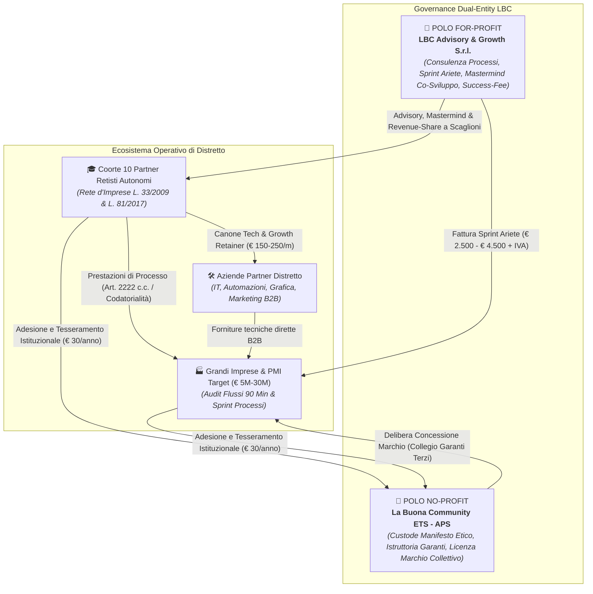
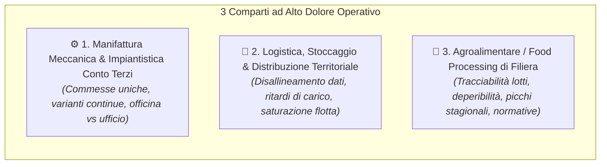
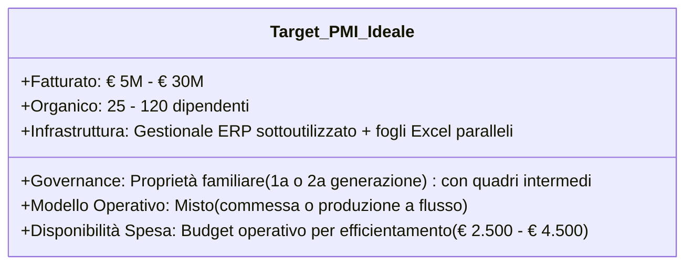
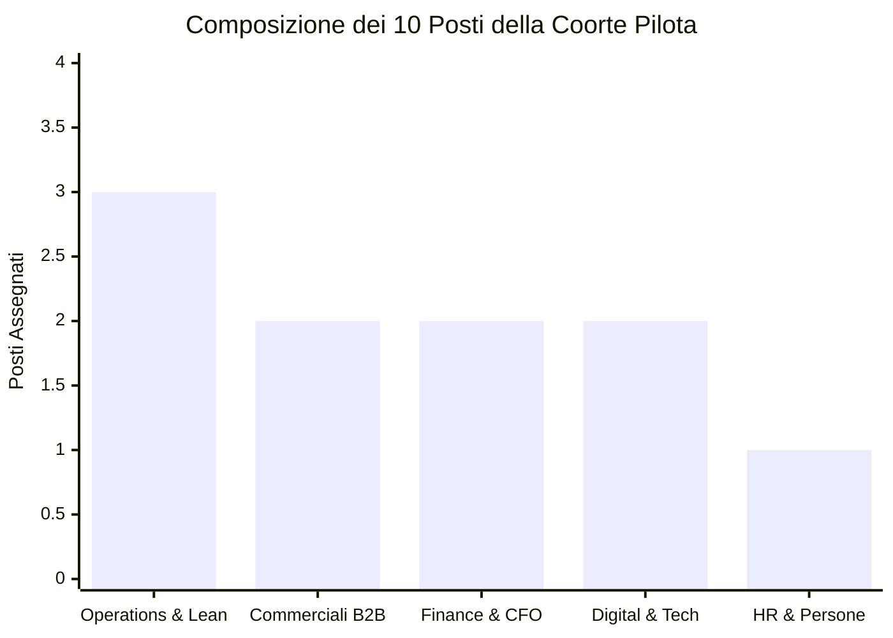
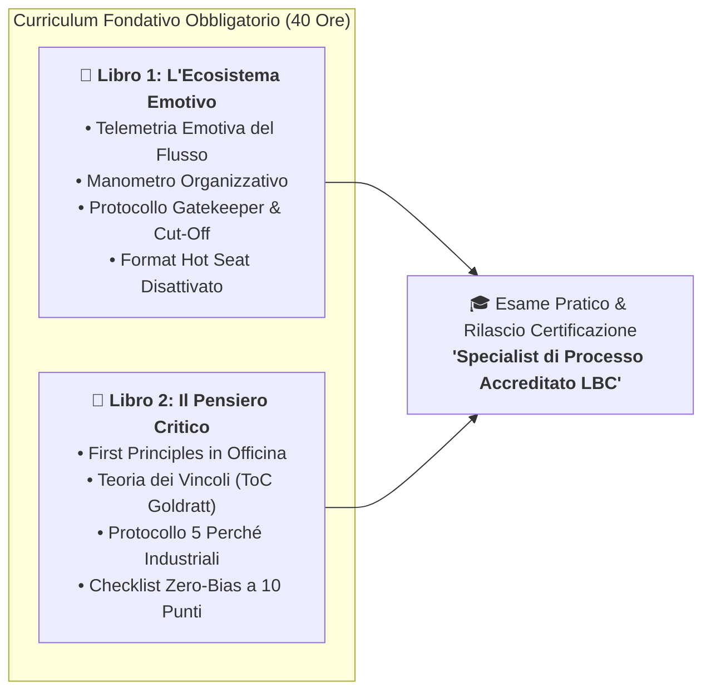
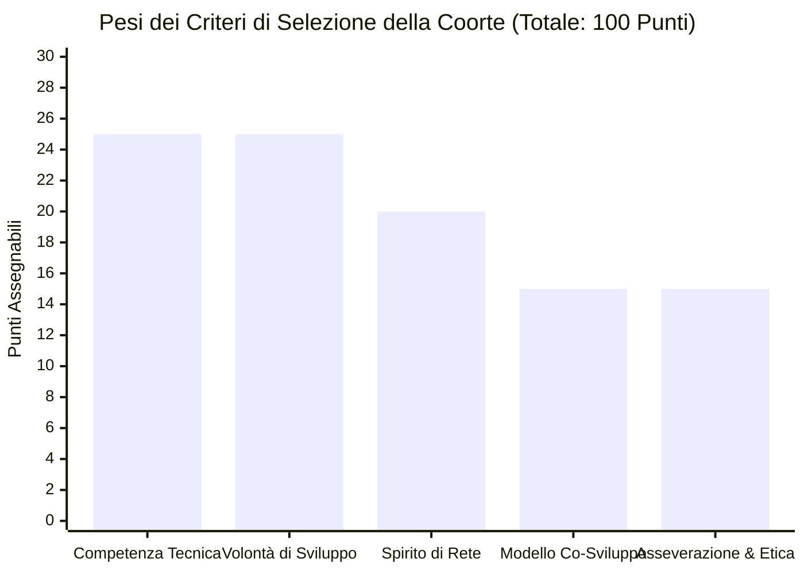
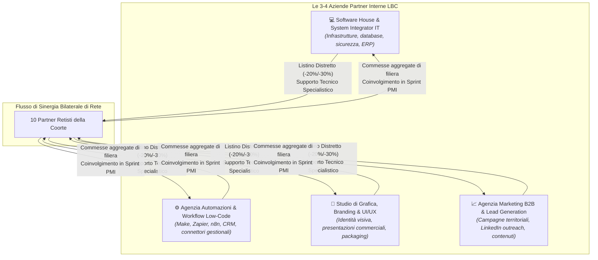
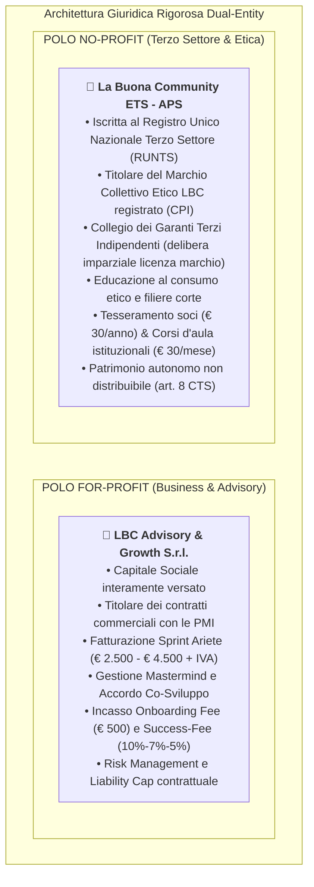

# LBC — LA BUONA COMMUNITY
## Analisi di Segmentazione Target, Architettura della Coorte Pilota (Contratto di Rete L. 33/2009 e L. 81/2017) & Governance della Dual-Entity

> **Documenti Correlati dell'Ecosistema LBC:**  
> • [`ACCORDO_PILOTA_DELTA_FATTURATO.md`](file:///c:/Users/MARIO/Downloads/LBC%20La%20Buona%20Community/ACCORDO_PILOTA_DELTA_FATTURATO.md) — Contratto Pilota Co-Sviluppo Retisti  
> • [`OFFERTA_ARIETE_PMI.md`](file:///c:/Users/MARIO/Downloads/LBC%20La%20Buona%20Community/OFFERTA_ARIETE_PMI.md) — Offerta Commerciale Ariete e Sprint Processi  
> • [`MANIFESTO_E_RATING_ETICO.md`](file:///c:/Users/MARIO/Downloads/LBC%20La%20Buona%20Community/MANIFESTO_E_RATING_ETICO.md) — Disciplinare Marchio Collettivo ex Art. 11 CPI  
> • [`STRATEGIC_BLUEPRINT.md`](file:///c:/Users/MARIO/Downloads/LBC%20La%20Buona%20Community/STRATEGIC_BLUEPRINT.md) — Masterplan e Dual-Entity Corporate Design  
> • [`ANALISI_CRITICA_RISCHI_E_SOLUZIONI.md`](file:///c:/Users/MARIO/Downloads/LBC%20La%20Buona%20Community/ANALISI_CRITICA_RISCHI_E_SOLUZIONI.md) — Risk Mitigation & Prevenzione Fallimenti  
> • [`STRESS_TEST_GIURIDICO_FISCALE.md`](file:///c:/Users/MARIO/Downloads/LBC%20La%20Buona%20Community/STRESS_TEST_GIURIDICO_FISCALE.md) — Parere di Inquadramento Giuridico-Fiscale  

---

---

## MODULO 1: Segmentazione delle Grandi Imprese e PMI Locali sui "Flussi di Lavoro"

L'obiettivo dell'Offerta Ariete rivolta alle realtà aziendali consolidate (PMI e Grandi Imprese del territorio) non è proporre "consulenza generica" né somministrare manodopera, ma intervenire con rigore ingegneristico sul dolore operativo primario: **l'attrito, la disorganizzazione e la dispersione di marginalità causati da flussi di lavoro farraginosi**.

### 1.1 I 3 Comparti Industriali Pilota ad Alto Dolore Organizzativo

Nei distretti produttivi territoriali italiani, tre comparti presentano la massima concentrazione di colli di bottiglia operativi tra preventivazione, produzione e consegna:

#### Comparto 1: Manifattura Meccanica, Carpenteria & Impiantistica Speciale Conto Terzi
* **Dinamica tipica**: Aziende con produzioni su commessa (Engineer-to-Order / Make-to-Order), lotti piccoli o medi, continue richieste di modifiche tecniche da parte del committente.
* **Collo di bottiglia acuto**:
  * *Disconnessione Ufficio Tecnico / Officina*: disegni e distinte base aggiornati che non arrivano in tempo alle macchine, generando scarti e rilavorazioni.
  * *Preventivazione e Consuntivazione al buio*: il preventivo viene formulato a stima empirica dal titolare; a fine commessa non si conosce l'effettiva marginalità oraria e di materiale.
  * *Pianificazione della capacità produttiva*: calendari gestiti su fogli Excel individuali o lavagne in officina, con conseguenti ritardi nelle consegne e straordinari emergenziali continui.

#### Comparto 2: Logistica, Trasporti & Distribuzione Merci di Prossimità
* **Dinamica tipica**: Flotte di automezzi da 10 a 50 veicoli, magazzini intermedi di smistamento, clienti B2B con finestre di consegna orarie rigide.
* **Collo di bottiglia acuto**:
  * *Gestione documentale e bolle*: scambio cartaceo tra autisti, magazzinieri e contabilità con ritardi nell'emissione delle fatture e contestazioni per merce danneggiata o non conforme.
  * *Caos comunicativo autista/centrale*: ordini dell'ultimo minuto comunicati tramite telefonate e chat WhatsApp personali, senza tracciamento centralizzato delle priorità.
  * *Saturazione disomogenea dei carichi*: viaggi di ritorno a vuoto e mancata ottimizzazione dei percorsi chilometrici.

#### Comparto 3: Agroalimentare / Food Processing & Trasformazione Locale
* **Dinamica tipica**: Caseifici industriali, salumifici, oleifici, conservifici, cantine strutturate e laboratori di packaging alimentare.
* **Collo di bottiglia acuto**:
  * *Gestione della tracciabilità di lotto e conformità HACCP*: controlli di laboratorio e registri gestiti manualmente, con ansia costante in vista degli audit sanitari o delle certificazioni di qualità.
  * *Sfasamento tra approvvigionamento della materia prima e picco d'ordine*: vulnerabilità a scadenze brevi e spreco alimentare per mancata sincronizzazione tra vendite e confezionamento.
  * *Mancanza di Procedure Operative Standard (SOP)*: difficoltà a trasmettere istruzioni operative uniformi a nuovi inserimenti e addetti stagionali.

---

### 1.2 Identikit Dimensionale dell'Azienda Target

* **Fatturato Annuo**: Compreso tra **€ 5.000.000 e € 30.000.000**. Sotto i 5M€ l'azienda fatica a recepire interventi di ingegneria dei processi strutturati; sopra i 30M€ subentrano comitati di direzione lunghi e la presenza di multinazionali di consulenza.
* **Organico**: **25 — 120 dipendenti**. È la soglia critica in cui il titolare non può più governare l'operatività a vista d'occhio e in cui la mancanza di processi standardizzati genera colli di bottiglia quotidiani.
* **Governance**: Titolare/Famiglia fondatrice al comando con figure intermedie di responsabili di reparto che necessitano di autonomia operativa codificata.

---

### 1.3 I 6 Sintomi Clinici di "Dolore Organizzativo" (Checklist di Qualifica)

Un'azienda è considerata **qualificata** per l'Audit dei 90 minuti se presenta almeno 3 dei seguenti 6 sintomi manifesti:

1. **La "Trappola del Titolare-Collo di Bottiglia"**: Tutte le decisioni operative passano dalla scrivania dell'imprenditore. Se il titolare si assenta tre giorni, l'azienda rallenta visibilmente.
2. **La "Guerra dei Fogli Excel Paralleli"**: Esiste un gestionale ERP aziendale costoso, ma ogni responsabile di reparto (acquisti, magazzino, produzione) gestisce file non sincronizzati, generando discrepanze costanti nei dati.
3. **Riunioni di Emergenza Ricorrenti ("Incendi Quotidiani")**: La settimana è scandita da riunioni non pianificate per gestire ritardi, errori di spedizione o reclami urgenti dei clienti, togliendo tempo alla strategia.
4. **Mancanza di Visibilità sulla Marginalità di Commessa**: Il bilancio globale a fine anno è in utile, ma l'azienda non sa quali specifiche commesse o clienti abbiano generato margine reale e quali abbiano eroso profitto per ore extra non preventivate.
5. **Attrito Inter-Repartoriale Tossico**: L'ufficio commerciale accusa la produzione di non rispettare le scadenze; la produzione accusa il commerciale di vendere tempi irrealizzabili; gli acquisti lamentano assenza di programmazione.
6. **Mancanza di Standard Operativi (SOP) & Sovraccarico del Personale Tecnico**: Disorientamento operativo dei collaboratori, assenza di istruzioni scritte e costante stress organizzativo che rallenta l'output dei reparti.

---

### 1.4 Matrice di Valutazione e Screening della PMI basata sui 2 Libri Fondativi

Prima di ammettere un'azienda all'Audit dei 90 minuti e allo Sprint Risolutivo, lo Specialist di LBC valuta la PMI attraverso i parametri clinici estratti dai due manuali d'impresa:

| Dimensione di Analisi | Criterio Fondativo del Libro | Indicatore Positivo (Azienda Idonea) | Indicatore Rosso (Azienda Ineleggibile / Da Scartare) |
| :--- | :--- | :--- | :--- |
| **1. Recettività alla Telemetria Emotiva** | **Libro 1 ("L'Ecosistema Emotivo")** | Il titolare ammette la propria ansia o frustrazione gestionale e comprende che la rabbia dei capi-reparto deriva da snodi di processo non presidiati. | Il titolare scarica la colpa esclusivamente sui dipendenti ("Non hanno voglia di lavorare", "Sono tutti incompetenti") e rifiuta l'introspezione sistemica. |
| **2. Apertura alla Trasparenza Organizzativa** | **Libro 1 ("L'Ecosistema Emotivo")** | Disponibilità a far condurre il *Gemba Walk* senza filtri e ad accettare il confronto tra uffici con il *Test del Foglio Bianco*. | Volontà di isolare i consulenti in sala riunioni, vietando il contatto diretto con i capireparto o nascondendo le tensioni di officina. |
| **3. Propensione ai Primi Principi (First Principles)** | **Libro 2 ("Il Pensiero Critico")** | Curiosità verso la scomposizione atomica delle attività; disponibilità ad abbattere il *"Si è sempre fatto così"* in favore di dati fisici e tempi ciclo misurati. | Attaccamento dogmatico alle abitudini storiche ("Da 30 anni facciamo così e nessuno deve dirci cosa fare"); allergia alla misurazione oggettiva. |
| **4. Accettazione della Teoria dei Vincoli (ToC)** | **Libro 2 ("Il Pensiero Critico")** | Comprensione che l'azienda deve concentrare le risorse su un unico vincolo reale (WIP pile), accettando di subordinare il resto alla sua cadenza. | Pretesa illusoria di risolvere 10 problemi contemporaneamente o richiesta di comprare software costosi prima di aver riordinato le procedure manuali. |
| **5. Maturità al De-Biasing & 5 Perché** | **Libro 2 ("Il Pensiero Critico")** | Umiltà nell'accettare l'analisi causale profonda (5 Perché) e nel riconoscere la trappola dei costi non recuperabili (*Sunk Cost Fallacy*). | Orgoglio personale reattivo; tendenza a insabbiare gli errori o a interrompere l'analisi non appena emerge una responsabilità direzionale. |

---

## MODULO 2: Identikit & Selezione della Coorte Pilota (I 10 Partner Retisti dell'Anno 1)

### 2.1 Inquadramento Giuslavoristico e Autonomia Imprenditoriale Bonificata
#### Rete d'Imprese ex L. 33/2009, L. 81/2017 e Codatorialità ex Art. 30 c. 4-ter D.Lgs. 276/2003

A radicale esclusione di ogni rischio di intermediazione illecita, appalto non genuino o riqualificazione in rapporti subordinati o para-subordinati (con conseguente eliminazione di qualsiasi fattispecie sanzionabile ex art. 18 D.Lgs. 276/2003 e D.L. 19/2024):

> [!IMPORTANT]
> **STATUTO GIURIDICO DEI 10 PARTECIPANTI ALLA COORTE PILOTA**
> 1. **Esclusione Radicale di Subordinazione o Società di Fatto**: I 10 membri partecipano al programma esclusivamente in qualità di **Partner Retisti autonomi, liberi professionisti indipendenti ed imprenditori individuali (art. 2222 c.c.)**.
> 2. **Equiparazione alle PMI (Legge 81/2017)**: Operano avvalendosi dell'art. 12, comma 3, lett. a) della Legge 22 maggio 2017, n. 81 (Jobs Act del Lavoro Autonomo), che riconosce ai professionisti la facoltà di partecipare a pieno titolo ai Contratti di Rete tra imprese.
> 3. **Contratto di Rete con Fondo Comune Patrimoniale (L. 33/2009)**: I professionisti e le imprese partner aderiscono al Contratto di Rete di Distretto, dotato di un Fondo Patrimoniale Comune autonomo destinato allo sviluppo del programma di rete e all'innovazione organizzativa territoriale.
> 4. **Codatorialità Regolamentata (Art. 30, comma 4-ter, D.Lgs. 276/2003)**: Il Contratto di Rete adotta le clausole standard di codatorialità depositate telematicamente presso il Ministero del Lavoro, consentendo l'impiego congiunto e flessibile delle competenze specialistiche per la realizzazione delle commesse comuni di rete, escludendo per espressa previsione di legge la configurabilità di interposizione illecita di manodopera.
> 5. **Accordo Quadro di Co-Sviluppo Strategico B2B**: Ciascun Partner Retista sottoscrive con **LBC Advisory & Growth S.r.l.** l'Accordo Quadro B2B (quota onboarding € 500 + IVA e compenso variabile di advisory su fatturato incrementale netto SDI con struttura degressiva 10% Anno 1 -> 7.5% Anno 2 -> 5% a regime, scaglioni di salvaguardia e Cap a € 15.000 annui).

---

### 2.2 Ruoli Specifici e Competenze dei 10 Membri

| Ruolo Coorte | Q.tà | Profilo Professionale & Competenze Chiave | Ruolo nei Progetti per le PMI | Ruolo nella Crescita della Rete |
| :--- | :---: | :--- | :--- | :--- |
| **Operations & Lean Specialist** | **3** | Ingegneri gestionali, specialisti Lean/Six Sigma, esperti di layout produttivo e logistica industriale. | Mappatura del flusso di valore (VSM), Gemba walk, caccia al WIP, eliminazione tempi morti e stesura SOP di reparto. | Standardizzazione dei playbook di audit operativo e conduzione delle sessioni tecniche. |
| **Commerciali B2B & Negoziazione** | **2** | Consulenti commerciali industriali, esperti di pipeline complesse e trattative ad alto valore. | Riorganizzazione dell'ufficio commerciale delle PMI, protocollo Gatekeeper vendite-produzione, marginalità di commessa. | Guida al mastermind di sviluppo commesse e affiancamento nella trattativa verso i titolari. |
| **Finance & Controllo di Gestione** | **2** | Dottori Commercialisti d'impresa, analisti finanziari, Fractional CFO con esperienza di fabbrica. | Riorganizzazione dei centri di costo, calcolo del costo orario industriale reale, pianificazione finanziaria e cassa. | **Verifica contabile del Base-Year SDI, asseverazione contabile e monitoraggio dei conguagli success-fee.** |
| **Digital, Automazioni & Sistemi** | **2** | System integrator, sviluppatori di workflow no-code/low-code (Make, n8n), esperti ERP/CRM per PMI. | Eliminazione del "lavoro fantasma", creazione connettori tra gestionali ed Excel, configurazione Daily Pulse Dashboard. | Interfaccia tecnica diretta con le Software House partner della rete LBC. |
| **HR & Organizzazione del Lavoro** | **1** | Consulenti del lavoro evoluti, esperti di sviluppo organizzativo, mansionari e dinamiche di gruppo. | Disinnesco dei conflitti di reparto (Hot Seat Disattivato), definizione delle Sedie Operative, formazione su nuove SOP. | Monitoraggio del clima relazionale della coorte e supervisione dei patti di lealtà tra retisti. |

---

### 2.3 Formazione Obbligatoria Iniziale dei 10 Retisti sui 2 Libri Fondativi

Nessun Partner Retista può accedere ai lead di distretto, partecipare agli Audit dei 90 minuti o intervenire presso le PMI committenti senza aver completato il curriculum formativo intensivo e superato la certificazione pratica sui due testi cardine dell'ecosistema:

1. **Modulo 1: Telemetria Emotiva e Riconoscimento dei Blocchi di Flusso (*Libro 1*)**:
   * Addestramento alla decodifica dell'ansia del titolare, della rabbia dei capi-reparto e dell'apatia degli operatori;
   * Esercitazione sul campo sul *Protocollo di Decontaminazione Emotiva nei Conflitti di Reparto*;
   * Standardizzazione del *Patto Plenario d'Ingresso* per proteggere l'intervento dalla diffidenza dei dipendenti storici.
2. **Modulo 2: First Principles Thinking e Teoria dei Vincoli (*Libro 2*)**:
   * Addestramento all'esecuzione del *Test del Foglio Bianco* per far emergere i disallineamenti di reparto senza generare conflitti;
   * Pratica di *WIP Pile Hunting* (individuazione dell'unico vincolo fisico reale del sistema produttivo);
   * Applicazione del *Cronometro delle Mani Libere* per quantificare il costo orario del lavoro a spreco (NVA);
   * Rigorosa applicazione della *Checklist di Audit Zero-Bias in 10 Punti* prima del rilascio di qualsiasi proposta di intervento.

---

### 2.4 Griglia di Valutazione e Selezione a 5 Criteri (Punteggio 0–100)

L'ammissione alla Coorte Pilota dei 10 Partner Retisti richiede il superamento di una selezione rigorosa. **La soglia minima inderogabile è fissata a 80/100 punti**:

1. **Competenza Tecnica e Risoluzione Pratica di Fabbrica (Max 25 Punti)**:
   * *25 pt*: Esperienza documentata di almeno 3–5 anni con casi reali di successo e comprovata autonomia operativa di processo.
   * *15 pt*: Buona preparazione teorica ma esperienza sul campo limitata a contesti micro o non manifatturieri.
   * *0 pt*: Approccio puramente accademico, teorico o privo di riscontri misurabili.
2. **Determinazione allo Sviluppo Commerciale Attivo (Max 25 Punti)**:
   * *25 pt*: Consapevolezza di voler superare il passaparola casuale; impegno formale alla prospezione attiva e all'acquisizione commesse.
   * *15 pt*: Atteggiamento passivo in attesa di opportunità veicolate esclusivamente da altri partner.
   * *0 pt*: Disinteresse per la crescita commerciale o indisponibilità a mettersi in gioco.
3. **Spirito di Rete e Complementarità Operativa (Max 20 Punti)**:
   * *20 pt*: Propensione alla cooperazione multidisciplinare, condivisione di contatti e approccio costruttivo tra pari.
   * *10 pt*: Professionista individualista ma disposto ad accettare le regole comuni di rete.
   * *0 pt*: Conflittualità, gelosia informativa o atteggiamento speculativo / opportunistico.
4. **Condivisione del Modello di Co-Sviluppo e Success-Fee a Scaglioni (Max 15 Punti)**:
   * *15 pt*: Piena condivisione del meccanismo B2B: quota onboarding di € 500 + IVA e success-fee degressiva (10%-7%-5% con Cap a € 15.000) su fatturato incrementale netto SDI.
   * *8 pt*: Esitazione iniziale ma disponibilità totale a seguito dell'esame del contratto blindato.
   * *0 pt*: Rifiuto della quota fissa iniziale o pretesa di non riconoscere alcuna percentuale sui risultati netti.
5. **Asseverazione Contabile Base-Year & Allineamento al Manifesto Etico (Max 15 Punti)**:
   * *15 pt*: **Disponibilità immediata e formale a produrre entro 15 giorni l'asseverazione contabile del fatturato storico imponibile rilasciata dal proprio commercialista/revisore tramite cassetto fiscale SDI e bilancio depositato/LM (Modello A)**, unitamente alla sottoscrizione del Manifesto Etico LBC.
   * *0 pt*: Rifiuto dell'asseverazione contabile, reticenza sui dati fiscali o contenziosi deontologici pendenti (*comporta esclusione immediata*).

---

## MODULO 3: Il Modello delle "Aziende Partner Interne" (IT, Automazioni, Grafica, Marketing)

L'ecosistema integra stabilmente **3–4 imprese e studi tecnici strutturati del distretto** specializzati nell'abilitazione tecnologica e nella visibilità:

### 3.1 La Convenzione di Rete e il Canone "Tech & Growth Retainer LBC"
* **Abbonamento Mensile Continuativo Agevolato**: I servizi specialistici dei partner (IT, connettori low-code, hosting, licenze condivise, manutenzione flussi, grafiche e campagne) vengono erogati ai 10 retisti in forma di **abbonamento mensile convenzionato riservato a € 150,00 – € 250,00 / mese + IVA** (a fronte di un ordinario valore di mercato di € 500,00 – € 700,00 / mese).
* **Vincolo Contrattuale di Presenza (Regola dell'85%)**: Il mantenimento del canone convenzionato è espressamente condizionato alla **presenza attiva ad almeno l'85% delle sessioni settimanali del Mastermind Operativo LBC** e al rispetto del Manifesto Etico.
* **Clausola di Decadenza Immediata**: In caso di recesso dal Contratto di Rete, espulsione o assenze ingiustificate superiori al 15% delle sessioni trimestrali, il retista decade dal beneficio tariffario: il canone si converte automaticamente nella tariffa piena commerciale di mercato (+150%/+200%) oppure le licenze e i connettori residenti sui server LBC vengono revocati entro 30 giorni.
* **Autonomia Contrattuale e Fatturazione Diretta**: Le Aziende Partner fatturano direttamente alle PMI committenti o ai retisti i propri canoni o moduli tecnici aggiuntivi, operando in piena trasparenza senza intermediazioni improprie o provvigioni occulte.

---

## MODULO 4: Governance della Dual-Entity & Matrice dei Flussi di Distretto

### 4.1 La Netta Separazione Giuridica ed Operativa della Dual-Entity

L'architettura di LBC è incardinata sulla rigorosa coesistenza di due entità giuridiche distinte e complementari:

> [!NOTE]
> **COMPARTIMENTAZIONE DEI FLUSSI ECONOMICI E ASSENZA DI COMMISTIONE**  
> 1. Nessun ricavo commerciale, fattura per Sprint Ariete o compenso per success-fee transita sui conti correnti de **La Buona Community ETS - APS**.  
> 2. **LBC Advisory & Growth S.r.l.** assume in proprio il pieno rischio d'impresa commerciale e la responsabilità contrattuale delle attività di advisory industriale.  
> 3. La concessione in licenza d'uso del **Marchio Collettivo Etico LBC** alle PMI non costituisce un automatismo commerciale dello Sprint Ariete: è un procedimento formale e separato rimesso all'istruttoria tecnica e alla delibera sovrana del **Collegio dei Garanti Terzi Indipendenti** dell'ETS-APS.

---

### 4.2 Matrice Completa dei Flussi Operativi e Finanziari

| Attore dell'Ecosistema | Cosa Conferisce all'Ecosistema | Cosa Riceve in Cambio | Flusso Economico Principale |
| :--- | :--- | :--- | :--- |
| **I 10 Partner Retisti della Coorte** | Competenze verticali sul campo, presenza settimanale al mastermind (min. 85%), rispetto dei 2 Libri Fondativi. | Accesso a commesse qualificate, strumenti software convenzionati (-60%/-70%), advisory direzionale di crescita. | Fatturano consulenze di processo alle PMI (art. 2222 c.c.); versano a LBC S.r.l. la quota onboarding (€ 500) + la success-fee a scaglioni (SDI netto); saldano il canone retainer ai partner tecnici. |
| **Grandi Imprese & PMI Target** | Apertura dei reparti per l'audit dei flussi, trasparenza sui dati operativi, budget per l'efficientamento. | Eliminazione del vincolo di processo, rilascio SOP monopagina, scorecard visiva (Daily Pulse), accesso all'istruttoria per il Marchio Etico. | Saldano gli Sprint Ariete (€ 2.500 - € 4.500 + IVA) fatturati da LBC Advisory S.r.l.; saldano eventuali moduli tecnici o canoni software direttamente alle aziende partner. |
| **Aziende Partner (IT / Low-Code / Marketing)** | Infrastrutture tecnologiche, canoni retainer convenzionati, collaudo rapido dei connettori negli Sprint. | Flusso continuo di commesse qualificate senza costi di acquisizione, entrate ricorrenti (MRR) dai contratti retainer della coorte. | Fatturano canoni mensili continuativi ai retisti e moduli software avanzati alle imprese committenti a condizioni di mercato. |
| **LBC Advisory & Growth S.r.l.** | Metodologia proprietaria (2 Libri), coordinamento settimanale del Mastermind, contratti blindati, copertura del rischio. | Sostenibilità economica for-profit, valorizzazione del modello di advisory territoriale industriale. | Incassa quote onboarding e success-fee sui risultati incrementali netti dai retisti; fattura ed incassa i corrispettivi per gli Sprint Ariete. |
| **La Buona Community ETS — APS** | Tutela del Manifesto Etico, gestione imparziale del Marchio Collettivo tramite Collegio dei Garanti terzi, educazione civica. | Crescita della reputazione etica del distretto, valorizzazione del lavoro dignitoso e della sostenibilità territoriale. | Raccoglie quota tesseramento istituzionale (€ 30/anno ex art. 85 c. 1 CTS) + abbonamento formazione soci (€ 30/mese ex art. 85 c. 2 lett. a CTS) e canoni licenza d'uso marchio a valore normale. |

---

## MODULO 5: Questionario di Screening e Qualificazione in 7 Domande per i Candidati Retisti

Il questionario è obbligatorio per tutti i professionisti candidati prima del colloquio personale di qualifica per la selezione dei **10 membri effettivi**:

---

### 📋 QUESTIONARIO DI CANDIDATURA COORTE PILOTA LBC (ANNO 1)

> **Istruzioni per il Candidato**: LBC Advisory & Growth S.r.l. seleziona 10 professionisti autonomi ed imprese individuali per un programma annuale intensivo di co-sviluppo basato sul **Contratto di Rete d'Imprese (L. 33/2009 e L. 81/2017)** con regime di codatorialità regolamentata ex art. 30 c. 4-ter D.Lgs. 276/2003. Rispondi con massima trasparenza, precisione deontologica e rigore numerico.

#### Domanda 1 — Posizionamento e Competenza Specialistica di Processo
*"In quale delle seguenti 5 macro-aree esprimi la tua massima competenza tecnica? Descrivi in massimo 3 righe l'intervento più significativo che hai realizzato negli ultimi 18 mesi per un'azienda, specificando il risultato pratico ottenuto."*
* [ ] Operations, Logistica Industriale e Ingegneria dei Processi
* [ ] Sviluppo Commerciale e Vendite B2B Complesse
* [ ] Controllo di Gestione, Finanza d'Impresa e Costing Industriale (Fractional CFO)
* [ ] Digitalizzazione, Automazione Processi e Strumenti Low-Code (Make / n8n / ERP)
* [ ] Organizzazione del Lavoro, Risorse Umane e Procedure Standard (SOP)
* *Dettaglio intervento:* _________________________________________________________________

#### Domanda 2 — La Sfida dell'Acquisizione Commesse (Analisi del Collo di Bottiglia)
*"Come acquisisci attualmente i tuoi incarichi professionali e qual è il limite principale che rallenta la crescita del tuo volume d'affari? (Es. dipendenza da passaparola episodico, difficoltà a negoziare contratti ad alto valore con PMI manifatturiere, tempo insufficiente per l'attività commerciale per via dell'operatività ordinaria)."*
* *Risposta:* _________________________________________________________________

#### Domanda 3 — Fatturato di Partenza e Asseverazione Contabile Obbligatoria (Base-Year SDI)
> [!WARNING]
> **REQUISITO VINCOLANTE DI ACCESSO ALL'ACCORDO DI CO-SVILUPPO**  
> Ai sensi dell'Art. 2 dell'Accordo di Co-Sviluppo Strategico, l'ammissione alla Coorte e l'efficacia del contratto sono inderogabilmente subordinate alla produzione dell'**attestazione asseverata del fatturato storico imponibile conseguito negli ultimi 12 mesi solari (Base-Year)**.  
> Tale certificazione deve essere rilasciata entro 15 giorni dalla selezione a firma del tuo Dottore Commercialista, Esperto Contabile o Revisore Legale, sulla base delle **fatture elettroniche trasmesse al Sistema di Interscambio (SDI), delle liquidazioni periodiche IVA (LIPE) presentate all'Agenzia delle Entrate e dell'ultimo bilancio depositato o Modello Redditi (quadro LM/RG)**.

*"A quanto ammonta indicativamente il tuo volume d'affari negli ultimi 12 mesi e confermi la tua disponibilità formale a produrre la certificazione asseverata del commercialista (secondo il Modello A contrattuale allegato) entro 15 giorni dalla selezione?"*
* [ ] Sotto i 25.000 € (In fase di avvio/consolidamento — Floor convenzionale applicabile pari a € 15.000)
* [ ] Tra 25.000 € e 50.000 €
* [ ] Tra 50.000 € e 100.000 €
* [ ] Oltre 100.000 €
* **Dichiarazione formale di disponibilità all'asseverazione del Base-Year SDI tramite commercialista**:  
  [ ] **SÌ, confermo e mi impegno a produrla entro 15 giorni**  
  [ ] **NO, rifiuto di certificare il fatturato storico** *(Comporta l'esclusione automatica dalla candidatura)*

#### Domanda 4 — Accettazione del Modello di Co-Sviluppo di Rete e Success-Fee a Scaglioni
*"Condividi e accetti integralmente l'inquadramento contrattuale B2B (Contratto di Rete ex L. 33/2009 e L. 81/2017) con una quota fissa di onboarding di € 500,00 + IVA e un compenso variabile di advisory (success-fee) degressivo a scaglioni (10% fino a 30k, 7% da 30k a 70k, 5% oltre 70k, con Cap massimo annuo invalicabile di € 15.000,00 + IVA) calcolato unicamente sull'incremento di fatturato netto asseverato SDI al netto dei tuoi clienti storici preesistenti (Carve-out di 24 mesi)?"*
* [ ] **SÌ, condivido pienamente la logica meritocratica della success-fee parametrata al risultato netto reale.**
* [ ] Desidero ricevere e analizzare la bozza contrattuale per verificare i dettagli della formula contabile.
* [ ] **NO, preferisco pagare tariffe fisse continuative elevate e non condividere percentuali sui risultati.** *(Esclusione automatica)*

#### Domanda 5 — Disponibilità Operativa, Formazione sui 2 Libri e Presenza alle Sessioni
*"Il programma richiede il superamento del curriculum formativo iniziale di 40 ore sui 2 Libri Fondativi ("L'Ecosistema Emotivo dell'Impresa" e "Il Pensiero Critico Applicato all'Azienda Reale") e la partecipazione costante agli incontri settimanali di lavoro e mastermind operativo in presenza (90 minuti a cadenza fissa). Sei in grado di garantire una partecipazione continuativa ad almeno l'85% delle sessioni annuali?"*
* [ ] **SÌ, garantisco la presenza e la considero prioritaria nella mia pianificazione professionale.**
* [ ] **NO, non posso garantire la presenza continuativa né dedicare tempo alla formazione iniziale.** *(Esclusione automatica per l'anno pilota)*

#### Domanda 6 — Attitudine alla Cooperazione Multidisciplinare di Distretto
*"Immagina di intervenire in una PMI per ottimizzare un flusso operativo e riscontrare la necessità urgente di un connettore software per l'ERP aziendale, di una revisione del branding/packaging e di un'analisi di costing industriale sui centri di costo. Come ti raccordi operativamente con gli altri Partner Retisti della Coorte e con le Aziende Partner specializzate convenzionate con LBC?"*
* *Risposta:* _________________________________________________________________

#### Domanda 7 — Trasparenza Deontologica e Allineamento al Manifesto Etico
*"Sottoscrivi integralmente i principi del Manifesto Etico LBC (tutela della dignità del lavoro, puntualità assoluta nei pagamenti verso terzi entro 30–60 giorni, trasparenza verso i committenti, rifiuto di logiche predatorie)? Dichiari sotto la tua personale responsabilità di non avere vertenze legali o procedimenti disciplinari aperti con imprese, committenti o collaboratori del territorio?"*
* [ ] **Sottoscrivo pienamente e confermo l'assenza di vertenze, protesti o controversie etico-deontologiche.**
* [ ] Dettaglio eventuali situazioni pendenti: _________________________________________________

---

Data di compilazione: ________________________  
**Firma del Candidato**: ____________________________________________________
