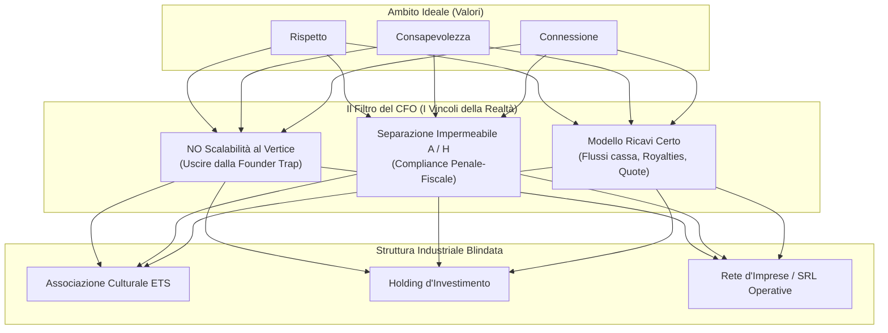

# DOSSIER STRATEGICO: ESTRAPOLAZIONE E ANALISI DEGLI APPUNTI DELLA CONSULENZA CFO

> **Oggetto**: Decodifica analitica, giuridico-fiscale e di governance delle 5 tavole di appunti strategici (Consulenza CFO per la strutturazione di "La Buona Community" - LBC).  
> **Finalità**: Trasformare le annotazioni grafiche e le obiezioni del CFO in requisiti architetturali operativi, modelli di business bancabili e presidi antirischio.

---

## INDICE DEI CONTENUTI

1. [Quadro d'Insieme & Il "Filtro CFO"](#1-quadro-dinsieme--il-filtro-cfo)
2. [Tavola 1: Architettura di Sistema (Concept Base, Concretizzazione, Struttura Pratica)](#2-tavola-1-architettura-di-sistema)
3. [Tavola 2: Valori Fondanti e il Vincolo della Scalabilità](#3-tavola-2-valori-fondanti-e-il-vincolo-della-scalabilit%C3%A0)
4. [Tavola 3: Gestione IP, Flussi Operativi e Catena del Valore dei Libri/Know-How](#4-tavola-3-gestione-ip-flussi-operativi-e-catena-del-valore)
5. [Tavola 4: Coesistenza Associazione-Holding, Naming e i 5 Pilastri di Segregazione](#5-tavola-4-coesistenza-associazione-holding-naming-e-i-5-pilastri)
6. [Tavola 5: Roadmap di Esecuzione in 4 Fasi ("La Metafora della Tavola")](#6-tavola-5-roadmap-di-esecuzione-in-4-fasi)
7. [Matrice Integrata dei Rischi e Contromisure Operative](#7-matrice-integrata-dei-rischi-e-contromisure)
8. [Conclusioni e Prossimi Passi di Esecuzione](#8-conclusioni-e-prossimi-passi)

---

## 1. QUADRO D'INSIEME & IL "FILTRO CFO"

La sessione di consulenza documentata nelle 5 lavagne riflette il classico **"stress-test di fattibilità"** condotto da un Chief Financial Officer (CFO) su una visione imprenditoriale embrionale ad alto impatto etico ed ideale.

L'idea originaria dei promotori combinava:
- Una community territoriale di mutuo aiuto e crescita per imprenditori e professionisti;
- I valori di etica, rispetto e consapevolezza veicolati attraverso contenuti editoriali (libri) e docenze del fondatore (Luca Braggion);
- Un meccanismo di incubazione di progetti imprenditoriali su cui investire capitale per ottenere ritorni economici.

### Il Ruolo Critico del CFO:
Il CFO ha applicato tre lenti analitiche implacabili:
1. **Sostenibilità Finanziaria e Scalabilità**: Distruggere l'illusione che una struttura fondata esclusivamente sul tempo del fondatore possa crescere indefinitamente.
2. **Conformità Fiscale e Diritto Societario**: Prevenire il rischio penale-tributario di commistione tra enti non-profit (Associazione) ed enti for-profit (Holding / SRL), bloccando ogni schema che possa configurare un'"associazione schermo".
3. **Meccanica degli Incentivi B2B**: Fornire una risposta brutale alla domanda che ogni imprenditore si pone: *"Perché dovrei entrare e pagare? Cosa ci guadagno?"*.



---

## 2. TAVOLA 1: ARCHITETTURA DI SISTEMA
### Concept Base ➔ Concretizzazione ➔ Struttura Pratica

La prima lavagna struttura il percorso complessivo da una visione divulgativa fino all'articolazione degli enti operativi.

```
+---------------------------------------------------------------------------------------------------+
| CONCEPT BASE                    CONCRETIZZAZIONE                     STRUTTURA PRATICA           |
|                                                                                                   |
| • Divulgazione Consapevole      In che modo posso io               +----------------------------+ |
|   Gratuita -> Conoscenze/        membro portare valore?            | ASSOCIAZIONE               | |
|   Competenze -> Grandi                                             | La Buona Comunità          | |
|   Aziende                       Cosa ognuno può mettere            | - Formazione membri        | |
|   [? Perché accettare ?]        a disposizione?                    | - Formazione da libri      | |
|                                                                    +--------------+-------------+ |
| • Rete Fertile Collaborativa                                                      |               |
|   (Piccoli/Grandi)                                                 +--------------v-------------+ |
|   [? Come stimolare ?]                                             | RETE COLLABORATIVA         | |
|                                                                    | - Baratto, Scambio servizi | |
| • Percorso Scalabile                                               |   Scontistiche, Formaz.    | |
|   1. Curioso (Utente)                                              | [? In che modo avviene ?]  | |
|   2. Attivo (Prof./Neo-Impr.)                                      +--------------+-------------+ |
|   3. Socio (Partner)                                                              |               |
|   [? Parametri escalation ?]                                       +--------------v-------------+ |
|                                                                    | HOLDING (Investitore)      | |
|                                                                    | - Selezione progetti       | |
|                                                                    | - Crescita Neo I -> Impr.  | |
|                                                                    | [? Criteri? Fonti incasso?]| |
|                                                                    +----------------------------+ |
+---------------------------------------------------------------------------------------------------+
```

### 2.1 Trascrizione Puntuale dei Dati della Lavagna
1. **Concept Base**:
   - **Divulgazione consapevole gratuita**: Conoscenze e competenze per coinvolgere inizialmente le grandi aziende.  
     *(Domanda CFO in rosso: "Perché io imprenditore dovrei accettare?")*
   - **Stimolazione interazione collaborativa**: Creazione di una "rete fertile" con interazioni:
     - Piccoli ➔ Piccoli
     - Piccoli ➔ Grandi
     - Grandi ➔ Grandi  
     *(Domanda CFO in rosso: "Come stimolare l'interazione?")*
   - **Percorso Scalabile (I 3 Livelli di Adesione)**:
     - *(Domanda CFO in rosso a margine: "Come avviene la crescita? Quali sono i parametri di escalation?")*
     - **Membro Utente ("Il Curioso")**: Fruitore esterno senza futuro imprenditoriale o collaborazione continuativa.
     - **Membro Partecipante ("L'Attivo")**:
       - *Opzione A - Professionista (collaborativo)*: Costruire e attivare la rete operativa; sviluppare progetti.
       - *Opzione B - Neoimprenditore (collaborativo)*: Evoluzione progetto in SRL (possibile selezione della Holding).
     - **Membro Partner ("Il Socio")**:
       - *Imprenditore*: (1) Progetto autonomo selezionato dalla rete diventato impresa (promosso da H tramite investimento); (2) Azienda collaboratrice consolidata.
2. **Concretizzazione (Punti di Cerniera)**:
   - *"In che modo posso io membro portare valore?"*
   - *"Cosa ognuno può mettere a disposizione?"*
3. **Struttura Pratica**:
   - **Associazione "La Buona Comunità"**: La comunità nasce all'interno dell'associazione. Gestisce le attività formative e culturali basate sia sulle competenze dei membri (Attivi e Partner) sia sui contenuti editoriali dei libri (Luca e lo Staff).
   - **Rete Collaborativa**: Gestita/promossa dall'associazione ma formata direttamente dagli associati. Si basa sullo scambio di servizi, baratto, scontistiche, formazione lavoro e offerte valorizzate.  
     *(Domanda CFO in rosso: "In che modo avvengono?")*
   - **Holding (Investitore)**: Seleziona in modo studiato i progetti ad alto potenziale per investire capitale di rischio ed entrare in società (equity). Lo scopo è accelerare il passaggio da Neoimprenditore a Imprenditore di successo.
     - Flusso bidirezionale: L'Associazione "acquista valore" (reputazione, vivaismo di idee); la Holding ottiene "arricchimento" (ritorni da investimenti).  
     *(Domande CFO in rosso: "Con che criteri selezionare i progetti su cui investire?", "Quando è pronto un progetto?", "Quali sono le fonti d'incasso? Royalties? Metodo? Introiti imprese?")*.

---

### 2.2 Analisi Tecnica e Risposte Strategiche del CFO

#### A. La sfida dell'engagement delle Grandi Imprese ("Perché dovrei accettare?")
- **Criticità Rilevata**: Le grandi aziende e le PMI strutturate non partecipano a una community spronate da puro altruismo o da generici inviti alla "consapevolezza gratuita". L'imprenditore strutturato calcola il ROI sull'impegno del proprio management.
- **Soluzione di Ecosistema**: L'attrattività per le grandi aziende risiede in tre leve commerciali tangibili:
  1. **Talent & Supplier Discovery**: Accesso a un vivaio certificato di micro-imprese e professionisti affidabili e motivati (riduzione costi di scouting fornitori e consulenti).
  2. **Open Innovation a Basso Rischio**: Possibilità di testare progetti pilota e soluzioni con micro-imprese agili prima di internalizzarli.
  3. **ESG & Territorial Marketing**: Posizionamento come leader distrettuale etico, spendibile nei bilanci di sostenibilità (CSRD / ESG).

#### B. La regolamentazione dell'interazione ("Come stimolare? In che modo avviene il baratto?")
- **Criticità Giuridico-Fiscale**: Lo "scambio servizi" e il "baratto" tra titolari di Partita IVA configurano **operazioni permutative** ai sensi dell'art. 11 del D.P.R. 633/1972 (IVA), soggette a reciproca fatturazione con applicazione dell'imposta. Inoltre, se gestite all'interno dell'Associazione senza una veste commerciale, rischiano di contaminare la natura non lucrativa dell'ente.
- **Soluzione di Ecosistema**: Come elaborato nell'architettura avanzata di LBC, lo strumento ideale non è l'associazione, bensì il **Contratto di Rete d'Imprese con Fondo Patrimoniale Comune (L. 33/2009)**. Il Contratto di Rete consente ai retisti la codatorialità, il distacco di personale a costo vivo e la cooperazione di filiera senza configurare intermediazione illecita o commistione contabile.

#### C. L'Escalation dei Membri ("Quali sono i parametri?")
- **Criticità Operativa**: Il passaggio da "Curioso" ad "Attivo" fino a "Partner" non può essere basato sulla simpatia o su sensazioni soggettive del fondatore, altrimenti genera frustrazione e disallineamento.
- **Soluzione di Ecosistema**: Adozione di un **Funnel di Qualificazione a Stage-Gate**:
  - *Livello 1 (Curioso)*: Iscrizione all'Associazione, fruizione di eventi aperti, lettura dei libri. Metrica: partecipazione e aderenza ai valori.
  - *Livello 2 (Attivo)*: Superamento dell'Audit di ammissione (o Assessment di competenze), sottoscrizione del codice etico, disponibilità documentata di ore/servizi da conferire alla rete.
  - *Livello 3 (Partner)*: Sottoscrizione del Contratto di Rete d'Imprese o conferimento al Fondo Comune; per le startup, rilascio di un business plan validato pronto per il veicolo di investimento (Holding).

#### D. La monetizzazione della Holding ("Fonti di incasso, criteri di selezione")
- **Criticità Finanziaria**: Un investitore istituzionale o una holding non può avere ricavi vaghi ("introiti imprese?"). La Holding deve reggersi su contratti tipici:
  - **Licensing & Royalties**: Cessione d'uso del marchio LBC e dei format operativi alle SRL operative.
  - **Management Fees**: Servizi centralizzati di advisory, finanza agevolata e pianificazione strategica erogati alle partecipate.
  - **Dividendi e Capital Gain**: Quote di utili distribuiti e guadagni da cessione quote (exit).
  - **Criteri di Pronto-Progetto**: Definizione di una checklist di bancabilità (MVP validato, break-even a 18 mesi, governance blindata, marginalità EBITDA > 15%).

---

## 3. TAVOLA 2: VALORI FONDANTI E IL VINCOLO DELLA SCALABILITÀ
### Respect, Awareness, Connection vs "Founder Trap"

```
+---------------------------------------------------------------------------------------------------+
| VALORI                                                                                            |
|                                                                                                   |
| • RISPETTO ----------------> [Accettazione reciproca e deontologia]                               |
| • CONSAPEVOLEZZA ---------> Consapevolizzare attraverso iniziative culturali                      |
|                              il tessuto sociale gratuitamente -> I consapevoli sanno valutare      |
|                              il valore.                                                           |
| • CONNESSIONE ------------> Terreno fertile x collaborazione.                                     |
|                                                                                                   |
|                                                                                                   |
|    !!!!!!!!!!!!!!!!!!!!!!!!!!!!!!!!!!!!!!!!!!!!!!!!!!!!!!!!!!!!!!!!!!!!!!!!!!                     |
|    !!   NO SCALABILITÀ AL VERTICE E LINEA NON REPLICABILE                  !!                     |
|    !!!!!!!!!!!!!!!!!!!!!!!!!!!!!!!!!!!!!!!!!!!!!!!!!!!!!!!!!!!!!!!!!!!!!!!!!!                     |
|                                                                                                   |
|                                                                                                   |
|   NO SOLDI ----> ETICA                                                                            |
|                  Identità Valoriale } UNICITÀ DIFFERENZIANTE ----> RENDERLO RICONOSCIBILE         |
+---------------------------------------------------------------------------------------------------+
```

### 3.1 Trascrizione Puntuale dei Dati della Lavagna
1. **I Tre Valori Chiave**:
   - **Rispetto**: Base imprescindibile di ogni relazione comunitaria.
   - **Consapevolezza**: Diffusione gratuita di cultura d'impresa sul territorio affinché il tessuto sociale comprenda il valore reale dei processi e dei servizi erogati.
   - **Connessione**: Creazione del "terreno fertile" per far germogliare collaborazioni orizzontali.
2. **L'Allarme del CFO (in rosso, doppio punto esclamativo)**:
   - **`!! NO SCALABILITÀ AL VERTICE E LINEA NON REPLICABILE`**
3. **Equazione Valore-Mercato**:
   - `NO SOLDI ➔ ETICA`
   - `Identità Valoriale` + `Unicità Differenziante` ➔ `RENDERLO RICONOSCIBILE`.

---

### 3.2 Analisi Tecnica e Decodifica del Vincolo

#### A. Il "Collo di Bottiglia del Fondatore" (Founder Bottleneck)
- **L'Obiezione del CFO**: Quando un progetto nasce attorno alla figura di un professionista o comunicatore brillante (Luca Braggion), il rischio sistemico è che **il valore percepito coincida al 100% con la sua presenza fisica**.
- Se per formare un imprenditore serve Luca, se per chiudere una trattativa serve Luca, se per validare un progetto serve Luca:
  $$\text{Capacità Massima} = 24\text{ ore/giorno} \times \text{Tariffa Oraria}$$
  Questo non è un modello scalabile, né un'impresa investibile: è una professione individuale con alti costi di struttura.

#### B. La Replicabilità come Condizione di Valore (Franchising/Licensing del Modello)
- Affinché LBC sia scalabile e attragga investitori (Holding, Business Angels, Banche), il metodo deve essere **ingegnerizzato**:
  - Non "le lezioni di Luca", ma **"Manuali Operativi LBC"**, **"Protocolli di Audit standardizzati (90 Minuti)"**, **"Sprint di Processo a 45 Giorni"**.
  - Formazione di formatori e auditor terzi: il modello deve funzionare identico a Treviso, a Brescia o a Bari senza che Luca debba salire in cattedra.

#### C. L'Etica come Asset Intangibile Riconoscibile
- *"No soldi ➔ Etica"*: Il CFO chiarisce che l'etica non deve essere intesa come "pauperismo" o "incapacità di generare profitto".
- Al contrario, l'etica e l'indipendenza valoriale devono diventare un **Marchio Collettivo Registrato (Marchio Etico di Distretto)**. L'etica diventa l'elemento differenziante che rende il network riconoscibile e premiato dai clienti finali rispetto ai consulenti tradizionali.

---

## 4. TAVOLA 3: GESTIONE IP, FLUSSI OPERATIVI E CATENA DEL VALORE
### Il Ruolo dei Libri e il Ciclo di Incubazione

```
+---------------------------------------------------------------------------------------------------+
| LIBRI & INCUBATORE                                                                                |
|                                                                                                   |
|                       +----------------------------------+   Formazione Know-How   +------------+ |
|                       | HOLDING                          | ----------------------> | SRL        | |
|                       | - Custode Diritti (IP)           |                         | AZIENDA    | |
|                       | - Concessione Licenze            | <---------------------- |            | |
|                       | - Partecipazione Societaria      |   - Compra/Vendita libri|            | |
|                       | - Business Angel                 |   - Royalty Licenza     |            | |
|                       | - Coordinamento Community        |   - Parte Dividendi? (?)|            | |
|                       +-----------------+----------------+                         +------------+ |
|                                         |                                                ^        |
|                  Compra/Vendita Libri   |                                                |        |
|                  Luca Formatore         |                                                |        |
|                                         v                                                |        |
|                       +-----------------+----------------+                               |        |
|                       | ASSOCIAZIONE (INCUBATORE)        |                               | Opzione|
|                       | • Idea Progetto                  |                               | Equity |
|                       |   -> Formazione Personale        |                               |        |
|                       |   -> Attuazione                  |                               |        |
|                       |   -> Verifica Scalabilità        | ------------------------------+        |
|                       |   = PROGETTO PRONTO              |                                        |
|                       +----------------------------------+                                        |
+---------------------------------------------------------------------------------------------------+
```

### 4.1 Trascrizione Puntuale dei Dati della Lavagna
1. **La Holding al Centro**:
   - Definisce i 5 ruoli proprietari e strategici della Holding:
     1. **Custode Diritti**: Detiene la proprietà intellettuale (IP) su marchi, libri, brevetti, modelli formativi.
     2. **Concessione Licenze**: Cede in licenza d'uso i diritti a fronte di corrispettivi certi.
     3. **Partecipazione Societaria**: Rileva quote di capitale delle nuove imprese create.
     4. **Business Angel**: Apporta capitale paziente e tutoraggio di alto livello.
     5. **Coordinamento Community**: Esercita la regia strategica complessiva dell'ecosistema.
2. **L'Associazione come Incubatore Etico**:
   - Percorso interno per le nuove idee:
     $$\text{Idea Progetto} \longrightarrow \text{Formazione Personale} \longrightarrow \text{Attuazione} \longrightarrow \text{Verifica Scalabilità} \Longrightarrow \mathbf{\text{PROGETTO PRONTO}}$$
   - Quando il progetto è "Pronto", si attiva un'**OPZIONE**: il progetto viene scorporato e capitalizzato come **SRL Azienda**.
3. **Flussi Contrattuali e Finanziari**:
   - **Holding ➔ SRL Azienda**: Formazione e trasferimento del know-how all'interno dell'azienda.
   - **SRL Azienda ➔ Holding**:
     - Acquisto copie libri per clienti/dipendenti;
     - Pagamento di **Royalty su licenza d'uso** del metodo/brand;
     - *(Punto interrogativo in rosso del CFO)*: **"Parte dei dividendi?"** (distribuzione periodica dell'utile).
   - **Holding ➔ Associazione**:
     - Compra/vendita libri a tariffe regolate;
     - Interventi di Luca Braggion in qualità di formatore remunerato.

---

### 4.2 Analisi Tecnica dei Flussi e Presidi

#### A. Detenzione dell'Intellectual Property (IP Box e Tutela Patrimoniale)
- **Logica del CFO**: L'Associazione (ente non-profit aperto ai soci) **non deve mai essere titolare dei marchi e dei diritti d'autore**. Se l'associazione dovesse sciogliersi o subire cambi di maggioranza nel consiglio direttivo, la proprietà dell'ecosistema verrebbe persa.
- **Corretta Architettura**: La Holding (o Luca persona fisica mediante conferimento) registra marchi e copyright. La Holding concede poi:
  - All'Associazione: licenza gratuita o calmierata per scopi divulgativi/culturali;
  - Alle SRL e alle imprese della Rete: licenze commerciali onerose a percentuale o a canone fisso.

#### B. La "Cessazione della Gestazione": Da Incubatore a SRL
- **Il Rischio di Impresa nell'Associazione**: L'Associazione può svolgere attività didattica, ma **non può gestire il rischio d'impresa di una startup commerciale**.
- **Lo Snodo**: Non appena il progetto supera la "Verifica di Scalabilità", deve uscire dall'alveo associativo. Viene costituita una NewCo (SRL o PMI Innovativa).
- **L'Opzione della Holding**: La Holding può esercitare un diritto di prelazione o un'opzione di sottoscrizione (Warrant / Safe / Equity Option) per entrare nel capitale sociale (es. al 10-25%) a fronte dell'iniezione di liquidità e supporto strategico.

#### C. La Risposta al Punto Interrogativo: "Parte dei Dividendi?"
- Il CFO pone un legittimo dubbio: fare affidamento sui soli dividendi delle startup è una trappola di cassa. Nelle prime fasi, le SRL non distribuiscono dividendi (reinvestono per crescere).
- **Strategia di Rientro di Cassa della Holding**:
  1. *A Breve Termine*: Royalties su licenze e contratti di service amministrativo/strategico (ricavi correnti certi a conto economico).
  2. *A Medio Termine*: Rimborsi di finanziamenti soci fruttiferi di interessi.
  3. *A Lungo Termine*: Dividendi straordinari e capital gain da cessione di quote a fondi o industriali (exit parziali).

---

## 5. TAVOLA 4: COESISTENZA ASSOCIAZIONE-HOLDING, NAMING E I 5 PILASTRI
### Governance, Branding e Segregazione Fiscale

Questa è la tavola più densa e critica dal punto di vista legale, fiscale e di corporate governance.

```
+---------------------------------------------------------------------------------------------------+
| NOMI E BRAND                                                                                      |
|                                                                                                   |
|  OPZIONE 1 (Sconsigliata)                OPZIONE 2 (Consigliata)                                  |
|  - Associazione: LA BUONA COMUNITÀ       - Associazione: LA BUONA COMUNITÀ                        |
|  - Holding: LUCA BRAGGION CAPITALE       - Holding: ALTRO NOME (Corporate)                        |
|  [Rischio: Associazione sembra solo      [Vantaggio: Distinzione netta,                           |
|   una facciata -> AMBIVALENZA]            inequivocabile e autorevole]                            |
|                                                                                                   |
|  REGOLA CARDINE: NAMING != | H CONDIVIDE VALORI, NON CONTROLLO | GOVERNANCE SEPARATA              |
|                                                                                                   |
+---------------------------------------------------------------------------------------------------+
| COESISTENZA A + H: I 5 PILASTRI DI SEGREGAZIONE                                                   |
|                                                                                                   |
| 1. SEPARAZIONE GIURIDICA ED ECONOMICA                                                             |
|    - Statuti diversi, CF diversi, P.IVA diverse, Contabilità separata                             |
|    - Finanziamenti H -> A devono essere chiari, tracciati e documentati in cassa                  |
|                                                                                                   |
| 2. SEPARAZIONE DI SCOPO                                                                           |
|    - Associazione: Divulgazione culturale, networking etico, NO FINI DI LUCRO                    |
|    - Holding: Investimenti, partecipazioni, gestione asset, RICERCA DI PROFITTO                   |
|                                                                                                   |
| 3. SEPARAZIONE OPERATIVA                                                                          |
|    - Associazione: Seleziona progetti culturali, diffonde idee, riceve erogazioni                 |
|    - HOLDING: [DIVIETI TASSATIVI CON 'X' ROSSA]:                                                  |
|      * NON può decidere le attività dell'associazione                                             |
|      * NON può usare l'associazione come proprio canale commerciale mascherato                    |
|      * NON può influenzare il direttivo associativo su base economica                             |
|    - GOVERNANCE FISICA: Luca non può essere Presidente di A e Dominus di H!                       |
|      * Presidente Associazione: Figura terza indipendente                                         |
|      * Luca: Fondatore morale, formatore pagato a fattura, proprietario H                         |
|      * Rischio sanzione: Interposizione fittizia, eterodirezione, reati tributari                 |
|                                                                                                   |
| 4. SEPARAZIONE COMUNICATIVA                                                                       |
|    - Associazione = Comunità culturale dove nascono idee                                          |
|    - Investimento Holding = Evento negoziale indipendente e privato                               |
|                                                                                                   |
| 5. SEPARAZIONE DECISIONALE                                                                        |
|    - Presidio totale dei conflitti d'interesse negli organi amministrativi                        |
+---------------------------------------------------------------------------------------------------+
```

### 5.1 Trascrizione Puntuale dei Dati della Lavagna
1. **Nomi e Brand**:
   - **Opzione 1 (a)**:
     - Associazione: *La Buona Comunità (Ass.)*
     - Holding: *Luca Braggion Capitale (H)*
     - Critica: LBC rischia di sembrare un mero "contenitore filosofico" con desinenze che definiscono le funzioni.
     - *(Nota rossa del CFO)*: **"Associazione rischia di sembrare solo una facciata ➔ Ambivalenza"**. La comunicazione risulterebbe distorta ed eticamente compromessa.
   - **Opzione 2 (b)**:
     - Associazione: *La Buona Comunità (Ass.)*
     - Holding: *Altro Nome - Holding*
     - Esito: **"Distinzione netta e inequivocabile"**.
   - **Regole Fondamentali a Lato**:
     - `NAMING !=` (Nomi differenti per entità differenti).
     - `H condivide valori, NON controllo`.
     - `Governance separata`.
     - `Evitare sovrapposizione di ruoli decisionali diretti`.
2. **I 5 Pilastri di Coesistenza A + H**:
   - **1. Separazione Giuridica ed Economica**:
     - Statuti differenti (`Statuti !=`).
     - Codici Fiscali e Partite IVA distinti (`CF !=, P.IVA !=`).
     - Contabilità completamente separata.
     - *Flussi finanziari*: Eventuali prestiti o donazioni tra H e A devono risultare perfettamente trasparenti, formalizzati e documentati a livello contabile e bancario.
   - **2. Separazione di Scopo**:
     - *Associazione*: Divulgazione culturale, aggregazione, networking etico ➔ **Rigido divieto di scopo di lucro**.
     - *Holding*: Impiego di capitali, assunzione di partecipazioni societarie, valorizzazione asset ➔ **Piena ricerca di profitto economico**.
   - **3. Separazione Operativa**:
     - *Ruoli dell'Associazione*: Scouting culturale di progetti, pubblicizzazione imparziale delle iniziative, ricezione di donazioni liberali.
     - *Divieti assoluti per la Holding (barrati con una X)*:
       - NON decidere i programmi formativi o assembleari dell'Associazione;
       - NON usare l'Associazione come canale commerciale/agente promozionale occulto;
       - NON influenzare il consiglio direttivo di A facendo leva sui finanziamenti economici erogati.
     - *Il Rischio Governance / Persona Fisica (In rosso)*:
       - **"Se Luca è addirittura il presidente !?"**
       - Luca = Fondatore Associazione + Proprietario Holding + Formatore retribuito.
       - Presidente Associazione = Deve essere un'altra persona indipendente.
       - Ratio: *"Eviti di sembrare che H comandi: non controllo strategico, rischi reati fiscali"*.
   - **4. Separazione Comunicativa**:
     - Non confondere l'accesso alla community con l'accesso ai fondi.
     - Associazione = "Comunità culturale dove possono nascere idee".
     - Holding = "L'investimento della Holding è un evento negoziale terzo e indipendente".
   - **5. Separazione Decisionale**:
     - Monitoraggio rigoroso delle delibere per prevenire conflitti d'interesse e commistioni di spesa.

---

### 5.2 Analisi Giuridico-Tributaria dei 5 Pilastri

#### A. Il Rischio di Riqualificazione Fiscale e l'"Associazione Schermo"
- In Italia, l'Agenzia delle Entrate e la Guardia di Finanza monitorano con estremo rigore le associazioni culturali collegate a società commerciali.
- Se l'Associazione viene usata per:
  1. Raccogliere lead e clienti da girare alla Holding o alla SRL;
  2. Vendere corsi formativi che in realtà mascherano consulenze aziendali;
  3. Far confluire ricavi commerciali de-tassati sotto forma di quote associative (art. 148 TUIR);
- **Le Conseguenze**: Decadenza totale dallo status di Ente Non Commerciale, riqualificazione di tutte le entrate in ricavi d'impresa imponibili IRES e IVA retroattivi per 5 anni, sanzioni dal 90% al 180%, e apertura di procedimento per reati tributari ex D.Lgs. 74/2000 (omessa/infedele dichiarazione).

#### B. La Compatibilità del Ruolo di Luca Braggion
- Il CFO ha individuato l'anello debole: se Luca è azionista della Holding, amministratore della SRL e Presidente dell'Associazione, la separazione societaria crolla sul piano probatorio (presunzione di eterodirezione e centro decisionale unico).
- **Presidio Obbligatorio**:
  - Il Presidente e la maggioranza del Direttivo dell'Associazione devono essere soci indipendenti (es. accademici, figure del terzo settore o professionisti terzi).
  - I rapporti di docenza tra Luca e l'Associazione devono essere disciplinati da apposito contratto di prestazione d'opera a prezzi normali di mercato (transfer pricing interno di congruità), approvati dal direttivo senza il voto di Luca.

---

## 6. TAVOLA 5: ROADMAP DI ESECUZIONE IN 4 FASI
### "La Metafora della Tavola"

```
+---------------------------------------------------------------------------------------------------+
| STEP DI ATTUAZIONE                                                                                |
|                                                                                                   |
|  (0) "IMBASTIRE LA TAVOLA" ---------> Costruire la Struttura                                      |
|                                        - Funzionamenti, Valori, Statuti, Regolamenti              |
|                                        - Burocrazia societaria e fiscale                          |
|                                                                                                   |
|  (1) "PREPARARE IL CIBO" -----------> Creare Valore Reale per l'Imprenditore                      |
|                                        - Contenuti Libri                                          |
|                                        - Formazione e Metodo Luca (consulenze)                    |
|                                        - Materiale Operativo, Tool, Schede                        |
|                                        ====> [OBIETTIVO: ATTIRARE IMPRENDITORI]                   |
|                                                                                                   |
|  (2) "APRIRE LE PORTE" -------------> Primi Eventi di Adesione                                    |
|                                        - Presentazioni pubbliche, networking                      |
|                                        ====> [OBIETTIVO: ATTIRARE MEMBRI QUALIFICATI]             |
|                                                                                                   |
|  (3) "RIEMPIRE I PIATTI" -----------> Trasmissione Conoscenze e Competenze                        |
|                                        - Erogazione audit, sprint operativi                       |
|                                        - Connessione e affari di rete tra i membri                |
+---------------------------------------------------------------------------------------------------+
```

### 6.1 Trascrizione Puntuale dei Dati della Lavagna
1. **Fase 0 - "IMBASTIRE LA TAVOLA"**:
   - Azione: Costruire l'infrastruttura di base prima di qualsiasi mossa pubblica.
   - Componenti:
     - Regole di funzionamento interno, formalizzazione dei valori, codice etico;
     - Burocrazia: costituzione enti, statuti impermeabili, attribuzione Codici Fiscali e Partite IVA.
2. **Fase 1 - "PREPARARE IL CIBO"**:
   - Azione: Creare il pacchetto di valore differenziante per l'imprenditore.
   - Componenti:
     - Finalizzazione dei contenuti editoriali (libri);
     - Codifica del metodo di formazione e consulenza;
     - Predisposizione dei materiali operativi (schede, questionari, framework).
   - *Target*: **Attirare Imprenditori**.
3. **Fase 2 - "APRIRE LE PORTE"**:
   - Azione: Avvio della fase relazionale verso l'esterno.
   - Componenti:
     - Organizzazione dei primi eventi ufficiali di presentazione e adesione.
   - *Target*: **Attirare Membri**.
4. **Fase 3 - "RIEMPIRE I PIATTI"**:
   - Azione: Consegna effettiva delle promesse e operatività piena.
   - Componenti:
     - Trasmissione operativa di conoscenze e competenze, attivazione degli scambi professionali ed erogazione dei servizi.

---

### 6.2 Analisi Strategica della Sequenza Temporale

Il CFO ammonisce contro il tipico errore delle iniziative associative italiane: **"aprire le porte prima di aver preparato il cibo"** (fare grandi campagne di iscrizione quando l'offerta è ancora generica e i regolamenti non sono blindati).

1. Se inviti gli imprenditori a tavola (Fase 2) ma non hai pronto il cibo (Fase 1), l'imprenditore viene una volta, percepisce improvvisazione o fuffa relazionale e non torna mai più.
2. Se vendi consulenza o progetti (Fase 3) senza aver blindato la burocrazia (Fase 0), alla prima ispezione fiscale l'intero castello societario subisce accertamenti devastanti.
3. **La Sequenza Rigida del CFO è l'unico percorso a rischio zero**:
   $$\text{Compliance (0)} \longrightarrow \text{Asset tangibili (1)} \longrightarrow \text{Recruitment (2)} \longrightarrow \text{Delivery (3)}$$

---

## 7. MATRICE INTEGRATA DEI RISCHI E CONTROMISURE

Sintesi organica delle criticità identificate dal CFO nelle 5 tavole, incrociate con le soluzioni adottate nell'ecosistema LBC:

| # | Ambito Critico | Obiezione / Alert del CFO | Rischio Sistemico | Soluzione Operativa LBC |
|---|---|---|---|---|
| **1** | **Scalabilità** | *"No scalabilità al vertice e linea non replicabile"* | Collo di bottiglia del fondatore; incapacità di crescere oltre il tempo individuale di Luca. | Codifica del know-how in libri, standardizzazione dell'Audit di 90' e Sprint a 45gg erogabili da professionisti abilitati della Rete. |
| **2** | **Fiscale / Societario** | *"Associazione rischia di sembrare solo una facciata (ambivalenza)"* | Riqualificazione tributaria di A come ente commerciale fittizio; sanzioni e reati tributari ex D.Lgs. 74/2000. | Separazione netta dei 5 pilastri: Holding commerciale autonoma e Associazione etica-culturale con governance terza. |
| **3** | **Governance** | *"Se Luca è addirittura il presidente !?"* | Conflitto di interessi insanabile e imputazione di eterodirezione commerciale all'Associazione. | Luca mantiene la proprietà della Holding e il ruolo di formatore/autore; la presidenza di A va a un garante terzo indipendente. |
| **4** | **Monetizzazione** | *"Quali sono le fonti d'incasso? Royalties? Criteri selezione?"* | Modello di business aleatorio basato su dividendi incerti di startup premature. | Flussi certi a monte: Licensing IP, Service fees, formazione B2B certificata e selezione rigida tramite Stage-Gate Committee. |
| **5** | **B2B Value Prop** | *"Perché io imprenditore dovrei accettare?"* | Rifiuto delle aziende strutturate a fronte di promesse valoriali astratte senza ROI misurabile. | Posizionamento chiaro: accesso a fornitori qualificati, risparmi di filiera, formazione aziendale e accordi su delta fatturato. |
| **6** | **Operatività di Rete** | *"In che modo avvengono baratto e scambio servizi?"* | Rischio di evasione IVA su permute e intermediazione abusiva di manodopera tra professionisti. | Inquadramento nel Contratto di Rete d'Imprese (L. 33/2009) con Fondo Patrimoniale Comune e regole di distacco lecito. |

---

## 8. CONCLUSIONI E PROSSIMI PASSI

Dagli appunti della consulenza emerge un quadro di straordinaria lucidità: il CFO non ha bocciato la visione di "La Buona Community", ma l'ha **depurata da ogni ingenuità da startup**. Ha tracciato i confini esatti entro cui la passione ideale deve incanalarsi per diventare una potenza economica sostenibile e legalmente inattaccabile.

### Piano di Lavoro Immediato:
1. **Perfezionamento Statutario**: Verificare che lo Statuto dell'Associazione escluda qualsiasi attività d'intermediazione o lucro soggettivo.
2. **Branding & Naming**: Battezzare la Holding con un marchio societario corporate distinto da LBC e dal cognome personale del fondatore (Opzione 2).
3. **Contrattualizzazione IP**: Redigere gli accordi di concessione licenza tra la Holding (proprietaria dei diritti dei libri/metodo) e gli enti utilizzatori.
4. **Comitato Tecnico di Selezione**: Definire i parametri numerici e qualitativi che certificano quando un'idea nell'incubatore associativo è ufficialmente un "Progetto Pronto" per la Holding.

---
*Dossier redatto a supporto della direzione strategica e degli agenti dell'ecosistema LBC.*
